# 设计模式

## 发布-订阅模式

在观察者模式中，观察者还是要获得发布者对象的引用才能完成事件的注册，对象之间还是存在依赖的关系的。

但是有些时候，订阅者其实不关心具体的发布者，只在乎对应的事件。在发布者的数量变得很大很大时，订阅者和发布者的关系将变得十分复杂，难以维护。

因此，我们引入一个中间层作为事件总线 (Event Bus)，发布者向总线发布事件，而订阅者向总线订阅事件。

```mermaid
sequenceDiagram
    autonumber
    %% 定义参与者
    participant P as 发布者 (Publisher)
    participant B as 事件总线 (Event Bus)
    participant S1 as 订阅者 A (UI血条)
    participant S2 as 订阅者 B (音效系统)

    %% 阶段 1：订阅
    Note over B, S2: 阶段 1：订阅
    S1->>B: 这里的 Subscribe<受击事件>()
    S2->>B: 这里的 Subscribe<受击事件>()
    Note right of B: 总线把 A 和 B <br/>记录下来

    %% 分隔符
    rect rgb(40, 40, 40)
        Note over P, S2: ... 游戏中途，玩家被打了一拳 ...
    end

    %% 阶段 2：发布
    Note over P, B: 阶段 2：发布 (业务逻辑触发)
    Note left of P: 我扣血了！<br/>但我不知道谁关心。<br/>我只管发消息。
    P->>B: Publish(new 受击事件(伤害10))

    %% 阶段 3：分发
    Note over B, S2: 阶段 3：分发 (总线遍历列表)
    B-->>S1: 触发回调 (UI更新)
    B-->>S2: 触发回调 (播放惨叫)
    
    Note left of B: 如果有报错，<br/>通常在这里捕获
```



采用这种模式的时候，为了解耦，甚至连事件本身我们都要提取出来，而不是在发布者的代码中用`event`关键词去声明事件。

比如，我们可以定义一个`IGameEvent`接口用来代表所有事件（注意不要在`IGameEvent`接口里定义事件的触发者破坏解耦性，可以在具体实现中定义）：

```cs
public interface IGameEvent;

public readonly struct TaskFinishedEvent(
	string id, 
	string taskName,
	Player player
) : IGameEvent
{
	public string Id => id;
	public string Name => taskName;
	public Player => player
}
```

然后我们考虑实现事件的总线。事件的总线需要能够注册事件并发布事件。

实现示例:

```cs
public static class EventBus
{
	private static readonly Dictionary<Type, List<Delegate>> Handlers = new();

	public static void Subscribe<T>(Action<T> handler) where T : IGameEvent
	{
		Type type = typeof(T);
		if (!Handlers.TryGetValue(type, out var list))
		{
			list = new List<Delegate>();
			Handlers[type] = list;
		}

		list.Add(handler);
	}

	public static void Unsubscribe<T>(Action<T> handler) where T : IGameEvent
	{
		Type type = typeof(T);
		if (Handlers.TryGetValue(type, out var list))
		{
			list.Remove(handler);
			if (list.Count == 0)
			{
				Handlers.Remove(type);
			}
		}
	}

	public static void Publish<T>(T gameEvent) where T : IGameEvent
	{
		Type type = typeof(T);
		if (Handlers.TryGetValue(type, out var list))
		{
			foreach (var handler in list)
			{
				((Action<T>)handler)?.Invoke(gameEvent);
			}
		}
	}
}
```

此示例中使用了`List<Delegate>`来存储所有事件而非使用多播委托，因为多播委托的底层实现和单播其实完全不同。

此外，发布方法采用了泛型签名`Publish<T>(T gameEvent) where T : IGameEvent`而非简单的`Public(IGameEvent)`，这是为了避免装箱：当且仅当编译器被迫把这个值类型（Struct）当作引用类型（Interface/Object）来看待时，就会发生装箱。直接使用`(Action<T>)`强转类型也是为了避免每次`as`带来类型检查的性能消耗（虽然很小）。

> [!IMPORTANT]
> 需要额外一提的是，通常有些任务完成后需要取消订阅。所以在`Public`方法中存储一个 handle 列表的副本并再去便利这个副本，就可以让任务回调时随意调用`Unsubscribe`方法来取消订阅了。

本次的示例只是为了展现发布-订阅模式的机制，实际在商业级项目中往往要考虑更多（线程模型，错误隔离，生命周期管理等），因此通常不需要自己去实现事件总线，而是应该考虑使用成熟的第三方框架。例如：

- 服务端：[CAP](https://github.com/dotnetcore/CAP?tab=readme-ov-file)
- Unity：[Unity-Event-Bus](https://github.com/adammyhre/Unity-Event-Bus)

> 参考视频：[发布–订阅模式： 事件总线如何解耦事件关系_哔哩哔哩_bilibili](https://www.bilibili.com/video/BV1SEkTBrEtN)