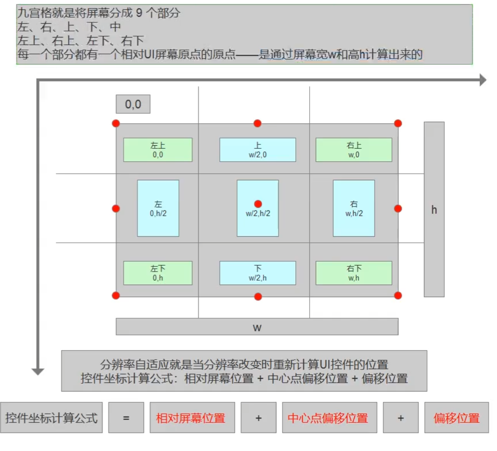

# Unity - GUI

## 1.1 GUI是什么
全程即时模式游戏交互界面IMGUI，是一个代码驱动的UI系统。

## 1.2 GUI的主要作用
1. 程序员的调试工具。
2. 为脚本组件创建自定义检视面板。
3. 创建新的编辑器窗口和工具以扩展Unity本身。

**注意：不用它为玩家制作UI功能。**

## 1.3 GUI的使用
在继承MonoBehaviour的脚本中的特殊函数里。
1. `OnGUI()`：每帧调用一次，相当于是专门用于绘制绘制GUI的函数。
2. 一般只在其中执行GUI相关界面绘制和操作逻辑。
3. 该函数在 `OnDisable()` 之前和 `LateUpdate()` 之后调用。
```c#
private void OnGUI()
{
    // 在这里编写GUI代码
}
```

## 2.1 GUI控件绘制的共同点
1. 他们都是GUI公共类中提供的静态函数。
2. 他们的参数都大同小异
    - 位置参数：`Rect`，表示控件在屏幕上的位置和大小。
    - 文本参数：`string`，表示控件显示的文本内容。
    - 图片参数：`Texture`，表示控件显示的图片内容。
    - 综合信息：`GUIContent`，包含了位置、文本和图片等信息。
    - 自定义样式：`GUIStyle`，用于设置控件的样式。
3. 每一种控件都有多重重载，都是各个参数信息的排列组合。
    - 必备的参数是位置参数 `Rect` 和 显示信息。

## 2.2 文本控件
1. 基本用法
```c#
public class Lesson2 : MonoBehaviour
{
	[SerializeField] private Texture texture;
	[SerializeField] private Rect rect;
	[SerializeField] private GUIContent guiContent;

	private void OnGUI()
	{
        // 显示文字
		GUI.Label(new Rect(0, 0, 100, 20), "第一条信息");
        // 显示图片
		GUI.Label(rect, texture);
        // 显示文字和图片
        GUI.Label(rect, guiContent);
	}
}
```

guiContent.tooltip可以设置一个提示信息，当鼠标悬停时可以通过 `Debug.Log(GUI.tooltip);` 获取到。

2. 自定义样式
此处建议感兴趣建议查阅官方文档：
[GUIStyle](https://docs.unity.cn/cn/2021.3/ScriptReference/GUIStyle.html)
    - 核心属性
        - **Name**: 控件的名称
    - 状态（State）
        - Normal (正常显示时)
            - **Background**: 背景图
            - **Text Color**: 字体颜色
    - Hover (鼠标悬停在控件上时)
    当鼠标指针移动到按钮上方时的状态。
    - Active (按下控件时)
    当用鼠标左键点击并按住按钮时的状态。

    - Focused (具有键盘焦点时)
    当按钮通过键盘（如 Tab 键）被选中时的状态。

    - 启用状态下的交互 (On...)
    这些设置定义了当控件本身是"启用"状态时，对上述各种状态的响应。
        - **On Normal** - 处于启用状态时
        - **On Hover** - 处于启用状态并且鼠标悬停在其上方时
        - **On Active** - 启用和按下时
        - **On Focused** - 启用且具有键盘焦点时

    - 布局与边距 (Layout & Margin)
        - **Border** (背景图像边框) - 用于设置背景图的九宫格切片边框
        - **Margin** (与其他控件边距) - 按钮控件的外边距，定义其与周围其他控件的距离
        - **Padding** (边缘到内容开始处间隔空间) - 按钮的内边距，定义其边框与内部内容（如文字或图标）之间的距离
        - **Overflow** (要添加到背景图像的额外空间) - 允许内容超出背景图像边界的额外空间

    - 字体与文本 (Font & Text)
        - **Font**: None (Font) - 该控件的字体
        > 注释：不设置则使用默认字体
        - **Font Size**: 0 - 字体大小
        - **Font Style**: Normal - 字形，如常规、粗体、斜体等
        - **Alignment**: Middle Center - 文本在按钮内的对齐方式
        - **Word Wrap** - 是否自动换行，如果文本长度超过按钮宽度，是否自动换行显示
        - **Rich Text** - 启用HTML样式标记，勾选后可以在文本中使用类似 HTML 的标签来设置样式（如 `<b>` 加粗, `<color=red>` 改变颜色）
        - **Text Clipping**: Clip - 文本超出边界时的裁剪方式
        - **Image Position**: Image Left - 如果按钮同时有图片和文字，图片的相对位置

## 3.3 按钮控件
1. 基本用法
```c#
GUI.Button(btnRect, btnContent, btnStyle);
```
2. 综合使用
```c#
// 按钮按下再抬起才算一次点击
if (GUI.Button(btnRect, btnContent, btnStyle))
{
    // 按钮被点击时执行的代码
    Debug.Log("按钮被点击了");
}

// 按钮被持续按下时不断调用
if (GUI.RepeatButton(btnRect, btnContent, btnStyle))
{
    // 按钮被持续按下时执行的代码
    Debug.Log("按钮被长按");
}
```

## 4.1 多选框
1. 普通样式
```c#
private bool isSelected = false; 

private void OnGUI()`
{
    isSelected = GUI.Toggle(toggleRect, isSelected, "选项1");
}
```
2. 自定义样式
    - 修改固定宽高 `fixedWidth` 和 `fixedHeight` 属性来调整图片大小。
    - 修改从 GUIStyle 边缘到内容起始处的空间 `padding` 。
```c#
isSelected = GUI.Toggle(toggleRect, isSelected, "选项1", guiStyle);
```
## 4.2 单选框
是基于多选框的。
```c#
private int selectedIndex = 0; // 选中的索引

private void OnGUI()
{
    // 绘制单选框 - 推荐的传统方式
    if (GUI.Button(rect1, "选项1", guiStyle)) selectedIndex = 0;
    if (GUI.Button(rect2, "选项2", guiStyle)) selectedIndex = 1;
    if (GUI.Button(rect3, "选项3", guiStyle)) selectedIndex = 2;
}
```

## 5.1 输入框
1. 普通输入
```c#
private string _inputString;

private void OnGUI()
{
    // 限制长度 5
    _inputString = GUI.TextArea(new Rect(10, 10, 300, 300), _inputString, 5);
}
```
2. 密码输入
```c#
private string _inputPassword;

private void OnGUI()
{
    _inputPassword = GUI.PasswordField(new Rect(10, 10, 100, 20), _inputPassword, '*');
}
```
## 5.2 拖动条
1. 水平拖动条
```c#
public Rect rect;
private float _value;

private void OnGUI()
{
_value = GUI.HorizontalSlider(rect, _value, 0, 1);
}
```
2. 垂直拖动条
```c#
_value = GUI.VerticalSlider(rect, _value, 0, 1);
```

## 6 图片绘制和框绘制
1. 图片绘制
    - `ScaleMode.ScaleToFit`：保持图片比例缩放到适合的大小。
    - `ScaleMode.ScaleAndCrop`：保持图片比例缩放到填满整个区域，但可能会裁剪图片的一部分。
    - `ScaleMode.StretchToFill`：拉伸图片填满整个区域，可能会失去原有比例。
    - `alphaBlend`：使用透明度混合绘制图片。
    - `imageAspect`：设置图片的宽高拉伸比例。
```c#
GUI.DrawTexture(rect, texture, ScaleMode.ScaleToFit, true, 0f);
```

2. 绘制框
```c#
GUI.Box(rect, "这是一个框");
```

## 7 工具栏和选择网格
1. 工具栏
```c#
public Rect rect;
private int _toolbarIndex = 0;
private string[] _toolbarInfos = new[] { "选项一", "选项二", "选项三" };

private void OnGUI()
{
    _toolbarIndex = GUI.Toolbar(rect, _toolbarIndex, _toolbarInfos);

        switch (_toolbarIndex)
		{
			case 0:
				break;
			case 1:
				break;
			case 2:
				break;
			default:
				break;
		}
}
```
2. 选择网格
    - 相对 toolbar 多了一个参数，表示每行显示的按钮数量。
```c#
GUI.SelectionGrid(rect, _toolbarIndex, _toolbarInfos, 3);
```

## 8 滚动列表和分组
1. 分组
    - 用于批量控制控件位置。
    - 可以理解为：包裹这的控件加了一个父对象。
    - 可以通过控制分组来控制包裹控件的位置。
    ```c#
    public Rect rect;
	
	private void OnGUI()
	{
		GUI.BeginGroup(rect);
		GUI.Button(new Rect(0f, 0f, 100, 100), "<UNK>");
		GUI.Label(new  Rect(100f, 0f, 100, 100), "<UNK>");
		GUI.EndGroup();
	}
    ```
2. 滚动列表
    ```c#
    public Rect posRect;
	public Rect viewRect;

	private Vector2 _nowPos;
	
	private void OnGUI()
	{
		_nowPos = GUI.BeginScrollView(posRect, _nowPos, viewRect);
        
        // 绘制内容
        GUI.Button(new Rect(0f, 0f, 100, 100), "<UNK>");

		GUI.EndScrollView();
	}
    ```

## 9 窗口
- 窗口
    - 第一个参数 `id` 是窗口的唯一标识符。
    - 委托函数 `WindowFunction(int id)` 用于绘制窗口内容。
    ```c#
    public Rect posRect;
	
	private void OnGUI()
	{
		GUI.Window(1, posRect, DrawWindow, "测试窗口1");
		GUI.Window(2, posRect, DrawWindow, "测试窗口2");
	}

	private void DrawWindow(int id)
	{
		switch (id)
		{
			case 1:
				GUI.Label(new Rect(posRect.x, posRect.y, posRect.width, posRect.height), "<UNK>");
				break;
			case 2:
				GUI.Label(new  Rect(posRect.x, posRect.y, posRect.width, posRect.height), "<P>");
				break;
		}
	}
    ```
- 模态窗口
    - 可以让其他控件不可用。
    - 可以理解为一个弹出窗口，用户必须先关闭它才能继续与其他控件交互。
    ```c#
    GUI.ModalWindow(3, posRect, DrawModalWindow, "模态窗口");
    ```
- 拖动窗口
    - 可以通过鼠标拖动来移动窗口位置。
    - 在 `DrawWindow` 函数中调用 `GUI.DragWindow()` 来启用拖动功能。
        - 可以传入一个 `Rect` 参数来限制拖动区域。
    ```c#
    public Rect posRect;
	
	private void OnGUI()
	{
        // 位置赋值只是前提
		posRect = GUI.Window(1, posRect, DrawWindow, "拖动窗口");
	}

	private void DrawWindow(int id)
	{
		if (id == 1)
		{
			GUI.DragWindow();
		}
	}
    ```

## 10 自定义皮肤 - GUISkin
- 全局颜色
    ```c#
    private void OnGUI()
    {
        // 设置全局颜色，影响背景和文本颜色
        GUI.color = Color.red; 
        GUI.Label(new Rect(10, 10, 100, 20), "红色文字", guiStyle);
        
        // 恢复默认颜色
        GUI.color = Color.white; 
        GUI.Label(new Rect(10, 40, 100, 20), "白色文字");

        // 文本着色颜色 
        // 会和全局颜色相乘。如果想单独设置文本颜色，就不建议设置全局颜色
        GUI.contentColor = Color.green;
        GUI.Button(new Rect(10, 70, 100, 20), "绿色按钮");

        // 背景元素着色
        // 会和全局颜色相乘
        GUI.backgroundColor = Color.blue;
        GUI.Box(new Rect(10, 100, 100, 20), "蓝色框");
    }
    ```
- 整体皮肤样式
    - 可以在 Project 窗口右键创建一个 GUISkin 资源。
    - 可以帮助我们设置整体的样式，相对于设置当个控件的 style 更加方便。
    ```c#
    public GUISkin guiSkin;

	private void OnGUI()
	{
        // 设置全局皮肤
        GUI.skin = guiSkin;

		GUI.skin = guiSkin;

        // 如果设置了GUIStyle，会覆盖GUISkin中的样式
		GUI.Button(new Rect(0, 0, 100, 100), "测试按钮");

        // 恢复默认皮肤
        GUI.skin = null;
	}
    ```
## 11 GUILayout
- `GUILayout` 是一个公共类。用 `GUILayout` 创建的UI组件会自动设置好UI布局。
    - 主要用于进行编辑器开发，不适合用于制作游戏UI。
    ``` c#
    GUILayout.Button("按钮1");
    GUILayout.Button("按钮2");
    GUILayout.Button("按钮3");
    ```
    ```c#
    // GUI.BeginGroup(new Rect(10, 10, 200, 200));
    GUILayout.BeginArea(new Rect(10, 10, 200, 200));

    GUILayout.BeginHorizontal();

    GUILayout.Button("按钮1");
    GUILayout.Button("按钮2");
    GUILayout.Button("按钮3");

    GUILayout.EndHorizontal();

    // GUI.EndGroup();
    GUILayout.EndArea();
    ```
- GUILayoutOption 布局选项
    - `GUILayout.Width(float width)`：设置宽度。
    - `GUILayout.Height(float height)`：设置高度。
    - `GUILayout.MinWidth(float minWidth)`：最小宽度。
    - `GUILayout.MaxWidth(float maxWidth)`：最大宽度。
    - `GUILayout.MinHeight(float minHeight)`：最小高度。
    - `GUILayout.MaxHeight(float maxHeight)`：最大高度。
    - `GUILayout.ExpandWidth(bool expand)`：是否自动扩展宽度以液态补齐。
    - `GUILayout.ExpandHeight(bool expand)`：是否自动扩展高度以液态补齐。
    ```c#
    GUILayout.Button("按钮1", GUILayout.Width(100), GUILayout.Height(50));
    ```

## 实践小项目
搭建一个简单的，所见即所得的，可以自适应分辨率的UI系统。最终封装以下控件：
- 按钮
- 文本框
- 单选框
- 多选框
- 输入框
- 拖动条
- 图片

### 前置知识

#### 1. 如何让脚本在编辑模式下运行
特性 `[ExecuteAlways]` ：在类名前加上这个特性，可以让类在编辑模式下自动执行生命周期函数。

#### 2. 九宫格布局概念


### 实际设计
#### 位置信息类
```c#
/// <summary>
/// 表示对齐方式
/// </summary>
public enum AlignmentType
{
	UpLeft,   
	Up,       
	UpRight,  
	Left,     
	Center,   
	Right,    
	DownLeft, 
	Down,     
	DownRight 
}

/// <summary>
/// 用于表示并计算位置信息
/// </summary>
[System.Serializable]
public class CustomGUIPos
{
	// 屏幕对齐方式
	[SerializeField] private AlignmentType screenAlignment = AlignmentType.UpLeft;
	
	// 组件原点对齐方式
	[SerializeField] private AlignmentType componentOriginAlignment = AlignmentType.UpLeft; 
	
	// 位置偏移量
	[SerializeField] private Vector2 offset = Vector2.zero;   
	
	[SerializeField] private float width;     
	[SerializeField] private float height;    
	
	// 实际位置矩形
	private Rect _realPosition;    
	
	// 组件原点位置
	private Vector2 _originPosition;   

	/// <summary>
	/// 根据组件原点对齐方式计算原点位置
	/// </summary>
	/// <returns>原点坐标</returns>
	private Vector2 CalculateOriginPosition()
	{
		return componentOriginAlignment switch
		{
			AlignmentType.UpLeft => Vector2.zero,
			AlignmentType.Up => new Vector2(width / 2, 0),
			AlignmentType.UpRight => new Vector2(width, 0),
			AlignmentType.Left => new Vector2(0, height / 2),
			AlignmentType.Center => new Vector2(width / 2, height / 2),
			AlignmentType.Right => new Vector2(width, height / 2),
			AlignmentType.DownLeft => new Vector2(0, height),
			AlignmentType.Down => new Vector2(width / 2, height),
			AlignmentType.DownRight => new Vector2(width, height),
			_ => Vector2.zero
		};
	}

	/// <summary>
	/// 根据屏幕对齐方式计算实际位置
	/// </summary>
	private void CalculateRealPosition()
	{
		switch (screenAlignment)
		{
			case AlignmentType.UpLeft:    
				_realPosition.x = -_originPosition.x + offset.x;
				_realPosition.y = -_originPosition.y + offset.y;
				break;
			case AlignmentType.Up:       
				_realPosition.x = Screen.width / 2f - _originPosition.x + offset.x;
				_realPosition.y = -_originPosition.y + offset.y;
				break;
			case AlignmentType.UpRight:   
				_realPosition.x = Screen.width - _originPosition.x - offset.x;
				_realPosition.y = -_originPosition.y + offset.y;
				break;
			case AlignmentType.Left:      
				_realPosition.x = -_originPosition.x + offset.x;
				_realPosition.y = Screen.height / 2f - _originPosition.y + offset.y;
				break;
			case AlignmentType.Center:   
				_realPosition.x = Screen.width / 2f - _originPosition.x + offset.x;
				_realPosition.y = Screen.height / 2f -_originPosition.y + offset.y;
				break;
			case AlignmentType.Right:  
				_realPosition.x = Screen.width - _originPosition.x - offset.x;
				_realPosition.y = Screen.height / 2f - _originPosition.y + offset.y;
				break;
			case AlignmentType.DownLeft:  
				_realPosition.x = -_originPosition.x + offset.x;
				_realPosition.y = Screen.height - _originPosition.y - offset.y;
				break;
			case AlignmentType.Down:     
				_realPosition.x = Screen.width / 2f - _originPosition.x + offset.x;
				_realPosition.y = Screen.height - _originPosition.y - offset.y;
				break;
			case AlignmentType.DownRight: 
				_realPosition.x = Screen.width - _originPosition.x - offset.x;
				_realPosition.y = Screen.height - _originPosition.y - offset.y;
				break;
		}
	}
	
	/// <summary>
	/// 获取计算后的实际位置矩形
	/// </summary>
	public Rect RealPosition
	{
		get
		{
			_originPosition = CalculateOriginPosition();
			CalculateRealPosition();
			_realPosition.width = width;
			_realPosition.height = height;
			return _realPosition;
		}
	}
	
}
```
#### 控件基类
```c#
public class CustomGUIControl : MonoBehaviour
{
	// 位置信息
	[SerializeField] private CustomGUIPos customGUIPos;
	
	// 组件内容
	[SerializeField] private GUIContent guiContent;
	
	// 自定义样式是否启用
	[SerializeField] private bool useCustomStyle;
	
	// 自定义样式
	[SerializeField] private GUIStyle guiStyle;

	public void DrawUI()
	{
		if (useCustomStyle)
		{
			DrawCustomGUI();
		}
		else
		{
			DrawNormGUI();
		}
	}

	protected virtual void DrawNormGUI()
	{
		// 绘制标准GUI
	}

	protected virtual void DrawCustomGUI()
	{
		// 在这里实现自定义GUI绘制逻辑
	}
}
```

#### 绘制所有控件的Root类
```c# {1}
[ExecuteAlways]
public class CustomGUIRoot : MonoBehaviour
{
    private CustomGUIControl[] _customGUIControls;
    
    private void Start()
    {
        _customGUIControls = GetComponentsInChildren<CustomGUIControl>();
    }

    private void OnGUI()
    {
        if (!Application.isPlaying)
        {
            // 仅在编辑模式下不断获取子组件，以节省性能
            _customGUIControls = GetComponentsInChildren<CustomGUIControl>();
        }

        foreach (var control in _customGUIControls)
        {
            control.DrawUI();
        }
    }
}
```

#### 控件示例 - Button
```c#:line-numbers {1}
public class CustomGUIButton : CustomGUIControl
{
	public event Action Click;
	
	protected virtual void OnClick()
	{
		Click?.Invoke();
	}
	
	protected override void DrawNormGUI()
	{
		if (GUI.Button(customGUIPos.RealPosition, guiContent))
		{
			OnClick();
		}
	}

	protected override void DrawCustomGUI()
	{
		if (GUI.Button(customGUIPos.RealPosition, guiContent, guiStyle));
		{
			OnClick();
		}
	}
}

```


# 结束！