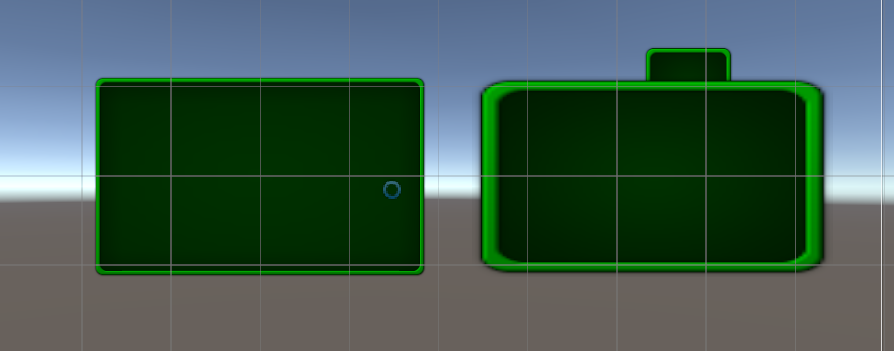
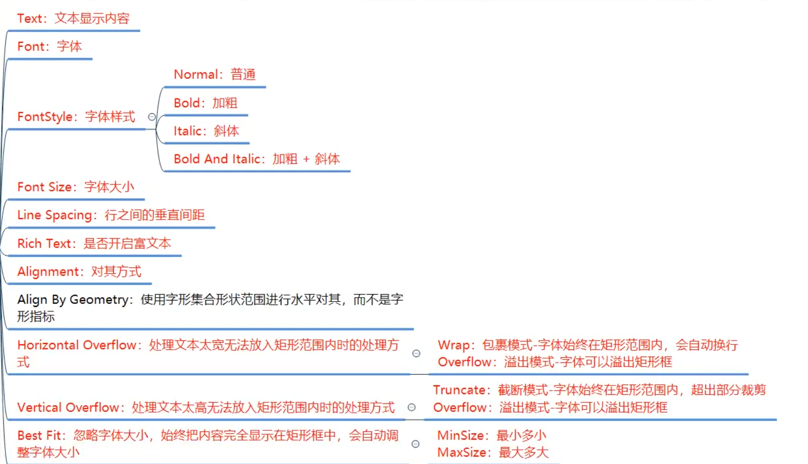

# Unity-UGUI

UGUI (Unity GUI) 是 Unity 引擎中用于创建用户界面 (UI) 的官方系统。它在 Unity 4.6 版本中被引入，取代了老旧且效率不高的 IMGUI (Immediate Mode GUI)，成为了制作游戏 UI 的主流方案。

## 六大基础组件

1. `Canvas` 对象上依附的：
    - `Canvas`：主要用于渲染UI控件
    - `Canvas Scaler`：画布分辨率自适应组件，主要用于分辨率自适应
    - `Graphic Raycaster`：射线事件交互组件，主要用于控制射线响应相关
    - `RectTransform`：UI对象位置锚点控制组件，主要用于控制位置和其对应方式
2. `EventSystem` 对象上依附的
    - `EventSystem`：玩家输入事件相应系统
    - `Standalone Input Module`：独立输入模块组件，用于监听玩家操作

### `Canvas`-渲染模式的控制

1. `Canvas` 组件用来干什么
    - `Canvas` 是 UGUI 中所有 UI 元素能够被显示的根本
    - 主要负责渲染自己的所有 UI 子对象
2. 场景中可以有多个 `Canvas` 对象
    - 可以分别管理不同画布的渲染方式，分辨率自适应方式等等参数
    - 如果没有特殊需求，一般一个场景上一个 `Canvas` 对象即可
    
### `Canvas` 组件的三种渲染方式
1. `Screen Space - Overlay`：屏幕空间，覆盖模式，UI 始终在前
    - `Pixel Perfect`：是否开启无锯齿精确渲染模式（性能换效果）
    - `Sort Order`:排序层编号（用于控制多个 `Canvas` 时的渲染先后顺序）
    - `Target Dislay`:目标设备(在哪个显示设备上显示)
    - `Additional Shader Channels`:其他着色器通道，决定着色器可以读取那些数据
2. `Screen Space - Camera`:屏幕空间，摄像机模式，3D 物体可以显示在 UI 之前
    - `Render Camera`：用于渲染 UI 的摄像机（如果不设置效果将类似与覆盖模式；不建议设置成主摄像机，因为会难以控制 UI 与物体的渲染顺序）
        > 通过分离主摄像机与专门的 UI 摄像机，设置让 UI 摄像机只渲染自己的图层（`depth only`），实现 UI 在 3D 物体前显示的效果
    - `Plane Distance`:UI 平面在摄像机前方的距离，类似整体 Z 轴的感觉
    - `Sorting Layer`:所在排序层
    - `Order in Layer`:排序层的序号
3. `World Space`:世界空间，3D 模式
    - `Event Camera`:用于处理 UI 事件的摄像机(如果不设置不能正常注册 UI 事件)

### `CanvasScaler` 简单介绍

`CanvasScaler`（画布缩放器）是 Unity UI 系统中的一个核心组件，它的主要作用是控制 `Canvas`（画布）上所有 UI 元素的整体缩放和尺寸，以适应不同的屏幕分辨率和尺寸。画布缩放器并不负责位置，位置由 `RectTransform` 来控制。

在 Game 窗口中的 Stats 中能观到当前的分辨率，该分辨率会参与到自适应的计算。同时，在 `Canvas` 对象上 `RectTransform` 组件中也能看到宽高和缩放。

::: info
屏幕分辨率 = 宽高 * 缩放系数
:::

`CanvasScaler` 有三种适配模式：
1. `Constant Pixel Size`（极少用）：无论屏幕大小如何，UI始终保持相同像素大小。
2. `Scale With Screen Size`（最常用）：根据屏幕尺寸进行缩放，随着屏幕尺寸大小缩放。
3. `Constant Physical Size`（极少用）：类似于第一种模式。无论屏幕大小和分辨率如何，UI元素始终保持相同物理大小。

接下来会一一介绍这三种模式。

### CanvasScaler-恒定像素模式

`Constant Pixel Size` 模式的参数：
- `Scale Factor`：缩放系数，会按此系数缩放画布中的所有UI元素。
- `Reference Pixels Per Unit`：单位参考像素，多少像素对应 Unity 中的一个单位（默认100像素为1单位）。在图片 Inspect 窗口中的 `Pixels Per Unit` 设置会和该参数一起参与计算。

::: info 恒定像素模式计算公式
UI原始尺寸 = 图片大小（像素）/ (Pixels Per Unit / Reference Pixels Per Unit)
:::

### CanvasScaler-缩放模式
`Scale With Screen Size` 模式的参数：
- `Reference Resolution`：参考分辨率。需要填写你希望参考的屏幕分辨率大小。例如，开发 pc端游戏时，可填入常用的 1920x1080；开发移动端游戏时，可填入常用的 1080x1920。
- `Screen Match Mode`：屏幕匹配模式，当前屏幕分辨率宽高比不适应参考分辨率时，
用于分辨率大小自适应的匹配模式。 
    - `Match Width Or Height`（最常用）:以宽高或者二者的平均值作为参考来缩放画布区域。
        - `Match`：以二者的某种平均值作为参考来缩放画布。
            1. 当 Match = 0 时，强制 UI 的缩放只参考屏幕宽度的变化；
            2. 当 Match = 1 时，强制 UI 的缩放只参考屏幕高度的变化；
            3. **当 Match = 0.5 时，这是最常用，也通常是效果最好的设置。** 它会在“匹配宽度”和“匹配高度”之间取得一个平衡。它试图找到一个中间点，让你的 UI 在各种不同的宽高比下都能合理地显示。
    - `Expand`: 水平或垂直拓展画布区域，会根据宽高比的变化大小来放大缩小画布。可以完全的展示参考分辨率下创建的所有内容，但可能会展示出未设置的区域，如屏幕上或下出空白区域。
        - 拓展匹配，将Canvas Size进行宽或高扩大，让他高于参考分辨率。
        - 缩放系数 = Mathf.Min(屏幕宽 / 参考分辨率宽, 屏幕高 / 参考分辨率高)
        - 画布尺寸 = 屏幕尺寸 / 放系数
    - `Shrink`: 水平或垂直裁剪画布区域，会根据宽高比的变化来放大缩小画布。可以完整占据整个屏幕，但会导致会对UI的裁剪。
        - 收缩匹配，将Canvas Size进行宽或高收缩，让他低于参考分辨率。
        - 缩放系数 = Mathf.Max(屏幕宽 / 参考分辨率宽, 屏幕高 / 参考分辨率高)
        - 画布尺寸 = 屏幕尺寸 / 缩放系数
    

### CanvasScaler-恒定物理模式
`Constant Physical Size` 模式的参数：
- `DPI`：图像每英寸长度内的像素点数。
- `Physical Unit`：物理单位，使用的物理单位种类。
- `Fallback Screen DPI`：备用DPI，当找不到设备DPI时，使用此值。
- `Default Sprite DPI`：默认图片DPI。

计算公式：新单位参考像素 = 单位参考像素 * Physical Unit / Default Sprite DPI

### CanvasScaler-World

当 Canvas 的渲染模式（Render Mode）设置为 `World Space` 时，`Canvas Scaler` 组件的模式就会被强制锁定为 `World` 模式。

这个 `World` 模式和我们之前讨论的 `Scale With Screen Size` 等模式在目标上完全不同。它不负责缩放 UI 的大小，而是负责控制 UI 在 3D 世界中的渲染质量或像素密度。

`Canvas Scaler` 此时有一个关键属性：`Dynamic Pixels Per Unit` (每单位动态像素数)，这个设置决定了UI “贴图”的分辨率。

### Graphic Raycaster-图形射线投射器组件

Graphic Raycaster 是图形射线投射器，用于检测UI输入事件的射线发射器，主要负责通过射线检测玩家和UI元素的交互，判断是否点击到了UI元素

相关参数：
- `Ignore Reversed Graphics`:是否忽略反转图形。
- `Blocking Objects`: 射线被哪些类型的碰撞器阻挡（在覆盖渲染模式下无效）。
- `Blocking Mask`: 射线被哪些层级的碰撞器阻挡（在覆盖渲染模式下无效）。

### EventSystem 

EventSystem 是整个 Unity UI 交互的中枢。它是一个独立的游戏对象，负责处理来自玩家的所有输入（鼠标、触摸、手柄、键盘），并将这些输入转化为具体的事件，再派发给正确的游戏对象（主要是 UI 元素）。

一个标准的 `EventSystem` 对象通常由以下几个组件构成：
1. `Event System`：这是核心组件，负责管理整个事件的派发逻辑和协同其他组件工作。

2. `Standalone Input Module` (独立输入模块)：这是默认的输入模块，专门用于处理来自PC平台（Windows, Mac, Linux）的鼠标、键盘和手柄输入。
> 在移动端项目中，这个组件会被 Touch Input Module 的功能所扩展（尽管现在 Standalone Input Module 已经整合了触摸功能）。

3. `Base Input Module`：这是一个基类，Standalone Input Module 就是从它继承而来的。如果你想创建自定义的输入方式（比如语音控制、手势识别），你就需要编写一个继承自 Base Input Module 的新脚本。

EventSystem 组件用于管理玩家的输入事件并分发给各UI控件，它是实践逻辑处理模块，所有的UI事件都通过 EventSystem 组件中轮询检测并做相应的执行，它类似一个中转站，和许多模块一起共同协作。EventSystem 组件有三个参数：
- `First Selected`：首先选择的游戏对象，可以设置游戏一开始的默认选择。
- `Send Navigation Events`：是否允许导航事件（通过键盘等设备进行移动、按下、取消）。
- `Drag Threshold`：拖曳操作的阈值（移动多少像素算拖曳）。


`Standalone Input Module` 是连接传统硬件输入与事件系统之间的一座关键“桥梁”。它的主要工作就是监听来自玩家电脑的输入设备——主要是鼠标、键盘和手柄——然后将这些原始的硬件信号（比如“鼠标左键被按下了”或“键盘W键被按下了”）翻译成 EventSystem 能理解的、更高级的逻辑事件（比如 `PointerClick` 点击、`Submit` 提交、`Maps` 导航等）。

Standalone Input Module组件参数(一般不会修改)：
- `Horizontal Axis`：水平轴按钮对应的热键名(该名字对应Input管理器)。
- `Vertical Axis`：垂直轴按钮对应的热键名(该名字对应Input管理器)。
- `Submit Button`：提交(确定)按钮对应的热建名(该名字对应Input管理器)。
- `Cancel Button`：取消按钮对应的热建名(该名字对应Input管理器)。
- `Input Actions Per Second`：每秒允许键盘/控制器输入的数量。
- `Repeat Delay`：每秒输入操作重复率生效前的延迟时间。
- `ForceModule Active`：是否强制模块处于激活状态。

### RectTransform
1. 用来干什么
- 继承于`Transform` 是专门用于处理UI元素位置大小相关的组件
- `Transform`组件只处理位置、角度、缩放
- `RectTransform`在此基础上加入了矩形相关，将UI元素当做矩形来处理
加入了中心点、锚点、长宽等属性
- 其目的是更加方便的控制其他笑以及分辨率自适应中的位置适应
2. 组件参数
- `Pivot`:轴心(中心)点，取值范围0~1
- `Anchors`(相对父矩形锚点)
    - Min是矩形锚点范围X和Y的最小值,
    - Max是矩形锚点范围X和Y的最大值,
    - 取值范围都是0~1
- `Pos(X,Y,Z)`:轴心点(中心点)相对锚点的位置
- `Width/Height`:矩形的宽高
- `Left/Top/Right/Bottom`:矩形边缘相对于锚点的位置;当锚点分离时会出现这些内容
- `Rotation`:围绕轴心点旋转的角度

## 三大基础控件

### Image——图像控件
1. Image是什么？
- 是UGUI中用于显示精灵图片的关键组件
- 除了背景图等大图，一般都使用Image来线束UI中的图片元素
2. 相关参数
- `Source lmage`:图片来源(图片类型必须是”精灵“类型)
- `Color`:图像的颜色
- `Material`:图像的材质(一般不修改，会使用U的默认材质)
- `Raycast Target`:是否作为射线检测的目标(如果不勾选将不会响应射线检测)
- `Maskable`:是否能被遮罩(之后结合遮罩相关知识点进行讲解)
- `Image Type`:图片类型
    - `Simple`-普通模式，均匀缩放整个图片
    - `Sliced`-切片模式，9宫格拉伸，只拉伸中央十字区域(需要在图片上设置边框)
    ::: tip
    需要安装2D Sprite包
    下图为切片模式效果,左边为切片模式，右边为普通模式
    :::
    
    - `Tiled`-平铺模式，重复平铺中央部分
    - `Filled`-填充模式
        - `Fill Method`:填充方式
        - `Fill Origin`:填充原点
        - `Fill Amount`:填充量
        - `Clockwise`:顺时针方向
        - `Preserve Aspect`:保持宽高比
- `Use Sprite Mesh`:使用精灵网格，勾选的话Unity会帮我们生成图片网格
- `Preserve Aspect`:确保图像保持其现有尺寸
- `Set Native Size`:设置为图片资源的原始大小
3. 代码控制
```c#
   void Start()
    {
        Image image = this.GetComponent<Image>();
        image.sprite = Resources.Load<Sprite>("ui_TY_fanhui_01");
        //其余均可点出来使用
    }
```
:::tip
一定要注意将图片类型转换为精灵
:::

### Text——文本控件
:::warning
注意在新版Unity中Text已经被遗弃，使用的是TextMeshPro
TextMeshPro会在后续的课程中讲解
:::
|特性    | Text  | TextMeshPro       |
|-------|--------|------------------|
|渲染质量| 低分辨率，缩放时易模糊  | 高分辨率，缩放时保持锐利（SDF技术）。          |
|  性能  |轻量级，但大文本或复杂UI效率较低。 | 优化更好，适合大量文本或动态内容。     |
| 富文本支持   | 仅支持简单标签  | 支持复杂富文本（颜色、动画、超链接等）  |
| 字体控制     | 有限（依赖系统字体或动态字体）。	   | 支持自定义SDF字体、字距调整、基线控制等。        |
|多语言支持    | 基础支持（依赖字体字符集）。   | 更好支持（如表情符号、特殊字符）。     |
| 动态布局     | 	需手动调整   | 支持自动换行、文本对齐、溢出处理等。        |
|3D场景文本    | 仅限UI Canvas。   | 	支持3D场景中的TextMeshPro组件    |

1. 相关参数

#### 富文本开启后
可以以类似html的格式对文本进行编辑
```html
<i><b>1231</b>23123131123</i>
```

### RawIamge——原始图像控件    
1. 是什么?
- 是UGUI中用于显示任何纹理图片的关键组件
- 它和Image的区别是 一般RawImage用于显示大图(背景图，不需要打入突击的图片，网络下载的图等等)
2. 参数相关
- `Texture`:图像纹理
- `UV Rect`:图像在UI矩形内的偏移和大小
- 位置偏移X和Y(取值0~1)
- 大小偏移W和H(取值0~1)
- 改变他们图像边缘将进行拉伸来填充UV矩形周围的空间
3. 代码控制
```c#
    void Start()
    {
        RawImage raw = GetComponent<RawImage>();
        raw.texture = Resources.Load<Texture>("ui_TY_erjikuang_01");
    }
```
## UGUI——组合控件

### Button组合控件
1. `Button`是什么
- 是UGUI中用于处理玩家按钮相关交互的关键组件
- 默认创建的`Button`由2个对象组成
- 父对象——B`utton`组件依附对象 同时挂载了一个Image组件作为按钮背景图
- 子对象——按钮文本(可选)
:::tip
由于旧的Text文本已经被遗弃，现在子对象上的组件是`TextMeshPro`，其余无大区别
:::
2. 相关重要参数
- `Interactable`:是否接受输入
- `Transition`:响应用户输入的过渡效果
    - `None`:没有状态变化效果
    - `ColorTint`:用颜色表示不同的状态变化
    - `Sprite Swap`:用图片表示不同状态的变化
    -  `Animation`:用动画表示不同状态的变化
- `Navigation`:导航模式,可以设置UI元素如何在播放模式中控制导航
3. 代码控制
```c#
    void Start()
    {
        Button btn = this.GetComponent<Button>();
        btn.interactable = true;
        Image img = this.GetComponent<Image>();
    }
```
4. 监听点击事件的两种方式
- 点击事件是在按钮区域按下抬起一次 就算点击
```c#
public class L10 : MonoBehaviour
{
    // Start is called before the first frame update
    void Start()
    {
        Button btn = this.GetComponent<Button>();
        btn.interactable = true;
        Image img = this.GetComponent<Image>();
        //1.通过拖的形式
        //2.采用代码添加法
        btn.onClick.AddListener(ClickBtn2);
        btn.onClick.AddListener(() =>
        {
            print("通过表达式直接添加");
        });
        btn.onClick.RemoveListener(ClickBtn2);
    }
    public void ClickBtn()
    {
        print("按钮点击，通过拖代码的形式");
    }

    private void ClickBtn2()
    {
        print("按钮点击，通过代码的形式");
    }
}
```
### `Toggle`开关控件
1. `Toggle`是什么
- 是UGUI中用于处理晚间单选框多选框相关交互的关键组件
- 可以通过配合ToggleGroup组件制作为单选框
- 默认个创建的Toggle由4个对象组成
- 父对象——Toggle组件依附
- 子对象——背景图（必备）、选中图（必备）、说明文字（可选）
2. 相关重要参数
- `IsOn`:当前是否处于打开状态
- `Toggle Transition`:在开关值变化时的过渡方式
    - `None`:无任何过渡直接显示隐藏
    - `Fade`:淡入淡出
- `Graphic`: 用于表示选中状态的图片
- `Group`: 将ToggleGroup组件拖上去后，即可分组
3. 代码控制
```c#
        Toggle tog =this.GetComponent<Toggle>();
        tog.isOn = true;
        print(tog.isOn);
        
        ToggleGroup togGroup = this.GetComponent<ToggleGroup>();
        
        //遍历当前选中的toggle
        foreach (Toggle item in togGroup.ActiveToggles())
        {
            print(item.name + " : " + item.isOn);
        }
```

### InputField——文本输入控件
:::warning
现在使用的也是InputField(TMP),只在文本组件上有区别
:::
1. 是什么？
- 是UGUI中用于处理玩家文本输入相关交互的关键组件
- 默认创建的InputField由三个对象组成
- 父对象——INputField组件依附对象 以及同时在其上挂载了一个Image作为背景图
- 子对象——文本显示组件（必备）、默认显示文本组件（必备）
2. 相关参数
- `TextComponent`：用于关联显示输入内容的文本组件
- `Text`：输入框的起始默认值
- `Character Limit`：可以输入字符长度的最大值
- `Content Type`：输入的字符类型限制
- `Line Type`：行类型，定义文本格式
- `Placeholder`：关联用于显示初始内容文本控件
- `Caret Blink Rate`：光标闪烁速率
- `Caret Width`：光标宽度
- `Custom Caret Color`：自定义光标颜色
- `Selection Color`：批量选中的背景颜色
- `Hide Mobile Input`：隐藏移动设备屏幕上键盘（仅适用于iOS）
- `Read Only`：只读，不可修改
3. 代码控制相关
```c#
TMP_InputField input = this.GetComponent<TMP_InputField>();
print(input.text);
input.text = "2233";
```

4. 监听事件
```c#
    public void ChangeValue(string str)
    {
        print("改变的输入内容"+str);
    }

    public void EndInput(string str)
    {
        print("结束时输入的内容"+str);
    }
```
:::tip
新版有4个监听事件，前两个是一样的
代码添加与上文一致
:::

### Slider——滑动条控件
1. 是什么？
- 是UGUI中用于处理滑动条相关交互的关键组件
- 默认创建的Slider由4组对象组成
- 父对象——Slider组件依附的对象
- 子对象——背景图、进度图、滑动块三组对象
2. 相关参数
- `Fill Rect`：进度条填充图形（显示当前值的填充区域）
- `Handle Rect`：滑动块图形（用户拖拽的控制柄）
- `Direction`：滑动条数值增加的方向
- `Left To Right`（从左到右）
- `Right To Left`（从右到左）
- `Bottom To Top`（从下到上）
- `Top To Bottom`（从上到下）
- `Min Value` 和 `Max Value`：滑动条的最小值和最大值
- `Whole Numbers`：是否限制为整数值（如1、2、3而非1.5）
- `Value`：滑动条当前数值
- `OnValueChanged`：值变化时触发的事件列表（可绑定函数）
3. 代码控制
```c#
Slider s = this.GetComponent<Slider>();
        print(s.value);
```
4. 监听事件
```c#
s.onValueChanged.AddListener((v) =>
{
    print("代码添加的监听"+v);
});
```

### ScrollBar——滚动条
1. 是什么？
- 是UGUI中用于处理滚动条相关交互的关键组件
- 默认创建的ScrollBar由2组对象组成
- 父对象——ScrollBar组件依附的独享
- 子对象——滚动块对象
:::tip
一般情况下我们不会单独使用滚动条

都是配合ScrollView滚动条视图来使用的
:::
2. 相关参数
- `Handle Rect`：用于关联滑动条的滚动块（滑块）图形对象
- `Direction`定义滑动条数值增加的方向：
- `Left To Right`：从左到右（默认）
    - `Right To Left`：从右到左
    - `Bottom To Top`：从下到上
    - `Top To Bottom`：从上到下
- `Value`滚动条的初始位置值（取值范围0~1）同时表示滚动块在滑动条中的比例大小（0~1）
- `Number Of Steps`设置允许的滚动位置数量（离散间隔数）
例如设置为5时，滑块只能停在0、0.25、0.5、0.75、1这5个位置

- `OnValueChanged`值改变时触发的事件列表，可通过拖拽方式绑定响应函数
3. 代码控制
```c#
Scrollbar scrollbar = this.GetComponent<Scrollbar>();
print(scrollbar.value);
print(scrollbar.size);
```
4. 监听事件
```c#
scrollbar.onValueChanged.AddListener((v) =>
{
    print(v);
});
```

### ScrollView——滚动视图
1. ScrollRect是什么
- 是UGUI中用于处理滚动视图相关交互的关键组件
- 默认创建的ScrollRect由4组对象组成
- 父对象——ScrollRect组件依附的对象 还有一个Image组件 作为背景图
- 子对象
    - `Viewport`控制滚动视图可视范围和内容显示
    - `Scrollbar Horizontal`：水平滚动条
    - `Scrollvar Vertical`:垂直滚动条
2. 相关参数
- `Content`：控制滚动视图显示内容的父对象，它的尺寸决定滚动视图能拖多远
- `Horizontal`：启用水平滚动（勾选框）
- `Vertical`：启用垂直滚动（勾选框）
- `Movement Type`：滚动视图元素的运动类型，控制拖动时的反馈效果
- `Elastic`：回弹效果，当拖动到边缘后会弹回边界（常用选项）
- `Elasticity`：回弹系数，控制回弹效果强度，值越大回弹越慢
- `Inertia`：移动惯性，开启后松开鼠标会有滑动惯性（勾选框）
- `Deceleration Rate`：减速率（0~1），0表示没有惯性，1表示不会停止
- `Scroll Sensitivity`：控制鼠标滚轮和触摸板的滚动事件敏感性
- `Viewport`：关联滚动视图内容视口对象
- `Horizontal Scrollbar`：关联水平滚动条对象
- `Vertical Scrollbar`：关联垂直滚动条对象
- `Visibility`：滚动条显示模式，包括：Permanent（一直显示）、Auto Hide（自动隐藏）、Auto Hide And Expand Viewport（自动隐藏并扩展视口）
- `Spacing`：滚动条和视口之间的间隔空间大小
- `OnValueChanged`：滚动视图位置改变时执行的事件列表
- `Unrestricted`：不受限制的滚动模式（一般不使用）
- `Clamped`：夹紧效果，始终限制在滚动范围内，没有回弹效果
- `Permanent`：滚动条一直显示的模式
- `Auto Hide`：滚动条自动隐藏的模式
- `Auto Hide And Expand Viewport`：自动隐藏滚动条并且自动扩展内容视口的模式
3. 代码控制
```c#
ScrollRect sr = this.GetComponent<ScrollRect>();
//改变内容的大小 具体可以拖动多少 都是根据它的尺寸来的
//sr.content.sizeDelta = new Vector2(200, 200);

sr.normalizedPosition = new Vector2(0, 0.5f);
```
4. 监听控制（了解即可）
```c#
sr.onValueChanged.AddListener(ChangeValue);
public void ChangeValue(Vector2 value)
    {
        print(value);
    }
```
### DropDown——下拉列表
1. 是什么？
- 是UGUI中用于处理下拉列表相关交互的关键组件
- 默认创建的DropDown由4组对象组成
- 父对象——DropDown组件依附的对象，还有一个Image组件作为背景图
- 子对象——Label是当前选项描述、Arrow右侧小箭头、Template下拉列表选单
2. 相关参数

- `Template`：关联下拉列表模板对象
- `Caption Text`：关联显示当前选项的文本组件
- `Caption Image`：关联显示当前选项的图片组件
- `Item Text`：关联选项列表中的文本控件
- `Item Image`：关联选项列表中的图片控件
- `Value`：当前选中选项的索引值
- `Alpha Fade Speed`：下拉列表淡入淡出动画速度
- `Options`：下拉列表中的选项集合
3. 代码控制
```c#
TMP_Dropdown dropdown = this.gameObject.GetComponent<TMP_Dropdown>();
print(dropdown.value);
print(dropdown.options[dropdown.value]);

dropdown.options.Add(new TMP_Dropdown.OptionData("123123"));
```

### 图集制作
1. 为什么要打图集
-  减少DrawCall 提高性能
2. Untiy打包图集相关
- Max SpriteAtlas Cache Size (GB)
功能
设置运行时 动态图集（Dynamic Atlas） 的最大内存缓存容量（单位：GB）。

动态图集会临时合并零散的小纹理，此值限制其总内存占用。

默认值通常为 1GB，可根据项目需求调整（如移动端建议降低至 0.5GB）。

注意事项

超过容量时，Unity 会自动释放未使用的动态图集。

过高可能导致内存压力，过低可能增加频繁生成的性能开销。

- Mode（图集模式选择）
Unity 提供 两种版本 的 Sprite Atlas 系统，需根据项目兼容性选择：

Sprite Atlas V1（旧版）

Enabled For Builds：仅构建时生效（编辑器内禁用）。

Always Enabled：编辑器和运行时均启用（兼容老项目）。

Sprite Atlas V2（新版，推荐）

Enabled：默认启用（编辑器+运行时）。

Enabled for Builds：仅构建时生效（编辑器禁用）。

选择建议：新项目优先用 V2（性能更好），旧项目升级可选 V1 - Always Enabled 过渡。
3. 打图集参数
:::tip
详细内容在Unity核心中
:::
4. 代码加载
```c#
//加载图集
SpriteAtlas sa = Resources.Load<SpriteAtlas>("MyAtlas");

sa.GetSprite("bk");
```
## UGUI——进阶

### UI事件监听接口
1. 事件监听接口用来解决什么问题
目前所有的控件都只提供了常用的事件监听列表，如果想做一些类似长按，双击，拖拽等功能
是无法制作的，或者想让Image和Text，RawImage三大基础控件能够响应玩家输入也是无法制作的
，而事件接口就是用来处理类似问题的，让所有控件都能够添加更多的事件监听来处理对应的逻辑。
2. 有哪些事件接口
- 常用事件接口

`IPointerEnterHandler - OnPointerEnter`
当指针（鼠标/触摸）进入游戏对象时触发

`IPointerExitHandler - OnPointerExit`
当指针离开游戏对象时触发

`IPointerDownHandler - OnPointerDown`
在游戏对象上按下指针时触发（按下瞬间）

`IPointerUpHandler - OnPointerUp`
松开指针时触发（需在原本按下的对象上松开）

`IPointerClickHandler - OnPointerClick`
在同一个游戏对象上完成"按下→松开"操作时触发（完整点击）

`IBeginDragHandler - OnBeginDrag`
开始拖动操作时在可拖动对象上触发

`IDragHandler - OnDrag`
拖动过程中持续触发（每帧调用）

`IEndDragHandler - OnEndDrag`
拖动操作完成时触发

- 不常用接口 了解即可

`InitializePotentialDragHandler - OnInitializePotentialDrag`
在找到拖动目标时调用，可用于初始化拖动操作的初始值

`IDropHandler - OnDrop`
当拖拽物体释放到目标对象上时调用

`IScrollHandler - OnScroll`
当鼠标滚轮滚动时调用

`IUpdateSelectedHandler - OnUpdateSelected`
每次勾选时在选定对象上持续调用（每帧）

`ISelectHandler - OnSelect
当对象被选中时调用（如通过Tab键或控制器选择）

`IDeselectHandler - OnDeselect`
当对象取消选中状态时调用

`IMoveHandler - OnMove`
发生方向移动事件时调用（如上、下、左、右等导航操作）

`ISubmitHandler - OnSubmit`
按下确认/提交按钮时调用（如键盘Enter或手柄A键）

`ICancelHandler - OnCancel`
按下取消按钮时调用（如键盘Esc或手柄B键）
3. 使用事件接口
```c#
public class L18 : MonoBehaviour,IPointerEnterHandler,IPointerExitHandler,IPointerDownHandler,IPointerUpHandler
{
    public void OnPointerEnter(PointerEventData eventData)
    {
        print("鼠标进入");
    }

    public void OnPointerExit(PointerEventData eventData)
    {
        //在移动设备商不存在进入的概念，下同
        print("鼠标离开");
    }

    public void OnPointerDown(PointerEventData eventData)
    {
       print("鼠标按下");
    }

    public void OnPointerUp(PointerEventData eventData)
    {
        print("鼠标抬起");
    }
}
```
4. PointerEventData参数的关键内容

`pointerId`
指针事件ID，用于区分鼠标按键：
0=左键，1=右键，2=中键

`position`
当前指针的屏幕坐标（Vector2，原点在屏幕左下角）

`pressPosition`
指针按下时的初始屏幕坐标（Vector2）
常用于计算拖动距离

`delta`
指针移动增量（Vector2，当前帧与上一帧的位置差）
拖拽时实时更新

`clickCount`
连续点击次数（int）
可用于实现双击检测

`clickTime`
点击发生的时间（float，Unity时间系统）
配合clickCount计算点击间隔

`pressEventCamera`
触发OnPointerPress事件的摄像机（Camera）
常用于世界空间UI的射线检测

`enterEventCamera`
触发OnPointerEnter事件的摄像机（Camera）
5. 总结
- 好处：
需要监听自定义事件的控件挂载继承实现了接口的脚本就可以监听到一些特殊事件
，可以通过它实现一些长按，双击拖拽等功能
- 坏处：
不方便管理，需要自己写脚本继承接口挂载到对应控件上，比较麻烦

### EventTrigger事件触发器
1. 事件触发器是什么
是一个集成了上节课中学习的所有事件接口的脚本
可以让我们更加方便的为控件添加事件监听
2. 如何使用时间触发器
- 拖曳脚本
在panel上添加处理逻辑的脚本
```c#
public void TestPointEnter(BaseEventData data)
{
    PointerEventData eventData = data as PointerEventData;
    print("鼠标进入"+ eventData.position);
}
```
在需要被控制的组件上添加EventTrigger组件，将panel的逻辑脚本拖拽到EventTrigger中
- 代码添加
```c#

public EventTrigger et;
// Start is called before the first frame update
void Start()
{
    //代码添加
    EventTrigger.Entry entry = new EventTrigger.Entry();
    entry.eventID = EventTriggerType.PointerUp;
    entry.callback.AddListener((data) =>
    {
        print("抬起");
    });
    //将声明好的事件加入到EventTRigger当中
    et.triggers.Add(entry);
}
```

### 屏幕坐标转UI相对坐标
1. `RectTransformUtility`
RectTransformUtility公共类 是一个RectTransform的辅助类，
主要用于进行一些坐标的转换等等操作，其中对于我们目前最重要的函数是：
将屏幕空间上的点，转换成Ui本地坐标下的点
2. 将屏幕坐标转换成UI本地坐标系下的点
- `RectTransformUtility.ScreenPointToLocalPointInRectangle`

参数1：相对父对象

参数2：屏幕点

参数3：摄像机

参数4：最终得到的点

:::tip
一般配合拖拽事件使用
:::
```c#
public void OnDrag(PointerEventData eventData)
{
    Vector2 nowPos;
    RectTransformUtility.ScreenPointToLocalPointInRectangle(
    this.transform.parent as RectTransform, eventData.position,
    eventData.enterEventCamera, out nowPos);
    this.transform.localPosition = nowPos;
}
```