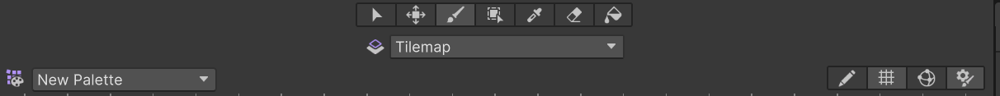

# Tilemap

Tilemap（瓦片地图）是 Unity 中用于创建 2D 关卡的强大工具，它允许你使用小的、可重复使用的 `Sprite`（称为 `Tile`）来构建游戏世界。

## Tilemap 系统概述

Tilemap 就像是一个画布，你可以使用自定义的笔刷，自由地进行绘制。Tilemap 系统使得创建复杂的 2D 场景变得简单高效。

Unity 中的 Tilemap 系统主要由5个部分组成：
1. Sprite 精灵：2D 中纹理的容器。
2. Tile 瓦片：包含一个精灵，以及颜色和碰撞体类型。
3. Palette 调色板：保存 Tile，将它们绘制到网格上。
4. Brush 笔刷：用于将预制的笔刷绘制到画布上。
5. Tilemap 瓦片地图：画布。

## 使用 Tile Palette 进行绘制

在 Unity 中，Tilemap 的绘制可以分为以下几个步骤： 

1. **创建调色板（Palette）**  
   通过菜单栏选择 `Window > 2D > Tile Palette` 打开 Tile Palette 窗口。如果还没有调色板，Active Palette 会显示 `No Valid Palette`，点击 `Create New Palette` 创建一个新的调色板。创建时可设置 `Grid Type`（网格类型），常用类型有：
   - `Rectangular`：矩形瓦片
   - `Hexagonal`：六边形瓦片
   - `Isometric`：等距瓦片
   - `Isometric Z as Y`：等距瓦片，Z 轴作为 Y 轴

2. **添加 Tile 到调色板**  
   将准备好的 Sprite 拖拽到调色板窗口中，即可自动生成对应的 `Tile`。如需调整调色板内容，可点击右侧的 `Toggle Tile Palette Edit` 进入编辑模式。

3. **创建 Tilemap 画布**  
   在 Hierarchy 面板中右键，选择 `2D Object > Tilemap`，根据需要选择合适的 Tilemap 类型。Tilemap 就是我们实际绘制 2D 场景的画布。

4. **在 Tilemap 上绘制**  
   在 Tile Palette 窗口点击 `Toggle Tile Palette Edit` 进入编辑模式，使用吸色笔选择需要的 Tile，然后在 Scene 视图中点击或拖动鼠标，即可将 Tile 绘制到 Tilemap 上。

::: tip Tile Palette 绘制工具

Tile Palette 面板上方提供了多种绘制工具：
- 选择工具
- 移动工具（可移动 Tile）
- 笔刷工具
- 框填工具
- 吸色笔
- 橡皮擦
- 填充工具
:::

注意事项：
- 在 `Isometric Z as Y` 调色板中，如果 Tile 在调色板中未对齐网格中心，可勾选下方 `Can Change Z Position`，并在绘制时用 +、- 键调整 Z 轴位置。但在做具有伪 Z 轴的 2D 游戏时，通常还是使用 `Isometric` 调色板。Sp
- 精灵纹理的轴心点会影响 Tile 的显示效果。
- 使用等距瓦片时，Unity 默认用 z 轴决定前后关系，但等距瓦片游戏通常不需要 z 轴。为避免遮挡问题，可按如下方式调整排序：
    - 进入 `Edit -> Project Settings -> Graphics -> Transparency Sort Mode`，将其设置为 `Custom Axis`，并将 `Transparency Sort Axis` 设置为 (0, 1, -0.26)。
    - 将 `Tilemap Renderer` 组件的 `Mode` 设置为 `Individual`。

## `Grid` 组件

所有的 `Tilemap` 都需要一个 `Grid` 组件来定义网格的布局。如果是首次创建 Tilemap， Unity 会自动生成一个携带 `Grid` 组件的游戏对象（通常就叫做 `Grid`），就如同 UI 元素与 `Canvas` 的关系一样。

`Grid` 组件允许你设置与网格排列相关的属性：

| 属性名           | 说明 |
|------------------|------|
| `Cell Size`      | 网格单元的大小。 |
| `Cell Gap`       | 网格单元之间的间距。 |
| `Cell Layout`    | 网格的布局方式，如矩形、六边形等。Create Tile Palette 时不同类型的 Tilemap 的区别其实就在这里。|
| `Cell Swizzle`   | 将单元格坐标重新排序为选择类型。通常保持默认即可。 |


如果美术资源太大或太小，可以通过修改 `Cell Size` 和图集的 `Pixels Per Unit` 来调整大小。

## `Tilemap` 组件

`Tilemap` 组件上的参数很少有情况需要去修改它，其包含了一些全局属性：

| 属性名           | 说明 |
|------------------|------|
| `Animation Frame Rate` | 瓦片动画播放速率。 |
| `Color`    | 色调。 |
| `Tile Anchor` | 瓦片的锚点偏移。 |
| `Orientation` | 瓦片地图上瓦片的朝向。相当于 2D 平面使用的是 Unity 中的哪两个轴。 |

## `Tilemap Renderer` 组件

`Tilemap Renderer` 组件挂载在 `Tilemap` 上，负责渲染瓦片内容。主要属性包括：

| 属性名           | 说明 |
|------------------|------|
| `Sort Order` | 所选瓦片在地图上的排序方向。可以视作设置画布原点。 |
| `Mode` | 瓦片渲染模式。`Chunk` 会将精灵进行批处理渲染，`Individual` 则会逐个渲染。 |
| `Detect Chunk Culling` | 渲染器渲染边界。`Auto` 模式下只会渲染摄像机内瓦片。 |
| `Material` | 瓦片渲染使用的材质。默认使用 `Sprites-Default` 材质不受光照影响。 |
| `Sorting Layer` | 瓦片渲染的排序层级。 |
| `Order in Layer` | 瓦片渲染的层级顺序。 |


## 添加碰撞器

为 Tilemap 添加碰撞器非常方便，只需要再 Tilemap 上添加一个 `Tilemap Collider 2D` 组件即可。该组件会自动为每个 Tile 生成碰撞器。

可以通过 `Composite Collider 2D` 组件来优化碰撞器的生成。该组件会将所有 `Tile` 的碰撞器合并为一个单一的碰撞器，从而提高性能。由于挂载 `Composite Collider 2D` 组件时还会自动添加 `Rigidbody 2D` 组件，如果不需要物理效果，可以将 `Rigidbody 2D` 的 `Body Type` 设置为 `Static`。

此外还可以在 Inspector 中修改 `Tile` 的 `Collider Type`：
| 瓦片碰撞器类型 | 说明 |
|------------------|------|
| `None` | 不生产碰撞器。 |
| `Sprite`| 使用精灵的形状作为碰撞器（默认）。 |
| `Grid` | 将严格按照该瓦片所在的网格单元 (Grid Cell) 的形状来生成。 |

::: tip
在等距瓦片游戏中，墙壁等静态物体通常设为 `Grid`，地面通常设为 `None`。
:::

如果需要做一些特殊的功能（例如使用平台效应器），Tilemap 碰撞器可能无法满足需求。此时可以单独创建一个空物体并为其添加碰撞器组件（如 `Box Collider 2D` 或 `Polygon Collider 2D`）。对于复杂的逻辑不用过度依赖 Tilemap 碰撞器。

## Tilemap 渲染顺序

Tilemap 中 Sprite 渲染优先级：
1. `Order in Layer`：在同一层级中，较大的值会被渲染在较小的值之上。
2. `Sorting Layer`：不同的排序层级会影响渲染顺序。
3. `Z Position`：在等距瓦片中，Z 轴位置会影响渲染顺序，较小的 Z 值会被渲染在较大的 Z 值之上。

::: details 角色与 NPC 的轴心点调整
在等距瓦片中，默认创建的人物或者 NPC 对象可能会出现半个身子被地面遮挡，看起来被埋在地里一样的情况。这就是渲染顺序的问题，根据角色图片中心点排序容易会导致渲染顺序的错误。

**解决方案：**
- 使用 Sprite Editor 将角色的轴心点调整到脚底下方。然后修改 `Sprite Renderer` 的 `Sprite Sort Point` 属性为 `Pivot`，这样就可以确保角色正确地站在地面上。
- 修改 `Order In Layer` 属性，使其大于地板排序层级。

此外，为了更方便地处理运动逻辑，通常都会把需要站立在地面上的物体的轴心点设置在底部。
:::

对于设置渲染层级还无法解决问题，可能是 `Tilemap Renderer` 的 `Mode` 设置为 `Chunk`，此时会将 Tilemap 划分为多个块进行渲染。可以尝试将其改为 `Individual` 模式，这样每个 Tile 都会单独渲染，可能会解决一些渲染顺序问题。

## Tilemap 的局限
- Tilemap 制作地形很方便，但只能在一个格子中心绘制 Tile，无法在格子之间绘制。
- 对于需要有逻辑交互的地形不方便制作（如平台效应器）。
- Tilemap 主要用于静态场景，动态物体（如角色）需要单独处理。

## 常用 API

可以通过 `Tilemap` 组件的 API 来操作 `Tilemap`，进行增删改查等，例如：
```csharp
// 获取 Tile
TileBase tile = tilemap.GetTile(tilePosition);

// 设置 Tile
tilemap.SetTile(tilePosition, newTile);

// 清除 Tile
tilemap.SetTile(tilePosition, null);

// 批量设置 Tiles
tilemap.SetTiles(tilePositionArray, tileArray);

// 批量替换 Tiles
map.SwapTile(oldTile, newTile);
```

其中，`TileBase` 是所有 `Tile` 的基类；`tilePosition` 类型为 `Vector3Int`。

此外，还可以使用 `tilemap.WorldToCell(Vector3 worldPos)` 方法将世界坐标转换为 `Tilemap` 的格子坐标，例如：
```csharp
// 获取鼠标在屏幕上的位置
Vector2 mousePosition = Input.mousePosition;
// 将屏幕坐标转换为世界坐标
Vector3 worldPosition = mainCamera.ScreenToWorldPoint(
   new Vector3(mousePosition.x, mousePosition.y, mainCamera.nearClipPlane));
// 将世界坐标转换为 Tilemap 的单元格坐标
Vector3Int cellPosition = tilemap.WorldToCell(worldPosition);
```

## `2D Tilemap Extras` 扩展包

`2D Tilemap Extras` 是 Unity 官方推出的一个免费扩展包，旨在增强内置 2D Tilemap 系统的功能。 它将过去社区中广受欢迎的自定义脚本（来自旧的 `2d-extras`）进行了优化和整合，变成了官方支持的、更稳定、更易于使用的工具集。

安装方式：
1. 打开 Unity Package Manager。
2. 点击左上角的 + 按钮，选择 Add package from git URL...。
3. 输入 `com.unity.2d.tilemap.extras`，点击 Add。

在 Project 窗口可找到 `2D Tilemap Extras` 扩展包带来的 Tiles，在 Tile Palette 中可以找到新增的笔刷。

### Tile

#### `Rule Tile`

`Rule Tile` 是一种“智能”瓦片，它能够根据自身周围的邻居瓦片，自动从一个列表中选择并显示正确的 `Sprite`。

它主要解决了在拼接地图时，不同区域（如草地、墙壁）之间需要大量过渡瓦片（如边角、边缘）的问题。通过预设规则，`Rule Tile` 可以将这个繁琐的过程完全自动化，极大提升关卡搭建的效率和美观度。

`Rule Tile` 核心属性：

| 属性 (Property)	| 功能说明 (Function) |
|------------------|---------------------|
| `Default Sprite`	| 默认显示的精灵。当没有一条规则被满足时，会显示此精灵。 |
| `Default GameObject`	| 默认生成的游戏对象。 |
| `Default Collider`	| 默认的碰撞器类型 (`None`, `Sprite`, `Grid`)。 |
| `Number of Tiling Rules` | 显示你当前已经创建了多少条平铺规则 (`Tiling Rules`)，只读不用修改。 |
| `Tiling Rules`	| 平铺规则列表。这是 `Rule Tile` 的核心，你可以在这里定义所有的匹配规则和对应的输出。 |

`Tiling Rules` 规则详解：

每个规则都由“匹配条件”和“输出结果”两部分组成。

| 规则属性 (Rule Property)	| 功能说明 (Function) |
|------------------|---------------------|
| 匹配网格 (3x3 Grid)	| 定义匹配条件的核心。中心格子代表当前瓦片，周围8个格子代表其邻居。点击格子可以切换三种状态：箭头 (必须是同类)、叉号 (必须不是同类) 和 空 (不关心)。 |
| `Rule Transform`	| 规则变换。用于处理旋转和镜像，可以极大减少规则的数量。 |
| `Sprite`	| 当此条规则匹配成功时，显示的精灵。 |
| `GameObject`	| 匹配成功时，实例化的预制体。可以用来创建可交互的对象。 |
| `Collider Type`	| 匹配成功时，瓦片的碰撞器类型。 |
| `Output`	| 输出类型。通常为 `Single`（单一输出），也可设为 `Random`（从精灵列表中随机选一个）或 `Animation`（播放序列帧动画）。

`Rule Tile` 默认是 `Rectangular` 网格类型， Create 窗口还具有其他类型的瓦片，如 `Hexagonal Rule Tile` 和 `Isometric Rule Tile`。

#### `Animated Tile`
`Animated Tile` (动画瓦片) 是一种可以随时间播放序列帧动画的瓦片。它让你的 2D 世界充满生机，非常适合用来制作流动的岩浆、闪烁的宝石、燃烧的火焰或动态的背景元素。

你需要提供一组静态的 `Sprite` 图片，`Animated Tile` 会按照你设定的速度循环播放这些图片，从而形成动画效果。

`Animated Tile` 核心属性：

| 属性 (Property)	| 功能说明 (Function) |
|------------------|---------------------|
| `Number of Animated Sprites`	| 动画包含的总帧数，只读不用修改。 |
| `Animated Sprites`	| 存放动画序列帧的列表。你需要按照播放顺序将 `Sprite` 拖拽到这里。 |
| `Minimum Speed`	| 动画播放的最小速度，单位是“帧/秒”。 |
| `Maximum Speed`	| 动画播放的最大速度，单位是“帧/秒”。每个瓦片的实际播放速度会是这个范围内的随机值。 |
| `Animation Start Time`	| 动画开始播放的时间。`Sync` 表示所有瓦片同步播放，`Random` 表示每个瓦片随机一个起始时间。 |
| `Collider Type`	| 该瓦片的碰撞器类型 (`None`, `Sprite`, `Grid`)。 |


#### `Rule Override Tile`
`Rule Override Tile` (规则覆盖瓦片) 是一种高级瓦片，它本身不包含任何平铺规则。相反，它会继承一个已有的 `Rule Tile` 的所有规则，并允许你只针对性地覆盖 (Override) 其中一条或几条规则的输出结果。

`Rule Override Tile` 核心属性：
| 属性 (Property) | 功能说明 (Function) |
|------------------|---------------------|
| `Tile`	| 指定要继承规则的“父” `Rule Tile`。这是建立继承关系的关键。 |
| `Overrides`	| 一个列表，包含了所有你想要覆盖的规则。每个列表项都定义了一个“原始输出”到“新输出”的映射关系。 |

#### `Advanced Rule Override Tile`

`Advanced Rule Override Tile` (高级规则覆盖瓦片) 是 `Rule Override Tile` 的直接超集。它继承了后者的所有功能——即继承一个基础 `Rule Tile` 的规则并覆盖其输出的 `Sprite`——同时，它还额外提供了覆盖 `GameObject` (预制体) 和 `Collider Type` (碰撞器类型) 的能力。

核心功能扩展：

| 覆盖属性 (Override Property) | 功能说明 (Function) |
|------------------|---------------------|
| `Override Sprite` (同 `Rule Override Tile`) | 勾选此项，可以提供一个新的 `Sprite` 来替换原始规则的 `Sprite` 输出。 |
| `Override GameObject` (新增) | 勾选此项，可以提供一个新的 `GameObject` 预制体来替换原始规则的 `GameObject` 输出。 |
| `Override Collider`	(新增) | 勾选此项，可以选择一个新的 `Collider Type` 来替换原始规则的碰撞器类型。 |

### Brushes

#### `GameObject Brush`

`GameObject Brush` (游戏对象笔刷) 允许你直接将游戏对象 (`GameObjects`)，通常是预制体 (`Prefabs`)，“绘制”或“盖章”到场景的网格上。

笔刷核心属性：
| 属性 (Property)	| 功能说明 (Function) |
|------------------|---------------------|
| `GameObject`	| 绘制的对象。 |
| `Offset` | 绘制时的对象的偏移量。|
| `Scale` | 绘制时对象的缩放比例。 |
| `Orientation` | 绘制时对象的旋转角度。|
| `Size` | 可同时绘制的对象数量。|

#### `Group Brush`

可以设置参数，当点击一个瓦片时，会自动取出一个范围内的瓦片。

核心属性：
| 属性 (Property)	| 功能说明 (Function) |
|------------------|---------------------|
| `Gap` | 遇到几个空白瓦片时，停止继续探测尝试选取。 |
| `Limit` | 一个方向上最多可以选取的瓦片数量（同一个轴的正负算作两个方向）。 |

#### `Random Brush`
可以随机绘制瓦片。

核心属性：
| 属性 (Property)	| 功能说明 (Function) |
|------------------|---------------------|
| `Tile Set Size` | 瓦片集大小。 |
| `Number of Tiles` | 瓦片数量。 |

#### `Line Brush`
选择一个瓦片绘制一条直线。

核心属性：
| 属性 (Property)	| 功能说明 (Function) |
|------------------|---------------------|
| `Line Start Active` | 使用上一个起点。|
| `Fill Gaps` | 通过绘制更多瓦片使线段更饱满。|
| `Line Start` | 线段起点坐标。|

### `Custom Rule Tile Script`
`Custom Rule Tile Script` (自定义规则瓦片脚本) 不是一个可以直接使用的瓦片，而是一个 C# 脚本模板。通过编辑这个脚本，你可以创建出拥有全新匹配规则的、完全自定义的 Rule Tile。


::: details `Custom Rule Tile Script` 模版示例
```csharp
[CreateAssetMenu]
public class CoastlineRuleTile : RuleTile<CoastlineRuleTile.Neighbor> 
{
    // 添加一个公开的列表，用于在 Inspector 中指定哪些瓦片算作“水”
   public List<TileBase> waterTiles;

   public class Neighbor : RuleTile.TilingRule.Neighbor 
   {
      // 定义一个新规则 "IsWater"
      public const int IsWater = 3; 
   }

   public override bool RuleMatch(int neighbor, TileBase tile) 
   {
      switch (neighbor) 
      {
         // 当规则是 IsWater 时，检查邻居瓦片是否存在于我们的 waterTiles 列表中
         case Neighbor.IsWater: return waterTiles.Contains(tile);
      }
      return base.RuleMatch(neighbor, tile);
   }
}
```
:::

