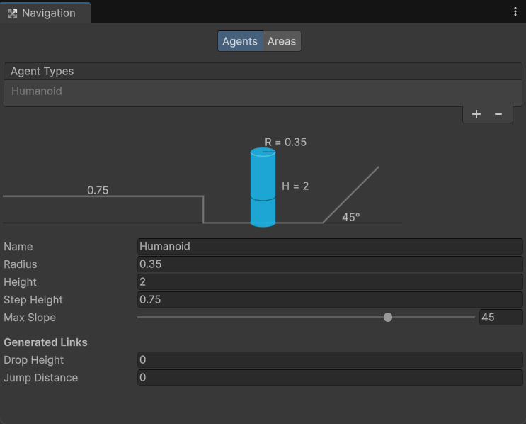
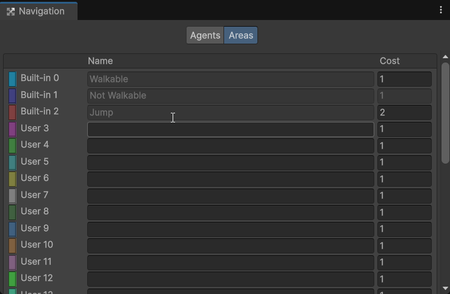
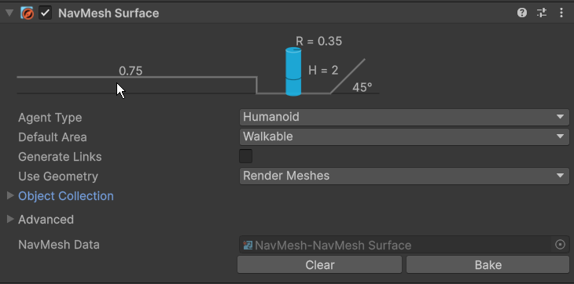
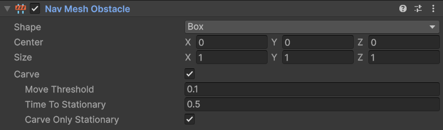

# Unity-AI Navigation

AI Navigation 是 Unity 中用于自动寻路的包，此篇专注于介绍新的 AI Navigation 2.0。

## 概览

AI Navigation 的核心是烘焙一个可行走区域的地图（NavMesh），然后让角色（Agent）在这张地图上寻找最短路径（Pathfinding）。

**核心概念：**

1. 导航网格 (Navigation Mesh / NavMesh)

    NavMesh 是专门绘制的一张可行走地图。它是一个简化的、由多边形构成的蓝色覆盖层，精确地告诉 AI：这些蓝色的地方，你都可以安全行走。

2. 寻路算法 (Pathfinding Algorithm)

    Unity 主要使用一种叫做 A* (A-Star) 的高效算法。

3. 烘焙 (Baking)

    烘焙就是生成 NavMesh 的过程。Unity 就会开始分析你标记为导航相关的物体，然后自动计算并生成那张蓝色的 NavMesh 地图。

4. 代理 (Agent / `NavMeshAgent`)
    
    它是一个组件 (Component)，你把它添加到你的 AI 角色（比如一个敌人或者一个 NPC）身上。你用代码给它一个目标点（`SetDestination`），它就会自动查询 A* 算法获取路径，然后控制角色的移动，包括加速、减速、转向、避开其他 Agent，最终平滑地移动到目的地。

**总结一下流程：**

布置场景 -> 烘焙 (Bake) 生成 NavMesh 地图 -> 给角色添加 `NavMeshAgent` 组件 -> 用代码告诉 Agent 去哪里。


## Navigation 窗口

Navigation 窗口只负责全局设置 (Agents, Areas)，场景内的具体操作则由 `NavMeshSurface` 和 `NavMeshModifier` 等组件完成。

**标签页：**
- Agents 标签页: 定义项目中所有可能存在的 Agent 的体型和能力（半径、高度、坡度等）。这属于一次性设定，供整个项目使用。
- Areas 标签页: 定义全局的区域类型和它们的寻路成本（比如 "Walkable", "Water", "Lava"）。



**Agents 属性说明：**

- `Agent Types`

    这是一个列表，允许你创建和管理多种不同的 Agent 模板。例如，你可以创建一个：

    - Humanoid (人形)：像您截图中这样，用于普通大小的角色。
    - Crawler (爬行者)：一个 `Height`（高度）很低但 `Radius`（半径）可能较宽的怪物。
    - Brute (巨兽)：一个 `Radius` 和 `Height` 都非常大的角色，它无法通过狭窄的门。

- `Name`

    当前这个 Agent 模板的名称。

- `Radius`

    一个浮点数，表示 Agent 的半径。这个值决定了 Agent 能通过多窄的通道。

- `Height`

    一个浮点数，表示 Agent 的高度。决定了 Agent 能通过多低矮的障碍物。

- `Step Height`

    Agent 能够迈上去的台阶的最大高度。

- `Max Slope`

    Agent 能够行走的最陡峭的斜坡角度（单位是度）。

- <span class="badge">Generated Links</Span>

    这个部分用于让系统自动创建一些特殊的“捷径”，允许 Agent 跨越一些导航网格中断的区域。

- `Drop Height`

    Agent 可以从一个平台边缘跳”或落下的最大垂直距离。

- `Jump Distance`

    Agent 可以水平跳过的最大间隙距离。



**Areas 标签页**

- Areas 标签页让你能够赋予场景中不同区域不同的通行成本，从而影响 AI 的寻路决策。可在物体的 `NavMeshModifier` 组件里选择已有 Areas。

- `Name`

    这个区域类型起的名字（比如“泥地”、“沼泽”、“加速带”）。

- `Cost`

    通过这个区域时所需付出的成本。 (cost >= 1)

    - `Cost = 1`: 标准成本，代表普通、正常的地面。
    - `Cost > 1`: 高成本区域。AI 会尝试绕远寻找最低成本路径。
    - `Cost < 1`: 低成本区域。AI会优先选择走这些路，哪怕路线实际更长。

## `NavMeshSurface` 组件

`NavMeshSurface` 负责在一个特定区域内生成导航网格。

你可以在一个场景中拥有多个 `NavMeshSurface`。这意味着你可以为不同的区域（比如建筑的一楼、二楼，或者一个独立的浮空岛）分别生成独立的导航网格，这在旧系统中是很难做到的。

这个组件通常被添加到一个空的 `GameObject` 上，作为场景中导航系统的控制器或管理器，这样更便于组织。

**创建 `NavMeshSurface`：**

打开 GameObject 菜单，选择 AI -> NavMeshSurface，会自动创建一个携带 `NavMeshSurface` 组件的游戏对象。

或者你可以创建一个空的 `GameObject`，然后手动添加 `NavMeshSurface` 组件。



**`NavMeshSurface` 的参数：**

- `Agent Type`

    指定该 `NavMeshSurface` 服务哪种 Agent（于 Navigation 窗口定义）。

- `Default Area`

    指定所有未被 `NavMeshModifier` 修改的、表面属于哪种区域类型（于 Navigation 窗口定义）。

- `Generate Links`

    是否生成跳跃和下落的连接点（具体数据于 Navigation 窗口定义）。

- `Use Geometry`

    决定 `NavMeshSurface` 是根据物体的视觉模型还是物理碰撞体来生成 NavMesh。

- <span class="badge">Object Collection</span>

    这个区域是用来精确筛选参与烘焙的物体。它提供了两层强大的过滤器。

- `Collect Objects`

    基于物体在 Hierarchy 中的关系来筛选。

    - `All Game Objects`：所有游戏物体。
    - `Volume`：设定一个立方体范围，只烘焙范围内的物体。
    - `Children`: 只烘焙挂载了这个 `NavMeshSurface` 组件的物体的所有子物体。（**推荐**）

- `Include Layers`

   基于物体的 Layer 来筛选。

- <span class="badge">Advanced</span>

    一些关于细节处理的设置，一般情况下保持默认即可。
    ::: details
    - `Voxel Size`

        烘焙体素的大小。

        体素可以理解为烘焙过程中的最小像素块或建筑砖块。Unity 在生成 NavMesh 之前，会先将你的场景“像素化”成一堆小立方体（也就是体素）。`Voxel Size` 就是这个立方体砖块的大小。值越小，精度越高，内存消耗更大。

    - `Tile Size`

        单个瓦片的大小。这是一个纯粹的性能优化选项，通常你永远不需要修改它。

        为了提高效率和利用多核 CPU，NavMesh 烘焙器不会一次性处理整个世界，而是把它分割成一个个正方形的瓦片（Tile），然后一块一块地处理。`Tile Size` 就是单个瓦片的尺寸（单位是Voxel，即上面说的体素）。

    - `Minimum Region Area`

        最小生成导航网格区域的面积。任何面积小于这个值的独立蓝色区域都会被排除掉。

        有时可能会在场景中生成一些非常非常小的、孤立的导航区域。这些区域太小了，没有生成的意义。该选项可以让最终生成的 NavMesh 更干净、更实用，移除掉那些没意义的碎片区域。当场景里有很多这种小碎片时，可以适当调高这个值。

    - `Build Height Mesh`

        生成更精确的表面高度信息。

        会额外生成一个详细的高度网格，让 NavMesh 的表面更紧密地贴合复杂、凹凸不平的地面（比如崎岖的山地）。这能让 Agent 在这些地形上移动时，脚部的位置更精确，减少悬空或“陷入地面”的情况。
    :::

- `NavMesh Data`

    烘焙成功后，这里会引用一个生成的数据文件（.asset）。

## `NavMeshAgent` 组件

`NavMeshAgent` 组件负责读取 NavMesh 信息指引角色到达指定目标地点，并且可以自动处理和避障等逻辑。

**属性说明：**

- `Agent Type`

     指定这个 Agent 属于哪种类型。 必须与 `NavMeshSurface` 烘焙时使用的 `Agent Type` 相匹配。

- `Base Offset`

    沿着 Y 轴对 Agent 的模型进行的视觉偏移。

- <span class="badge">Steering</span>

    Agent 移动相关的属性。

    ::: details

    - `Speed` & `Angular Speed` & `Acceleration`

        最大移动速度/最大转向速度/最大加速度。

    - `Stopping Distance`

        Agent 会在距离目标多远的地方停下。通常设置为一个非0但较小的值，如 `0.1`、`0.5`。

    - `Auto Braking`

        在接近 `Stopping Distance` 范围时自动减速。

    :::

- <span class="badge">Obstacle Avoidance</span>

    用于处理 Agent 之间的动态实时避障。

    ::: details

    - `Radius` & `Height`

        与 `Agent Type` 里定义的不同，此处仅用于定义 Agent 移动时，实时互避所用圆柱体。

    - `Quality`

        Agent 之间互相躲避的计算精度。

    - `Priority`

        决定当两个 Agent 路径冲突时，谁应该让路。范围0~99，数字越小，优先级越高。

    :::

- <span class="badge">Path Finding</span>

    与路径的计算和执行有关。

    ::: details
    - `Auto Traverse Off Mesh Link`

        自动穿越 Off Mesh Link，即连接两块独立 NavMesh 的特殊通道。
    
    - `Auto Repath`

        自动重新寻路。当原路径被阻挡时，Agent 会自动寻找一条新的可行路径。

    - `Area Mask`

        决定了 Agent 可行走的 `Areas`。

    :::

**代码控制：**

`agent.SetDestination(Vector3 targetPosition)` 是导航寻路的核心方法。它接收一个 `Vector3` 类型的目标点（即世界空间中的一个三维坐标），然后 NavMesh Agent 会自动计算出到达该点的最佳路径并开始移动。例如：
```csharp
agent.SetDestination(target.position);
```


光让 Agent 移动还不够，我们经常需要知道它当前的状态，以便做出下一步决策（如从追逐切换到攻击）。

1. Agent 的重要属性：  
    | 属性 | 描述 |
    |---|---|
    | `remainingDistance` | Agent 距离当前路径目标点还剩多远。 |
    | `stoppingDistance` | 你在 Inspector 里设置的停止距离。 |
    | `pathPending` | 一个布尔值，当 Agent 正在计算路径时为 true。在计算完成前，`remainingDistance` 可能是无效的。 |
    | `velocity` | Agent 当前的速度向量。 |
    | `pathStatus` | 返回一个路径状态的枚举。<ul><li>`PathStatus.PathComplete` — 路径完整，可到达目标。</li><li>`PathStatus.PathPartial` — 路径部分有效，Agent 会尽量接近目标但无法完全到达。</li><li>`PathStatus.PathInvalid` — 路径无效，通常表示目标不在 NavMesh 上或不可达。</li></ul> |
    | `isStopped` | 控制 Agent 移动的布尔属性。例如：设置为 `true` 时，Agent 会暂停移动但不会清除当前路径；设置为 `false` 时，它会继续沿着之前的路径移动。 |

2. 相关 API：

    立即清除当前路径，Agent 会停在原地。就像是取消导航：
    ```csharp
    agent.ResetPath();  
    ```
    立即将 Agent 传送到 NavMesh 上的一个新位置：
    ```csharp
    agent.Warp(Vector3 newPosition);
    ```

## `NavMeshObstacle` 组件

`NavMeshObstacle` 组件用于那些不是 Agent，但又需要阻挡 Agent 路径的动态物体。



**属性说明：**

- `Shape`

    定义障碍物的体积形状。

- `Center` & `Size`

    精确调整障碍物体积的大小和位置。

- <span class="badge" data-variant="green">Carve</span>

    在 NavMesh 中挖空出障碍物的体积。由于动态避障替换为静态障，性能开销会相对较大。

    ::: details 雕刻选项
    - `Move Threshold`：障碍物需要移动超过这个距离后，才会更新它在 NavMesh 上挖的洞。设置一个稍大的值（比如0.1）可以防止因微小移动就频繁更新 NavMesh，从而优化性能。
    - `Time To Stationary`：障碍物停止移动多久后，被认为是静止的。
    - `Carve Only Stationary`：一个优化选项。勾选后，障碍物只会在它停下来达到 `Time To Stationary` 设定的时间后，才会在 NavMesh 上挖洞。
    :::

## `NavMeshLink` 组件

`NavMeshLink` 用于在两个导航网格不相连的区域之间，手动创建一个可通行的连接。

自动烘焙系统很聪明，但它无法理解一些游戏中的抽象概念。`NavMeshLink` 就是作为设计师的你，用来告诉 AI：虽然这里看起来没路，但实际上你可以从这里跳过去/爬上去/传送过去！

**使用 `NavMeshLink` 组件：**

1. 在场景中创建一个空的 `GameObject`，可以命名为 `JumpLink` 或 `DoorLink`。
2. 将它放置在链接的起始位置附近。
3. 为这个 `GameObject` 添加 `NavMeshLink` 组件并调整起点和终点。

**属性说明：**

- `Agent Type`

    指定这个链接是为哪种类型的 Agent 准备的。

- `Area Type`

    定义这个链接本身属于哪种导航区域。

- `Cost Override`

    手动设置通过此链接的通行成本。

- <span class="badge">Positions</span>

    用于定义链接的两个端点。更推荐使用 `Start Transform` 和 `End Transform`。

    - `Swap`

        交换起点和终点的位置。

    - `Re-Center Origin`

        将 `NavMeshLink` 物体本身移动到起点和终点的正中间，方便整理场景。

- `Auto Update Positions`

    当链接的起点或终点位置发生变化时，自动更新链接的位置。

- `Bidirectional`

    允许 Agent 双向通过此链接。

- `Width`

    链接“桥梁”的宽度。虽0可以用，但建议设置一个合理的宽度（ex：>= Agent 半径）。

- `Activated`

    控制链接启用/禁用的开关。

**通过代码控制：**

主要通过修改 `navMeshLink.enabled` 属性来控制链接的启用和禁用。这和在 Inspector 中修改 `Activated` 的效果是一样的。

::: details 代码示例
最典型的应用就是门：
```csharp [DoorController.cs]
using UnityEngine;
using UnityEngine.AI;

public class DoorController : MonoBehaviour
{
    [SerializeField] private NavMeshLink navMeshLink; 
    private Animator animator; 

    void Start()
    {
        // 门一开始是关的，所以禁用Link
        if (navMeshLink is null)
            navMeshLink.enabled = false;
        
        animator = GetComponent<Animator>();
    }

    // 当需要开门时调用这个方法
    public void OpenDoor()
    {
        // 播放开门动画
        animator.SetTrigger("Open");

        // 启用NavMeshLink，让AI可以通过
        if (navMeshLink is not null)
            navMeshLink.enabled = true;
        
    }

    // 当需要关门时调用这个方法
    public void CloseDoor()
    {
        // 播放关门动画
        animator.SetTrigger("Close");

        // 禁用NavMeshLink，AI无法通过
        if (navMeshLink is not null)
            navMeshLink.enabled = false;
    }
}
```
:::

## `NavMeshModifier` 组件

用于在烘焙时对部分游戏对象进行特殊处理。

`NavMeshModifier` 主要有三大用途：

1. 指定区域类型 (Area Type)：这是它最常用的功能。你可以将一个平面标记为你在 Navigation 窗口 Areas 标签页里定义过的任何类型，比如 "Mud" (泥地), "Water" (水域), 或 "Lava" (岩浆)。

2. 标记为不可通行 (Not Walkable)：强制让某个区域无法被烘焙成 NavMesh，即使它的物理形状是平坦的。

3. 从烘焙中完全忽略 (Ignore from Build)：让 `NavMeshSurface` 在烘焙时完全无视这个物体，就好像它不存在一样。

**参数说明：**

- `Mode`

    将物体纳入考虑，还是从烘焙中忽略。

- `Affected Agents`

    设置这个 Modifier 只对特定类型的 Agent 生效。

- `Apply To Children`

    将 `NavMeshModifier` 上的设置应用到所有子物体。

- `Override Area`

    是否要修改物体的区域类型（`Area Type`）。

- `Override Generate Links`

    局部地控制自动链接的生成（`NavMeshSurface` 上有一个 `Generate Links` 的总开关）。

## `NavMeshModifierVolume` 组件

与 `NavMeshModifier` 作用类似，但作用于一个特定的立方体区域内的所有物体。

- `Size` & `Center`

   定义立方体的大小和位置。

- `Area Type`

    修改物体的区域类型。

- `Affected Agents`

    设置这个 Modifier 只对特定类型的 Agent 生效。

## 运行时烘焙

运行时烘焙是新版 AI Navigation 包最强大的功能之一，适用于程序化随机生成的关卡（如 Roguelike 游戏）或允许玩家在游戏中建造/破坏地形的场景（如沙盒游戏）。

运行时烘培主要通过 `NavMeshSurface` 组件的 `BuildNavMesh()` 方法来实现。这个方法会使 `NavMeshSurface` 立即根据它当前的设置（如`Collect Objects`, `Include Layers`等）重新扫描指定的物体，并生成一个新的、更新后的 NavMesh。

```csharp
navMeshSurface.BuildNavMesh()
```

::: warning
这是一个同步操作，意味着在它完成之前，游戏主线程会暂停。
:::

为了流程性，很多时候我们需要将复杂的 NavMesh 计算交给后台线程。

核心 API 有：
1. `NavMeshSurface.CollectSources()`

    这个辅助方法会根据 `NavMeshSurface` 的设置（收集范围、层等），收集所有需要参与烘焙的物体信息，并返回一个列表。这是异步烘焙的第一步：准备原材料。

2. `NavMeshBuilder.UpdateNavMeshDataAsync()`

    这是执行异步烘焙的关键方法。它接收烘焙所需的各种数据（包括上面收集到的物体列表），然后开始在后台线程中计算 NavMesh。它会返回一个 `AsyncOperation` 对象，我们可以通过这个对象来监控烘焙进度。

3. `AsyncOperation`

    这是 Unity 中处理所有异步操作的标准对象。我们可以通过查询它的 `isDone` 属性来判断操作是否完成，或者通过 `progress` 属性获取当前进度（0~1）。

::: details 代码示例
```csharp [AsyncNavMeshBuilder.cs]
using UnityEngine;
using UnityEngine.AI;
using System.Collections;
using System.Collections.Generic;

public class AsyncNavMeshBuilder : MonoBehaviour
{
    [SerializeField] private NavMeshSurface navMeshSurface;

    private AsyncOperation navMeshUpdateOperation;
    // 存储烘焙结果
    private NavMeshData navMeshData;
    private List<NavMeshBuildSource> sources = new List<NavMeshBuildSource>();

    void Start()
    {
        // 在开始时，为 Surface 创建一个新的 NavMeshData 实例来存储烘焙结果
        navMeshData = new NavMeshData();
        navMeshSurface.navMeshData = navMeshData;

        // 在游戏开始时就进行一次初始的异步烘焙
        StartCoroutine(UpdateNavMesh());
    }

    // 你可以在任何需要更新NavMesh的时候（比如放置建筑后）调用这个公共方法
    public void RequestNavMeshUpdate()
    {
        StartCoroutine(UpdateNavMesh());
    }

    // 异步更新 NavMesh 的协程
    private IEnumerator UpdateNavMesh()
    {
        // --- 第1步: 收集需要烘焙的源数据 ---
        // 参数是烘焙的范围和变换，通常使用组件自身的设置即可
        var buildSettings = navMeshSurface.GetBuildSettings();
        var bounds = navMeshSurface.CalculateWorldBounds(sources);
        navMeshSurface.CollectSources(sources);

        // --- 第2步: 开始异步烘焙操作 ---
        navMeshUpdateOperation = NavMeshBuilder.UpdateNavMeshDataAsync(
            navMeshData,      // 要更新的 NavMeshData
            buildSettings,    // 烘焙设置
            sources,          // 烘焙源列表
            bounds            // 烘焙范围
        );

        // --- 第3步: 监控烘焙过程 ---
        while (!navMeshUpdateOperation.isDone)
            yield return null; 

        if (navMeshUpdateOperation.isDone)
            Debug.Log("异步烘焙完成！");
    }

}
```
:::

## 与动画系统的配合

对于移动动画来说，可以提供通过 `NavMeshAgent` 的速度信息来驱动动画参数：
```csharp
animator.SetFloat("Speed", navMeshAgent.velocity.magnitude);
```

同时使用 `NavMesh Agent` 和带有 `Root Motion` 的 `Animator` 可能会产生竞争条件，因为两者都会尝试在每帧更新中移动 `Transform`。

解决方案有两种，核心原则是信息流应单向传递：要么由 `Agent` 控制角色移动，动画跟随其运动；要么由动画控制角色移动，`Agent` 负责路径模拟。否则会形成难以调试的反馈回路。

## 与物理系统的配合

你无需为 `NavMesh Agent` 添加物理碰撞器也能让它们互相避开。导航系统会模拟 `Agent` 与障碍物及静态世界的交互，该“静态世界”即已烘焙的 `NavMesh`。

如果你希望 `NavMesh Agent` 推动物理对象或触发物理触发器，请执行以下操作：

1.  为代理添加 `Collider` 组件。
2.  为代理添加 `Rigidbody` 组件。
3.  启用代理 `Rigidbody` 的 `Is Kinematic` 属性 —— 这一步非常重要，`Kinematic` 意味着刚体的运动由其他系统控制，而非物理模拟本身。

如果 `NavMesh Agent` 的 `Rigidbody` 未启用 `Kinematic`，则会出现竞争条件，代理和刚体可能会同时尝试移动 `Agent`，从而导致难以预测的行为。

你也可以使用 `NavMesh Agent` 驱动玩家角色而不使用物理系统：

*   将玩家 `Agent` 的 `avoidance priority` 设置为较低数值（优先级高），以便玩家能穿过人群。
*   通过修改 `NavMeshAgent.velocity` 来移动玩家，这样其他 `Agent` 能预测玩家的运动并进行避让。