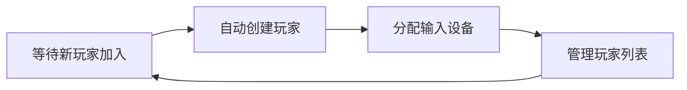

# Unity-InputSystem

Unity 的新输入系统将抽象的操作与具体的物理按键彻底分离开来。相比于老系统，新系统通过可视化的输入操作资源让你能轻松地为同一个操作绑定多个不同设备的按键，并内置了对长按、连击等复杂交互的强大支持，同时通过事件驱动的方式让代码更整洁、逻辑更清晰。

官方文档：[Input System 1.14.2](https://docs.unity3d.com/Packages/com.unity.inputsystem@1.14/manual/index.html)

## 导入

在 Unity6 的 URP 项目当中，Input System 已经会自动导入到项目中。如果需要切换输入系统，可以修改 Edit > Project Settings > Player 中的 Active Input Handling。

项目创建好时，Unity 会自动为你生成一个默认的 Input Actions 资产，叫做 `InputSystem_Actions`。这个资产会作为项目的 Project-wide Actions，即为整个项目指定的一个默认的输入操作资源。如若需要替换，可以在 Project Setting 中的 Input System Package 选项中进行修改。

## 纯粹代码获取输入

可以通过代码直接获取当前键盘来判断输入。这种方式和老的 Input Manager 类似，采用硬编码的形式，也因此不推荐在实际开发中使用。

**代码示例**
::: code-group
```csharp [EX1.cs]
// 获取当前连接的键盘
Keyboard keyboard = Keyboard.current;

// 检查 'A' 键本帧是否被按下
if (keyboard.aKey.wasPressedThisFrame)
    Debug.Log("A key was pressed this frame!");

// 检查左 Shift 键是否被按住
if (keyboard.leftShiftKey.isPressed)
    Debug.Log("Left Shift key is being held down.");

// 检查左 Shift 键本帧是否被释放
if (keyboard.leftShiftKey.wasReleasedThisFrame)
    Debug.Log("Left Shift key was released this frame!");
```

```csharp [EX2.cs]
// 订阅 onTextInput 事件，并指定当事件发生时调用 OnTextInput 方法
private void OnEnable()
{
    Keyboard.current.onTextInput += OnTextInput;
}

// 必须在 OnDisable 中取消订阅，防止内存泄漏
private void OnDisable()
{
    Keyboard.current.onTextInput -= OnTextInput;
}

// 当文本输入事件发生时，这个方法会被自动调用
private void OnTextInput(char character)
{
    // 处理文本输入事件
}
```

```csharp [EX3.cs]
// 检查本帧是否有任意键被按下
if (Keyboard.current.anyKey.wasPressedThisFrame)
{
    // 在这里写跳转场景、关闭UI等逻辑
}
```
:::

鼠标输入也是同种形式，且因为不常用不再赘述。

## `InputAction`

`InputAction` 类是对一个命令的抽象，其关注的是玩家的意图，而非具体按下的按键。

虽然你可以在类中声明一个 `InputAction` 字段然后在 Inspector 中编辑，但更常见的作法是在 `.inputactions` 资产文件中集中管理各种 `InputAction`。

**Action Properties：**

- `Action Type`

    决定了一个 Action 应该如何处理、整合以及最终输出从其绑定（Bindings）接收到的原始输入信号。

    | Action Type | 描述 |
    |---|---|
    | `Button` | 用于表示任何按下/松开的离散操作。如果一个开关，只有开和关两种状态。 |
    | `Value` | 用于表示连续变化的、可以是任意维度的模拟信号。可以代表一个具体的数值。 |
    | `Pass Through` | 类似于 `Value`，区别在于如果有多个设备绑定这个 Action，它会将所有设备的输入都传递给绑定的事件。 |

    ::: details `Pass Through` 不消歧 (No Disambiguation)
    如果一个 `Pass Through` Action 同时绑定了 W 和 D 键，当你同时按下它们时，这个 Action 的 `.performed` 事件会触发两次：一次由 W 键触发，一次由 D 键触发。它不会像 `Value` 类型那样将它们合并成一个对角线向量。

    当 `Pass Through` 的事件被触发时，它的价值不在于 `ReadValue()`，而在于从 `CallbackContext` 中获取那个触发了事件的物理控件本身。
    :::

- `Control Type`

    输入系统会根据 `Control Type` 筛选出对于的物理控件，并会把从这些控件接收到的信号转换成一种特定的数据格式。

    | 常用的 Control Type | 描述 | 输出类型 |
    | --- | --- | --- |
    | `Axis` |  用于表示一维的、连续变化的模拟值。 | `float` |
    | `Vector 2` | 表示二维的方向和幅度。 | `Vector2` |
    | `Vector 3` | 表示三维的方向和幅度。 | `Vector3` |

- `Interactions`

    定义输入必须如何被执行才能触发一个 Action。简单来说，`Interactions` 可以帮我我们简单实现诸如长按、连击等复杂交互。

    | 常用的 Interactions | 描述 | 意义 |
    | --- | --- | --- |
    | `Hold` | 长按 | 检测一个控件是否被按住超过了指定的时间。 |
    | `Press` | 按下 | 定义按键触发时机（按下/松开/两者） |
    | `Tap` | 点击 | 可以设置一个单次点击的持续时间（`Max Tap Duration`）。按下按键 (`Started`)，如果用户在持续时间内松开，`Performed` 事件就会在松开的瞬间触发，反之则触发 `Canceled`。|
    | `Slow Tap` | 慢点击 | 类似 `Tap`。当你按下按键并超过持续时间后，松开按键触发 `Performed`。 |
    | `Multi-Tap` | 多次点击 | 可以设置一个 `Tap Count`，表示在指定时间内需要按下的次数。 |

    其中所有 `Interactions` 都会有一个 `Press Point` 参数，代表一个按压阈值。很多设备（ex：手柄）的按键不只有按下和松开两个状态，还有类似半按、轻推的状态。`Press Point` 通过设立0.0~1.0的临界值，只有当扳机键的输入值大于或等于这个值时，才会被视为按下而非误触。

    此外还有一个 `Initial State Check`。默认情况下，如果在一个 Action 被启用时，它所绑定的某个按键已经处于被按下的状态，那么默认情况下 Action 对此一无所知。开启 `Initial State Check` 后，Action 会在启用时立即检查所有绑定的按键状态，并根据这些状态决定是否触发事件。

::: info `InputAction` 的事件
1. `Started`：按下时触发。
2. `Performed`：满足条件时触发。
3. `Canceled`：总是在用户松开按键等导致当前输入行为结束时触发。
:::

- `Processors`

    可以对原始输入的值行一系列的加工处理（比如过滤、反转、缩放），最后才将一个干净、规整的最终值传递给你的 `InputAction` 和游戏代码。

    | Processor | 描述 |
    |---|---|
    | `Clamp` | 限制输入值在一个指定的范围内。 |
    | `Invert` | 反转输入值（取反）。 |
    | `Scale` | 缩放输入值。 |
    | `Normalize` | 将输入值归一化到一个标准范围内（通常是0~1之间）。 |
    | `Normalize Vector 2` | 标准化向量。 |
    | `Scale` | 缩放。 |
    | `Axis Deadzone` | 忽略单个轴向的微小输入，会将其视为0。 |
    | `Stick Deadzone` | 忽略摇杆中心的微小输入，会将其视为0。 |

    有一个重要的 `Processor` 是 `Delta Time Scale`，其作用是将输入的增量值（Delta）乘以游戏的 `Time.deltaTime`，主要需要将输入增量转化为平滑、且与帧率无关的移动或旋转的场景。例如，对于鼠标移动转视角的 Action，你就应该使用该处理器。（`transform.rotate(0, rotationSpeed * Time.deltaTime, 0)`）

## 添加按键绑定

右键 Action 后即可添加绑定。总共有四种类型的绑定：

1. `Add Binding`

    用于将单个物理按键、摇杆轴或鼠标移动，直接映射到一个 Action。

2. `Add Positive/Negative Binding`

    创建一个 1D Axis (一维轴) 复合绑定 (Composite Binding)。

    核心用途: 使用两个相反的按键（比如 A 和 D）来模拟一个一维轴（比如左右移动），输出一个从 `-1.0` 到 `1.0` 的 `float` 值。

3. `Add Binding With One/Two Modifiers`

    用于创建一个带修饰键的复合绑定，也就是我们常说的组合键或快捷键。

    核心用途: 实现像 Ctrl + S 或 Ctrl + Shift + P 这样的输入。

    结构: 它会创建一个父绑定，下面带有子绑定：

    - Modifier (修饰键)：指定哪个键是必须被按住的（如 Ctrl, Shift, Alt）。

    - Binding (按键):指定在修饰键被按住的前提下，需要按下的那个主键（如 S）。

4. 此外还有一些和 `Control Type` 关联的 Bindings，例如：`Add Up/Down/Left/Right Composite`

::: tip
Bindings 里也有 `Interactions` 和 `Processors`。默认情况下，`Processors` 是串联的：先执行绑定的，再执行 Action 的；而一个输入行为必须同时满足两者的 `Interactions` 条件才能触发 `Performed` 事件。

但绝大多数情况下（可以说95%以上），你应该将 `Interactions` 和 `Processors` 直接添加到具体的 Binding 上。
:::

## 全局设置

Project Settings -> Input System Package 里的这些全局设置会影响项目中的所有输入行为，但大部分都可以在具体的 Binding 或 Action 上被覆盖（Override）。

此处只介绍几个，不易直观理解的选项：

- `Update Mode`

    - 它决定了 Input System 在何时处理输入事件和更新状态。这与 Unity 的 `Update` 和 `FixedUpdate` 生命周期紧密相关。

    | 选项 | 描述 |
    |---|---|
    | `Dynamic Update` | **这是默认且最推荐的选项。** 它会根据当前的更新模式自动选择最合适的时机。绝大多数情况下，它会与 `Update()` (游戏逻辑帧) 同步。 |
    | `Fixed Update` | 在每一帧的 `FixedUpdate` 中处理输入。 |
    | `Manual Update` | 禁用自动更新。你需要自己在代码的某个地方手动调用 `InputSystem.Update()` 来驱动系统。|

- `Background Behavior`

    - 它定义了当你的游戏窗口失去焦点（如切到桌面）时，输入系统该如何工作。

    | 选项 | 描述 |
    |---|---|
    | `Reset And Disable All Actions` | 这是独立平台（PC/Mac/Linux）的默认行为。当窗口失焦时，所有按下的按键状态都会被重置（比如角色会停止移动），并且系统不再监听输入。 |
    | `Ignore Focus` | 即使窗口在后台，输入系统仍然会像在前台一样处理所有输入。 |

- `Supported Devices`

    -  一个列表，告诉 Unity 你的游戏打算支持哪些类型的输入设备。

    - 这主要是一个性能优化选项。Input System 只会加载和监听列表中存在的设备类型。

    - 注意：从列表中移除设备不会神奇地让你的游戏不支持它，只会让 Input System 主动忽略它。


除了可以在 Actions 和 Bindings 覆盖的其他选项，其余未选项通常保持默认即可。（ex：`Scroll Delta Behavior` 滚轮增量行为、`Compensate Orientation` 移动设备传感器方向补偿）'

## `InputActionAsset`

`InputActionAsset` 是 Unity 新版输入系统的中央枢纽和核心大脑。它是一个独立于代码的资产文件，以一种可视化的方式，定义了您游戏中所有的输入逻辑。

它的核心设计思想是解耦：将玩家的意图（如跳跃）与具体的物理操作（如按下空格键）分离开来，并通过一个可配置的中间层将它们关联起来。

在之前的介绍中，我们也提到过输入配置文件（`.inputactions`）并隐隐提到如何使用，此处会是一个更加完整的介绍。

**创建 `.inputactions` 文件：**

右键单击项目窗口中的任意位置，选择 Create -> Input Actions。双击打开编辑。

> 本质是一个 `.json` 文件。

**解剖 `InputActionAsset` 结构：**

一个 `.inputactions` 文件主要由三个层级构成，从宏观到微观依次是：

1. `Action Maps`

    - `Action` 的集合。每个 `Action Map` 代表一种特定的游戏状态或上下文。

    - 核心用途: 管理游戏状态。你可以创建多个 `Action Map`，例如：

        - `InGame`: 包含所有在实际游戏中（跑、跳、攻击）的 Action。

        - `InMenu`: 包含所有在菜单中（上/下/左/右导航、确认、取消）的 Action。

        - `Driving`: 包含所有在驾驶载具时（油门、刹车、转向）的 Action。

2. `Actions`

    - 代表一个抽象的、与逻辑相关的命令，即玩家的意图。它是游戏代码直接与之交互的对象。

    - 一个 Action 会对应一个 `InputAction` 对象，类似蓝图与实例的关系。

3. `Bindings`

    - 连接抽象操作和物理按键的桥梁。一个 Action 可以有多个 Binding。

**创建和管理 创建和管理这些 `Control Schemes`：**

可以在右上角为特定的设备创建单一的 `Control Scheme`，然后可以在 Binding 里选择包含该 `Control Scheme` 的绑定。

::: info 什么是 ` Control Schemes`

您可以把它想象成一套完整的游玩方”或硬件组合。它将您项目中的输入设备和按键绑定（Bindings）打包成一个个逻辑分组。

常见的 `Control Schemes` 包括：
- Keyboard&Mouse (键鼠)
- Gamepad (手柄)
- Touchscreen (触摸屏)
- VR (虚拟现实)
:::

## `PlayerInput` 组件

`PlayerInput` 组件是一个简单的输入管理器，你只需要给它分配一个 `InputActionAsset`，然后在里面添加事件，就可以做到响应用户输入。

::: tip
通常来说，最常用的方法还是把 `.inputactions` 文件编译成 C# 文件，然后在代码里监听事件。
:::


里面最值得一提的属性就是 `Behavior`，它决定了 `PlayerInput` 组件如何处理输入事件：

| 属性 | 描述 |
| --- | --- |
| `Send Messages` | 调用脚本中名为 On[Action名] 的函数 (例如 `OnJump`)。|
| `Broadcast Messages` | 和上面一样，但也会通知子对象。 |
| `Invoke Unity Events` | 在 Inspector 中显示事件，让你手动拖拽要调用的函数，类似 UI 按钮。 |
| `Invoke C# Events` | 暴露 C# 事件，供其他脚本在代码中订阅。 |

`Camera` 属性和 `UI Input Module` 都是与 UI 交互相关的选项。通常不需要手动设置，其会自动将 `Camera` 设为主摄像机，`UI Input Module` 会自动与 `EventSystem` 关联，只你在需要覆盖的时候才需要手动设置。

## 生成 C# 类

使用根据 `InputActionAsset` 生成的 C# 文件来管理输入是最推荐的做法。

你只需要在 Project 窗口中选中 `.inputactions` 文件，然后在 Inspector 里点击 `Generate C# Class` 按钮即可。

| 生成选项 | 描述 | 建议 |
|---|---|---|
| C# Class File | 存放路径  | 决定好的脚本目录，如 Assets/Scripts/Input/ |
| C# Class Name | 生成的 C# 类的名字 | 设置为符合C#命名规范的名字，如 `GameInputs` |
| C# Class Namespace | 命名空间 | 专业的做法是填上你项目的命名空间，比如 `[游戏名字].Input` |

## 使用生成的 C# 类

我们只需要将生成的 C# 类实例化，然后监听事件就可以了。

**代码示例**

实例化一个 `PlayerControls` 类：
```csharp
public class PlayerController : MonoBehaviour
{
    // 声明一个私有变量来持有 PlayerControls 的实例
    private PlayerControls playerControls;

    private void Awake()
    {
        // 创建 PlayerControls 类的一个新实例
        playerControls = new PlayerControls();
    }
    
}
```

为了让输入系统开始工作，你必须启用（Enable）你想使用的 `Action Map`。同样，为了避免在对象被销毁后还继续监听输入（这会引发错误和内存泄漏），你必须在最后禁用（Disable）它们。例如：

```csharp
private void OnEnable()
{
    // 启用 "Player" Action Map
    // 这里的 .Player 与你在编辑器里创建的 Action Map 名称完全对应
    playerControls.Player.Enable();
}

private void OnDisable()
{
    // 禁用 "Player" Action Map
    playerControls.Player.Disable();
}
```

现在，我们可以开始真正地对输入做出响应了。

对于一次性动作（如跳跃、开火），推荐采用事件驱动模式。例如：

```csharp
// 在 OnEnable 中订阅事件
private void OnEnable()
{
    playerControls.Player.Enable();

    // 订阅 Jump Action 的 performed 事件
    playerControls.Player.Jump.performed += OnJump; 
}

// 在 OnDisable 中取消订阅
private void OnDisable()
{
    playerControls.Player.Disable();

    // 取消订阅
    playerControls.Player.Jump.performed -= OnJump;
}

// 当 Jump.performed 事件被触发时，系统会自动调用这个方法
private void OnJump(InputAction.CallbackContext context)
{
    // 跳跃逻辑...
}
```

对于持续性动作（如移动、观察），我们可以在 `Update()` 或 `FixedUpdate()` 中主动读取它的值。例如：

```csharp
private Vector2 moveInput;

private void Update()
{
    // ReadValue<Vector2>() 会返回一个 Vector2，这是在编辑器里设置的
    moveInput = playerControls.Player.Move.ReadValue<Vector2>();
}
```

## `InputAction.CallbackContext`

每当一个输入事件（`started`, `performed`, `canceled`）被触发时，输入系统就会把与该事件相关的所有上下文信息打包成一个 `CallbackContext` 对象，然后作为参数传递给你的回调方法。

`CallbackContext` 是一个结构体，存储了许多有用的信息：
| 属性/方法 | 描述 | 实用价值 |
|---|---|---|
| `phase` |  一个枚举（`InputActionPhase`），告诉你触发这次回调的是哪个阶段的事件。它的值会是 `Started`, `Performed`, `Canceled` 之一。 | 它允许你用一个方法注册一个 Action 的所有事件，然后用 `switch` 或 `if` 语句来区分处理。 |
| `ReadValue<T>()` | 用于读取当前 Action 的值，必须与你在编辑器里设置的 `Control Type` 匹配。 | 获取非按钮类型输入的重要方法。 |
| `interaction` | 一个引用，指向具体是哪个 `Interaction` 成功触发了这次的 `Performed` 事件。 | 实现判断点击长按等复杂逻辑。 |
| `control` | 触发此次事件的那个具体的物理控件（按键、摇杆、鼠标等）。 | 最典型的应用场景是在制作按键自定义界面时。 |
| `action` | 一个引用，指回触发这次事件的 `InputAction` 对象本身。 | 当一个回调方法绑定到多个不同 Action 的事件上时，可以区分是哪个 Action 触发了事件。 |

**代码示例**

::: code-group


```csharp [Ex1.cs]
// --- 按下、等待、松开 ---
private void OnEnable()
{
    // 将同一个方法订阅到所有三个事件上
    playerControls.Player.Fire.started += OnFire;
    playerControls.Player.Fire.performed += OnFire;
    playerControls.Player.Fire.canceled += OnFire;
}

private void OnFire(InputAction.CallbackContext context)
{
    switch (context.phase)
    {
        case InputActionPhase.Started:
            // 按下瞬间
            Debug.Log("开始蓄力..."); 
            break;
        case InputActionPhase.Performed:
            // 满足交互条件（比如长按完成）
            Debug.Log("开火！");     
            break;
        case InputActionPhase.Canceled:
            // 松开按键
            Debug.Log("停止开火/取消蓄力。"); 
            break;
    }
}
```

```csharp [Ex2.cs]
// --- 点按与长按 ---
private void OnAttack(InputAction.CallbackContext context)
{
    // 为同一个 Action 添加两个相同按键的绑定
    if (context.interaction is HoldInteraction)
    {
        // 执行重攻击
        HeavyAttack(); 
    }
    else 
    {
        // 执行轻攻击
        LightAttack(); 
    }
}
```

```csharp [Ex3.cs]
// --- 多个 Action 共用一个回调 ---
private void OnEnable()
{
    // 将所有三个事件，全部订阅到同一个“中央处理”方法上
    playerControls.UI.Submit.performed += OnUIAction;
    playerControls.UI.Cancel.performed += OnUIAction;
    // 这里用 started：如果玩家按住了方向键，导航音效只在他最初按下按键的那一刻播放一次。
    playerControls.UI.Navigate.started += OnUIAction; 
}

// 这就是我们那个“中央处理”方法
private void OnUIAction(InputAction.CallbackContext context)
{
    // 根据 context.action 返回一个 AudioClip
    AudioClip clipToPlay = context.action switch
    {
        var action when action == playerControls.UI.Submit    => submitSound,
        var action when action == playerControls.UI.Cancel    => cancelSound,
        var action when action == playerControls.UI.Navigate  => navigateSound,
        _ => null 
    };

    // 如果成功匹配到了一个音效，就播放它
    if (clipToPlay is not null)
    {
        audioSource.PlayOneShot(clipToPlay);
    }
}

// 在 OnDisable 中同样取消订阅
private void OnDisable()
{
    playerControls.UI.Submit.performed -= OnUIAction;
    playerControls.UI.Cancel.performed -= OnUIAction;
    playerControls.UI.Navigate.started -= OnUIAction;
}
```

:::

## `PlayerInputManager`

`PlayerInputManager` 是一个全自动的本地多人游戏管理器。它的核心职责是：

<br>


<br>

`PlayerInput` 管理单个玩家的输入，而 `PlayerInputManager` 可以管理多个 PlayerInput 实例的生成和设备分配。

::: tip
`PlayerInput` 可以单独完成绝大部分场景，但对于部分更复杂的场景，通常会利用 `PlayerInputManager` 同时结合手写代码。例如：

`PlayerInputManager` 的 `Player Prefab` 属性，设置的不是一个完整的、可玩的角色，而是一个非常轻量的、只包含基础逻辑的“玩家配置器（Player Configurator）”对象。这个“玩家配置器”对象的脚本，在 `Start()` 时会接管后续流程，比如激活角色选择 UI。当玩家在 UI 中完成所有选择后，“玩家配置器”脚本才会根据玩家的选择，去实例化真正的角色 Prefab，将输入设备交接过去，然后自我销毁。

当然你也可以完全自己手写本地联机功能。
:::

属性中最值得注意的是 Joinning 标签下的属性，它决定了新玩家如何加入游戏：
- `Join Behavior`
    | 选项 | 描述 |
    |---|---|
    | `Join Players When Button Is Pressed` | 按任意键加入游戏。|
    | `Join Players When Join Action Is Triggered` | 需要指定一个 Action。 |
    | `Join Players Manually` | 将玩家加入的全部控制权交给你。 |

    手动加入时你需要在你自己的游戏逻辑脚本中，在合适的时机，调用 `PlayerInputManager` 的 API 函数（ex: `JoinPlayer()`）来手动添加玩家。

- `Player Prefab`

    指向带 `PlayerInput` 组件的玩家 Prefab。

    ::: tip
    很多时候，我们不会使用 `PlayerInput` 组件，而是使用生成的 C# 类来管理输入。此时如果想要使用 `PlayerInputManager`，你的玩家 Prefab 需要同时挂载 `PlayerInput` 组件和你的输入管理脚本，`PlayerInput` 的核心职责转变接受设备和保存玩家信息。

    在你自己的 `PlayerController.cs` 脚本中，你需要做一个小小的改动，来将两者连接起来。

    ::: details 改动示例
    ```csharp 
    // 获取同一个游戏对象上的 PlayerInput 组件
    playerInput = GetComponent<PlayerInput>();

    // 像往常一样，创建我们自己的 PlayerControls 实例
    playerControls = new PlayerControls();

    // ----------------------------------------------------
    // --- 这就是连接两者的魔法所在 ---
    // ----------------------------------------------------
    // 让 playerControls 不再监听所有设备，
    // 专门监听 PlayerInputManager 分配给的设备
    playerControls.devices = playerInput.devices; // [!code highlight]
    ```
    :::

    - `Joining Enabled By Default`

        决定了 `PlayerInputManager` 在游戏场景开始时是否应该立即开始工作。

    - `Limit Number of Players`

        限制最大玩家数量。

此外还有一个 Split-Screen 标签用于分屏。使用该标签下的属性有一个重要的前提：你的玩家预制体本身必须包含一个 `Camera` 组件。

场景上往往只有一个 `PlayerInputManager`，且该类包含一个 `instance` 静态属性，可以在代码中随时访问它。例如：

```csharp
PlayerInputManager.instance.OnPlayerJoined += (playerInput) =>
{
    print($"新玩家加入，当前总人数：{PlayerInputManager.instance.playerCount}");
};
```

## 与 UGUI


#### 事件系统

在新版的输入系统中，EventSystem 的输入组件已经被更新为 `Input System UI Input Module` 以适应新的输入系统。

新输入组件的参数大都保持默认即可。这里介绍两个常用的：

1. `Pointer Behavor`

    控制系统如何处理来自不同设备的指针（鼠标、触摸、画笔），尤其是在可能同时存在多种指针的情况下。

    - `Single Mouse Or Pen But Multi Touch And Track`：鼠标和画笔等都视为单一指针，但触摸屏可以有多个指针。
    - `Single Unified Pointer`：始终单一指针。
    - `All Pointers As Is`: 所有指针都独立存在。

2. `Actions Asset`

    指定一个 `.inputactions` 文件作为UI输入的唯一来源。可以使用项目默认创建的输入资产。

    - `Point`, `Left Click`, `Move`, `Submit`, `Cancel` 等

        将上面 `Actions Asset` 中的具体 Action 与UI模块需要的基础功能（如移动光标、确认、取消）一一对应起来。

::: details 其他选项
| 选项 | 描述 | Tip |
|---|---|---|
| `Send Pointer Hover To Parent` | 当鼠标指针悬停在一个UI元素上，但该元素本身不处理悬停事件（`IPointerEnterHandler`）时，这个选项决定了是否要将该事件“冒泡”给它的父级对象去处理。 | 保持默认勾选即可。这是一个用于处理复杂嵌套UI的边缘情况的选项，多数情况下你不需要关心它。|
| `Move Repeat Delay` | 当你按住一个导航键（如键盘方向键或手柄摇杆）时，在开始连续移动UI焦点之前，需要等待的初始延迟时间（秒）。 | 就像在文本框里按住一个字母键，字母会先输入一个，停顿一下，然后才开始连续输入。这个就是那个停顿的时间。 |
| `Move Repeat Rate` | 在 `Move Repeat Delay` 结束后，UI焦点每秒移动的次数。值越高，在菜单中按住方向键时，光标移动得越快。| - |
| `XR Tracking Origin` |  仅用于VR/AR应用。它指定了用于UI交互的3D指针的坐标系原点。 | 如果你不是在做VR/AR项目，可以完全忽略这个字段。|
| `Deselect On Background Click` | 当你点击屏幕上没有任何UI元素的地方时，是否要取消当前被选中的UI元素（比如一个输入框或按钮）的选中状态。 | 建议保持勾选。这符合所有用户的操作习惯。|
| `Scroll Delta Per Tick` | 这个属性定义了，对于那些以离散的格 (Tick) 为单位来报告滚动的设备（最典型的就是 Windows 系统下的传统鼠标滚轮），滚动一格应该被转换成多大的滚动数值。 | 当 Project Settings 里的 `Scroll Delta Behavior` 设置为 `Uniform Across All Platforms` (跨平台统一) 时，`InputSystemUIInputModule` 就会介入，将来自 Windows 鼠标的那种大数值的滚动信号，转换成更标准化的增量值。`Scroll Delta Per Tick` 就是这个转换过程中的缩放系数”或灵敏度。|
:::

此外，如果在制作同屏多人游戏，需要将 `EventSystem` 组件替换为 `MultiplayerEventSystem`。它的核心作用是让多个玩家（多个 `PlayerInput`）能够同时、独立地与同一个 UGUI 画布 (`Canvas`) 进行交互。

该组件相比 `EventSystem` 组件多了一个参数 `Player Root`——这是一个性能优化和范围限定的设置，它用来告诉 `MultiplayerEventSystem` 只需要在这个指定的 `GameObject` 下面去寻找玩家（带有 `PlayerInput` 的对象）。

#### On-Screen

On-Screen 组件使你可以非常轻松地制作移动系统的输入系统与 UI 并将其关联起来。

On-Screen 组件会通过将触摸屏的输入模拟为键盘或手柄的按键输入。例如，当点击 Fire 按钮时，On-Screen 组件会模拟按下一个指定的按键（如左键），从而触发游戏中的开火逻辑。

| 组件 | 描述 | 关键属性 |
|---|---|---|
| `On-Screen Button` | 让一个 UGUI 元素（如按钮）表现得像一个物理按键。 | `Control Path`：模拟的物理按键。 |
| `On-Screen Stick` | 让 UGUI 元素表现得像一个物理摇杆，用于控制移动。 | · `Control Path`：模拟的物理摇杆（ex：`<Gamepad>/leftStick`）；<br>· `Movement Range`：摇杆的活动范围。 |

## 输入调试器

你可以使用 Input Debugger 进行输入设备，系统的检测。Input Debugger 是一个独立的编辑器窗口，你的输入不按预期工作时，它就是你寻找问题根源的最重要工具。

在 Unity 编辑器的顶部菜单栏，选择 Window -> Analysis -> Input Debugger 打开它。

这个窗口主要分为几个部分，有几个选项需要游戏运行时才能使用。我们来逐一了解它们的作用。

1. Devices (设备) 列表

    - 一个树状列表，展示了所有当前连接到电脑、并且被 Unity 识别的物理输入设备（键盘、鼠标、手柄、触摸屏等）。

    - 当你点击任何一个设备（比如 Xbox Controller），右侧会实时显示这个设备上所有控件 (Controls) 的当前状态。

2. Actions (操作) 视图

    - 当你的游戏正在运行时，这里会显示所有当前已启用的 `InputActionAsset` 实例。

    - 你可以实时看到这个 Action 的当前阶段 (Phase)：是 `Waiting`, `Started`, `Performed` 还是 `Canceled`。你还能看到它当前的值 (`Value`)，以及是哪个控件 (`Control`) 正在驱动它。

3. Users

    - 显示所有通过 `PlayerInput` 或 `PlayerInputManager` 管理的玩家。

    - 查看每个玩家 (Player #0, Player #1...) 的信息，哪个 Control Scheme (如 "Gamepad") 对该玩家是激活状态，你能看到该玩家具体配对了哪些物理 Device。

4. Metrics

    - 输入系统的性能监视器和数据统计面板。

    - 关于输入系统在运行时各种性能相关的数据，包括：Update Frequency/Time: 输入系统每次更新花费了多长时间；Number of Events: 到目前为止处理了多少个输入事件；Memory Usage (GC Allocs): 输入系统在运行中产生了多少需要被垃圾回收的内存。

其余的 Settings 包含了一些输入的全局设置，和在 Project Settings -> Input System Package 里的数据对应。而 Layouts 包含了 Input System 所知道的每一种设备类型的结构定义，包含了只读的控件结构信息。

## Project-wide Actions

你可以在代码里通过单例访问到这些 Actions。对于角色可以创建单独的资产文件。

```csharp
InputSystem.actions.FindAction("Move");
```

## 代替 `PlayerInput` 组件

如果不想使用 `PlayerInput` 组件，可以单独创建一个 `[InputManager]` 游戏对象并创建同名的脚本（`InputManager`），在该脚本里实例化通过 Input Actions 配置文件生成的 C# 类，然后暴露一些函数事件方便外部触发，相当于自己创建了一个脚本对 `InputSystem` 进行了一次包装。

## 重绑定

最常用的方法：使用 `PerformInteractiveRebinding`


```csharp
// 用于管理重新绑定过程的静态变量，确保同一时间只有一个按键在被修改
private static InputActionRebindingExtensions.RebindingOperation rebindingOperation;


 public void StartRebinding()
{
    // 禁用所有动作，防止在重新绑定时触发游戏逻辑
    actionReference.action.actionMap.Disable();

     // 核心：调用 PerformInteractiveRebinding
        rebindingOperation = actionReference.action.PerformInteractiveRebinding()
            // 在哪个绑定索引上进行操作。-1 表示自动选择第一个。
            // 如果你有多个绑定，比如键盘和手柄，需要指定正确的 index。
            // .WithTargetBinding(0) 

            // 排除某些输入，例如我们不希望鼠标移动被绑定为跳跃键
            .WithControlsExcluding("<Mouse>/position")
            .WithControlsExcluding("<Mouse>/delta")
            
            // 当操作完成时调用
            .OnComplete(operation => {
                // 清理操作，非常重要！
                operation.Dispose();
                
                // 重新启用动作
                actionReference.action.actionMap.Enable();

                // 更新UI显示
                UpdateUI();

                // TODO: 在这里调用保存函数
                SaveBindingOverrides();
            })
            // 当操作被取消时（例如按下了 Escape 键）
            .OnCancel(operation => {
                // 清理操作
                operation.Dispose();
                
                // 重新启用动作
                actionReference.action.actionMap.Enable();
            });

        // 启动重新绑定操作
        rebindingOperation.Start();
}
```

**保存**

```csharp
public void SaveBindingOverrides()
{
    // 将当前所有动作的覆盖绑定保存为 JSON 字符串
    var overrides = actionReference.action.actionMap.SaveBindingOverridesAsJson();
    // 使用 PlayerPrefs 保存这个字符串。key 可以是 action map 的名字。
    PlayerPrefs.SetString(actionReference.action.actionMap.name, overrides);
    PlayerPrefs.Save();
}

```

**加载**

```csharp

public void LoadBindingOverrides()
{
    // 从 PlayerPrefs 读取 JSON 字符串
    var overrides = PlayerPrefs.GetString(actionReference.action.actionMap.name);
    if (string.IsNullOrEmpty(overrides)) return;

    // 加载覆盖绑定
    actionReference.action.actionMap.LoadBindingOverridesFromJson(overrides);
}
```