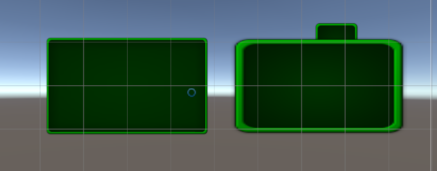
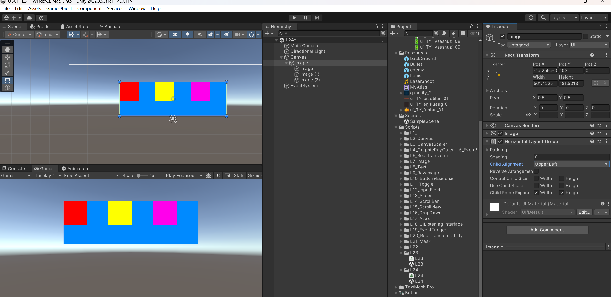

# Unity-UGUI

UGUI (Unity GUI) 是 Unity 引擎中用于创建用户界面 (UI) 的官方系统。它在 Unity 4.6 版本中被引入，取代了老旧且效率不高的 IMGUI (Immediate Mode GUI)，成为了制作游戏 UI 的主流方案。

UGUI 源码位于编辑器根目录下的： `Data/Resources/PackageManager/BuiltInPackages/com.unity.ugui`

## 六大基础组件

1. `Canvas` 对象上依附的：
    - `Canvas`：主要用于渲染UI控件
    - `Canvas Scaler`：画布分辨率自适应组件，主要用于分辨率自适应
    - `Graphic Raycaster`：射线事件交互组件，主要用于控制射线响应相关
    - `RectTransform`：UI对象位置锚点控制组件，主要用于控制位置和其对应方式
2. `EventSystem` 对象上依附的
    - `EventSystem`：玩家输入事件相应系统
    - `Standalone Input Module`：独立输入模块组件，用于监听玩家操作

### `Canvas`-渲染模式的控制

1. `Canvas` 组件用来干什么
    - `Canvas` 是 UGUI 中所有 UI 元素能够被显示的根本
    - 主要负责渲染自己的所有 UI 子对象
2. 场景中可以有多个 `Canvas` 对象
    - 可以分别管理不同画布的渲染方式，分辨率自适应方式等等参数
    - 如果没有特殊需求，一般一个场景上一个 `Canvas` 对象即可
    
### `Canvas` 组件的三种渲染方式
1. `Screen Space - Overlay`：屏幕空间，覆盖模式，UI 始终在前
    - `Pixel Perfect`：是否开启无锯齿精确渲染模式（性能换效果）
    - `Sort Order`:排序层编号（用于控制多个 `Canvas` 时的渲染先后顺序）
    - `Target Dislay`:目标设备(在哪个显示设备上显示)
    - `Additional Shader Channels`:其他着色器通道，决定着色器可以读取那些数据
2. `Screen Space - Camera`:屏幕空间，摄像机模式，3D 物体可以显示在 UI 之前
    - `Render Camera`：用于渲染 UI 的摄像机（如果不设置效果将类似与覆盖模式；不建议设置成主摄像机，因为会难以控制 UI 与物体的渲染顺序）
        > 通过分离主摄像机与专门的 UI 摄像机，设置让 UI 摄像机只渲染自己的图层（`depth only`），实现 UI 在 3D 物体前显示的效果
    - `Plane Distance`:UI 平面在摄像机前方的距离，类似整体 Z 轴的感觉
    - `Sorting Layer`:所在排序层
    - `Order in Layer`:排序层的序号
3. `World Space`:世界空间，3D 模式
    - `Event Camera`:用于处理 UI 事件的摄像机(如果不设置不能正常注册 UI 事件)

### `CanvasScaler` 简单介绍

`CanvasScaler`（画布缩放器）是 Unity UI 系统中的一个核心组件，它的主要作用是控制 `Canvas`（画布）上所有 UI 元素的整体缩放和尺寸，以适应不同的屏幕分辨率和尺寸。画布缩放器并不负责位置，位置由 `RectTransform` 来控制。

在 Game 窗口中的 Stats 中能观到当前的分辨率，该分辨率会参与到自适应的计算。同时，在 `Canvas` 对象上 `RectTransform` 组件中也能看到宽高和缩放。

::: info
屏幕分辨率 = 宽高 * 缩放系数
:::

`CanvasScaler` 有三种适配模式：
1. `Constant Pixel Size`（极少用）：无论屏幕大小如何，UI始终保持相同像素大小。
2. `Scale With Screen Size`（最常用）：根据屏幕尺寸进行缩放，随着屏幕尺寸大小缩放。
3. `Constant Physical Size`（极少用）：类似于第一种模式。无论屏幕大小和分辨率如何，UI元素始终保持相同物理大小。

接下来会一一介绍这三种模式。

### CanvasScaler-恒定像素模式

`Constant Pixel Size` 模式的参数：
- `Scale Factor`：缩放系数，会按此系数缩放画布中的所有UI元素。
- `Reference Pixels Per Unit`：单位参考像素，多少像素对应 Unity 中的一个单位（默认100像素为1单位）。在图片 Inspect 窗口中的 `Pixels Per Unit` 设置会和该参数一起参与计算。

::: info 恒定像素模式计算公式
UI原始尺寸 = 图片大小（像素）/ (Pixels Per Unit / Reference Pixels Per Unit)
:::

### CanvasScaler-缩放模式
`Scale With Screen Size` 模式的参数：
- `Reference Resolution`：参考分辨率。需要填写你希望参考的屏幕分辨率大小。例如，开发 pc端游戏时，可填入常用的 1920x1080；开发移动端游戏时，可填入常用的 1080x1920。
- `Screen Match Mode`：屏幕匹配模式，当前屏幕分辨率宽高比不适应参考分辨率时，
用于分辨率大小自适应的匹配模式。 
    - `Match Width Or Height`（最常用）:以宽高或者二者的平均值作为参考来缩放画布区域。
        - `Match`：以二者的某种平均值作为参考来缩放画布。
            1. 当 Match = 0 时，强制 UI 的缩放只参考屏幕宽度的变化；
            2. 当 Match = 1 时，强制 UI 的缩放只参考屏幕高度的变化；
            3. 当 Match = 0.5 时，它会在“匹配宽度”和“匹配高度”之间取得一个平衡。它试图找到一个中间点，让你的 UI 在各种不同的宽高比下都能合理地显示。
            ::: tip
            `Match Width Or Height` 也有可能产生黑边或裁剪，但它会尽量保持 UI 元素的完整性。

            Match = 0 时，UI 会优先使屏幕水平方向被完整的填充，此时可能会导致屏幕上下出现黑边或裁剪。同理，Match = 1 时，UI 会优先使屏幕垂直方向被完整的填充，此时可能会导致屏幕左右出现黑边或裁剪。

            综上一般来说，横屏游戏会设置 Match = 1，竖屏游戏会设置 Match = 0。
            :::
    - `Expand`: 水平或垂直拓展画布区域，会根据宽高比的变化大小来放大缩小画布。可以完全的展示参考分辨率下创建的所有内容，但可能会展示出未设置的区域，如屏幕上或下出空白区域。
        - 拓展匹配，将Canvas Size进行宽或高扩大，让他高于参考分辨率。
        - 缩放系数 = Mathf.Min(屏幕宽 / 参考分辨率宽, 屏幕高 / 参考分辨率高)
        - 画布尺寸 = 屏幕尺寸 / 放系数
    - `Shrink`: 水平或垂直裁剪画布区域，会根据宽高比的变化来放大缩小画布。可以完整占据整个屏幕，但会导致会对UI的裁剪。
        - 收缩匹配，将Canvas Size进行宽或高收缩，让他低于参考分辨率。
        - 缩放系数 = Mathf.Max(屏幕宽 / 参考分辨率宽, 屏幕高 / 参考分辨率高)
        - 画布尺寸 = 屏幕尺寸 / 缩放系数
    

### CanvasScaler-恒定物理模式
`Constant Physical Size` 模式的参数：
- `DPI`：图像每英寸长度内的像素点数。
- `Physical Unit`：物理单位，使用的物理单位种类。
- `Fallback Screen DPI`：备用DPI，当找不到设备DPI时，使用此值。
- `Default Sprite DPI`：默认图片DPI。

计算公式：新单位参考像素 = 单位参考像素 * Physical Unit / Default Sprite DPI

### CanvasScaler-World

当 Canvas 的渲染模式（Render Mode）设置为 `World Space` 时，`Canvas Scaler` 组件的模式就会被强制锁定为 `World` 模式。

这个 `World` 模式和我们之前讨论的 `Scale With Screen Size` 等模式在目标上完全不同。它不负责缩放 UI 的大小，而是负责控制 UI 在 3D 世界中的渲染质量或像素密度。

`Canvas Scaler` 此时有一个关键属性：`Dynamic Pixels Per Unit` (每单位动态像素数)，这个设置决定了UI “贴图”的分辨率。

### Graphic Raycaster-图形射线投射器组件

Graphic Raycaster 是图形射线投射器，用于检测UI输入事件的射线发射器，主要负责通过射线检测玩家和UI元素的交互，判断是否点击到了UI元素

**相关参数：**
- `Ignore Reversed Graphics`:是否忽略反转图形。
- `Blocking Objects`: 射线被哪些类型的碰撞器阻挡（在覆盖渲染模式下无效）。
- `Blocking Mask`: 射线被哪些层级的碰撞器阻挡（在覆盖渲染模式下无效）。

### EventSystem 

EventSystem 是整个 Unity UI 交互的中枢。它是一个独立的游戏对象，负责处理来自玩家的所有输入（鼠标、触摸、手柄、键盘），并将这些输入转化为具体的事件，再派发给正确的游戏对象（主要是 UI 元素）。

一个标准的 `EventSystem` 对象通常由以下几个组件构成：
1. `Event System`：这是核心组件，负责管理整个事件的派发逻辑和协同其他组件工作。

2. `Standalone Input Module` (独立输入模块)：这是默认的输入模块，专门用于处理来自PC平台（Windows, Mac, Linux）的鼠标、键盘和手柄输入。
> 在移动端项目中，这个组件会被 Touch Input Module 的功能所扩展（尽管现在 Standalone Input Module 已经整合了触摸功能）。

3. `Base Input Module`：这是一个基类，Standalone Input Module 就是从它继承而来的。如果你想创建自定义的输入方式（比如语音控制、手势识别），你就需要编写一个继承自 Base Input Module 的新脚本。

EventSystem 组件用于管理玩家的输入事件并分发给各UI控件，它是实践逻辑处理模块，所有的UI事件都通过 EventSystem 组件中轮询检测并做相应的执行，它类似一个中转站，和许多模块一起共同协作。EventSystem 组件有三个参数：
- `First Selected`：首先选择的游戏对象，可以设置游戏一开始的默认选择。
- `Send Navigation Events`：是否允许导航事件（通过键盘等设备进行移动、按下、取消）。
- `Drag Threshold`：拖曳操作的阈值（移动多少像素算拖曳）。


`Standalone Input Module` 是连接传统硬件输入与事件系统之间的一座关键“桥梁”。它的主要工作就是监听来自玩家电脑的输入设备——主要是鼠标、键盘和手柄——然后将这些原始的硬件信号（比如“鼠标左键被按下了”或“键盘W键被按下了”）翻译成 EventSystem 能理解的、更高级的逻辑事件（比如 `PointerClick` 点击、`Submit` 提交、`Maps` 导航等）。

Standalone Input Module组件参数(一般不会修改)：
- `Horizontal Axis`：水平轴按钮对应的热键名(该名字对应Input管理器)。
- `Vertical Axis`：垂直轴按钮对应的热键名(该名字对应Input管理器)。
- `Submit Button`：提交(确定)按钮对应的热建名(该名字对应Input管理器)。
- `Cancel Button`：取消按钮对应的热建名(该名字对应Input管理器)。
- `Input Actions Per Second`：每秒允许键盘/控制器输入的数量。
- `Repeat Delay`：每秒输入操作重复率生效前的延迟时间。
- `ForceModule Active`：是否强制模块处于激活状态。

### RectTransform

`RectTransform` 继承自 `Transform`，所以它也包含 `Position` (位置)、`Rotation` (旋转) 和 `Scale` (缩放) 这些基本属性。但它的强大之处在于增加了专门为 2D 矩形界面设计的几个关键概念，用来控制 尺寸 (Size) 和 自适应布局 (Responsive Layout)。

最核心的两个概念就是 `Pivot` (轴心) 和 `Anchors` (锚点)。

**组件参数：**
- `Pivot`:轴心（中心）点，取值范围0~1。
- `Anchors`(相对父矩形锚点)
    - Min 是矩形锚点范围 X 和 Y 的最小值；
    - Max 是矩形锚点范围 X 和 Y 的最大值；
    - 取值范围都是0~1。
    :::info 
    锚点的两种状态:
    1. 锚点合并 (Anchors Together)

        当四个锚点值相同时，UI 元素会试图维持其轴心与锚点之间的固定偏移量。同时，它会保持一个固定的宽度 (Width) 和高度 (Height)。
    
    2. 锚点分离 (Anchors Apart / "Stretching)

        当四个锚点分离时，UI 元素会试图维持其四条边与四个锚点之间的固定边距 (Margin)。这四条边距在 Inspector 中显示为 `Left`, `Right`, `Top`, `Bottom`，替换原本的 `X`, `Y`, `Width`, `Height` 属性。该模式常用于背景图。
    :::
- `Pos(X,Y,Z)`：轴心点（中心点）相对锚点的位置。
- `Width / Height`：矩形的宽高。
- `Left / Top / Right / Bottom`：矩形边缘相对于锚点的位置；当锚点分离时会出现这些内容。
- `Rotation`：围绕轴心点旋转的角度。

可以通过 `anchoredPosition` 属性来来获取或设置 UI 元素轴心点 (Pivot) 相对于其锚点 (Anchors) 位置，例如：
```c#
// 获取组件相锚点相对轴心的位置
Vector2 anchoredPosition = rectTransform.anchoredPosition;
```

在 Inspector 窗口第二行参数的右侧，有两个按钮，分别代表 `Blueprintt Mode` (蓝图模式) 和 `Raw Edit Mode` (原始编辑模式)。这两个模式的区别在于：
1. 开启蓝图模式后，编辑和旋转不会影响矩形，只会影响显示内容。
2. 开启原始编辑模式后，改变轴心和锚点值不会改变矩形位置。

## 三大基础控件

### Image-图像控件
**`Image` 是什么：**
- 是 UGUI 中用于显示精灵图片的关键组件。
- 除了背景图等大图，一般都使用 `Image` 来线束 UI 中的图片元素。

相关参数：
- `Source Image`：图片来源（图片类型必须是“Sprite 精灵”类型，可以在 Inspector 中设置）。
- `Color`：图像的颜色。
- `Material`：图像的材质（一般不修改，会使用 UI 的默认材质）。
- `Raycast Target`：是否作为射线检测的目标（如果不勾选将不会响应射线检测）。
- `Maskable`：是否能被遮罩（之后结合遮罩相关知识点进行讲解）。
- `Image Type`：图片类型。
    - `Simple`：普通模式，均匀缩放整个图片。
    - `Sliced`：切片模式，9宫格拉伸，只拉伸中央十字区域（需要在图片上通过 Sprite Editor 设置 `Border` 边框）。
    ::: tip
    在 Unity 2019 及以上版本中，使用切片模式时需要安装 2D Sprite 包。
    
    下图为切片模式效果，左边为切片模式，右边为普通模式。可以观察到，通过设置 `Border`，边框区域不会被拉伸，而是保持原样，只有中央部分被拉伸。

    
    :::

    - `Tiled`：平铺模式，重复平铺中央部分。也可以通过设置 Border 边框来控制平铺样式。
    - `Filled`：填充模式。
        - `Fill Method`：填充方式
        - `Fill Origin`：填充原点
        - `Fill Amount`：填充量
        - `Clockwise`：顺时针方向
        - `Preserve Aspect`：保持原图宽高比
- `Use Sprite Mesh`：使用精灵网格，勾选的话 Unity 会自动生成图片网格。一般用于 2D 游戏。
- `Preserve Aspect`：确保图像保持其现有尺寸。
- `Set Native Size`：设置为图片资源的原始大小。

通过代码控制：
```c#
void Start()
{
    Image image = this.GetComponent<Image>();
    image.sprite = Resources.Load<Sprite>("ui_TY_fanhui_01");
    //其余均可点出来使用
}
```
:::tip
需要将图片类型转换为 Sprite（精灵）才可以使用。
:::

### Text-文本控件
:::warning
新版 Unity 中 `Text` 已经被遗弃，转而使用 `TextMeshPro`。
`TextMeshPro` 会在后续的课程中讲解。

|特性    | Text  | TextMeshPro       |
|-------|--------|------------------|
|渲染质量| 低分辨率，缩放时易模糊。  | 高分辨率，缩放时保持锐利（SDF技术）。          |
|  性能  |轻量级，但大文本或复杂UI效率较低。 | 优化更好，适合大量文本或动态内容。     |
| 富文本支持   | 仅支持简单标签。  | 支持复杂富文本（颜色、动画、超链接等）。  |
| 字体控制     | 有限（依赖系统字体或动态字体）。	   | 支持自定义SDF字体、字距调整、基线控制等。        |
|多语言支持    | 基础支持（依赖字体字符集）。   | 更好支持（如表情符号、特殊字符）。     |
| 动态布局     | 	需手动调整。   | 支持自动换行、文本对齐、溢出处理等。        |
|3D场景文本    | 仅限UI Canvas。   | 	支持3D场景中的TextMeshPro组件。    |
:::

常用
- `Text`：显示的文本内容。
- `Font`：字体资源，决定文本显示的字体。
- `Font Style`：字体样式（如 Normal、Bold、Italic、Bold And Italic）。
- `Font Size`：字体大小。
- `Line Spacing`：行间距。
- `Rich Text`：是否启用富文本格式。
- `Alignment`：文本对齐方式（左、中、右、顶部、底部等）。
- `Raycast Target`：是否响应射线检测。
- `Color`：文本颜色。
- `Horizontal Overflow`：水平溢出处理（Wrap 换行，Overflow 溢出）。
- `Vertical Overflow`：垂直溢出处理（Truncate 截断，Overflow 溢出）。
- `Best Fit`：自动调整字体大小以适应区域。
#### `Rich Text` 富文本开启后
可以以类似 html 的格式对文本进行编辑：
```html
<i><b>1231</b>23123131123</i>
```
效果类似于：<ins><b>1231</b>23123131123</ins>

### RawImage-原始图像控件
**`RawImage` 是什么：**
- 是UGUI中用于显示任何纹理图片的关键组件
- 它和 `Image` 的区别是一般 `RawImage` 用于显示大图（背景图，不需要打入突击的图片，网络下载的图等等），且图片不需要转化为 Sprite 类型。

**组件参数：**
- `Texture`：图像纹理。
- `UV Rect`：图像在 UI 矩形内的偏移和大小。
    - 位置偏移 X 和 Y (取值0~1)。
    - 大小偏移 W 和 H (取值0~1)。
    - 改变他们图像边缘将进行拉伸来填充 UV 矩形周围的空间。

**通过代码控制：**
```c#
void Start()
{
    RawImage raw = GetComponent<RawImage>();
    raw.texture = Resources.Load<Texture>("ui_TY_erjikuang_01");
}
```
## UGUI-组合控件

### Button-组合控件
**`Button` 是什么：**
- 是 UGUI 中用于处理玩家按钮相关交互的关键组件。
- 默认创建的 `Button` 由2个对象组成：
    1. 父对象——`Button`组件依附对象 同时挂载了一个 `Image` 组件作为按钮背景图；
    2. 子对象——按钮文本（可选）。

::: tip
由于旧的 `Text` 文本已经被遗弃，现在子对象上的组件是 `TextMeshPro` ，其余无大区别。
:::

**重要参数**
- `Interactable`：是否能够交互。
- `Transition`：响应用户输入（选中，悬停等）的过渡效果。
    - `None`：没有状态变化效果。
    - `ColorTint`：用颜色表示不同的状态变化。
    - `Sprite Swap`：用图片表示不同状态的变化。
    - `Animation`：用动画表示不同状态的变化。
- `Navigation`：导航模式，可以设置UI元素如何在播放模式中控制导航。

**通过代码控制：**
```c#
void Start()
{
    Button btn = this.GetComponent<Button>();
    btn.interactable = true;
    Image img = this.GetComponent<Image>();
}
```

**监听点击事件的两种方法：**
1. 通过在 Inspector 窗口拖拽的方式。
2. 通过代码添加的方式。
::: info
在按钮区域按下再抬起算一次点击事件。
:::

代码示例：
```c# 
public class ButtonClickExample : MonoBehaviour
{
 
    void Start()
    {
        Button btn = this.GetComponent<Button>();
        btn.interactable = true;

        // 通过代码监听事件
        btn.onClick.AddListener(ClickBtn2);
        btn.onClick.AddListener(() =>
        {
            print("通过表达式直接添加");
        });

        // 移除方法
        btn.onClick.RemoveListener(ClickBtn2);
    }

    // 通过拖代码的形式；必须为公共方法
    public void ClickBtn()
    {
        print("按钮点击，通过拖代码的形式");
    }
}
```
### Toggle-开关控件

**`Toggle`是什么：**
- 是 UGUI 中用于处理晚间单选框多选框相关交互的关键组件。
- 可以通过配合 `ToggleGroup` 组件制作为单选框。
- 默认个创建的 `Toggle` 由4个对象组成：
    - 父对象—— `Toggle` 组件依附
    - 子对象—— 背景图、选中图、说明文字（可选）

**重要参数：**
- `IsOn`:当前是否处于打开状态。
- `Toggle Transition`：在开关值变化时的过渡方式。
    - `None`：无任何过渡直接显示隐藏。
    - `Fade`：√ 淡入淡出效果。
- `Graphic`：用于表示选中状态的图片。
- `Group`：单选框分组；需要为所有单选项设置同一个 `ToggleGroup` 组件即可实现单选框。在 `ToggleGroup` 组件上勾选 `Allow Switch Off` 可以实现允许不选择任何选项。
-  部分参数和 `Button` 组件相同，不再赘述。

**通过代码控制：**
```c#
// 获取 Toggle 组件
Toggle tog = this.GetComponent<Toggle>();
tog.isOn = true;
print(tog.isOn);

// 获取 ToggleGroup 组件
ToggleGroup togGroup = this.GetComponent<ToggleGroup>();

//遍历当前选中的toggle
foreach (Toggle item in togGroup.ActiveToggles())
{
    print(item.name + " : " + item.isOn);
}
```

### InputField-文本输入控件
:::warning
现在使用的也是 `InputField(TMP)`，只在文本组件上有区别。
:::

**`InputField` 是什么：**
- 是 UGUI 中用于处理玩家文本输入相关交互的关键组件。
- 默认创建的 `InputField` 由三个对象组成：
    - 父对象—— `InputField` 组件依附对象，以及同时在其上挂载了一个 `Image` 作为背景图。
    - 子对象—— 文本显示组件（必备）、默认显示文本组件（必备）。

**相关参数：**
- `TextComponent`：用于关联显示输入内容的文本组件。
- `Text`：输入框的起始默认值。
- `Character Limit`：可以输入字符长度的最大值。
- `Content Type`：输入的字符类型限制。
- `Line Type`：行类型，定义文本格式。
- `Placeholder`：关联用于显示初始内容文本控件。
- `Caret Blink Rate`：光标闪烁速率。
- `Caret Width`：光标宽度。
- `Custom Caret Color`：自定义光标颜色。
- `Selection Color`：批量选中的背景颜色。
- `Hide Mobile Input`：隐藏移动设备屏幕上键盘（仅适用于 iOS）。
- `Read Only`：设为只读。

**代码控制相关：**

获取 `InputField` 组件：
```c#
TMP_InputField input = this.GetComponent<TMP_InputField>();
print(input.text);
input.text = "2233";
```
监听事件：
```c#
input.onValueChanged.AddListener(ChangeValue);
input.onEndEdit.AddListener(EndInput);
// ↓ 新版额外可监听的事件 
input.onSelect.AddListener(SelectInput);
input.onDeselect.AddListener(DeselectInput);
```
::: tip
新版有四个监听事件，前两个是一样的。
:::

### Slider-滑动条控件
**`Slider` 是什么？**
- 是 UGUI 中用于处理滑动条相关交互的关键组件。
- 默认创建的 `Slider` 由4组对象组成：
    - 父对象—— `Slider` 组件依附的对象。
    - 子对象—— 背景图、进度图、滑动块三组对象。

**相关参数:**
- `Fill Rect`：进度条填充图形（显示当前值的填充区域）。
- `Handle Rect`：滑动块图形（用户拖拽的控制柄）。
- `Direction`：滑动条数值增加的方向。
    - `Left To Right`：从左到右。
    - `Right To Left`：从右到左。
    - `Bottom To Top`：从下到上。
    - `Top To Bottom`：从上到下。
- `Min Value` 和 `Max Value`：滑动条的最小值和最大值。
- `Whole Numbers`：是否限制滑动条的值只能为整数值（如1、2、3而非1.5）。
- `Value`：滑动条当前值。
- `OnValueChanged`：值变化时触发的事件列表（可绑定函数）。

**通过代码获取 `Value`：**
```c#
Slider s = this.GetComponent<Slider>();
print(s.value);
```

**监听事件：**
```c#
s.onValueChanged.AddListener((v) =>
{
    print("通过代码添加的监听：" + v);
});
```

### ScrollBar-滚动条
**`ScrollBar` 是什么**
- 是 UGUI 中用于处理滚动条相关交互的关键组件。
- 默认创建的 `ScrollBar` 由2组对象组成：
- 父对象—— `ScrollBar` 组件与背景图所依附的对象。
- 子对象—— 滚动块对象。

::: tip
一般情况下我们不会单独使用滚动条，都是配合 `ScrollView` 滚动条视图来使用的。
:::

**相关参数：**
- `Handle Rect`：用于关联滑动条的滚动块（滑块）图形对象。
- `Direction`定义滑动条数值增加的方向：
- `Left To Right`：从左到右（默认）。
    - `Right To Left`：从右到左。
    - `Bottom To Top`：从下到上。
    - `Top To Bottom`：从上到下。
- `Value` 滚动条的初始位置值（取值范围0~1）同时表示滚动块在滑动条中的比例大小（0~1）。
- `Number Of Steps` 设置允许的滚动位置数量（离散间隔数）。
例如设置为5时，滑块只能停在0、0.25、0.5、0.75、1这5个位置。
- `OnValueChanged` 值变化时触发的事件列表（可绑定函数）。

**通过代码控获取 `Value` 和 `Size`：**
```c#
Scrollbar scrollbar = this.GetComponent<Scrollbar>();
print(scrollbar.value);
print(scrollbar.size);
```

**监听事件：**
```c#
scrollbar.onValueChanged.AddListener((v) =>
{
    print(v);
});
```

### ScrollView-滚动视图


**`ScrollView` 是什么：**
- 是 UGUI 中用于处理滚动视图相关交互的关键控件。
- 默认创建的 `ScrollView` 由4组对象组成：
    - 父对象—— `ScrollRect` 组件依附的对象，还有一个 `Image` 组件作为背景图。
    - 子对象：
        - `Viewport`：控制滚动视图可视范围和内容显示。
        - `Scrollbar Horizontal`：水平滚动条。
        - `Scrollvar Vertical`:垂直滚动条。

**相关参数：**
- `Content`：控制滚动视图显示内容的父对象，它的尺寸决定滚动视图能拖多远。
- `Horizontal`：启用水平滚动（勾选框）。
- `Vertical`：启用垂直滚动（勾选框）。
- `Movement Type`：滚动视图元素的运动类型，控制拖动时的反馈效果。
    - `Elastic`（常用选项）：回弹效果，当拖动到边缘后会弹回边界，可以设置回弹系数 `Elasticity`。
    - `Clamped`：夹紧效果，始终限制在滚动范围内，没有回弹效果。
    - `Unrestricted`（不常用）：不受限制的滚动模式。
- `Inertia`：开启移动惯性，松开鼠标会有滑动惯性。可以设置 `Deceleration Rate` 来控制减速率（0~1），0表示没有惯性，1表示不会停止。
- `Scroll Sensitivity`：控制鼠标滚轮和触摸板的滚动事件敏感性。
- `Viewport`：关联滚动视图内容视口对象。
- `Horizontal Scrollbar` / `Vertical Scrollbar`：关联水平滚动条对象。关联垂直滚动条对象。
    - `Visibility`：滚动条显示模式，包括：
        - `Permanent`：始终显示；
        - `Auto Hide`：自动隐藏）；
        - `Auto Hide And Expand Viewport`：自动隐藏并扩展视口，当 Content 未超出视口时会自动使用滚动条所在区域填充内容。
    - `Spacing`：滚动条和视口之间的间隔空间大小。
- `OnValueChanged`：滚动视图位置改变时执行的事件列表。
- `Unrestricted`：不受限制的滚动模式（一般不使用）。
- `Clamped`：夹紧效果，始终限制在滚动范围内，没有回弹效果。
- `Permanent`：滚动条一直显示的模式。
- `Auto Hide`：滚动条自动隐藏的模式。
- `Auto Hide And Expand Viewport`：自动隐藏滚动条并且自动扩展内容视口的模式。

**通过代码控制：**
```c#
ScrollRect sr = this.GetComponent<ScrollRect>();

// 改变内容的大小，具体可以拖动多少，都是根据它的尺寸来的
sr.content.sizeDelta = new Vector2(200, 200);

// 改变 Content 位置
sr.normalizedPosition = new Vector2(0, 0.5f);
```

**监听控制（了解即可）：**
```c#
sr.onValueChanged.AddListener(ChangeValue);

public void ChangeValue(Vector2 value) => print(value);
```
### DropDown-下拉列表

**`DropDown` 是什么：**
- 是 UGUI 中用于处理下拉列表相关交互的关键组件。
- 默认创建的 `DropDown` 由 4 组对象组成:
    - 父对象—— `DropDown` 组件依附的对象，还有一个 `Image` 组件作为背景图。
    - 子对象—— `Label` 是当前选项描述、`Arrow` 右侧小箭头样式、`Template` 下拉列表选单。

**相关参数：**
- `Template`：关联下拉列表模板对象。
- `Caption Text`：关联显示当前选项的文本组件。
- `Caption Image`：关联显示当前选项的图片组件。
- `Item Text`：关联选项列表中的文本控件。
- `Item Image`：关联选项列表中的图片控件。
- `Value`：当前选中选项的索引值。
- `Alpha Fade Speed`：下拉列表淡入淡出动画速度。
- `Options`：下拉列表中的选项集合。

**通过代码获取选项信息：**
```c#
TMP_Dropdown dropdown = GetComponent<TMP_Dropdown>();
print(dropdown.value);
print(dropdown.options[dropdown.value]);
```

**通过代码添加选项：**
```c#
dropdown.options.Add(new TMP_Dropdown.OptionData("123123"));
```

**监听 `onValueChanged` 事件：**
```c#
dropdown.onValueChanged.AddListener((v) =>
{
    print("通过代码添加的监听：" + v);
});
```

### 图集制作

**图集（Atlas）是什么：**

简单来说，图集（Atlas），也经常被称为 精灵表（Sprite Sheet），是一种优化技术，它将许多零散的小图片（比如 UI 图标、道具、角色动画的序列帧）合并到一张更大的图片上。

多个 Sprite 都指向了同一张图集纹理，因而可以共享同一个材质。GPU 可以在不进行状态切换的情况下，一次性将它们全部绘制出来。这个过程，就是批处理 (Batching)。


通过使用图集可以减少 Draw Call：通常每个单独的纹理都需要一次 Draw Call，而图集可以将多个小图合并，大幅减少渲染调用次数，提升游戏性能。

::: details 什么是 Draw Call？为何会浪费性能？
**Draw Call 本质上是 CPU 向 GPU 发出的一个“绘制”命令。**

GPU 执行绘制操作本身是非常高效的，真正浪费性能的，是每次 Draw Call 之间，GPU 不得不进行的“状态切换”（Context Switching）。

**性能浪费点总结：**
1. CPU 开销：CPU 需要找出要绘制的每个物体，准备好各自的渲染数据，再把它们一个一个发送给 GPU。物体越多，CPU 就越忙，没时间去处理游戏逻辑（比如 AI、物理计算）。

2. 驱动程序开销：CPU 的指令不是直接给 GPU 的，中间还要经过显卡驱动程序的“翻译”。指令越多，“翻译”工作也越重。

3. **GPU 状态切换 (最主要的开销)**：每次 Draw Call 如果使用了和上一次不同的材质 (Material) 或纹理 (Texture)，GPU 就必须：
    - 清空当前的工作状态。
    - 加载新的纹理到显存。
    - 设置新的着色器 (Shader) 和参数。
    - ...等等一系列准备工作。
:::


**图集的应用场景：**

- UI 界面中的各种图标、按钮、装饰元素
- 角色/怪物的动画序列帧
- 游戏道具、装备的图标
- 粒子效果的纹理贴图
- 地图中的小装饰物件

**本篇会使用 Unity 自带的 Sprite Atlas 系统来制作图集。使用需要先安装 Unity 的 2D Sprite 包。**

::: details 关于 Sprite Atlas 的历史（至2025.7.21）
大约在 Unity 2020.1 版本发布后，Unity 官方正式将旧的 Sprite Packer (基于Packing Tag) 标记为“已弃用” (Deprecated)。从那时起，对于所有新项目和新开发者来说，Sprite Atlas 就成了唯一且标准的图集解决方案。这也是本篇目前只介绍 Sprite Atlas 的使用方法。
:::

**创建图集：**

在 Project 窗口中，在你希望存放它的位置（比如 Assets/SpriteAtlases 文件夹），点击右键，选择 Create -> Sprite Atlas。建议给它起一个有意义的名字，比如 MainMenu_Atlas 或 Player_Atlas。这个命名很重要，它能帮助你管理不同模块的图集。

::: tip
尽量让图集的尺寸保持在 2 的幂次方。GPU 极其擅长处理以 2 为基础的运算。让纹理尺寸是 2 的幂次方，就是用它最喜欢、最高效的方式给它“喂”数据。
:::

**指定打包对象：**

选中你刚才创建的 MainMenu_Atlas 资源，看向 Inspector 面板。你会看到下方有个区域叫做 `Objects for Packing` (打包对象)。
::: details 下方区域提示未在 Editor 里启用 Sprite Packer
如果下方区域提示未在 Editor 里启用 Sprite Packer，需要在 Project Settings -> Editor 中启用或者直接点击提示信息打开 Editor。

在 Sprite Packer 中，有4个选项：
| 模式 | 优点 | 缺点 | 推荐指数 |
| :--- | :--- | :--- | :--- |
| `V1 - Always Enabled` | 稳定可靠，编辑器/构建性能一致 | V1引擎打包速度可能较慢 | ⭐⭐⭐⭐ (如果V2不稳定，这是首选) |
| **`V2 - Enabled`** | **V2引擎速度快，编辑器/构建性能一致** | V2可能在某些版本中存在实验性Bug | ⭐⭐⭐⭐⭐ **(绝大多数情况下的最佳选择)** |
| `V1/V2 - Enabled for Builds` | 进入播放模式最快 | 编辑器性能与构建版本不符，无法准确调试 | ⭐⭐ (仅在极端追求迭代速度的大型项目中考虑) |

默认先使用 `V2 - Enabled` 模式就好，除非有特殊需求。
:::

有两种方式可以添加对象到图集中：

1. 打包整个文件夹（推荐）

    直接从项目窗口中，将我们里创建的那个存放图片的文件夹（ex: Assets/Sprites/MainMenu），整个拖拽到 `Objects for Packing` 列表里。

    在未来，你只要往这个文件夹里添加、删除或修改任何图片，Sprite Atlas 都会自动更新。你再也不用手动去管理列表了，这对于项目迭代和团队协作来说至关重要。

    这种方式也有助于维持项目逻辑的清晰：一个功能模块（如主菜单、玩家角色）的所有图片都放在一个文件夹里，对应一个图集，项目结构非常清晰。

2. 打包单个文件

    你也可以把单个的精灵图片一个一个地拖拽到列表里。但当图片数量很多时，这种方式管理起来会非常痛苦。一般只在临时测试或有特殊需求时使用。


**常用配置图集参数：**

1. `Include in Build`（必须勾选）：勾选后，图集会在构建时打包到游戏中。如果不勾选，图集只在编辑器中使用，运行时不会加载。
2. `Allow Rotation`：允许 Unity 在打包时旋转某些图片 90 度，以求得最紧凑的排列，节省空间。
3. `Tight Packing`：允许 Unity 使用图片的实际轮廓而不是矩形边界来进行打包。
4. `Padding` (内边距)：设置每个精灵图片之间以及图片与图集边缘之间的最小像素间距。
5. `Show Platform Settings For` (平台特定覆盖): 这是专业级优化的关键。你可以为不同平台（如 PC, Android, iOS）设置不同的压缩格式、压缩质量和最大尺寸。

::: tip
当你绕过 Unity 的标准 UI 系统，去手动操作网格（Mesh）的 UV 坐标或使用特殊着色器（Shader） 时，`Allow Rotation` 和 `Tight Packing` 才有可能导致“错误旋转”等问题。对于日常使用的 `Image` 组件和 `Sprite Renderer`，Unity 在后台为你处理好了一切，它会读取图片打包信息并自动对 UV 坐标进行补偿，把旋转过的图“转回来”。因此在开发普通 UI 时，你可以放心使用这两个选项。
:::

下面是一些使用频率相对较低的参数 ↓
::: details `Type` 参数

**`Type` (类型)：`Master` vs `Variant`**

`Type` 属性允许你创建一种父子关系的图集，这在需要管理不同版本或风格的资源时非常强大。


**`Master Atlas` (主图集)**
- 标准图集。它负责定义打包的结构——也就是哪些图片被打包进来，以及它们打包后的位置、旋转、裁切等所有布局信息。
- 你可以把它想象成一个“蓝图”或“模板”。它规定了“贴纸簿”每一页的布局和上面应该有什么贴纸。

**`Variant Atlas` (变体图集)**

- `Variant Atlas` 自身不决定任何打包结构。相反，它必须指定一个 `Master Atlas` 作为它的“主图集”。
- 它的作用是“继承”主图集的完整布局，然后用自己列表中的图片去替换掉主图集中对应位置的图片。
- 你可以把它想象成是“贴纸簿”的“皮肤”或“高清替换包”。它沿用原版贴纸簿的每一页布局，但把上面的所有贴纸都换成了新的图案。


一实际应用场景：高清(HD) / 标清(SD) 资源管理。
:::

::: details `Texture` 参数


- `Read/Write` (读/写)
    - 作用: 勾选后，允许你通过 C# 脚本在 CPU 端访问和修改这张纹理的像素数据（使用 `GetPixel`, `SetPixel` 等函数）。
    - 代价: 这是一个极其昂贵的选项。它会在 CPU 内存中也创建一个纹理的副本，这会使这张纹理的内存占用直接翻倍。
    - 使用场景: 仅当你确定需要在运行时通过代码动态地改变纹理时才开启。例如：制作一个可以画画的画板、程序化生成纹理、将截图保存为图片等。
    - **结论: 对于普通的 UI 或精灵，永远不要勾选它。**

- `Generate Mip Maps` (生成 Mipmap)
    - 作用: Mipmap 是一系列预先计算好的、尺寸由大到小、逐渐模糊的纹理版本。它主要用于 3D 世界。当一个贴着此纹理的 3D 模型离摄像机很远时，GPU 会自动使用尺寸更小的 mipmap 版本来渲染，这样可以防止远处物体出现闪烁和锯齿（摩尔纹），并提升渲染性能。
    - 对 UI / 2D 的影响: 对于基本固定在屏幕上的 UI 元素，或者 2D 游戏中大小相对固定的精灵，我们不需要这个功能。开启它反而会额外增加约 33% 的内存占用。
    - **结论: 对于 UGUI 和大部分 2D 精灵，请关闭此选项。只有当你的精灵被放置在 3D 空间中，且会被摄像机从很远的地方观察时，才需要开启。**

- `sRGB` (Color Texture) (sRGB 色彩纹理)
    - 作用: 这个选项告诉 GPU，这张图片是用来表示“颜色”的（比如 UI 按钮的颜色、角色的皮肤颜色），它处在人眼视觉友好的 sRGB (Gamma) 空间。GPU 在进行光照计算时，会先将其转换到线性的色彩空间，以保证物理计算的正确性。
    - 什么时候关闭: 当你的纹理不代表颜色，而是代表纯粹的数据时。例如：法线贴图 (Normal Map)、高度图、金属度/粗糙度贴图等。这些数据图需要保持其原始的线性数值。
    - **结论: 对于所有用于显示的 UI 和精灵，请保持勾选。**

- `Filter Mode` (滤波模式)
    - 作用: 决定了当纹理被放大或缩小时，像素之间如何插值，影响最终的视觉效果。
    - `Point` (no filter): 不进行混合。像素边缘会非常清晰，放大后呈块状。像素艺术 (Pixel Art) 风格的游戏必选此项。
    - `Bilinear`: 对相邻的 4 个像素进行平滑混合。这是最常用的模式，放大后图像边缘会显得平滑但略带模糊。
    - `Trilinear`: 在双线性过滤的基础上，还会在两个最接近的 Mipmap 等级之间进行混合。只有在开启 Generate Mip Maps 时才有意义。可以提供最平滑的远景过渡效果。
    - **结论: 大多数高清 UI/精灵选择 Bilinear，像素风格选择 Point。**


- `Max Texture Size` (最大纹理尺寸)
    - 作用: 限制最终生成的图集大图的最大边长。例如，设置为 2048，那么图集的宽和高都不会超过 2048 像素。如果内容太多，Unity 会自动创建第二张、第三张图集（名字相同，但内部会编号）。
    - 一些旧的移动设备可能不支持超过 2048x2048 甚至 1024x1024 的纹理。为移动平台设置一个较低的尺寸上限可以保证兼容性。而 PC 平台则可以放心使用 4096 或更高。

- `Format` (压缩格式)
    - 这是性能优化的核心。它决定了你的图集纹理在被 GPU 读取时使用的压缩算法。不同的平台对压缩格式的支持和效率是不同的。
    - `Automatic`: Unity 会根据平台自动选择一个它认为合适的格式，通常是比较安全的通用格式。
    - 手动选择:
        - PC (Standalone): 通常选择 DXT5 (也叫 BC3)。如果需要更高质量，可以选择 BC7。
        - Android: 优先选择 ASTC。它非常灵活，可以在压缩率和质量之间做很好的平衡。如果需要兼容非常老的设备，可以选择 ETC2。
        - iOS: 同样优先选择 ASTC。
        - RGBA 32 bit: 这是不压缩的格式。质量最高，但占用的显存也最大，通常只用于对图像质量有极端要求的特定情况。

- `Compression Quality` (压缩质量)
    - 当 `Format` 设置为 `Automatic` 或某些支持质量选择的格式（如 ASTC）时，这个选项才有效。
    - 它提供了 `Low Quality`, `Normal Quality`, `High Quality` 三个档位，让你在压缩速度和最终图片质量之间做取舍。通常选择 `Normal Quality` 就足够了。

- `Use Crunch Compression` (使用 Crunch 压缩)
    - 作用: Crunch 是一种附加的、有损的压缩技术，它可以在 DXT 或 ASTC 等标准 GPU 压缩格式之上，进一步减小纹理在硬盘上的存储体积。
    - 工作原理: 当游戏加载时，需要先将 Crunch 格式解压成目标平台支持的普通 GPU 压缩格式（如 DXT），然后再加载到显存。
    - 优点: 能显著减小最终游戏包的大小。
    - 缺点: 可能会稍微增加初次加载这张资源的时间，并且因为是有损压缩，可能会轻微降低图像质量。
    - **结论: 对于那些对存储体积敏感的项目（如手游），这是一个非常有用的优化工具。你可以对一些次要的、或本身就比较模糊的背景图开启它，以换取更小的包体。**

:::

::: tip
**对于这些杂七杂八的参数很多的情况下，很多时候最好的做法就是保持默认设置，只做必要的修改。之后通过性能分析器（Profiler）找到问题，最后再“对症下药”地进行优化。**

这种做法遵循了 KISS(Keep It Simple, Stupid) 原则和 不要过早优化(Do Not Prematurely Optimize) 原则。
:::

**预览和验证：**

在 Inspector 面板的底部，点击 Pack Preview 按钮。Unity 会立即执行一次打包，并在下方的小窗口中显示出最终生成的大图集的样子。你可以看到所有小图是如何被排列组合的。

**在项目中使用图集中的精灵：**

可以像往常一样继续使用精灵，只不过现在它们都来自于图集。Unity 会自动处理从图集中加载精灵的细节。

不过也可以通过先加载图集，然后从中获取精灵的方式来使用图集，不过一般不会这样做。例如：
```c#
// 加载图集资源
SpriteAtlas sa = Resources.Load<SpriteAtlas>("MyAtlas");

// 获取图集中的精灵 
sa.GetSprite("bk");
```

**注意事项：**

如果在渲染同一个图集的图片时，突然在渲染的顺序中插入了一个不同图集的图片，Unity 会先自动切换图集再切换回来，这会导致 Draw Call 增加。因此，尽量在渲染同一图集的图片时保持顺序一致。值得一提的是 UGUI 对该情况进行了优化，只要不同图集之间的图片没有交叉、重叠，就不会增加 Draw Call。

## UGUI-进阶

### UI 事件监听接口

UGUI 的事件接口是让你能够编写 C# 脚本来响应各种用户输入的“钩子”(Hooks)。

当 `EventSystem` 检测到用户的操作（如点击、拖拽）并确定了目标 UI 对象后，它就会检查该对象上的脚本是否实现了特定的事件接口。如果实现了，`EventSystem` 就会调用该接口定义的方法，从而让你能够执行自定义的交互逻辑。

**为什么需要事件接口？**

目前所有的控件都只提供了常用的事件监听列表，如果想做一些类似**长按、双击、拖拽**等功能是无法制作的，或者想让 `Image`、`Text`、`RawImage` 三大基础控件能够响应玩家输入也是无法制作的。事件接口就是用来处理类似问题的，让所有控件都能够添加更多的事件监听来处理对应的逻辑。

#### 指针事件接口

这些接口主要处理鼠标和触摸相关的交互：

| 接口名称 | 触发时机 | 方法名称 |
|---------|----------|----------|
| `IPointerEnterHandler` | 指针进入游戏对象 | `OnPointerEnter` |
| `IPointerExitHandler` | 指针离开游戏对象 | `OnPointerExit` |
| `IPointerDownHandler` | 指针按下瞬间 | `OnPointerDown` |
| `IPointerUpHandler` | 指针松开（需在原本按下的对象上） | `OnPointerUp` |
| `IPointerClickHandler` | 完整点击（按下 → 松开） | `OnPointerClick` |

#### 拖拽事件接口

专门处理拖拽操作的接口：

| 接口名称 | 触发时机 | 方法名称 |
|---------|----------|----------|
| `IBeginDragHandler` | 开始拖拽 | `OnBeginDrag` |
| `IDragHandler` | 拖拽过程中（每帧） | `OnDrag` |
| `IEndDragHandler` | 拖拽结束 | `OnEndDrag` |

#### 其他交互事件接口

| 接口名称 | 触发时机 | 方法名称 |
|---------|----------|----------|
| `IInitializePotentialDragHandler` | 找到拖拽目标时，初始化拖拽操作 | `OnInitializePotentialDrag` |
| `IDropHandler` | 拖拽物体释放到目标上 | `OnDrop` |
| `IScrollHandler` | 鼠标滚轮滚动 | `OnScroll` |
| `ISelectHandler` | 对象被选中（Tab 键/手柄选择） | `OnSelect` |
| `IDeselectHandler` | 对象取消选中 | `OnDeselect` |
| `IUpdateSelectedHandler` | 选中状态下持续调用（每帧） | `OnUpdateSelected` |
| `IMoveHandler` | 方向移动事件（导航操作） | `OnMove` |
| `ISubmitHandler` | 确认/提交按钮（Enter /手柄 A 键） | `OnSubmit` |
| `ICancelHandler` | 取消按钮（Esc /手柄 B 键） | `OnCancel` |

#### 使用事件接口

**基本使用示例：**

```c#
using UnityEngine;
using UnityEngine.EventSystems;

public class UIEventHandler : MonoBehaviour, 
    IPointerEnterHandler, IPointerExitHandler, 
    IPointerDownHandler, IPointerUpHandler, IPointerClickHandler
{
    public void OnPointerEnter(PointerEventData eventData)
    {
        Debug.Log("鼠标进入");
        // 可以在这里改变 UI 外观，比如高亮显示
    }

    public void OnPointerExit(PointerEventData eventData)
    {
        Debug.Log("鼠标离开");
        // 注意：在移动设备上不存在"悬停"的概念
    }

    public void OnPointerDown(PointerEventData eventData)
    {
        Debug.Log($"鼠标按下 - 按键ID: {eventData.pointerId}");
        // 0 = 左键，1 = 右键，2 = 中键
    }

    public void OnPointerUp(PointerEventData eventData)
    {
        Debug.Log("鼠标抬起");
    }
    
    public void OnPointerClick(PointerEventData eventData)
    {
        Debug.Log("完整点击事件");
        // 只有在同一对象上完成"按下→抬起"才会触发
    }
}
```

**拖拽功能示例：**

```c# [DragHandler.cs]
using UnityEngine;
using UnityEngine.EventSystems;

public class DragHandler : MonoBehaviour, 
    IBeginDragHandler, IDragHandler, IEndDragHandler
{
    private Vector3 originalPosition;
    
    public void OnBeginDrag(PointerEventData eventData)
    {
        originalPosition = transform.position;
        Debug.Log("开始拖拽");
    }
    
    public void OnDrag(PointerEventData eventData)
    {
        // 跟随鼠标位置移动
        transform.position = eventData.position;
    }
    
    public void OnEndDrag(PointerEventData eventData)
    {
        Debug.Log("拖拽结束");
        // 可以在这里判断是否拖拽到有效区域
    }
}
```

#### PointerEventData 重要参数

`PointerEventData` 是事件接口方法的参数，包含了丰富的事件信息：

| 参数名称 | 类型 | 说明 |
|---------|------|------|
| `pointerId` | int | 指针事件ID：0 = 左键，1 = 右键，2 = 中键 |
| `position` | Vector2 | 当前指针的屏幕坐标（原点在屏幕左下角） |
| `pressPosition` | Vector2 | 指针按下时的初始屏幕坐标，常用于计算拖动距离 |
| `delta` | Vector2 | 指针移动增量（当前帧与上一帧的位置差） |
| `clickCount` | int | 连续点击次数，可用于实现双击检测 |
| `clickTime` | float | 点击发生的时间（Unity时间系统） |
| `pressEventCamera` | Camera | 触发 OnPointerPress 事件的摄像机 |
| `enterEventCamera` | Camera | 触发 OnPointerEnter 事件的摄像机 |

**使用示例：**

```c#
public void OnPointerDown(PointerEventData eventData)
{
    // 判断是否为右键点击
    if (eventData.pointerId == 1)
    {
        Debug.Log("右键点击");
    }
    
    // 获取点击位置
    Vector2 clickPos = eventData.position;
    Debug.Log($"点击位置: {clickPos}");
    
    // 检测双击
    if (eventData.clickCount == 2)
    {
        Debug.Log("双击检测");
    }
}
```

#### 事件接口总结

**优点：**
- 提供了比内置事件更丰富的交互功能
- 可以让基础控件（Image、Text等）响应用户输入
- 能够实现长按、双击、拖拽等高级交互
- 事件信息详细，便于实现复杂逻辑

**缺点：**
- 需要自己编写脚本继承接口
- 管理相对麻烦，每个需要事件的对象都要挂载脚本
- 代码量相对较大

### `EventTrigger` 事件触发器

`EventTrigger` 是一个集成了上节课中学习的所有事件接口的脚本组件，可以让我们更加方便的为控件添加事件监听，而无需自己编写继承接口的脚本。

**使用事件触发器**

可以通过拖曳脚本的方式为 `EventTrigger` 添加事件监听。

例如我们有一个图像对象，其父对象是一个面板 `panel`。如果我们希望为这个图像添加对应事件，可以为图片对象添加 `EventTrigger` 组件，然后在 `panel` 中编写方法并注册到 `EventTrigger` 中。

在 `EventTrigger` 组件中，选择对应类型的事件，然后就可以将 `panel` 中的方法拖拽到事件列表中。方法例如:
```c#
public void TestPointEnter(BaseEventData data)
{
    PointerEventData eventData = data as PointerEventData;
    print("鼠标进入"+ eventData.position);
}
```

此外，还可以通过代码的方式添加事件监听。通过 `EventTrigger.Entry` 来创建一个新的事件条目，并将其添加到 `EventTrigger.triggers` 列表中实现事件的注册。例如：

```c#
public class Panel : MonoBehaviour
{
    [SerializeField] private EventTrigger eventTrigger;

    private void Start()
    {
        // 在父对象 panel 的脚本中监听 EventTrigger 的事件
        EventTrigger.Entry entry = new EventTrigger.Entry
        {
            eventID = EventTriggerType.PointerUp
        };
        entry.callback.AddListener(baseEventData => print("抬起"));
        
        eventTrigger.triggers.Add(entry);
    }
}
```

### 屏幕坐标转UI相对坐标

`RectTransformUtility` 公共类是一个 `RectTransform` 的辅助类，主要用于进行一些坐标的转换等等操作，其中对于我们目前最重要的函数是：将屏幕空间上的点，转换成 UI 本地坐标下的点。


通过 `RectTransformUtility` 中的方法 `ScreenPointToLocalPointInRectangle()` 可以将屏幕坐标转换为相对于父对象的本地坐标。

方法完整的定义方式：
```c#
RectTransformUtility.ScreenPointToLocalPointInRectangle(
    this.transform.parent as RectTransform, eventData.position,
    eventData.enterEventCamera, out nowPos);
```

参数4：最终得到的点

:::tip
一般配合拖拽事件使用
:::
```c#
public void OnDrag(PointerEventData eventData)
{
    Vector2 nowPos;
    RectTransformUtility.ScreenPointToLocalPointInRectangle(
    this.transform.parent as RectTransform, eventData.position,
    eventData.enterEventCamera, out nowPos);
    this.transform.localPosition = nowPos;
}
```

### Mask 遮罩

遮罩使图片只显示自身的一部分。

通过在父对象上添加 `Mask` 组件，子对象勾选 `Maskable`（默认开启），可以实现遮罩其子对象。需要注意父对象透明的部分会被遮罩，只有不透明的部分会显示。


### 模型和粒子显示在UI之前


**方法一：修改Canvas渲染模式**
1. 将Canvas的 `Render Mode` 改为 `Screen Space - Camera`。
2. 指定一个专用的UI摄像机（避免与主场景摄像机混用）。
3. 调整渲染层级：
   - 在 `Tags and Layers` 设置中创建新的 `Sorting Layer`。
   - 将UI放在下层，模型放在上层。

**方法二：渲染到纹理**
1. 使用专门的摄像机渲染3D模型。
2. 将渲染结果输出到 `Render Texture`。
3. 通过UI `Image` 组件显示纹理（类似小地图的制作方式）。

粒子特效号可以通过设置 `Particle System` 的 `Renderer` 组件中的 `Sorting Layer` 和 `Order in Layer` 来控制其渲染顺序。

### 异形按钮

#### 什么是异形按钮
异形按钮是指图片形状不是传统矩形的按钮，如圆形、多边形或其他不规则形状。

#### 实现精确点击检测

**方法一：子对象拼接法**

原理：
按钮的点击检测基于图片的矩形范围判断，且检测范围采用自下而上的层级判断，所以子对象的图片范围也会被算入可点击范围。

实现步骤：
1. 创建多个透明图片作为按钮的子对象。
2. 用这些透明图片拼接出不规则形状。

**方法二：透明度阈值法**

> **⚠️ 注意**  
> 该方法相对第一种方法会消耗更多内存资源

实现步骤：

1. 在 Inspector 中开启图片的 `Read/Write Enable` 选项。

2. 为控件（ex:：按钮）编写脚本，通过代码修改子对象图片透明度的响应阈值，例如：
   ```c#
   // 透明度小于 0.1f 的像素点不会响应点击事件
   img.alphaHitTestMinimumThreshold = .1f;
   ```

参数说明：
- `alphaHitTestMinimumThreshold`：设置像素点被射线检测的最小 alpha 值。
- 当像素点的 alpha 值小于设定值时，该像素点不会响应射线检测。
- 简单来说：透明或半透明区域不会响应点击事件。

### 自动布局组件

#### 什么是自动布局

虽然 UGUI 的 `RectTransform` 已经非常方便地帮助我们快速布局，但 UGUI 中还提供了很多可以帮助我们对UI控件进行自动布局的组件。

这些组件可以帮助我们自动设置UI控件的位置和大小等属性。

**工作原理：**
- 自动布局控制组件 + 布局元素 = 自动布局
- 自动布局控制组件：Unity提供的用于自动布局管理的组件
- 布局元素：具备布局属性的对象，主要指具备 `RectTransform` 的UI组件

#### 水平/垂直布局组件 (`Horizontal/Vertical Layout Group`)

**主要参数：**

- **`Padding`**：控制布局边缘的偏移量（左、右、上、下）
- **`Spacing`**：子对象之间的间距（单位：像素）
- **`Child Alignment`**：子对象的对齐方式（九宫格定位，如居中、靠左、靠右等）
- **`Control Child Size`**：是否强制控制子对象的宽度（Horizontal）或高度（Vertical）以填充
- **`Use Child Scale`**：布局时是否考虑子对象的缩放（若子对象被缩放，勾选后按缩放后尺寸计算布局）
- **`Child Force Expand`**：是否强制子对象填充剩余空间（勾选后子对象会均分额外空间），在不设置 `Layout Element` 的情况下不会影响子对象的原始尺寸。

**效果展示：**


此外还可以通过给子对象添加 `Layout Element` 组件来控制子对象的最小/最大宽度和高度等布局属性。


#### 网格布局组件 (`Grid Layout Group`)

**基础参数：**
- **`Padding`**：控制网格边缘的偏移量（左、右、上、下）
- **`Cell Size`**：每个格子的固定大小（宽度 × 高度）
- **`Spacing`**：格子之间的间隔（水平间距、垂直间距）

**起始位置设置：**
- **`Start Corner`**：第一个子对象的起始位置
  - `Upper Left`（左上）
  - `Upper Right`（右上）
  - `Lower Left`（左下）
  - `Lower Right`（右下）

**排列方向：**
- **`Start Axis`**：子对象的排列方向
  - `Horizontal`：水平排列，填满一行后换行
  - `Vertical`：垂直排列，填满一列后换列

**对齐方式：**
- **`Child Alignment`**：网格整体的对齐方式（九宫格定位，如居中、靠左等）

**约束模式：**
- **`Constraint`**：
  - `Flexible`：灵活模式，自动调整行列数量以适应容器大小
  - `Fixed Column Count`：固定列数模式，限制网格的列数
  - `Fixed Row Count`：固定行数模式，限制网格的行数

#### 内容大小适配器 (Content Size Fitter)

**核心功能：**
自动调整UI元素（如Text）的 `RectTransform` 尺寸，使其适配内容大小。通常用于动态文本或配合布局组件使用。

**主要参数：**

- **`Horizontal Fit`**（水平适配模式）：
    - `Unconstrained`：不自动调整宽度
    - `Min Size`：按子对象最小宽度调整
    - `Preferred Size`：按子对象理想宽度调整（如文本自然宽度）

- **`Vertical Fit`**（垂直适配模式）：
  - 选项同水平模式（`Unconstrained` / `Min Size` / `Preferred Size`）

#### 宽高比适配器 (Aspect Ratio Fitter)

**核心功能：**
控制UI元素按固定宽高比自动调整尺寸，确保内容比例不变形。适用于需要保持特定比例的图像、视频等UI元素。

**主要参数：**

- **`Aspect Mode`**（适配模式）：
  - `None`：禁用比例适配
  - `Width Controls Height`：以宽度为基准自动计算高度
  - `Height Controls Width`：以高度为基准自动计算宽度
  - `Fit In Parent`：在父容器内完整显示（可能产生黑边）
  - `Envelope Parent`：填满父容器（可能内容被裁剪），可以用来做背景图

- **`Aspect Ratio`**（宽高比）：
  - 手动设置宽度与高度的比值（如 16:9 = 1.78，4:3 = 1.33）

### Canvas Group

使用目前学过的知识点，无法方便快捷地设置面板的整体淡入淡出效果，因此需要 `CanvasGroup` 来解决这个问题。

为面板添加 `CanvasGroup` 组件，即可实现整体控制效果。

**主要参数：**

- **`Alpha`**（透明度）
  - 范围：0-1，控制组内所有UI的全局透明度
  - 不影响子对象单独设置的Alpha值

- **`Interactable`**（交互开关）当 Match = 0.5 时
  - 禁用时组内所有按钮/输入框等交互组件失效
  - 失效的控件会显示为灰色状态

- **`Blocks Raycasts`**（射线阻挡）
  - 关闭时，组内UI不会阻挡射线检测
  - 相当于将所有子对象的 `Raycast Target` 设为 false

- **`Ignore Parent Groups`**（忽略父组）
  - 启用时不受父对象 `CanvasGroup` 属性影响
  - 让当前组独立作用

## 插件
1. DoTween
   - 一个强大的动画插件，支持各种类型的动画效果。
   - 可以轻松实现 UI 元素的平移动画、缩放动画、颜色渐变等。

## 实践技巧

### 创建专门渲染 UI 的摄像机
设置一个专门渲染 UI 的摄像机与主摄像机分离能带来更好的灵活性和逻辑上的清晰度。

我们可以创建一个新的摄像机，并且将主摄像机和 UI 摄像机的 `Clear Flags` 设置为 `Depth Only`，再修改主相机和 UI 摄像机的 `Culling Mask`，使其只渲染各自需要的层。

然后设置 `Canvas` 的 `Render Mode` 为 `Screen Space - Camera`，这种模式下，Canvas 会使用指定的摄像机进行渲染，并且方便我们以后在 UI 上添加 3D 元素。然后，可以在 `Canvas Scaler` 中设置 `UI Scale Mode` 为 `Scale With Screen Size`，然后修改 `Reference Resolution` 使 UI 能够根据屏幕分辨率自动缩放，这个数值可以根据实际需求调整，比如可以设置背景图大小。对于下方的 `Screen Match Mode`，可以设置为 `Match Width Or Height`，然后根据实际需求调整 `Match` 的值，比如横屏游戏设置为 1，竖屏游戏设置为 0。

### 创建 `UI Manager` 管理器

首先为了方便管理 UI 元素和逻辑上的清晰，我们先来管理一下 UI 元素。

我们在 Hierarchy 窗口中创建两个空的 GameObject，分别命名为 `[UI]` 和 `[Managers]`。然后将所有 UI 元素（ex：`Canvas`, `EventSystem`, `UICamera`）放入 `[UI]` 下，将所有管理器脚本（ex：`_UIManager`）放入 `[Managers]` 下。

先创建一个 `GameManager` 脚本，挂载到 `[Managers]` 下，然后为其添加如下代码防止切换场景时自身被删除：
```c# [GameManager.cs]
using UnityEngine;

public class GameManager: MonoBehaviour
{
    private void Awake()
    {
        DontDestroyOnLoad(gameObject);
    }
}

```

```c# [UIManager.cs]
using System.Collections.Generic;
using System.Threading.Tasks;
using MyGame.UI;
using UnityEngine;
using UnityEngine.AddressableAssets;
using UnityEngine.ResourceManagement.AsyncOperations;

namespace MyGame.Managers
{
    /// <summary>
    /// UI 管理器，负责所有 UI 面板的加载、显示、隐藏和卸载。
    /// 采用单例模式，并使用 Addressables 进行异步资源管理。
    /// </summary>
    public class UIManager : MonoBehaviour
    {
        // 单例模式
        public static UIManager Instance { get; private set; }
    
        // [UI] 引用
        [SerializeField] private Transform uiRoot;

        // 画布的 Transform 引用
        [SerializeField] private Transform canvasTrans;

        // 面板字典，存储已加载的面板
        private Dictionary<string, BasePanel> _panelDict;

        private void Awake()
        {
            // 确保只创建一个 UIManager 实例
            if (Instance != null)
            {
                Debug.LogWarning("UIManager 已经存在，不会重复创建。");
                Destroy(gameObject);
                return;
            }

            Instance = this;

            // 确保画布存在
            if (canvasTrans == null)
            {
                canvasTrans = GameObject.Find("Canvas")?.transform;
                if (canvasTrans is null)
                {
                    Debug.LogError("UIManager 未能找到 Canvas！请在 Inspector 中手动指定。");
                }
            }

            if (uiRoot == null)
            {
                uiRoot = new GameObject("[UI]").transform;
                if (uiRoot == null)
                {
                    Debug.LogError("UIManager 无法创建 UI 根对象，请检查场景设置。");
                }
                else
                {
                    DontDestroyOnLoad(uiRoot);
                }
            }
        
            _panelDict = new Dictionary<string, BasePanel>();
        }

        /// <summary>
        /// 异步加载并显示指定类型的 UI 面板。
        /// 如果面板已加载，则直接返回已加载的实例。
        /// 面板资源通过 Addressables 系统加载，并挂载到指定的 Canvas 下。
        /// </summary>
        /// <typeparam name="T">面板类型，需继承自 BasePanel。</typeparam>
        /// <returns>
        /// 返回异步任务，任务结果为面板实例（T）。
        /// 如果加载失败或未找到 BasePanel 组件，则返回 null。
        /// </returns>
        public async Task<T> ShowPanelAsync<T>() where T : BasePanel
        {
            string panelName = typeof(T).Name;
            if (TryGetPanel(out T panel))
            {
                Debug.LogWarning($"面板 {panelName} 已经加载，无需重复加载。");
                return panel;
            }

        
            // 异步加载面板资源
            AsyncOperationHandle<GameObject> handle = Addressables.InstantiateAsync("UI/" + panelName, canvasTrans);
            print(panelName);
            GameObject panelGo = await handle.Task;

            // 检查加载结果
            if (handle.Status != AsyncOperationStatus.Succeeded || panelGo == null)
            {
                Debug.LogError($"加载或实例化面板失败： {panelName}");
                return null;
            }

            // 确保面板上有 BasePanel 组件并获取该组件
            panel = panelGo.GetComponent<T>();
            if (panel == null)
            {
                Debug.LogError($"面板 {panelName} 上未找到 BasePanel 组件。");
                Addressables.ReleaseInstance(panelGo);
                return null;
            }

            _panelDict[panelName] = panel;
            panel.Show();
            return panel;
        }

        /// <summary>
        /// 隐藏并卸载指定类型的 UI 面板。
        /// 如果面板未加载，则不会执行任何操作。
        /// 面板隐藏后会释放其实例资源（通过 Addressables）。
        /// </summary>
        /// <typeparam name="T">面板类型，需继承自 BasePanel。</typeparam>
        public void HidePanel<T>() where T : BasePanel
        {
            string panelName = typeof(T).Name;
            if (!TryGetPanel(out T panel))
            {
                Debug.LogWarning($"面板 {panelName} 未加载，无法隐藏。");
                return;
            }

            panel.Hide(() => Addressables.ReleaseInstance(panel.gameObject));
            _panelDict.Remove(panelName);
        }

        /// <summary>
        /// 尝试从已加载的面板字典中获取指定类型的面板实例。
        /// </summary>
        /// <param name="panel">输出参数，返回找到的面板实例；如果未找到则为 null。</param>
        /// <typeparam name="T">面板类型，需继承自 BasePanel。</typeparam>
        /// <returns>如果找到面板则返回 true，否则返回 false。</returns>
        public bool TryGetPanel<T>(out T panel) where T : BasePanel
        {
            string panelName = typeof(T).Name;
            if (_panelDict.TryGetValue(panelName, out BasePanel basePanel))
            {
                panel = basePanel as T;
                return panel != null;
            }

            panel = null;
            return false;
        }
    }
} 
```
### 外部字体导入

先获得你想使用的字体文件（.ttf 或 .otf 格式 或 .ttc），然后将其放入 Unity 项目的 `Assets` 文件夹中。图方便的话字体也可以在 `C:\Windows\Fonts` 这个目录下找。

导入字体后，在 Project 窗口右键你的字体文件选择 `Create` -> `TextMeshPro` -> `Font Asset`，然后会生成一个新的字体资产文件，可以被使用在 TMP 中。

接下来修改字体资产的图集分辨率。找到 `Generation Setting` 中的 `Atlas Width`，更改为 8192 （或更高），然后点击 Apply 按钮。更高清的图集分辨率可以让字体在高分辨率屏幕上显示得更清晰。

此外可以通过`Windows` -> `TextMeshPro` 里的 `Font Asset Creator` 进行更高级的设置和优化。这里暂时先不展开(~~挖坑~~)。

### 排序文字和图片时减少 DC 
在渲染同一个图集的图片时，如果突然插入渲染一个文字或不同图集的图片，Unity 会先自动切换图集再切换回来，这会导致 Draw Call 增加。因此，尽量在渲染同一图集的图片时保持顺序一致。文字和图片也分开渲染，避免和图片混合渲染增加 Draw Call。

例如:
```
> Camera
> Canvas
    > Panel
    > Image1.1
    > Image1.2
    > Text1
    > Text2
    > Image2.1
    > Image2.2
    > ..
> EventSystem
```

当然如果是小型项目，或者图片数量不多，Draw Call 数量也不多，且实现该方法不方便，那么可以不必过于强求。对于大型项目，或者图片数量较多的项目，会有更好的方法，而不是简单通过排序来减少 Draw Call。

### `Aspect Ratio Fitter` 

`Aspect Ratio Fitter` 组件可以帮助我们保持 UI 元素的宽高比，确保在不同分辨率下仍然保持正确的比例。

**Comming Soon...**

### `Grid`

`Grid` 组件可以帮助我们创建网格布局，自动排列子对象。它可以与 `Horizontal Layout Group` 或 `Vertical Layout Group` 结合使用，来实现更复杂的布局。

**Comming Soon...**

### `Content Size Fitter`

`Content Size Fitter` 组件可以自动调整 UI 元素的大小，以适应其内容。它通常与 `Layout Group` 组件一起使用，以确保子对象的大小和位置正确。

**Comming Soon...**
