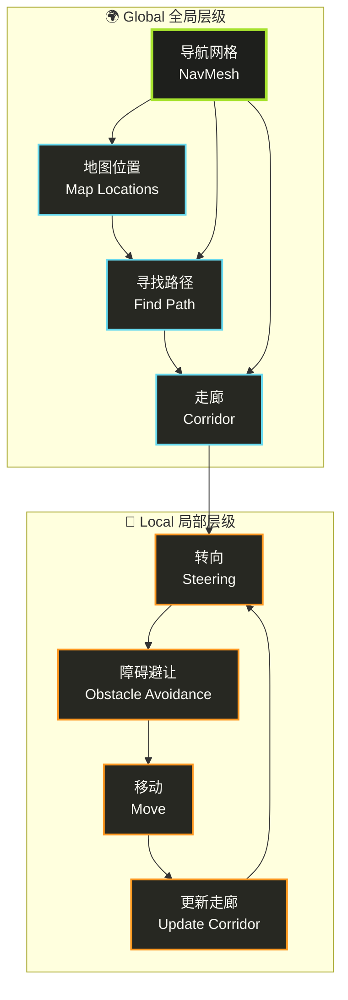

# Unity-导航寻路系统

在游戏中，你经常会看到敌人、NPC 或同伴角色能够智能地绕过障碍物，从 A 点移动到 B 点。它们不是简单地直线行走，而是能找到一条可通行的路径。实现这种行为的核心技术就是导航寻路系统。

Unity 的导航系统主要基于一个叫做导航网格（Navigation Mesh, 简称 NavMesh）的概念。

官方文档：[AI Navigation](https://docs.unity3d.com/Packages/com.unity.ai.navigation@2.0/manual/index.html)

## Navigation System In Unity

### 内部工作原理

Unity 的**导航系统**（`Navigation System`）主要负责在游戏场景中让角色（`Agent`）智能地从起点移动到终点。它分为两个核心部分：

* **全局导航**：负责根据整个场景的几何信息找到跨越地图的路径
* **局部导航**：在移动过程中处理即时方向调整与避障

导航系统通过检测代理可站立的位置并将其连接成覆盖场景表面的**导航网格**（`NavMesh`），网格由凸多边形组成，并记录多边形间的邻接关系，方便全局路径搜索。



#### 寻路过程

1. **路径规划**：系统首先将起点和终点映射到最近的多边形上
2. **算法搜索**：使用 `A*` 算法在多边形邻接图中查找路径
3. **走廊生成**：找到的多边形序列称为**走廊**（`Corridor`），代理会不断朝下一个可见拐角前进
4. **动态修正**：若场景中有多个代理同时移动，它们会因避让而偏离原路径，此时系统会根据多边形连通性动态修正走廊
5. **局部避障**：使用 `RVO`（Reciprocal Velocity Obstacles）技术预测潜在碰撞并调整速度与方向，确保流畅移动

#### 障碍物处理

障碍物分为两种处理方式：

* **动态障碍**（如移动物体）：适合使用局部避障即时绕行
* **静态障碍**（长期阻挡路径）：需要修改 `NavMesh`（称为 `Carving`），在网格上挖空不可通行的区域
  * ⚠️ 这一过程计算代价较高

此外，Unity 还提供 `NavMesh Link` 组件，用于标记非可行走表面的特殊通道，如跳栅栏或穿门，代码可在运行时访问这些链接并触发对应的动作。


在生成 `NavMesh` 时，系统会使用**体素化**（`Voxelization`）将场景栅格化，提取可行走表面后生成导航网格。

**体素大小**（`Voxel Size`）会影响精度与烘焙速度：

| 体素大小 | 精度 | 生成速度 | 适用场景 |
|----------|------|----------|----------|
| 越小 | 越高 | 越慢 | 需要精确导航的区域 |
| 越大 | 越低 | 越快 | 宽阔开放区域 |

**推荐配置：**

* **默认设置**：每个 `Agent` 半径对应 `3` 个体素（直径 `6` 个体素），适用于大多数情况
* **宽阔区域**：可用 `1-2` 个体素加快速度
* **狭窄室内**：建议 `4-6` 个体素
* **性能提示**：超过 `8` 个体素通常意义不大，反而浪费性能

#### 代理形状与属性

`NavMesh Agent` 在场景中以一个**直立圆柱体**表现，其几何属性如下：

* **半径**：由组件的 `Radius` 属性指定
* **高度**：由组件的 `Height` 属性指定
* **姿态**：圆柱体保持直立状态，用于检测与响应障碍物和其他代理的碰撞

> 💡 **提示**：当 `GameObject` 的锚点不在圆柱体基底时，可通过 `Base Offset` 属性调整高度差。

#### 大小设置

##### 🔧 烘焙设置（Navigation 窗口）
- **用途**：指定场景中所有代理避让静态几何体时的**全局尺寸**
- **限制**：为了节省内存和 CPU，烘焙时只能设置一种尺寸

##### 🎮 代理组件（NavMesh Agent）
- **用途**：定义每个代理与移动障碍物或其他代理的**碰撞半径和高度**
- **灵活性**：可针对不同角色单独调整
- **示例**：给沉重士兵更大半径以保持更大间距

#### 典型用法与变体

| 配置方式 | 描述 | 适用场景 |
|----------|------|----------|
| **标准配置** | 烘焙设置和组件属性使用相同尺寸 | 确保环境避让一致性 |
| **特殊配置** | 组件属性中增大半径 | 让其他单位主动留出空间，同时仍遵循相同的导航网格行走规则 |

**核心理念**：通过调整代理半径，可以在不改变导航网格的前提下实现不同的避让行为。

### NavMesh Obstacle 概要

#### 两种主要模式

<details>
<summary><strong>阻挡模式 (Obstructing)</strong></summary>

- **行为**：当未启用 `Carve` 时，障碍物行为与普通 `Collider` 相似。
- **效果**：`NavMesh Agent` 会进行基础避障，但范围有限，在密集场景中容易被堵塞。
</details>

<details>
<summary><strong>雕刻模式 (Carving)</strong></summary>

- **行为**：启用 `Carve` 且障碍物静止时，会在 `NavMesh` 上切出“洞”。
- **效果**：移动时恢复为阻挡模式，有助于 `Agent` 在障碍物密集或路径被阻塞时重新规划路径。
</details>

#### 移动障碍物的更新逻辑

Unity 将障碍物移动超过 `Carve > Move Threshold` 设置的距离视为“移动”，并在下一帧重新计算雕刻洞。为降低 CPU 开销，仅在必要时更新，且有一帧延迟才生效。

### 重计算模式

#### 仅静止时雕刻 (Carve Only Stationary)

- **状态**：默认开启。
- **过程**：
  1. 障碍物移动时移除雕刻的“洞”。
  2. 静止并持续超过 `Carving Time To Stationary` 后再重新雕刻。
- **特点**：移动中仅做碰撞规避，不重新规划路径。

##### 移动也雕刻 (Carve when moved)

- **设置**：取消勾选 `Carve Only Stationary`。
- **过程**：每当移动超过 `Carving Move Threshold` 时，实时更新雕刻洞。
- **适用场景**：体积大、移动缓慢的障碍物（如坦克）。

#### **推荐设置**

- ✅ **Carve Only Stationary (仅静止时雕刻)**：推荐使用的默认模式，性能最佳，尤其适合由物理系统驱动的 `GameObject`。
- ☑️ **Carve when moved (移动也雕刻)**：当障碍物体积较大且移动缓慢，需要让路径及时调整时，可选择此模式。


::: tip
修改 `NavMesh Obstacle` 的设置后，到实际生效存在**一帧延迟**，使用 `NavMesh` 查询方法时需提前考虑该延迟。
:::

### Navigation Areas and Costs 概要
#### 路径成本 (Pathfinding Cost)

- **定义**：区域成本决定了 A* 算法在多条可行路径间的偏好。高成本区域相当于“加长”了该段距离。
- **计算方式**：`cost = 距离 × 区域成本`。所有成本必须 `≥ 1.0`。
- **调优建议**：
  - 将常用但不希望频繁走过的区域（如 `NavMesh Link`）成本调高。
  - 注意：成本只是“提示”，在较长路径上效果难以精确控制。

### 区域类型 (Area Types)

| 类型 | 说明 |
| :--- | :--- |
| **Walkable** | 默认可行走区域。 |
| **Not Walkable** | 禁止生成 `NavMesh`，用于屏蔽特定物体或区域。 |
| **Jump** | 自动分配给生成的 `NavMesh Link`，用于跳跃连接。 |
| **自定义类型** | 最多 29 种，可在 `Navigation` 窗口的 “Areas” 选项卡下新增和配置。 |

- **区域叠加规则**：当区域重叠时，采用索引最高的类型。`Not Walkable` 始终优先，以便快速封闭区域。

#### 区域掩码 (Area Mask)

- **功能**：每个 `NavMesh Agent` 都拥有一个 `Area Mask`，用于开启或屏蔽对各类区域的通行权限。
- **设置方式**：
  - 在 Inspector 面板中勾选。
  - 通过脚本动态修改。
- **应用示例**：实现差异化角色行为，例如僵尸无法通过门（`Door` 区域），但人类可以自由出入。

## Navigation Overview

### 创建 `NavMesh`

创建 `NavMesh` 用于定义场景中的可导航区域，使角色能够在该区域内智能导航。

#### 📋 创建步骤

1. **选择几何体**
   - 选择要添加 `NavMesh` 的场景几何体

2. **添加组件**
   - 在 `Inspector` 窗口中，点击 **"Add Component"**
   - 选择 `Navigation` > `NavMesh Surface`

3. **配置设置**
   - 在 `NavMesh Surface` 组件中，指定必要的设置
   - 📖 有关可用设置的详细信息，请参阅 [NavMesh Surface 组件](https://docs.unity3d.com/Packages/com.unity.ai.navigation@2.0/manual/NavMeshSurface.html)

4. **烘焙 NavMesh**
   - 完成配置后，点击 **"Bake"** 按钮

#### 🎨 可视化效果

烘焙完成后，`NavMesh` 会生成并显示在场景中：

::: tip
只要 `Navigation` 窗口打开并可见，NavMesh 就以**蓝色覆盖层**的形式显示在基础场景几何体上。
:::

#### 🔄 更新 NavMesh

当以下情况发生时，可以再次烘焙（Bake）`NavMesh` 来更新：

- ✅ 场景几何体发生更改
- ✅ `NavMesh` 修饰符属性改变
- ✅ `NavMesh Surface` 组件属性修改
- ✅ 所选 Agent 类型设置变更

#### 🗑️ 移除 NavMesh

要永久从项目中移除 `NavMesh`，可以使用以下任意一种方式：

| 方法 | 操作步骤 | 效果 |
|------|----------|------|
| **组件面板** | 在 `NavMesh Surface` Inspector 中，点击 **"Clear"** 按钮 | 清除当前 `NavMesh` |
| **项目窗口** | 在 `Project` 窗口中删除 `NavMesh` 资源文件 | 完全删除资源 |

::: warning
⚠️ **注意**：如果仅从 GameObject 上移除 `NavMesh Surface` 组件，`NavMesh` 资源文件并不会被删除，即使 `NavMesh` 不再出现在场景中。
:::

### 创建 NavMesh Agent

一旦你的关卡已经烘焙（Bake）了 `NavMesh`，就可以创建一个可以在场景中智能导航的角色。我们将用一个圆柱体来搭建原型代理，并通过 `NavMesh Agent` 组件和一个简单脚本来控制它的移动。

#### 🎯 创建角色

| 步骤 | 操作 | 说明 |
|------|------|------|
| **1. 创建几何体** | `GameObject` > `3D Object` > `Cylinder` | 在层级面板中创建圆柱体 |
| **2. 默认尺寸** | 高度 `2`，半径 `0.5` | 适合作为类人形角色，无需调整 |
| **3. 添加组件** | `Add Component` > `Navigation` > `NavMesh Agent` | 在检视面板中添加导航组件 |

::: tip
✅ **完成标志**：此时，你已经拥有了一个可以接收导航命令的基础 `NavMesh Agent`。
:::


#### 🎮 脚本控制导航

`NavMesh Agent` 组件负责角色的寻路和移动控制。在脚本中，导航流程通常只需设置目标位置，其余由 `Agent` 自动完成。

```csharp [MoveTo.cs]
using UnityEngine;
using UnityEngine.AI;

public class MoveTo : MonoBehaviour
{
    [Header("导航设置")]
    public Transform goal;

    void Start()
    {
        NavMeshAgent agent = GetComponent<NavMeshAgent>();
        agent.destination = goal.position;
    }
}
```

以上脚本会在游戏开始时，将 `Agent` 的目标设置为指定 `Transform`。

#### ⚙️ 配置场景目标

按照以下步骤完成场景配置：

##### 📝 步骤 1：脚本配置
1. **创建脚本**：创建并编辑 `MoveTo.cs` 脚本
2. **替换内容**：将内容替换为上文示例代码
3. **添加到角色**：将 `MoveTo` 脚本拖拽到场景中的圆柱体角色上

##### 🎯 步骤 2：目标设置
1. **创建目标**：在层级面板中创建球体（`GameObject` > `3D Object` > `Sphere`）
2. **定位目标**：将球体移至靠近 `NavMesh` 表面且与角色有一定距离的位置
3. **关联目标**：选中角色，在 `MoveTo` 脚本的 `Goal` 属性中，拖入该球体

##### ▶️ 步骤 3：测试运行
点击播放按钮（**Play**），即可看到角色自动沿 `NavMesh` 导航至球体位置。

#### 📌 核心要点

**简化导航**：在脚本中获取 `NavMesh Agent` 引用后，只需将 `agent.destination` 设置为目标坐标，即可触发自动寻路和移动。

| 组件职责 | 描述 |
|----------|------|
| **NavMesh Agent** | 负责路径计算、碰撞检测、移动控制 |
| **MoveTo 脚本** | 设置目标位置，触发导航行为 |
| **目标 Transform** | 提供导航终点坐标 |

### 创建 NavMesh Obstacle

`NavMesh Obstacle` 组件用于定义在导航时代理应避开的障碍物。例如，代理在移动时会避开由物理系统控制的物体，如板条箱和油桶。

#### 示例：添加一个板条箱障碍物

1.  **创建立方体**
    *   在层级视图中，依次选择 `GameObject` > `3D Object` > `Cube`，创建一个立方体来表示板条箱。
    *   将立方体移动到关卡顶部的平台上，使用默认尺寸即可。

2.  **添加 `NavMesh Obstacle` 组件**
    *   在检视面板中点击 `Add Component`，选择 `Navigation` > `NavMesh Obstacle`，为立方体添加 `NavMesh Obstacle` 组件。
    *   将 `Shape`（形状）设置为 `Box`，此时中心和尺寸会自动匹配渲染网格。

3.  **添加 `Rigid Body` 组件**（非必要）
    *   再次点击 `Add Component`，选择 `Physics` > `Rigid Body`，为障碍物添加刚体组件。
  
4.  **启用 `Carve` 属性**
    *   在 `NavMesh Obstacle` 的检视面板中启用 `Carve`，让代理知道要绕开此障碍物。

这样，你就创建了一个受物理控制的可移动板条箱，AI 在导航时会自动避让它。

::: info
当你的障碍物不需要进行真实的物理交互时，完全不需要添加 `Rigid Body` 组件。
:::

#### `Carve` 选项

`Carve` 选项是否勾选，取决于你想要达成的行为效果和对性能的考虑。


| 特性 (Feature) | 勾选 `Carve` (雕刻模式) | 不勾选 `Carve` (避让模式) |
| :--- | :--- | :--- |
| **工作原理** | 在 NavMesh 上动态“挖洞”，改变网格结构 | NavMesh 保持不变，由 Agent 主动进行局部避让 |
| **行为效果** | 宏观路径重新计算，像遇到一堵新墙 | 局部移动路径调整，像躲避一个行人 |
| **性能开销** | **高** (修改 NavMesh 是昂贵操作) | **低** (避让算法非常高效) |
| **可靠性** | **高** (100% 阻挡) | **中等** (极端情况可能失败或穿透) |
| **核心区别** | **硬性阻挡** (Hard Block) | **柔性避让** (Soft Avoidance) |
| **适用场景** | 自动门、吊桥、升降墙等**少量**、**必须**阻断路径的物体 | 其他 AI 角色、玩家、**大量**的动态小物体 |

### 创建 NavMesh Link

`NavMesh Link` 用于为寻路代理在可行走导航网格之外创建通路。例如，可以设置 `NavMesh Link` 让代理跳过沟渠或篱笆，或在穿过前打开一扇门。

#### 添加和配置 `NavMesh Link`

1.  **创建圆柱体**
    *   在场景中创建两个圆柱体（菜单：GameObject > 3D Object > Cylinder）。
    *   将圆柱体缩放至 `(0.1, 0.05, 0.1)`，以便于操作。
    *   将第一个圆柱体移动到上层平台的边缘，靠近已有的 `NavMesh` 表面。
    *   将第二个圆柱体放置在地面上，靠近 `NavMesh`，并对准代理降落的位置。

2.  **添加 `NavMesh Link` 组件**
    *   选中第一个圆柱体，在 Inspector 面板中点击 Add Component > Navigation > NavMesh Link，为其添加 `NavMesh Link` 组件。
    *   在 `Start Transform` 字段中，将第一个圆柱体拖入；在 `End Transform` 字段中，将第二个圆柱体拖入。

    此时，你已成功设置了一个可用的 `NavMesh Link`。 当通过此 `Link` 的路径比沿原有 `NavMesh` 行走更短时，寻路系统会优先选择经过该链接的路径。

    你可以将 `NavMesh Link` 组件附加到场景中的任何 `GameObject`（例如篱笆预制体），也可以使用任何具有 `Transform` 的 `GameObject` 作为起点或终点标记。 要了解可调整的所有属性，请参阅 `NavMesh Link` 组件参考文档。

#### 自动生成跳跃和下落链接

在进行 `NavMesh` 烘焙时，系统可以自动检测并创建常见的跨越跳跃（jump-across）和下落（drop-down）链接。 详细设置请查看 `NavMesh Surface` 组件的相关参数。

#### 故障排除：`Link` 无法使用时

如果代理无法穿越 `NavMesh Link`，请检查以下几点：

*   确保两端的端点都正确连接到导航网格。
*   在 `AI Navigation` 覆盖层中启用 `Show NavMesh debug visualization`，可查看连接状态。
    *   当链接宽度为 `0` 时，正确连接的端点会在场景视图中显示一个圆圈。
    *   如果链接有宽度，正确连接的边会以深色线段显示；未连接的边则以灰色线段显示。
    *   若两端均已连接，宽链接会额外显示一个透明的实心矩形，填充链接边缘之间的空间。
    *   链接两端之间还会显示一条带箭头的弧线：
        *   至少一端连接时，弧线为黑色；
        *   两端都未连接时，弧线为灰色。
*   如果 `Activated` 属性被禁用，则任何代理或路径均无法穿越该链接，此时场景视图中链接显示为红色。请确保在需要通行时启用此属性。
*   另一常见原因是 `NavMesh Agent` 的 `Area Mask` 未包含该 `NavMesh Link` 所使用的区域类型。

### 与其他组件配合使用

#### 概览

当你希望将 `NavMesh Agent`、`NavMesh Obstacle` 和 `NavMesh Link` 等导航组件与其他 Unity 组件一起使用时，本指南列出了在混合使用这些组件时的注意事项和最佳实践。

#### `NavMesh Agent` 与物理系统

你无需为 `NavMesh Agent` 添加物理碰撞器也能让它们互相避开。导航系统会模拟 `Agent` 与障碍物及静态世界的交互，该“静态世界”即已烘焙的 `NavMesh`。

如果你希望 `NavMesh Agent` 推动物理对象或触发物理触发器，请执行以下操作：

1.  为代理添加 `Collider` 组件。
2.  为代理添加 `Rigidbody` 组件。
3.  启用代理 `Rigidbody` 的 `Is Kinematic` 属性 —— 这一步非常重要，`Kinematic` 意味着刚体的运动由其他系统控制，而非物理模拟本身。

如果 `NavMesh Agent` 的 `Rigidbody` 未启用 `Kinematic`，则会出现竞争条件，代理和刚体可能会同时尝试移动 `Agent`，从而导致难以预测的行为。

你也可以使用 `NavMesh Agent` 驱动玩家角色而不使用物理系统：

*   将玩家 `Agent` 的 `avoidance priority` 设置为较低数值（优先级高），以便玩家能穿过人群。
*   通过修改 `NavMeshAgent.velocity` 来移动玩家，这样其他 `Agent` 能预测玩家的运动并进行避让。

#### `NavMesh Agent` 与动画系统

同时使用 `NavMesh Agent` 和带有 `Root Motion` 的 `Animator` 可能会产生竞争条件，因为两者都会尝试在每帧更新中移动 `Transform`。

解决方案有两种，核心原则是信息流应单向传递：要么由 `Agent` 控制角色移动，动画跟随其运动；要么由动画控制角色移动，`Agent` 负责路径模拟。否则会形成难以调试的反馈回路。

##### 动画跟随 `Agent`

使用 `NavMeshAgent.velocity` 作为 `Animator` 的输入，大致匹配 `Agent` 的运动速度与动画。

*   实现简单且鲁棒，但当动画无法精确匹配速度时会出现脚部滑动现象。

##### `Agent` 跟随动画

1.  禁用 `NavMeshAgent.updatePosition` 和 `NavMeshAgent.updateRotation`，将模拟过程与游戏物体位置解耦。
2.  利用模拟结果 `NavMeshAgent.nextPosition` 与动画根位置 `Animator.rootPosition` 之间的差值来驱动动画控制。

更多细节请参见“耦合动画与导航”章节。

#### `NavMesh Agent` 与 `NavMesh Obstacle`

这两者并不兼容！同时启用会导致 `Agent` 自我避让。当开启雕刻（`Carving`）功能时，`Agent` 还会不断尝试重新映射到雕刻洞穴的边缘，产生更多错误行为。

请确保在任何时刻只有其中一个组件处于活动状态：

*   在 `Agent` 已“死亡”时，可关闭 `Agent` 组件并启用 `Obstacle`，以强制其他 `Agent` 避让。
*   或者通过设置优先级，使特定 `Agent` 更易被其他 `Agent` 避让。

#### `NavMesh Obstacle` 与物理系统

如果你希望基于物理的对象影响 `NavMesh Agent` 的行为，请：

1.  为该对象添加 `NavMesh Obstacle` 组件，让避让系统能够识别并考虑该障碍物。
2.  如果该游戏对象同时拥有 `Rigidbody` 和 `NavMesh Obstacle`，`Obstacle` 会自动从 `Rigidbody` 获取速度信息，让 `NavMesh Agent` 能预测并避让移动障碍。

### 构建高度网格以精确放置角色

在导航过程中，`NavMesh Agent` 会被限制在 `NavMesh` 曲面上行走。由于 `NavMesh` 只是可行走空间的近似表示，某些细节（如楼梯）在烘焙后会被简化为斜面。如果你的游戏需要角色在复杂地形上更加精确地放置，可以为 `NavMesh` 添加 `HeightMesh`，或在烘焙 `NavMesh` 时一并构建 `HeightMesh`。

::: tip
构建 `HeightMesh` 会占用额外的内存和运行时计算时间，因此烘焙 `NavMesh` 的时间会相应增加。
:::

#### 在现有 `NavMesh` 上添加 `HeightMesh`

1.  在编辑器中打开场景。
2.  选中包含 `NavMesh` 的场景几何体或 `GameObject`。
3.  如有必要，在 `Inspector` 面板中展开 `NavMesh Surface` 组件。
4.  在 `NavMesh Surface` 组件的 `Advanced` 区域中，勾选 `Build Height Mesh`。
5.  完成设置后，点击 `Bake`。

    此时，`NavMesh` 会以蓝色覆盖层显示，`HeightMesh` 会以粉色覆盖层显示。

#### 在烘焙 `NavMesh` 时构建 `HeightMesh`

1.  按照 “创建 `NavMesh`” 的步骤先设置好 `NavMesh Surface` 组件。
2.  在 `NavMesh Surface` 组件中，勾选 `Build Height Mesh`。
3.  完成后，点击 `Bake`。

烘焙完成后，`NavMesh` 以蓝色覆盖层显示，`HeightMesh` 以粉色覆盖层显示。