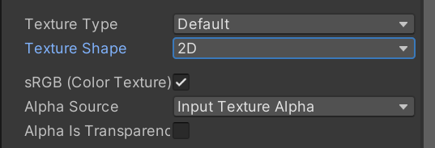
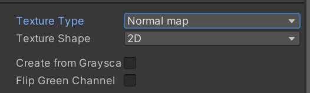
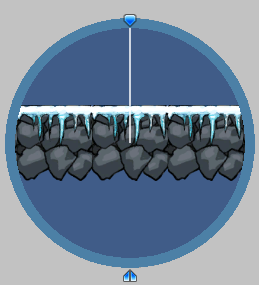
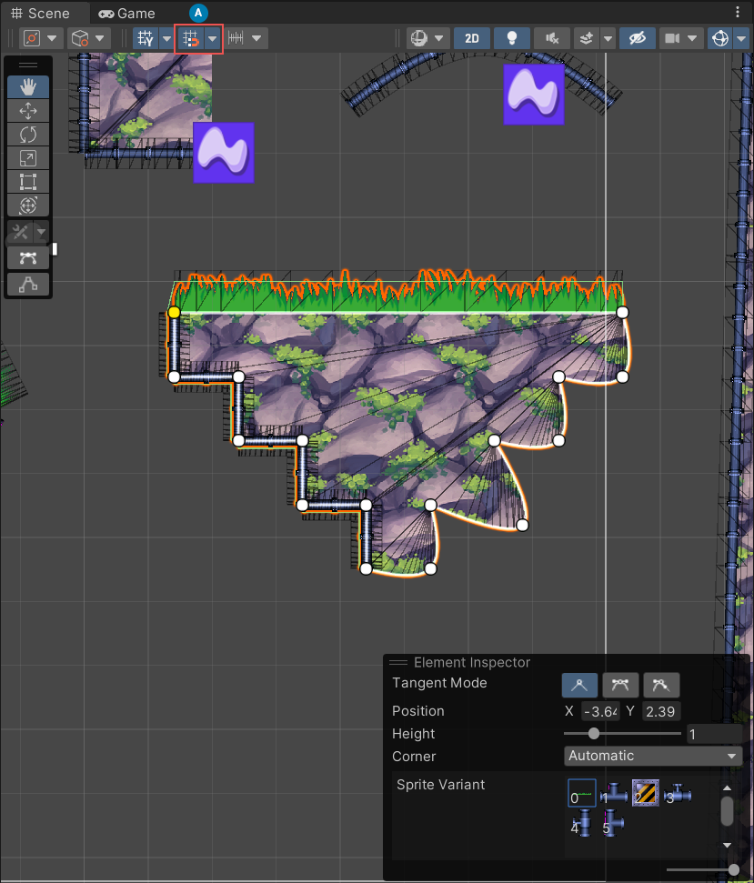

# Unity-核心-2D

## 图片导入概述

Unity 支持多种图片格式，常见格式如下：

|格式| 特点描述|
|-----------|--------------------------------------------|
| JPG / JPEG  | 有损压缩，压缩率高，体积小，无透明通道。|
| PNG       | 无损压缩，体积小，支持透明通道。|
| TGA       | 支持不失真压缩，体积小，效果清晰。|
| BMP       | 几乎不压缩，文件体积大。|
| TIF       | 基本不损失图片信息，但体积大。|
| PSD       | Photoshop专用格式，可通过工具导入。|
| EXR / GIF / HDR / IFF / PIC | Unity也支持这些格式。|

最常用的格式为 JPG, PNG 和 TGA。

## `Texture Type` 纹理类型

纹理类型主要是为了让纹理图片有不同的主要用途，指明其是用于哪项工作的纹理。

**各类型概览**

| 类型 (Type)                | 主要用途                                                                 |
|----------------------------|--------------------------------------------------------------------------|
| Default                    | 最常用、最通用的类型，用于 3D 模型的纹理（如反照率贴图、金属度贴图等）。         |
| Normal Map                 | 用于存储法线信息，为模型表面增加凹凸细节，模拟高模的视觉效果。                 |
| Sprite (2D and UI)         | 用于 2D 游戏、UI 元素（如按钮、图标）和粒子系统。                             |
| Editor GUI and Legacy GUI  | 用于 Unity 编辑器扩展的 GUI 元素或旧版的 IMGUI 系统。                         |
| Cookie                     | 用作光源的“遮罩”，投射出特定形状或图案的光影，例如窗户透光的效果。             |
| Lightmap                   | 用于存储预烘焙的光照信息，是光照贴图（Lightmapping）流程的一部分。             |
| Cursor                     | 用于自定义硬件鼠标光标的图标。                                             |
| Single Channel             | 当你只需要图片的一个颜色通道（红、绿、蓝或 Alpha）时使用，可以节省内存。        |

**参数说明**

1. `Default`：
    
    - `sRGB`：告诉 Unity 该纹理是伽马空间的（sRGB），在渲染时会自动进行颜色空间转换——采用线性光照计算后再进行伽马转换。
        `Alpha Source`：指定如何生成纹理的Alpha通道。
        - `None`：忽略 Alpha 通道。
        - `Input Texture Alpha`：直接使用图片文件自带的 Alpha 通道。
        - `From Gray Scale`：从输入纹理 RGB 值的平均值生成 Alpha 通道。
    - `Alpha Is Transparency`：如果你的 Alpha 通道用于表示透明度，勾选此项可以优化边缘的显示效果，避免出现白边或黑边。
    ::: details 伽马空间与线性空间
    结论来说，在 Unity 中采用线性颜色空间（Linear Color Space）可以提供更准确的光照和颜色计算，效果更自然。

    详情可阅读：[Gamma and Linear Space - What They Are and How They Differ](https://kinematicsoup.com/news/2016/6/15/gamma-and-linear-space-what-they-are-how-they-differ)

    热心网友提供的中文翻译版：[伽马空间与线性空间详解](https://gwb.tencent.com/community/detail/120396)
    :::

2. `Normal Map`：
    法线贴图就是在原物体的表面每个点上均做法线，法线就是垂直于某个点的切线的方向向量。
    

    - `Create From Grayscale`：让 Unity 根据灰度图生成法线贴图，但效果完全没法和美术制作的法线贴图相比。
        - `Bumpiness`：控制凹凸程度，值越大凹凸感越强。
        - `Filtering`：如何计算凹凸值。
            - `Smooth`：使用标准算法生成法线贴图。
            - `Sharp`：生成比标准模式更锐利的法线贴图。
    ::: details 法线贴图
    法线贴图是一种特殊的纹理，它不存储颜色信息，而是存储模型表面的方向（法线）信息。

    一般美术所制作的模型是细节丰富的高模，但为了性能考虑。通常会将高模的多个三角面片合并，最终导出一个低模。为了在低模上保留高模的细节，在导出低模的同时，还会导出一张法线贴图。通过在低多边形模型上使用法线贴图，Unity 可以据此进行更加复杂的光照计算，模拟出高多边形模型才有的复杂表面细节，如砖缝、划痕、褶皱等，极大地提升了画质而无需增加模型的多边形数量。
    :::

3. `Editor GUI and Legacy GUI`：编辑器扩展——当你需要为 Unity 编辑器编写自定义窗口或 Inspector 面板时，所用的图标或图片应设为此类型。

4. `Sprite(2D and UI)`： Unity 中专门为 2D 游戏和用户界面（UI）设计的纹理类型
    - `Sprite Mode `：指定纹理是单一精灵还是精灵图集。
        - `Single`：当你的图片文件（比如一个 PNG）里只包含一个独立的元素时使用。比如一个按钮的图标、一个道具的图标。
        - `Multiple`：当你的图片文件是一张“精灵图集 (Sprite Sheet)”，包含了多个需要被切割出来的元素时使用。最常见的例子就是一个角色的所有动画帧都画在一张大图上。
        - `Polygon`：不使用图片原始的矩形边界，而是为这个 Sprite 手动定义一个自定义的多边形网格形状。
    - `Pixels Per Unit`：指定每个像素对应的世界单位数，影响精灵在场景中的大小。如同比例尺，决定了你的精灵在游戏场景里显示出来有多大。
    - `Mesh Type`：指定精灵的网格类型（只有 `Single` 和 `Multiple` 模式下有）。
        - `Full Rect`：创建四边形，将精灵显示在整个四边形上。
        - `Tight`：基于像素的 Alpha 值来生成网格，更加贴合精灵图片形状。
            > 任何小于 32x32 的精灵都会被自动设置为 Full Rect，无法使用 Tight。
    - `Extrude Edges`：在精灵的边缘添加额外的像素，可以用于防止锯齿状边缘。
    - `Pivot`：指定轴心点（仅可用于 `Single` 模式）。
    - `Generate Physics Shape`：自动生成物理碰撞体，适用于需要物理交互的精灵（仅在 `Single` 和 `Multiple` 模式）。
    - `Sprite Editor`：打开精灵编辑器，允许对精灵进行切割、调整和编辑。

5. `Cursor`：自定义光标。

6. `Cookie`光源剪影格式。
    - `LightType`：应用的光源类型。一般点光源的剪影需要设置为立方体纹理，方向光和聚光灯的剪影设置为 2D 纹理。
        - `Spotlight`：聚光灯类型，需要边缘纯黑色纹理。
        - `Directional`：方向光，平铺纹理。
        - `Point`：点光源，需要设置为立方体形状。
    - 与 `Default` 相同的参数不再赘述。

7. `LightMap / Directional Lightmap`：是 Unity 光照烘焙（Lighting Baking）系统的产物。这个类型通常由 Unity 自动设置，你很少需要手动去更改它。

8. `Single Channel`：单通道模式。这个模式能让一张贴图在内存里的占用空间减少 75%，但代价是它会丢掉所有颜色信息，只保留一张灰度图。
    - `Channel`：希望将纹理处理为 Alpha 还是 Red 通道。
        - `Alpha`：使用 Alpha 通道，不允许进行压缩。
        - `Red`：使用红色通道。

::: details 通道
通道是指图像中每个像素的颜色信息存储方式。例如：aRGB 三个通道，每个通道存储 8 位（0-255），代表不同的颜色信息，Alpha 通道则用于存储透明度信息。
:::

## `Texture Shape` 纹理形状

纹理不仅可以用于模型贴图，还可以用于制作天空盒和反射探针。纹理形状决定了你的纹理数据在内存中是如何组织的，以及它被用来做什么。它不再是关于纹理的“内容”（比如是颜色还是法线），而是关于它的“维度和结构。

不同类型的具体参数了解即可。

#### `2D`

`2D` 纹理是最常用的类型，这些纹理将用到模型和 GUI 上。

**参数说明**
- `Mapping`（映射）
    - `Auto`：根据纹理信息自动创建布局。
    - `6 Frames Layout (Cubic Environment)`：纹理包含标准立方体贴图布局之一排列的六个图像。
    - `Latitude-Longitude Layout (Cylindrical)`：将纹理映射到2D维度（经度/纬度）。
    - `Mirrored Ball (Spheremap)`：将纹理映射到类似球体的立方体贴图上。

#### `Cube`

立方形贴图，主要用于天空盒和反射探针。

**参数说明**
- `Convolution Type`（卷积类型）
    - `None`：无过滤。
    - `Specular (Glossy Reflection)`：将立方体作为反射探针。
    - `Diffuse (Irradiance)`：将纹理进行过滤表示辐照度，可作为光照探针。

- `Fixup Edge Seams`（修复边缘缝隙）
    - 作用：当`Convolution Type`为`None`和`Diffuse`时可用，解决低端设备上立方体贴图过滤错误。


#### `2D Array` 
这是一个更高级的、用于优化的形状。它像是一“叠”尺寸和格式都完全相同的 2D 贴图。主要作用为在着色器 (Shader) 中进行高性能的纹理切换。

可以用于：
- 精灵动画（替代 `Animation Sheet`，减少 Draw Call）
- 地形分层（如不同地貌的混合）
- Variants 材质（同一物体的不同皮肤/状态）

#### `3D`

`3D` 纹理是一个立体的纹理，通常用于存储体积数据，如体素、烟雾模拟等。

适用于：
- 体积效果（云、雾、火焰）
- 颜色查找表 (LUT - Look-Up Table)


## `Advanced` 纹理高级设置
在 Unity 导入纹理时，`Advanced`（高级）设置面板允许你对纹理的底层行为进行更细致的控制，适用于有特殊需求的项目或美术资源优化。


**参数说明**

- `Non-Power of 2`：非2的幂尺寸纹理的处理方式。美术资源使用2的幂尺寸便于压缩和 GPU 优化。
    - `None`：保留原始尺寸。
    - `ToNearest`：将纹理尺寸缩放为最接近的2的幂尺寸。
    - `ToLarger`：将纹理尺寸向上缩放到最接近的2的幂尺寸。
    - `ToSmaller`：将纹理尺寸向下缩放到最接近的2的幂尺寸。
    ::: tip
    PVRTC 格式要求纹理必须为正方形。
    :::

- `Read / Write Enable`：是否允许脚本在运行时读取/修改纹理数据。勾选后可用Texture2D.GetPixels等API，但会增加内存占用。只有需要脚本动态处理纹理时才建议开启。

- `Virtual Texture Only`：仅用于虚拟纹理系统（如大型场景地形），一般项目无需勾选。

- `Generate Mipmaps`：是否自动生成 MipMap（多级渐进纹理），用于提升远距离渲染效果和性能。大多数贴图建议开启，UI图标等特殊用途可关闭。
    - `Use Mipmap Limits`：是否启用 MipMap 限制（配合 MipMap Limit Group 使用），可针对不同平台或场景优化纹理内存。
            - `Mipmap Limit Group`：选择MipMap限制分组，便于统一管理和调整 MipMap 策略。适合大型项目或多平台适配。
    - `Mip Streaming`（了解即可）：启用可以使用纹理串流，主要用于控制 MipMap 的加载级别，用于减少 Unity 对纹理所需内存的的总量，性能换内存。可以通过设置 `Priority` 来控制优先考虑的 MipMap 层级。
    - `Mipmap Filtering`（了解即可）：MipMap 过滤算法（如 Box、Kaiser、Mitchell），影响 MipMap 生成的质量和锐度。Box 适合大多数情况，Kaiser 和Mitchell 更锐利但计算量略大。
    - `Preserve Coverage`（了解即可）：保持 Alpha 覆盖率，防止生成 MipMap 后透明区域变小，常用于有透明通道的贴图（如UI、特效）。
    - `Replicate Border`（了解即可）：复制边缘像素到纹理边界，防止UV采样超出范围时出现黑边或杂色。适合需要无缝贴图的场景。
    - `Fadeout to Gray`（了解即可）：让远距离的MipMap逐渐变为灰色，减少视觉干扰，适合特殊美术需求（如远景雾化效果）。
    ::: tip
    2D 游戏一般不使用 mipmap，3D 选择性使用。
    :::
- `Ignore PNG Gamma`：忽略PNG图片自带的Gamma信息，强制使用项目设置的颜色空间。一般建议保持默认，特殊色彩管理需求时可调整。
- `Swizzle`（了解即可）：通道重映射（R、G、B、A），可自定义纹理的颜色通道顺序，适合特殊 Shader 或美术需求。例如只用 Alpha 通道做遮罩时可将 A 映射到 R。

一般情况下，默认设置即可满足大多数项目需求。只有在遇到特殊性能瓶颈或美术需求时，才建议深入调整这些高级参数。

::: details MipMap
在三维计算机图形的贴图渲染中有一个常用的技术被称为 Mipmapping。
为了加快渲染速度和减少图像锯齿，贴图被处理成由一系列被预先计算和优化过的图片组成的文件，这样的贴图被称为 mipmap。Mipmap 需要占用一定的内存空间。

Mipmap 中每一个层级的小图都是主图的一个特定比例的缩小细节的复制品。
虽然在某些必要的视角，主图仍然会被使用，来渲染完整的细节。但是当贴图被缩小或者只需要从远距离观看时，mipmap 就会转换到适当的层级。

因为 mipmap 贴图需要被读取的像素远少于普通贴图，所以渲染的速度得到了提升。
而且操作的时间减少了，因为 mipmap 的图片已经是做过抗锯齿处理的，从而减少了实时渲染的负担。同时，放大和缩小也因为 mipmap 而变得更有效率。

如果贴图的基本尺寸是 256x256 像素的话,它 mipmap 就会有8个层级，每个层级是上一阶层级的四分之一的大小：128x128;64x64;32x32;16x16;8x8;4x4;2x2;1x1(一个像素)

简单来说，开启 MipMap 功能后，Unity 会帮助我们根据图片信息生成 n 张不同分辨率的图片，在场景中会根据我们离该模型的距离选择合适尺寸的图片用于渲染，提升渲染效率。
:::

## 平铺拉伸设置

**参数说明**

- `Wrap Mode`（平铺纹理的方式）：
    - `Repeat`：在区域内重复纹理。
    - `Clamp`：拉伸纹理的边缘，超出部分会一直显示边缘像素。
    - `Mirror`：在每个整数边界上镜像纹理，以创建重复图案。
    - `Mirror Once`：镜像纹理一次，之后超出部分拉伸边缘。
    - `Per-axis`：分别控制U轴和V轴上的包裹方式，可实现更灵活的平铺效果。

- `Filter Mode`：控制纹理在 3D 变化拉伸时如何进行过渡和模糊处理。
    - `Point`：纹理在靠近时变为块状。
    - `Bilinear`：纹理在靠近时变得模糊。效果较好，常用。
    - `Trilinear`：与`Bilinear`类似，但纹理也在不同的 Mip 级别之间模糊。

- `Aniso Level`（各向异性过滤等级）：
    - 以大角度查看纹理时提升纹理质量，数值越高效果越好，但性能消耗也越高。一般不会去修改。

## 纹理打包平台
参数说明：

- `Max Size`：设置导入纹理的最大尺寸。即使美术导出的图片很大，也可以通过这里限制它们的尺寸在一定范围内，避免资源浪费。

- `Resize Algorithm`：当纹理尺寸大于指定的 Max Size 时，使用的缩小算法。影响缩小后的图片质量。
    - `Michell`：默认米歇尔算法。
    - `Bilinear`：使用双线性插值调整大小，保留更多细节。

- `Format`：纹理格式。各平台支持的格式有所不同，如果选择 Automatic，会根据平台使用默认设置。
    - 都支持的格式：如 RGBA 32bit、RGB 16bit 等。
    - 移动端和网页端有特有格式。
    > 官方文档：[各平台的推荐、默认和支持的纹理压缩格式](https://docs.unity3d.com/cn/2022.3/Manual/class-TextureImporterOverride.html)
    ::: info
    IOS 如果使用默认 PVRTC 压缩格式可以获得更大的兼容性。如果应用程序不包含 OpenGL ES 2.0 的支持，则可以使用 ASTC 压缩格式，这种格式可以提供更好的质量和灵活性，并且压缩速度比前者快。

    Android 设备情况更为复杂。对于安装了 OpenGL ES 3.1 的 Android 设备，可以使用 ASTC 压缩格式。此外还有各种别的格式：
    2. ETC：在所有 Android 设备上支持。
    1. ETC2 / EAC：在 OpenGL ES 3.0 上支持。
    3. RGBA 16位 / RGBA 32位：在所有设备上都支持。  
    :::

- `Compression`：选择纹理的压缩类型，帮助 Unity 正确选择压缩格式。会根据平台和压缩格式的可用性进行压缩。
- `Use Crunch Compression`：启用后，使用 Crunch 压缩。Crunch 是一种基于 DXT 或 ETC 纹理压缩的有损压缩格式。压缩时间长，但解压速度快，适合需要极致压缩的场景。可以通过设置 `Compression Quality` 来控制压缩质量。

ETC 格式下会出现的参数：
- `Split Alpha Channel`：Alpha 通道分离，节约内存。会把一张图分成两张纹理，一张包含 RGB 数据，一张包含 Alpha 数据，在渲染时再合并渲染。这是一个很好的设置，可以节约内存。

- `Override ETC2 fallback`：不支持 ETC2 压缩的设备上，使用的回退格式。用于兼容性处理。

## Sprite Editor

主要用于编辑 2D 游戏开发中使用的 Sprite 精灵图片，可以用于编辑图集中提取元素，设置精灵边框，设置九宫格，设置轴心点等功能。

在 Unity 的 3D 模版下，需要下载 `2D Sprite` 包才能使用。

#### 对于单图

单图的情况下，Sprite Editor 主要用于设置精灵的属性和编辑。

**Sprite Editor 精灵编辑器：**
- `Name`：精灵的名称。
- `Postition`：这个独立的 Sprite 在原始的整张大图（Sprite Sheet）中所占据的矩形区域。
- `Border` 参数用于设置九宫格的边框。在 UGUI 笔记中已有涉及，此处不再赘述。
- `Pivot`：轴心。可以通过 `Custom` 自定义轴心点位置。
- `Pivot Unit Mode`：轴心点单位模式。
    - `Pixels`：像素单位。
    - `Normalized`：归一化单位，范围从 0 到 1。推荐。

**Custom Outline 自定义渲染范围：**

- 在左上角和从 Sprite Editor 切换到 Custom Outline 模式。在该模式下，可以自定义边缘线设置和精灵网格的轮廓形状。

- 默认情况下，图片都是在矩形网格上渲染，边缘外部透明区域会被渲染，浪费性能。使用自定义轮廓，可以调小透明区域，提高性能。

- 在该模式下，左上角有新的选项：
    - Snap：开启后，在拖拽轮廓顶点时，光标会自动“吸附”到最接近的像素网格上，保证顶点的坐标为整数，避免半像素的情况。
    - Outline Tolerance：轮廓点的复杂度和准确性，值越大轮廓点越多，越精细。
    - Generate：生成网格轮廓。

**Custom Physics Shape 自定义物理形状：**

- 在该模式下，可以自定义精灵的物理形状，该形状决定了碰撞检测的区域。

- 左上角的选项和 Custom Outline 模式下相同，只是发挥最用不同。

**Skinning Editor 蒙皮编辑器：**
> Comming soon...

**Secondary Textures 次要纹理：**

- 次要纹理设置，可以将其他纹理与该精灵关联。着色器可以得到这些辅助纹理，然后用于做一些特殊效果的处理，让精灵用于其他效果。

- 与 Shader 结合使用，可以实现更复杂的视觉效果。
    > Coming soon...

#### 对于多图

当图片资源为图集时，我们需要设置精灵的属性为 `Multiple`，然后在 Sprite Editor 中进行分割。

**Sprite Editor 精灵编辑器**左上角会出现新的的选项：
- SLice：切割选项。
    - `Type`：切割类型。
        - `Automatic`：自动切割，Unity 会根据图片内容智能识别切割区域。
        - `Grid By Cell Size`：按网格大小切割，指定每个精灵的宽度和高度。
        - `Grid By Cell Count`：按网格数量切割，指定行数和列数。
        - `Isometric Grid`：等距网格切割，指定
    - `Pivot`：小图轴心点。
    - `Method`：处理现有小图矩形。
        - `Delete Existing`：自动生成新的矩形以替换现有的矩形。
        - `Smart`：尝试创建新的矩形并保留或调整现有矩形。
        - `Safe`：添加新的矩形，保留现有矩形。

- Trim：自动修建，清除透明区域。

在选中小图后，右下角会出现类似于单图的设置选项。

#### 对于 `Polygon` 模式

可以在左上角 `Sides` 设置多边形的边，取值为 3 到 128。也可以通过 `Custom Outline` 自动生成渲染范围。

值得一提的是，这种模式在实际开发中使用的非常少。

## `Sprite Renderer`

`Sprite Renderer` 是 Unity 中专门用来在 2D 游戏中显示和渲染 2D 图像（除了 UI 元素） 的核心组件。

**参数说明**
- `Sprite`：渲染的精灵图像。
- `Color`：定义着色。
- `Filp`：水平或垂直翻转精灵。
- `Draw Mode`：绘制模式，决定当 `Scale` 变化时的缩放方式。
    - `Simple`：普通模式，均匀缩放整个图片。
    - `Sliced`：切片模式，9宫格拉伸，只拉伸中央十字区域（需要通过 Sprite Editor 设置 Border 边框）。此时需要通过修改 `Size` 来设置大小。
    - `Tiled`：平铺模式，重复平铺中央部分。也可以通过设置 Border 边框来控制平铺样式。大小也通过 `Size` 设置。
        - `Tiled Mode`：平铺时的行为。
            - `Continuous`：中央部分平铺，边缘部分不拉伸但会切割。
            - `Adaptive`：类似 `Simple` 模式，当尺寸到达 `Value` 时会平铺。
    ::: tip
    如果调整到 `Sliced` 和 `Tiled` 模式时发出警告，是提示该模式只适用于 Sprite 的 `Mesh Type` 为 `Full Rect` 或 `Sprite Mode` 为 `Polygon` 的精灵。
    :::
- `Mask Interaction`：与遮罩的交互方式。
    - `None`：不与遮罩交互。
    - `Visible Inside Mask`：只在遮罩内可见。
    - `Visible Outside Mask`：只在遮罩外可见。   
- `Sprite Sort Point`：决定了 Unity 使用精灵上的哪个点来计算其与摄像机的距离，从而确定渲染顺序。
- `Material`：渲染材质，一般使用默认材质即可。如果有特殊需求（如受光照影响的效果），可以自定义材质。
- `Additional Settings`：可通过 `Sorting Layer` 和 `Order in Layer` 两个属性来控制渲染顺序。
    ::: tip
    在 2D 游戏中，摄像机一般是 `Orthographic`（正交投影），因此图片在 Z 轴上不同位置并不会影响显示的大小，但 Z 轴位置仍然会影响哪个物体更靠前。所以其实也可以通过调整 Z 轴位置来控制渲染顺序。`Order in Layer` 对渲染层级的控制强于 `Z` 轴位置。
    :::
   
可以通过代码动态的改显示的图片：
```csharp
var spriteRenderer = GetComponent<SpriteRenderer>();
var handle = await Addressables.LoadAssetAsync<Sprite>("YourSprite.png");

// 设置 SpriteRenderer 的精灵
if (handle.Status == AsyncOperationStatus.Succeeded)
    spriteRenderer.sprite = handle.Result;
```

加载 `Mutiple` 模式下的精灵时，需要使用 `LoadAssetsAsync<T>`。`LoadAssetsAsync` 会返回一个 `AsyncOperationHandle<IList<Sprite>>`，需要通过 `await handle.Task` 来获取加载结果 `IList<T>`。

::: details 代码示例
```csharp {16-18} [MyTest.cs]
using System.Collections.Generic;
using System.Threading.Tasks;
using UnityEngine;
using UnityEngine.AddressableAssets;
using UnityEngine.ResourceManagement.AsyncOperations;

public class MyTest : MonoBehaviour
{
    [SerializeField] private string address = "my_sprites";

    private List<Sprite> _spriteList;
    private AsyncOperationHandle<IList<Sprite>> _handle;
    
    // 加载图集
    private async Task LoadSpritesAsync()
    {
        // 异步加载精灵列表
        _handle = Addressables.LoadAssetsAsync<Sprite>(address, null);
        IList<Sprite> sprites = await _handle.Task;

        if (_handle.Status == AsyncOperationStatus.Succeeded)
        {
            _spriteList = new List<Sprite>(sprites);
        }
    }
    
    private void OnDestroy()
    {
        if (_handle.IsValid())
            Addressables.Release(_handle);
    }

    // 简单的在图集中加载特定名称的精灵的示例
    private async Task<Sprite> LoadSpecificSpriteAsync(string address)
    {
        // address 的格式需要为 $"{图集 Address}[{精灵.Name}]"
        AsyncOperationHandle<Sprite> handle = Addressables.LoadAssetAsync<Sprite>(address);
        await handle.Task;
        if (handle.Status == AsyncOperationStatus.Succeeded)
            return handle.Result;

        return null;
    }
}
```
::: 

如果想要加载 Unity 里面创建的图集，不需要单独加载图集再从图集里抽出单图来使用，整个过程会更加方便。就像 UGUI 一样，你可以直接使用单图，最后再打包图集，Unity 会自动使用图集中的图片。这也是 Unity 官方推荐的做法。

## Sprite Creator

可以通过 Sprite Creator 创建新的精灵。它是一个简单的工具，可以快速创建各种多边形精灵。它的主要作用是制作快速的 2D 游戏原型，用作美术资源的占位符。

在 Project 面板中右键点击，选择 Create > 2D > Sprite，即可创建简单的多边形。

## `Sprite Mask`

`Sprite Mask` 是 Unity 里的一个组件，它能让你控制一个或一组 Sprite（2D 图像）的可见部分。就像是用一张镂空的卡片盖在一张画上，你只能看到镂空部分下面的画。

可以在 Project 面板中选择 Create > 2D Object > Sprite Mask 创建一个携带 `Sprite Mask` 组件的对象。该组件如果想发挥作用，需要将希望被遮罩的图片的 `Sprite Renderer` 组件的 `Mask Interaction` 设置为 `Visible Inside Mask` 或 `Visible Outside Mask`。

参数说明：
- `Sprite`：遮罩的形状。
- `Alpha Cutoff`：遮罩的透明度阈值，低于该值的像素将被遮罩掉。
- `Custom Range`：是否自定义遮罩范围。
    - `Front`：遮罩层范围的最大值。
    - `Back`：遮罩层范围的最小值。
- `Sprite Sort Point`：决定计算图片和摄像机距离时，采用图片中心还是轴心点。一般不用修改。

## `Sorting Group`

`Sorting Group` 是一个组件，它的核心作用是将一个游戏对象及其所有子对象的渲染器（如 `Sprite Renderer`）“打包”成一个独立的单元。Unity 在决定渲染顺序时，会优先处理这个“单元”，而不是去单独计算其内部每一个子对象的排序。

`Sorting Group` 只会在同一父游戏对象下的子对象之间起作用，不会影响其他父对象或兄弟对象的渲染顺序，除非设置 `Sort at Root`。

属性说明：
- `Sorting Layer`：决定了整个组属于哪个渲染层。
- `Order in Layer`：这个数字决定了在同一个 Sorting Layer 中，这个组的渲染优先级。
- `Sort at Root`：忽略父级的存在，直接参与到全局的根排序中。


## Sprite Atlas

有关图集的内容，已经在 UGUI 笔记中介绍过了，不再赘述。

[Unity-UGUI#图集制作](./Unity-UGUI#图集制作)

## 刚体

在 Unity 中，如果你希望一个 2D 游戏对象（比如角色、子弹、箱子）能够受到物理规律的影响（如重力、推力、摩擦力、碰撞），那么你就必须为它添加 `Rigidbody 2D` 组件。

2D 物理系统中的刚体和 3D 物理系统中的刚体基本相同，最大区别在于 2D 游戏对象只在 X 和 Y 平面上移动，并且只在垂直于该平面上的轴旋转。

参数说明：
- `Body Type`：决定了该物体的基本物理行为。
    - `Dynamic`：这是默认类型，也是功能最全的类型。一个完全的物理对象。它会受到重力、推力 (AddForce)、速度 (velocity) 等所有物理效果的影响。它会与其他任何类型的刚体（包括静态和运动学刚体）发生真实的物理碰撞，并产生反弹、旋转等效果。
    - `Kinematic`：运动学刚体，它拥有物理外形（可以触发碰撞），但它不受物理引擎的力所控制。可以通过脚本移动。
    - `Static`：静态刚体，一个完全静止、不可移动的物理对象。适用于地形、墙壁等不动的对象。
- `Material`：指它在物理世界中的表面特性。可以设置摩擦力、弹性等属性。会优先使用 2D 碰撞器上的物理材质，其次是刚体上，其次是全局物理材质。
    ::: details `Physics Material 2D`
    简单来说，这个“物理材质”不是指物体看起来的样子（比如颜色、纹理），而是指它在物理世界中的表面特性，主要控制两个方面：
    1. 摩擦力（Friction）
    2. 弹性（Bounciness）

    要使用 `Physics Material 2D`，你首先需要在项目（Project）窗口中创建一个 `Physics Material 2D` 资源。在 Project 窗口点击鼠标右键 -> Create -> 2D -> Physics Material 2D。

    创建并选中这个资源后，你会在 Inspector 窗口看到两个主要的滑块：
    1. `Friction` (摩擦力)
        - 作用: 定义了物体与其他表面接触时的滑动摩擦系数。
    2. `Bounciness` (弹性 / 恢复系数)
        - 作用: 定义了物体碰撞后能“弹回”多少能量。
    :::
- `Simulated`：是否启用物体及其子对象的物理模拟。`Kinematic` 的刚体开启后会充当一个质量无限大的物体，不可移动但可碰撞。
- `Use Full Kinematic Contacts`：仅在 `Kinematic` 模式会出现，可以和所有 2D 刚体碰撞，如其他 `Kinematic` 的或 `Static` 的刚体。
- `Use Auto Mass`：自动计算质量。
- `Liner Drag`：线性阻力，控制物体在移动时的阻力大小。值越大，物体移动时减速越快。 
- `Angular Drag`：角阻力，控制物体旋转时的阻力大小。
- `Gravity Scale`：收到的重力的缩放比例。
- `Collision Detection`：碰撞检测模式。
    - `Discrete`：离散碰撞检测，适用于大多数情况。物体在每一帧之间的移动不会被考虑。
    - `Continuous`：连续碰撞检测，适用于快速移动的物体，可以减少穿透其他物体的风险。
    ::: details `Continuous Dynamic` 和 `Continuous Speculative`
    3D 当中还有 `Continuous Dynamic` 和 `Continuous Speculative` 用于 连续碰撞检测（Continuous Collision Detection, CCD）但在 2D 中没有这两个选项。

    `Continuous Dynamic` (连续动态)
    - 这是 `Continuous` 的增强版，也是最“豪华”的模式。它不仅会扫描和预测与静态物体的碰撞，还会预测与其他 `Continuous` 和 `Continuous Dynamic` 刚体的碰撞（因为 `Continuous` 不能防止穿透其他同样在运动的 `Continuous` 或 `Continuous Dynamic` 刚体）。
    - **性能开销非常非常大。**

    `Continuous Speculative` (连续推测)
    - 这是 Unity 引入的一种更新、更现代的 CCD 模式。它的工作方式完全不同。它不是向前“扫描”，而是根据物体的速度，在物体周围“膨胀”出一个检测范围，然后推测它在下一帧的运动轨迹上是否可能与别的物体发生接触。它在处理高速旋转（Angular Motion）时的穿隧问题比 `Continuous Dynamic` 更有效。
    - **性能比 `Continuous Dynamic` 好得多，在很多情况下甚至接近 `Discrete`。是目前官方推荐的首选 CCD 方案。**
    :::
- `Sleeping Mode`：对象处于静止状态时进入睡眠状态。
    - `Never Sleep`：永不进入睡眠状态，会一直进行检测计算。性能消耗大。
    - `Start Awake`：游戏对象在被创建或加载时，物理状态是活跃的。它会正常参与物理计算，直到它自己满足了休眠条件而进入休眠。默认且推荐的选项。
    - `Start Asleep`：最初处于睡眠状态，但可以被碰撞唤醒。

- `Interpolate`：插值模式，控制物体在运动时的平滑度。
    - `None`：不进行插值。
    - `Interpolate`：根据上一帧的位置进行插值。
    - `Extrapolate`：根据物体的速度预测下一帧的位置。

- `Constraints`：约束选项，限制物体不在一个轴上运动或受力的影响。
- `Info`：显示物体的物理信息，如质量、速度、加速度等。

依据情况，选择使用不同的刚体：

| 类型      | 说明 |
|-----------|--------------------------------------------------|
| `Dynamic`   | 受力的作用，需要碰撞的对象。|
| `Kinematic` | 通过刚体 API 移动，不受力的作用，但想要进行碰撞检测。|
| `Static`    | 不动不受力的静态物体，但想要进行碰撞检测。|

可以通过代码为刚体添加力的作用，例如：
```csharp
Rigidbody2D rb = GetComponent<Rigidbody2D>();
// 添加一个向上的力
rb.AddForce(new Vector2(0, 10));
// 添加一个向上的相对力
rb.AddRelativeForce(new Vector2(0, 10));
```
还可为刚体添加扭矩（Torque）：
```csharp
rb.AddTorque(5f);
```
::: tip
扭矩旋转的方向可以使用 **右手定则(Right-Hand Rule)**  来判断。

将大拇指方向指向旋转轴的正方向（2D 中为正 Z 轴，即从屏幕指向眼睛的方向），其余四指弯曲的方向就是扭矩旋转的方向。
:::
`AddForce` 和 `AddRelativeForce` 方法还可以接受第二个参数，以指定力的作用方式：
1. `ForceMode2D.Force`：默认方式，持续施加力。t 为物理帧间隔。
2. `ForceMode2D.Impulse`：常描述为添加瞬时冲击力。本质上是施加一个冲量（I = m * v）。
3. `ForceMode2D.VelocityChange`：施加一个瞬时速度变化。

::: info
通过代码添加力的内容与 [Unity入门#刚体与力的应用](./Unity入门#刚体与力的应用) 中的内容相似。
:::

通过代码添加速度：
```csharp
rb.velocity = new Vector2(5f, 0f);
```

## 碰撞器

碰撞器是一个组件，它为游戏对象定义了一个用于物理碰撞的、不可见的形状。如同物体的“物理骨骼”或“力场边界”——它不负责移动，不负责受力，它只做一件事：定义物体的物理边界。

因此刚体可以通过碰撞器获得的范围信息进行物理计算。

#### `Sphere Collider 2D` 球形碰撞器
参数说明：
- `Edit Collider`：快捷编辑碰撞器的形状。
- `Material`：物理材质，定义摩擦力和弹性等属性。
- `Is Trigger`：是否为触发器。触发器不会产生物理碰撞，但可以检测到碰撞事件（如 `OnTriggerEnter2D`）。
- `Used By Effector`：是否被效应器使用。效应器可以对碰撞器施加额外的物理效果，如风力、重力等。
- `Offset`：碰撞器位置的偏移量。
- `Radius`：碰撞器的半径。

#### `Box Collider 2D` 矩形碰撞器
参数说明：
- `Used By Composite`：是否被复合碰撞器使用。复合碰撞器可以将多个碰撞器组合成一个更复杂的形状，勾选后消失的属性需要可以在复合碰撞器上设置。
- `Auto Tiling`：当精灵大小改变时，自动调整碰撞器的大小。
- `Size`：可设置宽高。
- `Edge Radius`：圆角半径，控制碰撞器边缘的圆滑程度。

#### `Polygon Collider 2D` 多边形碰撞器
参数 `Points` 定义了多边形的顶点。使用 `Edit Collider` 可以直接在 Scene 视图中编辑顶点，更直观快捷。

#### `Edge Collider 2D` 边界碰撞器
边界碰撞器定义了线段状的碰撞区域，可用于地面或墙壁。

参数类似于 `Polygon Collider 2D`。

#### `Capsule Collider 2D` 胶囊碰撞器
参数 `Direction` 可设置胶囊的方向。
#### `Composite Collider 2D` 复合碰撞器
通过在父物体上添加 `Composite Collider 2D` 组件，可以将多个子碰撞器组合成一个更复杂的碰撞形状，子碰撞器需要启用 `Used By Composite` 选项。

父物体添加 `Composite Collider 2D` 时 Unity 还会自动为其依赖的添加 `Rigidbody 2D`。但此时还是在复合组件上修改刚体属性，不需要修改 `Rigidbody 2D`。

参数说明：
- `Geometry Type`：定义组合碰撞器的几何类型。
    - `Outlines`：空心轮廓，类似于边界碰撞器。
    - `Polygons`：实心多边形，类似于多边形碰撞器。
- `Generation Type`：定义组合碰撞器的生成方式。
    - `Synchronous`：同步生成，实时更新碰撞器形状。
    - `Manual`：手动生成——通过代码或点击下方 `Regenerate Geometry`。子物体位置改变时不会自动更新碰撞器形状。
- `Vertex Distance`：顶点距离，控制生成的多边形顶点之间的距离。值大时会忽略小的棱角，值越小则更准确贴合子碰撞器形状。
- `Offset Distance`（不常用）：将所有合并后的最终碰撞体轮廓，向外或者向内整体偏移指定的距离。

碰撞检测函数：
```csharp
private void OnCollisionEnter2D(Collision2D collision)
{
    // 当有其他碰撞器与刚体发生碰撞时调用
    Debug.Log("碰撞发生: " + collision.gameObject.name);
}

private void OnCollisionExit2D(Collision2D collision)
{
    // 当有其他碰撞器与刚体的碰撞结束时调用
    Debug.Log("碰撞结束: " + collision.gameObject.name);
}

private void OnCollisionStay2D(Collision2D collision)
{
    // 当有其他碰撞器与刚体持续碰撞时调用
    Debug.Log("持续碰撞: " + collision.gameObject.name);
}


```
触发器检测函数：
```csharp
private void OnTriggerEnter2D(Collider2D collision)
{
    // 当有其他碰撞器进入触发器时调用
    Debug.Log("触发器进入: " + collision.name);
}

private void OnTriggerExit2D(Collider2D collision)
{
    // 当有其他碰撞器离开触发器时调用
    Debug.Log("触发器离开: " + collision.name);
}

private void OnTriggerStay2D(Collider2D collision)
{
    // 当有其他碰撞器持续在触发器内时调用
    Debug.Log("触发器持续: " + collision.name);
}
```

## 物理材质

物理材质 (Physics Material) 是用来定义一个物体表面的物理特性的，主要控制两个属性：
1. `Friction`：静态和动态摩擦系数大小。
2. `Bounciness`：弹性系数大小。

物理材质和物体看起来的样子（颜色、纹理）完全无关，只影响物理碰撞时的表现。

在 Project 面板中右键点击，选择 Create > 2D > Physics Material 2D，即可创建一个新的物理材质资源。

::: tip
在 3D 中的物理材质 `Physics Material` 具有更多属性，可以单独设置滑动摩擦力（Dynamic Friction）和静态摩擦力（Static Friction）。此外，还可以通过 `Combine` 设置当两个带有不同物理材质的物体碰撞时，如何计算它们接触点最终的摩擦力和弹性。
:::

## 恒定力

`Constant Force` 是一个特殊的脚本，可以给一个刚体施加一个持续的力。主要有三个属性：
1. `Force`：施加的恒定力。
3. `Relative Force`：施加的恒定力，相对于刚体的局部坐标系。
2. `Torque`：施加的恒定扭矩。

## 效应器

效应器 (`Effector 2D`) 是一个可以附加到 2D 碰撞器(`Collider 2D`) 上的组件，可以让游戏物体在相互接触时产生一些特殊的物理作用力。可以实现风、水流、传送带或者单向平台等效果。有的效应器要求物体必须为触发器。

效应器是 Unity 2D 物理系统独有的功能。在 3D 物理中没有完全对应的概念。

##### `Area Effector 2D` 区域效应器
在一个区域内，对所有进入的物体施加一个恒定方向和大小的力或扭矩。

参数说明：
- `Use Collider Mask`：是否使用碰撞器掩码来限制哪些层上的碰撞器可以受到效应器的影响。
- `User Global Angle`：是否使用全局角度来计算作用力方向。
- `Force Angle`：作用力的角度。
- `Force Magnitude`：作用力的大小。
- `Force Variation`：作用力的变化范围。
- `Force Target`：效应器在目标对象上施加力的作用点。
    - `Collider`：碰撞器当前位置。如果碰撞器有偏移没有位于质心，可能产生扭矩导致旋转。
    - `Rigidbody`：刚体质心。
- `Drag`：阻力。
- `Angular Drag`：角阻力。

#### `Buoyancy Effector 2D` 浮力效应器
模拟液体浮力。它会尝试将进入其范围的物体推向“液面”。

参数说明：
- `Density`：液体密度，影响浮力大小（F = ρ * V * g）。
- `Surface Level`：液体表面高度，影响浮力的作用点。
- `Flow Angle`：液体流动的相对世界方向的角度。
- `Flow Magnitude`：液体流动推力的大小。
- `Flow Variation`：推力的变化范围

#### `Platform Effector 2D` 平台效应器
创建一个单向通过的平台。

参数说明：
- `Rotational Offset`：平台的旋转偏移角度。
- `Use One Way`：是否启用单向碰撞行为。
- `Use One Way Grouping`：当平台有多个碰撞器的时候，可以将它们组合成一个单向平台。 
- `Surface Arc`：以局部坐标系下的正上方为中心，填写一个角度值，定义不允单项通过的区域范围。
- `Use Side Friction`：是否启用侧向摩擦。不开启时平台两侧不会产生摩擦力。
- `Use Side Bounce`：是否启用侧向弹性。
- `Side Arc`：定义平台“侧面”的物理有效范围，专门用来防止角色在跳跃时从平台的边缘“穿”进去或者卡在里面。

#### `Point Effector 2D` 点效应器
从一个点出发，吸引或者排斥范围内的物体。

参数说明：
- `Force Magnitude`：作用力的大小。
- `Force Variation`：作用力的变化范围。
- `Distance Scale`：距离缩放，影响作用力随距离的衰减。
- `Force Source`：作用力的来源。
    - `Collider`：从碰撞器位置施加力。
    - `Rigidbody`：从刚体质心施加力。
- `Force Mode`：作用力的模式。
    - `Constant`：忽略距离，施加恒定力。
    - `Inverse Linear`：作用力随距离的增加而线性减小。
    - `Inverse Squared`：作用力随距离的增加而平方减小，呈指数级减小，类似重力（F = G * m1 * m2 / r^2）。

#### `Surface Effector 2D` 表面效应器
当物体接触到这个效应器的表面时，沿着表面切线方向施加一个力。

参数说明：
- `Speed`：施加的速度。 
- `Speed Variation`：速度变化范围。
- `Force Scale`：缩放表面效应器施加的力的大小。
- `Use Contact Force`：是否对接触物体表面的点施加力，如果选择会让对象旋转。
- `Use Friction`：是否启用摩擦力。
- `Use Bounce`：是否启用弹性。 

## Sprite Shape 

Sprite Shape 是一个让你像使用矢量绘图软件（如 Adobe Illustrator）一样，去创建和编辑复杂的 2D 形状和地形的工具。

Sprite Shape 系统主要由两部分构成：
1. `Sprite Shape Profile` (精灵形状配置文件)
- 这是一个资产 (Asset)，存在于你的项目文件夹中。
- 你可以把它理解为一套“外观蓝图”，你在这个 Profile 文件里定义好各种规则。

2. `Sprite Shape Controller` (精灵形状控制器)
- 这是一个组件，你可以将它添加到场景中的游戏对象上。
- 这是实际使用的 `Sprite Shape Profile` (蓝图) 的地方。该组件提供一个样条曲线编辑器 (Spline Editor)，让你可以在场景中直接通过控制点 (Node) 来“绘制”你想要的形状。

官方文档：[Sprite Shape](https://docs.unity3d.com/Packages/com.unity.2d.spriteshape@13.0/manual/index.html)

::: tip Sprite Shape 精灵形状的图片导入设置

导入用于 Sprite Shape 的图片时，请使用以下属性设置，以确保图片可以兼容 Sprite Shape：
1. `Texture Type`：设置为 `Sprite (2D and UI)`。其他类型不支持 Sprite Shape。
2. `Sprite Mode`：如果图片只包含一个精灵，设置为 `Single`。
3. `Mesh Type`：必须设置为 `Full Rect`，否则无法用于 Sprite Shape。
:::

#### `Sprite Shape Profile` 精灵形状配置文件
在 Project 面板中右键点击，选择 Create -> 2D -> Sprite Shape Profile 即可创建一个新的精灵形状配置文件。

以下为 `Sprite Shape` Profile 主要属性说明：

| 属性（Property） | 功能说明（Function） |
|------------------|-------------------------------------------------------------|
| `Control Points`<br>控制点 | - |
| `Use Sprite Borders`<br>使用精灵边框 | 允许在控制点处绘制精灵的边框（主要用于九宫格拉伸）。需在 Sprite Editor 中定义 Sprite Borders。|
| `Fill`<br>填充 | - |
| `Texture`<br>纹理 | 设置用于填充的纹理。如果 Sprite Shape Controller 的 Open Ended 属性启用，则此项无效。|
| `Offset`<br>偏移 | 决定填充纹理边缘的边界偏移量。|
| `Angle Ranges` (tool)<br>角度范围工具 | 用于创建角度范围并为其分配不同的精灵。|
| `Start` (degrees)<br>起始角度 | 输入所选角度范围的起始角度（单位：度）。|
| `End` (degrees)<br>结束角度 | 输入所选角度范围的结束角度（单位：度）。|
| `Order`<br>显示顺序 | 决定精灵相交时的显示优先级。数值高的精灵会覆盖数值低的精灵。|
| `Sprites`<br>精灵列表 | 分配给所选角度范围的精灵列表。列表顺序决定 Sprite Variant 编号，顶部为默认显示精灵。|
| `Corners`<br>拐角 | - |
| `All Corner options`<br>所有拐角选项 | 为各个拐角分配特定精灵。|

::: tip
现在`Sprite Shape Profile`资产已经不区分 Open Shape 和 Closed Shape 了。如果要创建一个封闭的形状，可以在 `Sprite Shape Controller` 组件中关闭 `Is Open Ended` 选项。
:::

#### `Sprite Shape Controller` 精灵形状控制器
当将 `Sprite Shape Profile` 拖入场景时，`Sprite Shape Controller` 组件会自动附加到创建的 `GameObject` 上。可以通过 `Controller` 的设置编辑 `Sprite Shape` 轮廓的形状。

::: info 
该游戏对象上还有一个 `Sprite Shape Renderer` 组件，它负责渲染 `Sprite Shape` 的外观。参数比较简单易懂，不赘述。
:::

以下为 Sprite Shape Controller 主要属性说明：

| 属性（Property） | 功能说明（Function） |
|------------------|-------------------------------------------------------------|
| `Profile`<br>配置文件 | 选择该 Sprite Shape 使用的 `Sprite Shape Profile`（精灵形状配置文件）。|
| `Edit Spline`<br>编辑样条 | 启用后可显示并编辑控制点。|
| `Spline`<br>样条 | - |
| `Detail`<br>细分质量 | 选择渲染 Sprite Shape 网格的细分质量（高/中/低）。|
| `Open Ended`<br>开放端点 | 关闭时将两端连接形成封闭形状，开启时两端不连接。|
| `Adaptive UV`<br>自适应UV | 默认启用。启用后，Unity 会自动拉伸精灵以无缝拼接路径。关闭后，精灵只会平铺，宽度不足时可能被截断。|
| `Enable Tangents`<br>启用切线 | 若需要切线计算（如使用 URP Shader）时启用。|
| `Corner Threshold`<br>拐角阈值 | 设置判断拐角的阈值（角度，默认30°）。小于等于该值视为拐角。|
| `Fill`<br>填充 | - |
| `Fill Tessellation (C# Job)`<br>填充细分（C# Job） | 以 C# Job 方式生成填充几何体。|
| `Stretch UV`<br>拉伸UV | 启用后，填充纹理的UV会拉伸至整个 Full Rect 区域。|
| `Custom Geometry Creator`<br>自定义几何生成器 | 设置用于生成自定义几何体的 Scriptable Object。|
| `Custom Geometry Modifier`<br>自定义几何修改器 | 设置用于修改生成几何体的 Scriptable Object 列表。|
| `Pixels Per Unit`（仅在关闭 Stretch UV 时可用）<br>每单位像素 | 影响填充纹理的缩放，值越大纹理越小。默认100。|
| `World Space UV`（仅在关闭 Stretch UV 时可用）<br>世界空间UV | 启用后，填充纹理按世界空间UV应用，而非每个 GameObject 的UV。|

在开启 Edit Spline 后，可以在 Scene 视图中直接编辑控制点。可以通过拖动控制点来调整形状，也可以通过右键菜单添加或删除控制点。在选中一个控制点后，Scene 视图右下角会出现相关的控制点设置选项：

| 属性 | 描述 |
| :--- | :--- |
| `Point` | - |
| `Tangent Mode` (切线模式) | 选择三种点模式之一，来改变控制点上切线的编辑方式。 |
| `Linear` (线性/尖角) | 在该控制点与其相邻点之间不形成曲线（即直线连接）。 |
| `Continuous Mirrored` (平滑-镜像) | 控制点两侧会出现两条切线，使其与相邻点之间的样条线变为曲线。调整切线可以改变曲线的形状。在此模式下，两条切线之间的角度始终为 180 度。 |
| `Broken Mirrored` (平滑-独立) | 控制点两侧会出现两条切线，使其与相邻点之间的样条线变为曲线。在此模式下，切线的长度和角度可以被独立调整。 |
| `Position` (位置) | 选中控制点的局部 x 和 y 坐标。 |
| `Height` (高度) | 以 0.1 到 4 的系数（倍数）增加或减少该控制点处精灵的高度。 |
| `Corner` (拐角) | 设置是否在控制点处渲染拐角精灵。默认为`Automatic`。 |
| `Disabled` (禁用) | 在选中的控制点处不渲染任何精灵。 |
| `Automatic` (自动) | 如果该控制点及其相邻点都处于`Linear Point Mode`，则该控制点会显示指定的拐角精灵。 |
| `Stretched` (拉伸) | 选中控制点处的拐角精灵会与其相邻点连接，并拉伸该精灵。 |
| `Sprite Variant` (精灵变体) | 从可视化的变体选择器中选择`Sprite Variant`。按 N 键可以在该控制点所有可用的变体之间循环切换。 |
| `Global snapping` (全局吸附) | 当`Edit Spline` 启用时，选择`Global Snap` 图标来开启或关闭网格吸附功能。 |



#### 生成碰撞器

要在 Sprite Shape 上启用碰撞器属性，需要为其添加 `Collider 2D` 组件。但请注意，Sprite Shape 仅支持 `Edge Collider 2D` 和 `Polygon Collider 2D` 两种碰撞器。

默认情况下，每次编辑时，`Collider` 网格都会自动重塑以匹配 Sprite Shape。若要直接对 `Collider` 网格进行手动编辑，需要先在在 `Sprite Shape Controller` 的 `Collider` 设置中禁用 `Update Collider` 选项，这可以防止 `Sprite Shape Controller` 自动更新 `Collider` 网格并覆盖您的手动编辑。

## Tilemap 瓦片地图

Tilemap 是一个强大、高效的系统，它允许你使用一组小的、可重复使用的图片（称为“瓦片”或 `Tile`）像搭积木或贴瓷砖一样，在网格上“绘制”出你的 2D 游戏世界。相较于 Sprite Shape，Tilemap 可以制作出更复杂的地图和关卡设计。

[Tilemap](./Tilemap.md)


