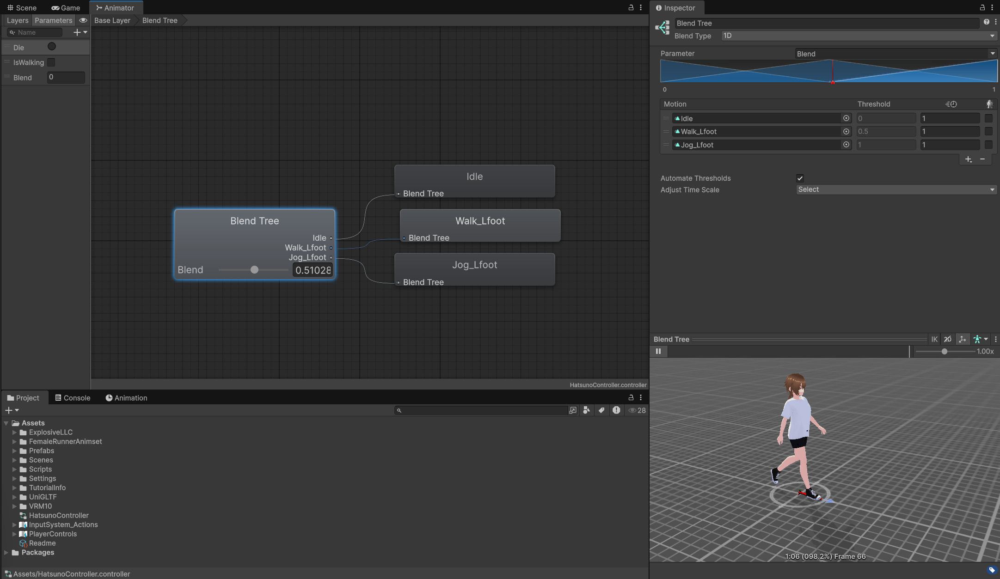

# Unity-核心-动画


## Animation 窗口
Animation 窗口是 Unity 中用于创建和编辑动画片段（`Animation Clip`）的工具。通过该窗口，你可以为对象添加关键帧，调整属性曲线，预览动画效果，实现角色、UI 或场景元素的动态表现。它支持逐帧编辑、曲线调整和事件插入，是动画工作流程的基础。


Animation 窗口提供了用于制作单个动画片段的功能，通常位于窗口左上角，功能从左到右分别是：
1. `Preview`：预览当前动画片段的效果。
2. 录制模式
3. 回到第一帧
4. 回到上一关键帧
5. 播放/暂停
6. 前进到下一关键帧
7. 回到最后一帧
8. 显示当前为第几帧

窗口右上角的三个点按钮可以进行更细腻的设置，如动画帧率。

窗口下方还有两个按钮：`DopeSheet`（关键帧模式） 和 `Curves`（曲线模式），用于编辑关键帧。

## 编辑关键帧
> 真正的动画一般都是美术同学制作，程序只要会简单的动画编辑（ex：位移）即可。

选择希望编辑的对象后，在 Animation 窗口中点击 `Create` 按钮为其创建一个新的动画片段，如果先前已经为该物体创建过动画，则点击左侧的动画片段下拉菜单点击 `Create New Clip` 创建新的动画片段。Unity 会自动为物体进行必要的设置：添加 `Animator` 组件，创建 `Animator Controller` 动画状态机并与 `Animator` 关联。

录制模式下，修改 Inspector 面板中物体的属性（如位置、旋转、缩放等），Unity 会自动为这些属性添加关键帧并创建过渡：


可以在 `Curves` 模式下修改关键帧的插值曲线，调整动画的缓动效果：


在 `Curves` 模式下可以直接拖动关键帧曲线的斜线来调整动画的插值效果，或者在关键帧上右键进行更细致的编辑：
| 切线模式 | 功能 |
| ---- | ---- |
| `Clamped Auto` | 自动插值，保持曲线平滑。 |
| `Auto` | 旧版自动插值，现在几乎不使用。 |
| `Free Smooth ` | 允许您自由地、手动地拖拽关键帧两侧的切线控制柄。 |
| `Flat` | 强制将关键帧两侧的切线都设置为完全水平。 |
| `Broken` | 允许独立地、分别地调整关键帧两侧的切线控制柄。 |

| 插值 | 功能 |
| ---- | ---- |
| `Free` | `Free Smooth` 和 `Broken` 模式的统称或前置状态。当您将一个关键帧的切线设置为 `Free` 时，意味着您放弃了自动计算（如 `Clamped Auto`），转为手动控制。 |
| `Linear` | 在两个关键帧之间创建一条笔直的线。 |
| `Constant` | 一个关键帧的值会保持不变，直到下一个关键帧的时刻，才瞬间跳转到新的值。|
| `Weighted` | 允许您在两个关键帧之间创建一个平滑的过渡，但与 `Free Smooth` 不同的是，它会考虑到关键帧的权重：可以将加权切线的控制柄“拉得更远”或“收得更近”。拉得越远，该切线对曲线形状的“引力”就越强，变化至该关键帧的视觉效果越快。|

## `Animation Clip` 文件
`Animation Clip` 储存了一个动画片段的所有信息。其中的属性大部分不用修改：
| 属性 | 功能 |
| ---- | ---- |
| `Loop Time` | 是否循环播放动画。 |
| `Loop Pose` | 循环播放后是否自动过度至起始状态。|
| `Cycle Offset` | 循环动画在开始播放时的延迟播放偏移量。|

在 Debug 面板（Inspector 右上角三个点按钮列表中开启）下，`Animation Clip` 文件的 Inspector 面板会显示更多信息，如 `Sample Rate` （每秒帧数）和 `Wrap Mode`（循环模式）等。

## 有限状态机
状态机（State Machine） 是一种将复杂行为分解为一系列独立、清晰的状态，并定义这些状态之间如何切换的设计模式。一个对象在任何特定时刻只能处于一种状态。

**状态机的三大核心要素**
1. **状态 (States)**

    代表一个对象在某个时刻所处的具体状况或行为。每个状态都是独立的。
2. **过渡 (Transitions)**

    连接两个状态的路径或规则，定义了从一个状态切换到另一个状态的可能性。

3. **条件 (Conditions) 或 事件 (Events)**

    触发过渡的具体原因。当某个条件满足时，状态机就会沿着预设的过渡路径切换到新的状态。

## `Animator Controller`

`Animator Controller` 是一个可视化的有限状态机 (FSM)，一个存在于您项目中的资产文件（以 `.controller` 为后缀）。它的核心作用是管理一个对象的所有动画片段（`Animation Clip`），并根据预设的逻辑和来自代码的指令，决定在何时播放哪个动画，以及动画之间如何过渡。

::: info `Animator Controller` 窗口

:::

**`Animator Controller` 的核心构成元素**

1. 状态 (States)

   状态是状态机的基本单元，表现为一个个彩色的方块。
   - 普通状态：通常直接关联一个 `Animation Clip`。当进入这个状态时，与之关联的动画片段就会播放。
   - 特殊状态节点：
      | 节点类型 | 功能 |
      | ---- | ---- |
      | <span class="badge badge--lime" data-appearance="subtle">Entry</span> | 状态机的起点。当游戏对象被激活时，会自动从 <span class="badge badge--lime" data-appearance="subtle">Entry</span> 节点通过一条过渡线进入<span class="badge badge--orange" data-appearance="subtle">默认状态</span>。 |
      | <span class="badge badge--red" data-appearance="subtle">Exit</span> | 当您希望状态机结束并停止时，可以创建一个到 <span class="badge badge--red" data-appearance="subtle">Exit</span> 节点的过渡。 |
      | <span class="badge badge--blue" data-appearance="subtle">Any State</span> | 一个特殊的“万能”起始点。从 <span class="badge badge--blue" data-appearance="subtle">Any State</span> 引出的过渡，意味着无论当前处于哪个状态，只要满足条件，都可以立即切换到目标状态。非常适合处理“死亡”、“受击”这类需要随时能触发的全局性动画。 |

   - Inspector 重要属性：
      | 属性 | 描述 |
      | ---- | ---- |
      | `Motion` | 关联的动画剪辑。 |
      | `Speed` | 动画播放速度。 | 
      | `Mirror` | 是否镜像播放动画。 |

      ::: details 相对重要较低的属性
      | 属性 | 描述 |
      | ---- | ---- |
      | `Tag` | 用于标记状态的自定义标签。 |
      | `Multiplier` | 额外的速度乘数，它的值会与上面的 `Speed` 值相乘。可以分配一个 `Animator Controller` 中的 `float` 参数。 |
      | `Motion Time` | 控制当前状态下的动画片段播放到的位置。可以分配一个 `Animator Controller` 中的 `float` 参数。 |
      | `Mirror` | 水平镜像播放。同样，可以由一个 `Bool` 类型的参数来动态控制。 |
      | `Cycle Offset` | 循环动画延迟播放的偏移量。可以分配一个 `Animator Controller` 中的 `float` 参数。 |
      | `Foot IK` | 通过 IK 在一定程度改善骨骼系统转化成肌肉系统后，脚步位置偏移产生的动画不自然。 |
      | `Write Defaults` | • 不勾选：当状态机离开这个状态时，属性的值会保持在它离开时的状态，直到有另一个动画状态来修改它。这是当前 Unity 推荐的做法。<br><br>• 勾选：当状态机离开这个状态时，所有被这个状态的动画修改过的属性都会被重置为它们在进入这个状态之前的默认值。但如果你有多个动画层，控制某个部位的动画可能会强制把其他骨骼重置回默认姿态，覆盖掉其他层的效果。 |
      :::

      ::: tip
      当你的动画逻辑表现得很奇怪，却又无从下手时，很有可能是 `Write Defaults` 属性导致的。这是一个默认开启的属性，你需要手动取消它。
      :::

   - 你可以为状态添加 [StateMachineBehaviour](#statemachinebehaviour) ，可以在状态的不同阶段执行代码。

2. 参数 (Parameters)

   参数是您用来从代码中控制状态机逻辑的变量，用于驱动状态过渡。在 Animator 窗口的左侧 Parameters 标签页中可以创建四种参数：
   - `Float`：浮点数类型的参数，通常用于控制动画的速度、强度等。
   - `Int`：整数类型的参数，常用于状态的切换、计数等。
   - `Bool`：布尔类型的参数，用于表示某个条件是否成立，常用于触发动画的开关。
   - `Trigger`：触发器类型的参数，用于一次性触发某个动画，类似于事件。一个 `Trigger` 最好只分配给一个过渡的 `Condition`，避免竞争问题。
   ::: details 为什么 `Float` 参数作为 Condition 时不能设置 `Equal`

   `Animator` 的浮点数（float）参数过渡条件里没有等于（Equal），这不是一个疏忽，而是有意为之的设计。主要有两个原因：
   1. 核心原因：浮点数的精度问题（Floating-Point Imprecision）

      计算机中，浮点数（float 或 double）的存储方式决定了它几乎不可能精确地表示所有小数。

      这和我们平时用的十进制小数类似。比如分数 1/3 写成十进制是 0.33333...，你永远无法精确地写完它。计算机在用二进制表示很多十进制小数时也会遇到同样的问题。
      - 一个你认为应该是 `0.1` 的值，在内存里可能存储为 `0.10000000149`。
      - 一个你认为应该是 `1.0` 的值，经过一些计算后可能变成 `0.99999999999`。

      因此，直接用 `==` 来判断两个浮点数是否相等是极其危险和不可靠的，它很大概率会失败。

   2. 设计哲学原因：状态与瞬时

      动画状态机（`Animator`）的设计初衷是管理状态和状态之间的切换。在游戏世界里，绝大多数的物理量和输入值都是连续变化的，而不是瞬时不变的。使用`Greater` 和 `Less` 定义一个范围，这远比一个几乎不可能达到的精确值要实用得多。

   为了防止开发者（特别是新手）掉进常见的编程陷阱，Unity 的工程师们干脆就在 `Animator` 的条件里移除了浮点数的等于”选项，强制你使用更可靠的 `Greater` 或 `Less`。
      
   :::

3. 过渡 (Transitions)

   过渡是连接两个状态的白色箭头，它定义了状态切换的规则和表现。选中一条过渡线，Inspector 中会显示其详细设置：
   | 属性 | 功能 |
   | ---- | ---- |
   | <span class="badge badge--white" data-appearance="subtle">All Transition</span> | |
   | `Solo`/`Mute` | 调试工具。勾选 `Mute` 后，这条过渡会暂时失效；如果一个状态有多条出路，当您勾选其中一条过渡的 `Solo` 后，其他所有从该状态出发的过渡都会被暂时静音。|
   | `Settings` | - |
   | `Has Exit Time` | 如果勾选：当前动画必须播放完毕（或播放到指定的 `Exit Time`），并且满足 `Conditions`，才会发生过渡。适用于需要完整播放的动画，比如一次完整的攻击动作。 <br> 如果取消勾选：只要 `Conditions` 满足，立即打断当前动画并开始过渡。适用于需要快速响应的动作，比如从“跑步”立即切换到“站立”。 |
   | `Exit Time` | 当 `Has Exit Time` 启用时生效。它是一个 0 到 1 之间的值，代表当前动画播放进度的百分比。例如，0.75 意味着当前动画必须播放到其总时长的 75% 之后，过渡才有可能被触发（如果 `Conditions` 也满足的话）。|
   | `Fixed Duration` | 如果勾选：`Transition Duration` (s) 的单位是秒。无论动画片段本身多长，过渡混合的时间都是一个固定的秒数。<br> 如果取消勾选：`Transition Duration` (s) 的单位是百分比。它的值（0到1）代表过渡时间占当前动画片段总时长的百分比。|
   | `Transition Duration` (过渡持续时间) | 两个动画相互混合、平滑过渡所花费的时间。|
   | `Transition Offset` (过渡偏移) | 决定了目标动画（即将要播放的那个动画）应该从哪个时间点开始播放。值为 0 到 1 之间的百分比。|
   | `Interruption Source` (中断源) | 这是处理“过渡被打断”情况的高级设置，决定了正在进行的过渡可以被哪种新过渡打断。<br> 1. `None`：当前过渡不可被打断。<br> 2. `Current State`：只有从当前状态出发的新过渡可以打断它。<br> 3. `Next State`：只有从目标状态出发的新过渡可以打断它。<br> 4. `Current State, then Next State`（或 `Next State, then Current State`）：定义了打断的检查顺序。|
   | `Ordered Interruption` (有序中断) | 只有当新过渡在 `Transitions` 列表中的顺序高于当前正在进行的过渡时，才允许中断发生。这为您提供了一种用排序来定义“打断优先级”的方法。|
   | `Conditions` | 触发这条过渡必须满足的条件列表。这些条件都基于您之前创建的参数。例如，`Speed Greater 0.1`。|
   | <span class="badge badge--blue" data-appearance="subtle">Any State</span>  |  |
   | `Can Transition To Self` | 是否可以过渡到自身 |
   |  `Preview source state` | 预览从不同状态过度到自身的动画效果。 |

4. 层 (Layers)

   动画层允许您在身体的不同部位同时播放不同的动画。

   工作方式：像 PhotoShop 的图层一样，上层动画可以覆盖下层动画。
   - `Weight` (权重)：可以设置每一层的权重（影响力），0 代表完全没影响，1 代表完全覆盖。可以通过代码设置权重：
      ```csharp
      int layerIndex = animator.GetLayerIndex("Shooting Layer");
      animator.SetLayerWeight(layerIndex, newWeight);
      ```
   - `Mask` (遮罩)：可以为每个层指定一个身体遮罩 (`Avatar Mask`)，指定这一层的动画只应该影响身体的哪些骨骼。
   ::: details 经典用例
   `Base Layer`  负责角色的移动（站立、行走、跑步）。

   创建一个新的 `Upper Body Layer`，设置其 `Mask` 为只影响角色的上半身骨骼。在这个层里放置“射击”、“挥手”等动画。

   这样，角色就可以在一边跑步的同时，一边进行射击。
   :::
   - `Blending` (混合模式)：这个下拉菜单决定了当前层的动画如何与它下面的图层相结合。
      - `Override` (覆盖模式)：使用自身动画的关键帧数据，去逐个添替换掉/添加到所有在它下方图层中、作用于同一个身体部位的动画数据，`Weight` 影响覆盖的强度。
      - `Additive` (叠加模式)：它不会替换下层动画，而是将当前层的动画效果叠加在下面图层的结果之上，同样受 `Weight` 控制影响。
      ::: details 示例
      底层 `Base Layer` 播放“举枪瞄准”的稳定动画。

      上层 `Recoil Layer` 设置为 `Additive` 模式，播放一个非常短暂的“枪械后坐力”动画（这个动画片段里，只有手臂和枪向上小幅度跳动的位移信息）。

      最终效果：角色在稳定瞄准的同时，每次开火，这个后坐力动画就会被叠加在瞄准动作之上，产生一个真实、可控的“上跳”效果，而不会破坏原有的瞄准姿势。另一个常见用途是叠加轻微的“呼吸”动画，让角色在站立或跑步时显得更生动。
      :::
   - `Sync` (同步)：这是一个极其强大的功能，用于跨层复用一整套状态机逻辑，避免重复搭建复杂的 `Animator Controller`。
      - 勾选 `Sync` 后，当前层会完全复制您指定的另一个层（源层，通常是 `Base Layer`）的状态机结构（包括所有状态、过渡和参数）。
      - 同步之后，您可以只替换其中某些状态所使用的 `Animation Clip`，而逻辑保持不变。
      ::: details 示例
      1. `Base Layer` 有一套完整的移动状态机（站立、走路、跑步）。
      2. 您想为角色增加“持剑”状态下的移动，动作和普通状态下完全不同。
      3. 您可以新建一个 `Sword Layer`，勾选 `Sync` 并选择 `Base Layer` 作为源。
      4. 现在 `Sword Layer` 拥有了和 `Base Layer` 一模一样的状态机。
      5. 您只需在 `Sword Layer` 中，将 `Walk` 状态的动画片段替换为 `Sword_Walk`，将 `Run` 状态的片段替换为 `Sword_Run` 即可。
      6. 在游戏中，当玩家拔出剑时，您用代码将 `Sword Layer` 的权重（`Weight`）从 0 调到 1，角色所有的移动动画就无缝切换到了持剑版本，而您完全不需要重新画一遍状态机的连线和逻辑。
      :::

   - `Timing` （计时）：只有当你勾选了它左边的 `Sync` 复选框后，`Timing` 才能被激活。`Timing` 决定了当前同步层（Synced Layer）的动画时长和过渡时间是否也需要和源层保持一致。`Timing` 会对动画加速或减速以匹配源层的节奏。
   - `IK Pass` (IK 通道)：IK 指的是反向动力学，是一种通过目标位置来反向计算骨骼链条如何旋转的技术。
      - 勾选 `IK Pass` 会在动画更新流程中开启一个 IK 计算通道。它会使 `Animator` 在处理完这一层的常规动画后，准备好执行额外的 IK 计算。
      - 真正的 IK 逻辑通常写在脚本的 `OnAnimatorIK()` 这个特殊回调函数里。您必须勾选 `IK Pass`，这个函数才会被调用。
      ::: details 示例
      **脚贴合不平整的地面**：角色的跑动动画是在平地上制作的，但游戏场景的地面凹凸不平。您可以开启 `IK Pass`，然后在 `OnAnimatorIK()` 中检测角色脚下地面的实际高度，通过代码（如 `animator.SetIKPosition`）强制将脚的骨骼“踩”在正确的地面位置上，避免穿模或悬空。

      **手握住动态物体**：角色需要握住车门把手、方向盘或者另一名角色的手。这些目标的位置是动态变化的。通过 IK，您可以让角色的手精确地“粘”在目标上，无论身体如何移动。
      :::


5. 混合树 (Blend Trees)
   
   这是一种特殊类型的状态，它本身不播放单一动画，而是根据一个或多个浮点数参数，平滑地混合多个动画片段。
   - 1D 混合树：根据一个参数混合。最经典的例子就是根据`Speed` 参数，平滑地混合 `Idle`、`Walk` 和 `Run` 三个动画。
   - 2D 混合树：根据两个参数混合。例如，根据`SpeedX` 和 `SpeedY` 两个参数，混合向前、向后、向左、向右跑的动画，实现360度的自由移动。

::: tip 构成元素命名方式推荐

行业没有绝对统一标准；核心是“整个项目内保持一致 + 一眼能读懂含义”。下表汇总常用、稳定且被社区/团队广泛采纳的约定：

| 构成元素 | 推荐命名风格 | 示例 |
|----------|--------------|------|
| 动画层 (Layers) | PascalCase 可含空格 | `Base Layer`, `Upper Body`, `Combat` |
| 状态 (States) | 简洁动词 / 名词；PascalCase | `Idle`, `Walk`, `JumpStart` | 
| 状态变体 (Variants) | 基础名 + 下划线 + 分类 + 序号 | `Attack_Sword_01`, `Attack_Sword_02` | 
| 参数 (Parameters) | camelCase | `speed`, `isGrounded`, `attack` |
:::

## `Animator`

`Animator` 组件是连接着动画逻辑蓝图（`Animator Controller`）、骨骼信息（`Avatar`）和游戏对象本身的桥梁。

**核心属性**
- `Controller`

   指定一个 `Animator Controller` 资产。

- `Avatar`

   这里需要指定一个 `Avatar` 资产，它定义了模型骨骼与 Mecanim 系统的映射关系。

   - 对于 Humanoid (人形) 动画，Avatar 是必需的，它使得动画可以被重定向（Retargeting）；对于 Generic (通用) 动画，Unity 也会为其生成 Avatar 来统一管理骨骼信息。

- `Apply Root Motion` 

   用于决定角色的位移是由动画本身还是由代码来控制。
   
   勾选时由动画驱动位移，如果动画本身包含向前的运动，那么角色在游戏世界里就会真的向前移动；不勾选时动画只在原地播放，需通过代码移动角色，这是更常见的做法。

- `Update Mode`

   决定 `Animator` 的更新时机，与游戏的哪个更新循环同步。
   - `Normal`：在常规的 `Update` 循环中更新，与游戏的渲染帧同步。这是默认和最常用的设置
   - `Animate Physics`：在物理 `FixedUpdate` 循环中更新。
   - `Unscaled Time`：动画的更新将忽略游戏的时间缩放 (`Time.timeScale`)。

- `Culling Mode` (剔除模式)

   一项重要的性能优化设置，用于决定当游戏对象在摄像机视野外时，`Animator` 是否播放动画。
   - `Always Animate`：始终播放动画，即使对象不可见。性能开销最大。
   - `Cull Update Transforms`：当对象不可见时，动画状态机仍在后台运行，但不会更新游戏对象的骨骼变换。当对象再次可见时，它会立即“跳”到正确的姿态。这是推荐的默认值，在性能和表现之间取得了很好的平衡。
   - `Cull Completely`：当对象不可见时，整个动画播放都会暂停。当它再次可见时，会从上次暂停的地方继续播放。


**核心 API**


最常用的一类 API 用于修改 `Animator Controller` 中创建的参数，从而驱动状态机发生过渡。此类 API 通常以“set + 数据类型”的方式命名，且需要传入一个和参数名相同的字符串和一个对应的数据值。例如：

```csharp
animator.SetFloat("<Condition Name>", floatValue)
animator.SetBool("<Condition Name>", boolValue)
animator.SetInteger("<Condition Name>", intValue)
animator.SetTrigger("<Condition Name>")
```

该类型的方法还有一个重载，主要用来平滑过渡混合树种的动画。

该方法需要设置一个 `dampTime` 指明需要完成过渡的时间（该属性是设置一个目标，不会重复设置导致用于无法到达目标），并传入一个 'deltaTime' 来确保帧数无关。

使用该方法时，你需要在每帧调用，例如：
```csharp
void Update()
{
   // 0.1f 是一个可选的平滑时间
   animator.SetFloat("<Condition Name>", conditionThreshold, 0.1f, Time.deltaTime)
}
```


此外还可以不通过 `Conditions` 直接播放动画片段，不过这不是推荐的做法：
```csharp
animator.Play("<State Name>", layerIndex, normalizedStartTime);

animator.CrossFade("<State Name>", transitionDuration);
```

::: details 魔法字符串
直接在代码中反复使用字符串（“魔法字符串” - Magic Strings）来设置变量存在很多隐患，健壮性不强。为了解决这个问题，Unity 提供了一个官方推荐的、更健壮、性能更高的方法：`Animator.StringToHash()`。

这个方法的作用是将一个字符串参数名预先转换成一个独一无二的整数 ID。之后，您在调用 `SetFloat` 等方法时，直接传入这个整数 ID 即可。由于整数的比较和传递远比字符串要快，并且我们将字符串的定义集中在了一个地方，代码的健壮性和性能都得到了极大的提升。

**示例**

对于大型项目，为了方便在多个不同脚本中访问这些参数 ID，最佳实践是创建一个专门的静态类来统一管理它们：
```csharp
// 创建一个新脚本 AnimParams.cs
public static class AnimParams
{
    public static readonly int Speed = Animator.StringToHash("Speed");
    public static readonly int IsJumping = Animator.StringToHash("IsJumping");
    public static readonly int Attack = Animator.StringToHash("Attack");
    // ... 在这里添加所有其他参数
}

// 在您的玩家控制脚本中这样使用：
public class PlayerController_Best : MonoBehaviour
{
    private Animator animator;

    void Awake() { animator = GetComponent<Animator>(); }

    void Update()
    {
        // 直接引用静态类，有代码提示，绝不会拼错
        animator.SetFloat(AnimParams.Speed, Input.GetAxis("Vertical"));
        
        if (Input.GetButtonDown("Fire1"))
            animator.SetTrigger(AnimParams.Attack);
    }
}
```
:::

## 2D 序列帧动画
这是最传统、最经典的 2D 动画技术，原理就像手翻书。

**制作流程**
1. 准备精灵图集 (`Sprite Sheet`)：将一个动画的所有帧绘制在一张大图上。
2. 切割精灵：在 Unity 中选中该图片，在 Inspector 中将 `Texture Type` 设为 `Sprite (2D and UI)`，`Sprite Mode` 设为 `Multiple`。然后点击 `Sprite Editor` 按钮。
3. 在 Sprite Editor 窗口中，使用 `Slice` 工具（例如 `Grid By Cell Size`）将大图自动切割成一个个独立的 `Sprite`。
4. 创建动画片段：
   - 在场景中创建一个空对象或一个 `Sprite` 对象。
   - 打开 Animation 窗口（Window > Animation > Animation）。
   - 选中刚刚切割好的所有 `Sprite` 帧，将它们一次性拖拽到 Animation 窗口的时间轴上。
   - Unity 会自动创建一个 `Animation Clip`，并为 `Sprite Renderer` 组件的 `Sprite` 属性在时间轴上创建好所有关键帧。


对于现代 2D 游戏开发，尤其是制作角色和生物动画，2D 骨骼动画是绝对的主流和推荐方案。序列帧动画则更多地用在需要独特艺术风格、UI 元素或特效的场合。

## 2D 骨骼动画

2D 骨骼动画就是一种用虚拟的骨头驱动 2D 图片部件来制作动画的技术。它结合了传统 2D 美术的视觉表现力和类似 3D 骨骼动画的制作效率与控制方式，是现代 2D 动画（尤其是游戏开发）中非常流行和实用的技术。

这套系统主要由以下几个核心部分组成：
- **美术资源 (Sprite)**

   这就是你看到的角色图片。通常，你会把角色的不同部分（如头、躯干、上臂、下臂、手）画在同一张图上，或者分为不同的图层。

- **骨骼 (Bones)**

   一套看不见的、有关节的骨架。你在角色的图片上创建并放置这些骨骼，形成一个父子层级关系（例如，肩部骨骼是上臂骨骼的父级，移动肩膀时，胳膊会跟着动）。

- **网格 (Mesh)**

   为了让图片能像皮肤一样随着骨骼平滑地变形，Unity 会自动或手动地在你的 2D 图片上生成一个三角面片构成的网格。

- **权重 (Weights)**

   这是最关键的一步，也称为刷权重或蒙皮（Skinning）。它定义了图片网格上的每一个顶点受哪些骨骼的影响以及影响的程度。例如，肘部的顶点会同时受到上臂骨骼和下臂骨骼的影响，这样在弯曲手臂时，肘部才能产生平滑自然的形变，而不是生硬的折断。

通过只改变骨骼的位置（Position）、旋转（Rotation）和缩放（Scale），就能驱动整个角色的网格变形，从而创建出走路、跑步、攻击等各种动画。

在 Unity 中制作 2D 骨骼动画，主要依赖一个官方包：`2D Animation`。

::: details 2D骨骼动画是性能换内存吗？

**并非。**

内存与瓶颈转移：双重优化，非等价交换
骨骼动画不仅内存占用通常更低（存储部件纹理+轻量骨骼/动画数据 <<< 海量序列帧纹理），其本质是将性能瓶颈从致命的 DC（CPU 提交）转移到高效的 GPU 顶点蒙皮计算。现代GPU对这类计算优化极好，且可通过控制网格复杂度进一步优化，整体性能（尤其关键场景）反而提升。

性能换内存是对技术原理的误读——骨骼动画在动态角色场景下往往同时实现更低内存占用和更高渲染效率。其真正的代价是增加了GPU顶点计算（可控优化），但这与“交换”无关。

:::

## `2D Animation`

`2D Animation`包是一个强大的内置工具集，能让你直接在 Unity 编辑器中为 2D 精灵（`Sprite`）创建骨骼、添加蒙皮权重并制作复杂的骨骼动画。

为了使图片能够动起来，基本需要3个步骤：

**添加骨骼**    ➡    **绑定网格**    ➡    **刷权重**

如此以来，您就可以通过动画操作角色骨骼来制作各种动画了。

这3个步骤主要通过 `Sprite Editor` 中的 `Skinning Editor` 来完成。

#### `Skinning Editor` 

`Skinning Editor` 是 `2D Animation` 包中的核心工具之一。它的主要用作将角色图片（Skin）与骨骼（Bones）进行绑定，并调整当骨骼活动时，图片应该如何自然地变形。

窗口右侧包含了制作骨骼，网格和权重的全部工具。

如果是 PSB 资源，上方还会出现 `Sprite Sheet` 按钮。


**Pose**

这个区域主要用于在不创建实际动画的情况下，快速预览和测试你的骨骼绑定效果。
| 工具 | 效果 | 详细描述 |
| ---- | ---- | ---- |
| `Preview Pose` | 预览姿势 | 该模式下你可以在编辑器里直接拖动骨骼，来观察角色的皮肤（网格）是否会跟随骨骼产生理想的形变，且该模式的修改不会保存。 |
| `Restore Pose` | 恢复姿势 | 如果你在预览模式下调整了骨骼，点击此按钮可以将所有骨骼瞬间恢复到它们最初的、未经改动的绑定姿势（Bind Pose）。 |

**Bones**

这个区域用于创建和编辑构成角色骨架的骨骼。
| 工具 | 效果 | 详细描述 |
| ---- | ---- | ---- |
| `Edit Bone` | 编辑骨骼 | 允许你选择、移动、旋转或拉伸已经存在的骨骼。 |
| `Create Bone` | 创建骨骼 | 你可以在图片上点击并拖拽，来创建父子关系的骨骼链（比如从肩膀到手肘，再到手腕）。 |
| `Split Bone` | 分割骨骼 | 将一根选中的骨骼从中间断开，变成两根。这在你需要增加一个新关节（比如在小臂中间增加一个可以弯曲的节点）时非常有用。 |

**Geometry**

这个区域负责管理图片的网格（Mesh）。所谓的网格，就是你看到的图片上那个橙色的、由许多小三角形组成的轮廓。Unity 不是直接让图片变形，而是让这个网格变形，图片则像贴图一样附着在网格上。
| 工具 | 效果 | 详细描述 |
| ---- | ---- | ---- |
| `Auto Geometry` | 自动生成几何体 | 让 Unity 自动分析图片轮廓，并为你生成一套初始的网格。自动生成的网格是一个很好的起点。 |
| `Edit Geometry` | 编辑几何体 | 手动模式，允许你直接拖动网格的顶点（Vertex）来改变网格形状。 |
| `Create Vertex` | 创建顶点 | 在网格上添加新的顶点，以获得更精细的变形控制。 |
| `Create Edge` | 创建边 | 连接两个顶点，形成一条新的边，从而构成新的三角形面片。 |
| `Split Edge` | 分割边 | 在一条已有的边上增加一个顶点，将其一分为二。 |

**Weights**

这是整个绑定过程中最关键也最需要技巧的一步。“权重”决定了每一个网格顶点在多大程度上受到每一根骨骼的影响。

| 工具 | 效果 | 详细描述 |
| ---- | ---- | ---- |
| `Auto Weights` | 自动计算权重 | 会根据每个顶点离不同骨骼的远近，来分配影响权重。自动权重的计算通常在自动生成网格时就已经执行。 |
| `Weight Slider` | 权重滑块 | 选中一块骨骼或者顶点，可以修改其权重值与受到影响的权重；也可修改特定骨骼对于特定边的权重。 |
| `Weight Brush` | 权重笔刷 | 你可以选择一根骨骼，然后像画画一样，用笔刷在网格上涂抹这根骨骼的影响力。可以调整笔刷的大小、硬度等属性。 |
| `Bone Influence` | 骨骼影响检查 | 选中一个或多个顶点后，这里会列出所有对它们有影响的骨骼以及具体的权重值。 |
| `Sprite Influence` | 精灵影响检查 | 在处理由多个精灵组成的复杂角色时，用来查看是哪个精灵的网格顶点（不常用）。 |

**Rig**

提供复制黏贴功能，是用于工作成果。
- `Copy Rig` (复制绑定): 复制当前精灵上所有的骨骼、网格和权重信息。
- `Paste Rig` (粘贴绑定): 将复制好的绑定信息，粘贴到另一个精灵上。如果你有多个外观相似但颜色不同的敌人，只需为一个制作好绑定，然后就可以将这套设置一键复制给所有其他敌人，极大提升效率。

::: details 常见问题

**Bone 的 `Depth` 的作用**
- 简单来说，`Depth` 用来决定骨骼的渲染层级顺序，也就是哪根骨骼及其关联的皮肤应该显示在更前面，哪个应该在更后面。

**`Auto Geometry` 参数**
- `Outline Detail`：这个滑块控制生成的网格轮廓与图片实际边缘的贴合紧密程度。
- `Alpha Tolerance` (Alpha 透明度容差)：这个值决定了引擎在确定图片边缘时，应该在多大程度上“容忍”半透明的像素。
- `Subdivide` (细分)：这个滑块用于增加网格内部的顶点密度，它不影响轮廓形状。

**权重的 `Normalized` (归一化)**
- `Normalized` 是一个复选框，通常默认勾选。它的作用是强制让每一个网格顶点上，所有骨骼影响权重的总和永远等于 100% (或 1.0)。

**`Weight Brush/Slider` 的三种 `Mode`**
- `AddAndSubtract`（加/减模式）：直接增加你当前所选骨骼的权重值。按住 Shift 键则变为减少当前骨骼的权重。
- `GrowAndShrink`（增长/缩减模式）：在已有的权重区域边缘进行扩张或收缩。它会自动将边界向外推或向内拉。
- `Smooth`（平滑模式）：它不增加也不减少权重，而是将你涂抹区域内不同骨骼的权重进行混合和平均化，让权重过渡变得平滑。

:::

#### 单图动画

单图的绑定流程非常简单，可以直接在图片上绘制骨骼。遵循流程即可完成绑定：

**添加骨骼**    ➡    **绑定网格**    ➡    **刷权重** 

在绑定后，将图片添加到场景中（`Sprite Render`），并为其添加组件 `Sprite Skin`。`Sprite Skin` 组件能够根据绑定数据生成骨骼以供操作。接下来在 `Animation` 窗口修改骨骼属性即可制作动画。

如果在 Scene 窗口中没有显示骨骼，需要开启 Gizmos。

#### 图集动画

图集的绑定流程会略显复杂。我们通过一个例子来说明：

假设有一个起始资源是一个名为 `character_parts_atlas.png`，上面零散地分布着角色的头、身体、四肢等部件。

1. 切割图集

   必须先设置图里的哪一块是头、哪一块是手臂。

   - 将 `character_parts_atlas.png` 拖入 Project 窗口。
   - 在 Inspector 中，设置 `Texture Type` 为 `Sprite (2D and UI)`，`Sprite Mode` 为 `Multiple`。
   - 打开 Sprite Editor 进行切片，然后在 Sprite 详情面板中为它起一个有意义的名字，例如 `Head`, `Torso`, `Arm_Upper_L`。

2. 创建统一骨架
   - 在编辑器的主窗口中，无视部件的零散分布，然后在各个身体零件绘制出完整的骨骼结构。
   - 从根骨骼（如 `Pelvis`）开始，创建出完整的层级（`Pelvis` -> `Spine` -> `Chest` -> `Shoulder_L` -> `Arm_Upper_L` ...）。记得为骨骼命名。

3. 为每个零件进行蒙皮和权重设置

   这是将零件和骨架关联起来的核心步骤。你需要在同一个 Skinning Editor 窗口中，为每个零件分别进行设置，迭代完成 蒙皮 -> 关联骨骼 -> 分配权重 的循环：
   - 选择一个零件，从下拉菜单中选择一个零件，为这个零件点击 `Auto Geometry` 生成网格，并按需优化。
   - 在 `Weight`s 面板中，找到 `Bone Influence` 列表。点击 + 号，从骨骼列表中选择所有应该会影响到这个零件的骨骼。例如，对于左上臂，你应该至少添加 `Arm_Upper_L` 和 `Shoulder_L` 这两根骨骼。
   - 为这一个零件计算权重。然后，使用 `Weight Brush` 等工具进行微调。

将你在上一步中绑定好的资源文件，从 Project 窗口直接拖拽到 Scene 场景中。Unity 会自动为你生成一个包含所有部件、骨骼以及一个包含`Sprite Skin` 组件的游戏对象。接下来就可以在和单图一样创建动画。

#### `PSB`

::: details `PSB` 和 `PSD` 
`PSD` 和 `PSB` 都是 Adobe Photoshop 的原生文件格式，它们是专业数字图像编辑领域的基石。其核心价值在于完整地记录了创作过程中的每一个可编辑细节，而不仅仅是最终的图像结果。

`PSB` 格式在功能上与 `PSD` 完全相同，它存在的唯一目的就是打破 `PSD` 的尺寸（30,000 x 30,000）和容量限制（2 GB），以应对超大规模的图像处理需求。

Unity 官方推荐使用 `PSB` 格式。
:::
   

使用 `PSB` 文件需要导入 `2D PSD Importer` 包。

操作方式类似多图。


## Spine

Spine 是一款强大的骨骼动画制作软件，在游戏开发中被广泛使用。Spine 动画通常由美术人员负责，此处仅介绍如何在 Unity 中使用 Spine 动画。

首先需要从官网下载并导入运行库：[spine-unity](https://zh.esotericsoftware.com/spine-unity-download/)

Spine 导出的资源由3个文件组成：
1. `.json` / `.bytes` 存储骨骼信息和动画数据
2. `.png` 图片图集
3. `atlas.txt` 图片在图集中的位置信息

`spine-unity` 运行时在检测到 Spine 资产添加后会自动生成 Unity 所需的资产文件：
1. 一个代表 `texture atlas`文件（`.atlas.txt`）的 `_Atlas` 资产文件。它包含对 material（材质）和 `.atlas.txt` 文件的引用。
2. 一个代表各 `texture atlas`页（`.png`）的 `_Material` 资产文件。它包含对着色器和 `.png` texture 的引用。
3. 一个存储了 skeleton 数据（`.json`, `.skel.bytes`）的 `_SkeletonData` 资产文件。它包含了对 `.json` 或 `.skel.bytes` 文件的引用以及对自动生成的 _Atlas 资产的引用。

使用 Spine 资产

将 `_SkeletonData` 资产拖拽到 Hierarchy 中，Unity 会自动创建一个 `GameObject`，并添加 `SkeletonAnimation` 组件。

拖入时会产生3个选项：
- `SkeletonAnimation` 使用 Spine 脚本控制
- `SkeletonGraphic(UI)` 在 UI 中使用
- `SkeletonMecanim` 使用 `Animator` 控制（如果你熟悉该组件，推荐）

#### Skeleton Data 资产

Skeleton data 资产(名字后缀为 `_SkeletonData`) 存储了 skeleton 的层次结构、槽位、绘制顺序、动画和其他构成 skeleton 的数据信息。spine-unity 运行的其他组件也将会引用并共享 skeleton data 资产, 以显示 skeleton 并播放其动画。 

::: details Inspector 窗口

:::

Skeleton data 资产核心属性：

| 属性 | 说明 |
| ---- | ---- |
| `Skeleton JSON` | 引用 `.json` / `.skel.bytes` 骨骼与动画数据。 |
| `Scale` | 全局缩放倍率（导入后统一调整尺寸）。 |
| `Atlas` | 图集资源引用（纹理布局 + 材质）。 |

**Mix Settings（混合设置）**

| 项 | 说明 | 典型用途 |
| ---- | ---- | ---- |
| `Animation State Data` | 状态混合配置容器。 | 存储多对动画的过渡时长。 |
| `Default Mix Duration` | 未显式指定时使用的默认混合时长。 | 快速获得统一过渡手感。 |
| `Add Custom Mix` | 为 A→B 指定专属混合时长。 | 精细化调优特殊动作（如 Idle→Attack）。 |

**Preview（预览）**

| 控件 | 功能 | 备注 |
| ---- | ---- | ---- |
| `Animation` | 选择并播放动画。 | 便于逐帧审查。 |
| `Set Pose` | 重置到默认绑定姿势。 | 清除当前预览偏移。 |
| `Slot` | 预览指定插槽的显示与替换。 | 一个插槽可包含多张图片。 |


::: details 其余参数

- `Skeleton Data Modifiers`：骨骼数据修改器。
- `Blend Mode Material`：混合模式材质。
- `Apply Additive Material`：是否使用叠加材质。
- `Multiply Material`：相乘材质。
- `Screen Material`：屏幕材质。
- `Create Animation Reference Assets`：创建动画参考资产。
- `SkeletonMecanim`：骨骼机制。可以关联 Unity 的 Animator Controller（非必须）。
:::

#### `Skeleton Animation` 组件

`Skeleton Animation` 组件是控制 Spine 骨骼动画的核心组件。它负责驱动动画状态（如播放、循环、混合等），管理动画间的过渡逻辑，并更新骨骼层级数据。通常与 `SkeletonRenderer` 协同工作（后者负责实际渲染），共同实现动画的播放与可视化效果。

属性说明：
- `SkeletonData Assets`：管理的骨骼动画信息。
- `Initial Skin`：初始蒙皮。
- `Animation Name`：当前想要播放的动画。
- `Loop`：是否循环动画。
- `Time Scale`：播放速度。
- `Root Motion`：如果你的 Spine 动画包含了根骨骼的平移、旋转或缩放，并且你希望这些运动能够影响到整个 `GameObject`，你可以使用 `Root Motion` 功能。

`Advanced` 属性一般不用修改，详可参考官方文档：[Skeleton Animation](https://zh.esotericsoftware.com/spine-unity-main-components#SkeletonAnimation%E7%BB%84%E4%BB%B6)

`Advanced` 属性里的 Debug 选项可以用于调试。

#### 代码控制

**动画播放**

想要控制动画首先要获取 `SkeletonAnimation` 组件的引用。例如：
```csharp
_skeletonAnimation = GetComponent<SkeletonAnimation>();
```

可以通过直接修改组件属性来播放动画：
```csharp
// --- 顺序不可变，否 _skeletonAnimation.loop 的设置不会成功 --- 
_skeletonAnimation.loop = false;
_skeletonAnimation.AnimationName = "main";
```

更通用的播放方法是通过方法 `SetAnimation()`，方法签名是：
```csharp
SetAnimation(int trackIndex, string animationName, bool loop)
```
参数说明：
- `trackIndex`：动画轨道索引。Spine 支持多轨道播放动画，比如在 `track 0` 上播放走路动画，在 `track 1` 上播放挥手动画。通常，主动画（如走路、跳跃）使用 `track 0`。
- `animationName`：动画的名称。
- `loop`：是否循环播放。

代码示例:
```csharp
_skeletonAnimation.AnimationState.SetAnimation(0, "main", true);
```

如果播放的动画不希望立刻打断当前动画，而是排在后面，可以使用 `AddAnimation()` 方法。该方法所需前三个参数与 `SetAnimation()` 
完全相同，还需要一个额外的参数用于延迟播放 - `float offset`。

代码示例：
```csharp
skeletonAnimation.AnimationState.AddAnimation(0, "blink", false, 0);
```

**转向**

通过修改属性 `ScaleX` 实现转向，例如：
```csharp
_skeletonAnimation.skeleton.ScaleX = -1;
```

**常用事件**

`Start`：可以向动画开始播放的时候注册事件，其中事件参数 `TrackEntry entry` 包含了正在播放的动画的所有信息：
```csharp
_skeletonAnimation.state.Start += entry 
   => print(_skeletonAnimation.AnimationName);
```


`Complete`：当一个动画在某个轨道上播放完成时会触发 `Complete` 事件。示例：
```csharp
skeletonAnimation.state.Complete += entry 
   => print(_skeletonAnimation.AnimationName)
```
::: tip
注意：循环动画永远不会触发 `Complete` 事件，除非你手动停止它。
::: 

`End`：会在一个动画在轨道上被清除、被新动画替换或播放完成时触发。与 `Complete` 的区别在于 `End` 在动画因任何原因停止时都会触发（播完了、被别的动画打断了等）。例如：
```csharp
skeletonAnimation.state.end += entry 
   => print(_skeletonAnimation.AnimationName)
```

**自定义事件**

当动画播放到你在 Spine 编辑器中手动设置的事件关键帧（Event Keyframe）时触发。这是最灵活、最强大的一个事件。

事件参数：
- `TrackEntry`：正在播放的动画信息。
- `Spine.Event`：你在 Spine 编辑器中设置的那个事件对象，包含了事件名、整数、浮点数和字符串等自定义数据。

代码示例：
```csharp {8-9}
public class SpineEventExample : MonoBehaviour
{
   // 骨骼动画组件
   [SerializeField] public SkeletonAnimation skeletonAnimation;

   private void Start()
   {
      // 订阅Event事件
      skeletonAnimation.state.Event += HandleCustomEvent;
   }

   private void HandleCustomEvent(TrackEntry trackEntry, Spine.Event e)
   {
      // 通过事件名字 (e.Data.Name) 来判断是哪个自定义事件
      Debug.Log($"在动画 '{trackEntry.Animation.Name}' 中触发了自定义事件: {e.Data.Name}");

      if (e.Data.Name == "footstep")
      {
         Debug.Log("播放脚步声！");
         // 调用音效播放函数
      }
      else if (e.Data.Name == "hit")
      {
         Debug.Log("攻击帧到达！进行伤害判定！");
         // 调用伤害判定的函数
      }
   }
}
```

::: tip
`TrackEntry` 代表了当前正在某个轨道（Track）上播放的这一个动画实例。。你可以把这个对象看作是你对那个正在播放的动画的一个句柄。

`TrackEntry` 对象暴露了很多有用的属性和事件，让你可以进行精细化的控制。以下是一些最常用的功能：
- `entry.Loop (bool)`：控制这个动画是否循环播放。
   ```csharp
   TrackEntry entry = skeletonAnimation.state.SetAnimation(0, "attack", false);
   if (someCondition) 
      entry.Loop = true; // 将其改为循环播放
   ```
- `entry.TimeScale (float)`：控制这个动画实例的播放速度。
   ```csharp
   TrackEntry entry = skeletonAnimation.state.SetAnimation(0, "run", true);
   // 进入慢动作模式
   entry.TimeScale = 0.5f;
   ```
- `entry.Delay (float)`：设置或获取动画开始播放前的延迟时间（秒）。
   ```csharp
   // 播放攻击动画，但在0.2秒后才开始
   TrackEntry entry = skeletonAnimation.state.SetAnimation(0, "attack", false);
   entry.Delay = 0.2f;
   ```
- `entry.TrackTime (float)`：获取或设置动画当前的播放时间。你可以用它来跳转 到动画的特定帧。
   ```csharp
   // 跳转到动画的1秒处
   entry.TrackTime = 1.0f; 
   ```
- `entry.Alpha (float)`：控制动画的透明度，用于实现淡入淡出效果。

- `entry.Animation.Name (string)`：获取当前播放的动画的名称。
- `entry.Animation.Duration (float)`：获取动画的总时长。

我们之前讨论过全局监听 `skeletonAnimation.state` 的事件，比如 `Start`、`Complete` 等。但有时你只想监听某一次特定播放的事件，`TrackEntry` 就可以做到。例如：
```csharp
// 播放一个一次性的 "special_attack" 动画
TrackEntry specialAttackEntry = skeletonAnimation.state.SetAnimation(0, "special_attack", false);

// 只为这一次的播放订阅Complete事件
specialAttackEntry.Complete += OnSpecialAttackFinished;

// 事件处理函数
private void OnSpecialAttackFinished(TrackEntry trackEntry)
{
    Debug.Log("特殊攻击动画播放完毕！");
    // 做一些特殊处理，比如角色解除无敌状态

    // 重要：为了防止内存泄漏，处理完后要取消订阅
    trackEntry.Complete -= OnSpecialAttackFinished;
}
```
这种方式比全局监听更精确，逻辑也更清晰。

:::

**常用特性**
- `[SpineAnimation]`：当你把它用在一个 `string` 类型的公开变量上时，它会在 Unity 的 Inspector 面板中，把这个变量的输入框变成一个下拉列表。这个列表会自动填充关联的 `SkeletonDataAsset` 中所有可用的动画名称。

   例如：
   ```csharp
   public class AnimationSelector : MonoBehaviour
   {
       [SpineAnimation] public string animationName;
   }
   ```
   
   效果：
   

- `[SpineBone]`：将 Inspector 面板中的一个 `string` 变量，变成一个可以选择骨骼（Bone）名称的下拉菜单。
   ::: tip
   在 `Advance` 的 `Debug` 里勾选 `Show Bone Names` 可以方便地观察骨骼名称。
   :::

- `[SpineSlot]`：将 Inspector 面板中的一个 `string` 变量，变成一个可以选择插槽（Slot）名称的下拉菜单。
   ::: details 插槽

   插槽像一个装备栏，每个插槽都附着在某个骨骼上。

   插槽本身是不可见的，它是一个容器，用来装载附件（Attachment），而附件才是我们能看到的图片。

   插槽还控制着绘制顺序，决定了哪些图片在上层，哪些在下层。

   例如，一个角色可能有一个 `eyes` 插槽，这个插槽里可以轮流显示 `eyes-open`（睁眼）附件和 `eyes-closed`（闭眼）附件。它也可能有一个 `weapon` 插槽，里面可以显示 `sword`（剑）附件，也可以显示 `axe`（斧子）附件，或者什么都不显示。

   :::

- `[SpineAttachment]`：将 Inspector 面板中的一个 `string` 变量，变成一个可以选择附件（Attachment）名称的下拉菜单。它通常需要依赖于一个指定的插槽（Slot）。

**获取骨骼**

`FindBone()` 通过骨骼的名字（字符串），在骨架（Skeleton）中找到并返回对应的那个骨骼对象（Spine.Bone）。例如：
```csharp
Bone eyesBone = skeleton.FindBone("eyes");
```

可以通过修改 `Bone` 对象的属性来控制骨骼的位置、旋转和缩放。例如：
```csharp
eyesBone.X = 100; 
eyesBone.Y = 200; 
eyesBone.Rotation = 45; 
eyesBone.ScaleX = 1.5f;
eyesBone.ScaleY = 1.5f; 
```

**设置插槽**


`SetAttachment` 能够在指定的插槽（Slot）中，设置并显示一个指定的附件（Attachment）。例如：
```csharp
skeleton.SetAttachment(slotName, attachmentName);
```
> 也可以通过插槽实现换装的功能。

## 2D 中的 IK


**什么是 FK (Forward Kinematics)**

要理解 IK，最快的方法是先理解它的反面FK (Forward Kinematics - 正向动力学)。

它像一个纯粹的父子关系链条。为了让手移动到某个位置，你必须：

1. 先旋转肩膀。

2. 然后旋转手肘。

3. 最后再旋转手腕。

特点：运动和控制是从根部（如肩膀）开始，逐级传递到末端（如手）的。你通过设定每一个关节的角度来决定最终末端的位置。

**什么是 IK (Inverse Kinematics)**

IK 则完全反过来。你不再关心中间的关节要转多少度，而是直接告诉系统：我希望手移动到这个杯子的位置上。然后，系统会自动为你计算出为了让手到达那里，手腕、手肘和肩膀应该各自旋转多少度。

#### 2D IK 包

`2D IK` 包是 Unity 提供的一个官方工具包，它让您能够在您已经创建好的 2D 骨骼上，轻松地应用和管理 IK 系统。现已经被完全整合进 `2D Animation` 包。

它的核心作用就是提供一系列的组件（Components）和解算器（Solvers），让你把 FK 骨骼变成由 IK 控制的智能骨骼链。

假设您已经有了一个绑定好的角色，现在想为他的手臂添加 IK 控制：

1. 添加 IK Manager:

   首先，在您角色 Prefab 的根对象上，添加一个 `IK Manager 2D` 组件。这个组件是该角色所有 IK 系统的总管理者。

2. 创建 IK Solver:

   在 `IK Manager 2D` 组件中，点击 `+`，你会看到一个解算器列表。对于手臂或腿，最常用的是 `Limb`（肢体）解算器，会自动生成长度为 2 的骨骼链。

3. 设置 `Limb` 解算器:

   | 字段 | 作用 |
   | ---- | ---- |
   | `Effector`（效应器） | 将骨骼链的最后一根骨骼（如 `Hand`）拖拽到此字段，这是你直接控制的“末端”。 |
   | `Target` | 新建一个空物体（如 `IK_Target`）并放到你希望末端到达的位置；将其拖入该字段，后续可用脚本驱动。 |
   | `Create Target` | 可直接点击该按钮，Unity 会自动创建并关联目标物体。 |
   | `Flip` | 若关节弯曲方向不正确，勾选以反转弯曲方向。 |


`2D IK Manager` 提供了三种 solver：
::: tip
Inspector 中的大部分参数“了解即可”，按需调整关键项即可上手。
:::

- <span class="badge badge--green" data-appearance="subtle">Limb</span>

   2D IK 中最常用的解算器。它的效率极高，专门用于解决像手臂和腿这样的简单“两段式”或“三段式”肢体链条。

   | 选项 | 说明 |
   | ---- | ---- |
   | `Constrain Rotation` | 约束旋转。 |
   | `Solve from Default Pose` | 从默认姿势求解计算。 |
   | `Flip` | 使肢体关节向反方向弯曲。 |
   | `Weight` | 控制该角色身上所有 IK 解算器的全局权重。`1`代表 IK 完全生效，骨骼会尽力到达目标点；`0` IK 完全失效，骨骼会恢复到其原始动画或绑定姿势；`0.5` IK 效果和原始姿势各占一半。|

- <span class="badge badge--blue" data-appearance="subtle">Chain（CCD）</span> / <span class="badge badge--purple" data-appearance="subtle">Chain（FABRIK）</span>

   更通用、更灵活的解算器，特别适合处理长链条。

   它采用一种迭代（iteration）的方式。在一个循环中，它先从末端（Effector）开始，逐个关节地将链条拉向目标位置；然后再从根部开始，将链条拉回原始位置，同时保持末端尽可能靠近目标。这个过程会重复多次，来寻找一个优解。
   
   - CCD 运动和弯曲更集中于靠近链条末端（Effector）的关节，根部的关节会相对懒惰，动得更少。这会产生一种类似挥鞭子的效果。

   - FABRIK 的运动和弯曲会更均匀地分布在整个链条的每一个关节上。这使得它的动作看起来通常更像一条自然的绳索或尾巴。

   | 选项 | 说明 |
   | ---- | ---- |
   | `Chain Length`| 定义 IK 链的骨骼数量。 |
   | `Iterations` | 定义上述“前伸-回拉”的计算循环在一帧内执行的次数。|
   | `Tolerance`（容差） | 定义 Effector 与 Target 间距离小于该阈值时视为到达目标，并停止当帧迭代。|

## 2D 换肤

无论是把换肤资源放在同一个 `PSB` 文件里，还是拆分成多个文件，整体思路是一致的。

- 导入设置：若是单个 `PSB` 文件且换肤图层为隐藏，请在导入时勾选 `Include Hidden Layers`。
- 资源管理：使用资产 `Sprite Library Asset` 管理换肤映射。它支持“继承”，便于基于基础皮肤快速派生变体。

| 术语 | 作用 |
| ---- | ---- |
| `Sprite Library Asset` | 资产库。定义 `Category`/`Label` 到具体 `Sprite` 的映射关系。|
| `Sprite Library` | 组件。挂在角色根对象上，引用一个 `Sprite Library Asset`。|
| `Sprite Resolver` | 组件。挂在具体部位（如 `Head`），选择要使用的 `Category`/`Label`。|

::: tip
实现换装需要多个换肤资源之间的骨骼信息一致（同一套骨架/权重绑定）。
:::

**步骤 1：创建主库** 

创建一个 `Sprite Library Asset` 作为主库（父级）。将基础换肤资源（如 `Default_Skin.psb`）拖入该库中，库会根据图层信息自动生成对应的 `Category` 与 `Label`。

提示：`Category` 是分类（如头部、身体、手臂），`Label` 是具体选项（如 头盔 1、头盔 2）。

**步骤 2：创建子库（继承主库）**

右键点击主库（父级）文件 -> Create -> Sprite Library Variant。这样做会自动创建子库并为你链接好 `Main Library`。要覆盖的内容在 `Inherited` 标签页直接替换图片即可；也可在子库中新增自己的 `Category`/`Label`，新增项会出现在 `Local` 标签下。

**步骤 3：配置 Prefab 绑定**

为角色创建 `Prefab`，在根对象添加 `Sprite Library` 组件，并将主库（如 `Default_Skin`）赋给其 `Sprite Library Asset` 字段，作为默认皮肤。

在需要可替换的部位子对象（如 `Head`）添加 `Sprite Resolver` 组件，设置其 `Category` 与 `Label`，即可正确显示皮肤下的图片。此时也可以修改同一 `Category` 下切换不同 `Label` 的图片，例如：

```csharp
// 1. 找到角色头部游戏对象上的 SpriteResolver 组件
SpriteResolver headResolver = character.transform.Find("Head").GetComponent<SpriteResolver>();

// 2. 更改它的 Category 和 Label
//    告诉它去“头盔槽”(Headgear)这个分类里，找到“铁盔”(IronHelmet)这个标签对应的 Sprite
headResolver.SetCategoryAndLabel("Headgear", "IronHelmet"); 
```

**步骤 4：整体换肤（运行时/编辑器）**

直接切换 `Sprite Library` 的 `spriteLibraryAsset` 即可实现整套皮肤的切换：

```csharp
spriteLibrary.spriteLibraryAsset = aNewSkinAsset;
```

## 导入模型

对 Unity 开发者来说，最核心、最常用的格式是 FBX 和越来越流行的 glTF。这里仅介绍 FBX 导入。

::: details 模型的基本制作过程

3D模型的制作通常包括以下几个主要步骤：

1. **建模**  
   使用三角面片组合，像捏泥人一样拼装出模型的形状。

2. **展UV**  
   UV 是纹理贴图坐标的简称，具有U轴和V轴，类似于三维坐标系的XYZ轴。纹理坐标中的每一个点都和 3D 模型上的位置信息是相互联系的。展 UI 就像是将 3D 模型的表面“拆开”成一张 2D 图片上，方便后续贴图。
   > 如果对具体内容很感兴趣的，可以观看[【Kurt】Blender零基础入门教程 | Blender中文区新手必刷教程(已完结)](https://www.bilibili.com/video/BV14u41147YH/?spm_id_from=333.337.search-card.all.click&vd_source=b3c97e3d2220b29b554866d21d02bd09)

3. **材质和纹理贴图**  
   - **纹理**：一张 2D 图片，包含颜色、细节等信息。
   - **贴图**：通过 UV 坐标将纹理映射到 3D 模型表面。
   - **纹理贴图**：为模型提供颜色、细节、UV 等信息。
   - **材质**：决定模型的表现效果——结合纹理贴图和着色器算法，可呈现金属、塑料、玻璃等不同效果。

4. **骨骼绑定**  
   为模型添加骨骼结构，定义骨骼控制哪些网格区域，实现后续动画控制。

5. **动画制作**  
   利用骨骼的旋转、移动等操作，在时间轴上制作关键帧，通过插值规则让模型在关键帧之间平滑过渡，最终形成完整的动画效果。

:::

#### Model 选项卡

详细内容可参阅官方文档：[Model 选项卡](https://docs.unity.cn/cn/2023.2/Manual/FBXImporter-Model.html)


**Scene**
- `Scale Factor`：当模型中的比例不符合项目预期时，可以修改此值改变模型的全局比例。
- `Preserve Hierarchy`：始终创建一个显示预制体根。如果不启用此选项，无法正常导入只包含骨骼动画的模型。

**Meshes**
- `Mesh Compression`：压缩网格。
- `Read / Write Enabled`：启用或禁用对网格的读写访问。开启时，CPU 会将网格数据传给 GPU 后仍保留可寻址内存，意味着可以对网格数据进行处理。开启会增加内存占用。

**Geometry**
- `Weld Vertices`：合并共享相同属性的节点。

#### Rig 选项卡

Rig 选项卡主要是用于设置如何将骨骼映射到导入模型的网格。以便能够使其动画化。对于人形角色，需要分配或创建 Avater（替身信息），对于非人形角色模型，需要在骨骼中确定根骨骼。

简单来说，Rig 选项卡主要是设置骨骼和替身系统相关信息的。


`Animation Type` 定义的动画类型说明：
- `None`：不存在动画。
- `Humanoid`：人形。人形模型需要使用 Avater 系统绑定人主要关节的映射关系。
- `Generic`：通用。
- `Legacy`：旧版（Unity 3.x）动画系统。

人形动画类型属性说明：
- `Avater Definition`：选取获取 Avatar 定义的位置。
   - `No Avater`：没有 Avater 信息。
   - `Create From This Model`：从当前模型创建 Avater 信息。选择 `Configure` 打开配置。
   - `Copy From Other Avater`：从其他模型复制 Avater 信息。可选择 `Source`。

- `Skin Weights`：设置影响单个顶点的最大骨骼数量。
- `Optimize Game Objects`：在 Avater 系统和 `Animator` 组件中删除和存储所导入角色的游戏对象骨骼层级信息。如果启用会出现下方 `Extra Transforms To Expose` 选项。角色将使用 Unity 动画系统的内部骨架。
- `Extra Transforms To Expose`：要公开的骨骼层级。

通用模型额外属性 `Root Node `：选择用于此 Avatar 的根节点的骨骼。`Humanoid` 中臀部（Hips）是隐式的根。

不再赘述 `Legacy` 动画类型。

#### Animation 选项卡

专门用于动画文件的设置。对于模型来说通常无需修改。

#### Material 选项卡

这个标签页的核心作用是决定 Unity 如何处理和创建你在 3D 建模软件（如 Blender, Maya）中为模型设置的材质和贴图。


属性说明：
- `Material Creation Mode`

   决定如何处理模型材质。
   - `Import via MaterialDescription`：这是目前 Unity 推荐的默认方式。它会读取 `.fbx` 文件中包含的材质信息然后在 Unity 内部为你自动创建一个新的 Unity 材质。
   - `Standard (Legacy)`：这是旧版本的导入方式。功能上和上面的选项类似，但它使用的材质属性映射规则比较老。
   - `None`：忽略模型文件中所有的材质信息。当你把这个模型拖到场景里时，它很可能会显示为刺眼的粉红色或品红色。

- `Location`
   
   决定了材质要从哪里来，或者存到哪里去。

   - `Use Embedded Materials`：根据模型信息创建的临时材质，在资产内部生成对应的 `Material` 子资产。这个选项不会修改原 `.fbx` 文件（毕竟是只读的）。
   - `Use External Materials (Legacy)`：把根据模型信息创建的临时材质，储存在外部文件中。

- `Extract Textures` & `Extract Materials`

   在 `Use Embedded Materials` 模式下的选项。导出所有材质和纹理。如果无材质和纹理则显示为灰色。

- `Naming` / `Search`

   在 `Use External Materials (Legacy)` 模式下的选项。用于定于导入材质的命名规则和查找材质的位置。

**Asset PostProcessors 资产后处理器**

这个功能是一个面向程序员的高级自动化脚本功能。

它不是一个让你在这里点击设置的选项，而是一个代码钩子（Code Hook）。它允许你编写 C# 脚本，在 Unity 导入任何资产（模型、贴图、音频等）的前、中、后阶段，自动执行你写的代码，来检查甚至修改这些资产的导入设置。

使用资产后处理器，你需要创建一个 C# 脚本，让它继承自 `AssetPostprocessor` 类，然后实现特定的函数，例如：
- `void OnPreprocessModel()`：在模型导入之前执行。
- `void OnPostprocessModel(GameObject model)`：在模型导入之后执行。
- `void OnPreprocessTexture()`：在贴图导入之前执行。

## Avatar 系统

Avatar 系统是其动画系统的核心部分，它将动画数据（Animation Clip）与具体的模型解耦，是骨骼结构和肌肉系统这两种概念的结合体。

这个系统的存在，最主要的目的就是为了实现动画重定向 （Animation Retargeting）。简单来说，就是让一套动画可以被无数个不同体型、不同比例的人形角色复用。

可以遵从以下步骤创建 Avatar：
1. 当你将一个带有骨骼的角色模型（比如 `.fbx` 或 `.blend` 文件）导入到 Unity 中时，选中这个模型文件，在 Inspector 窗口中会看到一个 Rig 标签页。
2. 当你 `Animation Type` 选择 `Humanoid` 后，Unity 会尝试自动分析你模型的骨骼，并将它们映射到一个标准的、内部定义的人形骨架上。
3. 你可以点击 `Configure` 按钮进入 Avatar 配置界面。在这里，你会看到一个绿色的人形骨架图。Unity 会将模型的骨骼（例如 `Bip001_L_UpperArm`）拖拽到对应的槽位上（例如 `Left Upper Arm`）。大部分情况下 Unity 的自动映射是准确的，但有时需要你手动进行修正。
4. 配置完成并点击 Done 后，Unity 会在你的模型文件旁边（或作为其子资产）生成一个新的资产，图标是一个小人，它就是包含了骨骼映射关系的 Avatar。

使用 Avatar：
1. 将你的角色模型拖到场景中。
2. 给这个角色对象添加一个 `Animator` 组件。
3. 在 `Animator` 组件中，有一个 `Avatar` 属性。把你刚刚为这个模型生成的那个 Avatar 资产拖进去。
4. 再将你的动画逻辑（Animator Controller）赋给 `Animator` 组件的 `Controller` 属性。

Muscles & Settings：
- Muscles Group Preview：肌肉群预览。
- Pre-Muscle Settings：肌肉设置，用于设置骨骼在旋转时的限制范围。

::: details Additional Settings

可以在 Additional Settings 中设置手脚的扭转和伸展值。其中 `Translation DoF` 比较重要。默认情况下，Unity 的人形动画重定向系统（就是 Avatar 发挥作用的地方）为了达到最高的兼容性和性能，做了一个简化：它假设所有骨骼的动画都只通过旋转（Rotation）来实现。比如，当一个角色抬起手臂时，系统只关心肩关节旋转了多少度、肘关节旋转了多少度。它不关心骨骼本身有没有发生位置移动（Translation）。这个简化在 95% 的情况下都是非常有效的，因为绝大多数标准的人类动作（跑、跳、走、挥拳）都可以纯粹通过骨骼的旋转来表现。

当你勾选 `Translation DoF` 后，你就告诉 Unity：在处理这个动画时，除了骨骼的旋转，请一并考虑并应用某些特定骨骼的位移信息。有些特殊的、更具表现力的动画（尤其是在卡通或风格化的动画中）会包含骨骼的位移，最经典的例子就是耸肩动作。

:::

## 包含动画的模型

一个 `.fbx` 文件可以包含：
- 一个静态模型（只有网格、材质）
- 一个模型 + 一个/多个动画（比如一个角色和待机、走路、跑步、跳跃等多个动画）
- 一个/多个动画

通常来说，角色的模型和动画会分别储存在不同的文件中，以便动画的复用。

Animation 选项卡是 Unity 的模型导入器的一部分。它的主要功能是：定义和配置此 3D 模型文件中所包含的动画数据。

**导入选项**

重要选项：
- `Import Constraints`：导入约束。

   - 在3D建模软件（如Maya, Blender）中，动画师可能会使用约束（Constraints）来制作动画，比如IK（反向动力学）约束、目标约束（让一个物体始终朝向另一个）等。勾选此项后，Unity 会尝试将这些约束关系也一并导入，并在运行时进行计算。这通常需要配合 Unity 的 `Animation Rigging` 包来使用。
   - 通常保持不勾选，因为大部分游戏动画在导出时已经烘焙好了。

- `Import Animation`：从这个模型文件中读取和导入动画数据。如果你的模型文件（例如一个FBX）包含了动画，你就必须勾选它。

- `Import Animated Custom Properties`：允许你导入在3D软件中为模型或材质制作的自定义属性动画。

   - 例如，动画师可以在 Maya 里直接为角色眼睛的材质制作一个发光强度的动画（比如从0变到1）。勾选此项后，Unity 就能读取这个发光强度的动画曲线，让你在游戏里实现角色出招时眼睛发光的效果，而无需写代码控制。
   - 当你不需要这类高级效果时，可以忽略它。


- `Anim Compression`：导入动画时使用的压缩类型。
   - `Off`：禁用。再导入时不会减少关键帧数量，效果好性能低，文件大内存占用也大，通常不建议。
   - `Keyframe Reduction`：减少冗余关键帧。仅适用于 `Generic` 动画类型。
   - `Optimal`：推荐的默认选项。 Unity会自动分析动画曲线，智能地选择最佳的压缩方式（关键帧削减或其他算法），在保证质量和减小体积之间取得一个很好的平衡。
   - `Rotation / Position / Scale Error`：设置压缩旋转/位置/缩放的容错度。

其余选项：
- `Bake Animations`：通过反向动力学或模拟创建动画以便推进运动关键帧，仅适用于 Maya、3Dmax 和 Cinema4D 文件。

**动画选择列表**

一个 `.fbx` 可能包含多个动画剪辑。可以在 Clips 列表中新增，删除，预览或编辑对应的动画剪辑。


此处的 `Start` 和 `End` 属性标记了动画的起始和结束时间。

## 模型动画

动画剪辑本质上是一个数据容器，它里面存储了大量的曲线（Curves），每一条曲线都描述了一个属性随时间变化的过程。

获得动画主要有两种方式：
1. 从外部3D模型文件导入（最常见）
2. 在 Unity 中直接创建和编辑

此处聚焦于第一种方式。


**`Loop Time`**

勾选则动画循环播放。
- `Loop Pose`：自动匹配为无缝循环播放。
- `Loop Match`：无缝循环播放自动匹配程度。绿灯代表能很好匹配。
- `Cycle Offset`：除第一次循环，播放的周期偏移量。

**Root Transform Rotation**

控制角色旋转的根运动。

- `Bake Into Pose`：从动画中提取出根骨骼的旋转变化，并将其应用到游戏对象的`Transform` 上。
- `Based Upon`：计算旋转时的参考系或基准。
   - `Original`：使用动画文件中存储的原始旋转数据。这是最常用、最直观的选项。
   - `Body Orientation`：仅适用于人形（Humanoid）角色。Unity 会根据角色的上下半身朝向，计算出一个平均的、更稳定的朝向。
   - `Root Node Rotation`：仅适用于通用（Generic）角色。使用在 Avatar 中被指定为根节点的那个骨骼的朝向作为基准。
- `Offset`：额外增加一个固定的旋转角度。

::: info 根运动 Root Motion

想象一下角色跑步：

- 方法 A（无根运动）：动画本身是原地跑步，像在跑步机上一样。角色的位置是由代码（比如 `transform.position += ...`）来控制和移动的。动画只负责播放腿部动作。

- 方法 B（有根运动）：动画本身就带有向前移动的信息。美术师在3D软件里制作动画时，角色的根骨骼（Root Bone）真的向前移动了。Unity 会提取这个移动信息，并用它来驱动游戏世界中整个角色游戏对象（`GameObject`）的移动。代码只需要负责播放跑步动画，而不需要负责向前移动这个行为。

根运动就是方法 B，即由动画剪辑来驱动游戏对象的位移和旋转。

:::

**Root Transform Position (Y)**

控制角色在垂直方向的运动。
- `Bake Into Pose`：提取动画中根骨骼在 Y 轴上的位移，并应用到游戏对象的 `Transform` 上。
- `Based Upon (at Start)`：决定了计算 Y 轴位置的参考基准。
   - `Original`：直接使用动画文件中的原始 Y 轴坐标。
   - `Feet`：仅适用于人形（Humanoid）角色。这是一个非常有用的选项，它会以最低的那只脚的 Y 坐标作为基准点（Y = 0），确保脚底板始终紧贴着 Y = 0 的平面。
   - `Root Node Position`：仅适用于通用（Generic）角色。使用 Avatar 中指定的根节点的 Y 坐标作为基准。
- `Offset`：额外增加一个固定的垂直高度偏移。

**Root Transform Position (XZ)**

控制的是角色在水平面（XZ平面）上的运动。
- `Bake Into Pos`：提取动画中根骨骼在 XZ 平面上的位移，并应用到游戏对象的 `Transform` 上。
   ::: info
   勾选此项可以完美解决角色移动时最常见的问题——脚底打滑(Foot Sliding)。
   :::

-  `Based Upon (At Start)`：决定了计算 XZ 轴位置的参考基准。
   - `Original`：直接使用动画文件中的原始 XZ 坐标。这是最标准、最常用的选项。它意味着完全相信并采用动画师制作的位移。
   - `Center Of Mass`：仅适用于人形（Humanoid）角色。使用角色的重心（Center Of Mass）作为基准点。
   - `Root Node Position`：仅适用于通用（Generic）角色。使用 Avatar 中指定的根节点的 XZ 坐标作为基准。

**相对不重要的参数**
- `Mirror`：左右镜像反转。仅适用于人形（Humanoid）角色。
- `Additive Reference Pose`：将动画剪辑当作附加动画来处理。通过属性 `Pose Frame` 设置参考帧。

**Curves**

Curves 允许你在动画剪辑中嵌入自定义的浮点数 （`float`）数据，然后通过代码读取这些数据，从而实现动画与游戏逻辑的同步。实际开发中 Curves 的使用频率会少于 Events，不过我认为都不如状态机行为脚本好用。

使用 Curves：
1. 点击 + 添加曲线：为其取个合适的名字，之后会通过代码的方式通过这个名字获取对应的值。
2. 编辑曲线：添加后，你会看到一行新的曲线数据，右边有一个小小的曲线预览图。点击这个预览图，Unity 会打开 Curve Editor (曲线编辑器) 窗口。在这个窗口里，你可以自由地设计你的数据曲线。
3. 在 `Animator Controller` 中创建参数：打开你的角色的 `Animator Controller`，在 Parameters 标签页中，创建一个与你在 Curves 里创建的曲线名字完全一致新的 `float` 参数。Unity 会自动关联曲线与 `Animator Controller` 当中的参数。


**Events**

Events 功能可以在动画时间轴的某个精确时间点上，调用对应的函数。~~但我感觉 Events 的功能被状态机行为脚本完爆了。~~

对应在 Animation 窗口创建的动画，可以直接在该窗口中添加事件，但对于只读的 `.fbx` 文件，需要在 Inspector 面板添加事件。

点击 + 可以添加事件。在事件触发时会 Unity 会在挂在动画的游戏对象上寻找具有同名函数的脚本并调用，若不存在对于函数则报错。

可以在下方列表中设定函数接受的参数类型。


**Mask**

Mask（遮罩）是一个用于实现动画分层（Animation Layering）的核心功能。利用遮罩可以实现诸如下半身走路上半身攻击的组合动作。

由于此属性只作用于单个动画片段，使用 Animator 里的 Layers 进行批量遮罩通常效果更好，而且还实现了解耦。

::: details Mask（遮罩）
**核心思想：规定动画的“管辖范围”**

想象一下画画时用的遮罩胶带或模板：
- 你先在画布上画了一个完整的背景（比如一个正在跑步的人）。
- 然后，你拿一个只露出上半身的模板盖在画上。
- 接着，你在这个模板上画画（比如让角色的手臂挥舞）。
- 完成之后，你拿开模板，就会看到一个“下半身在跑步，上半身在挥手”的最终效果。

Unity 中的 `Avatar Mask` 就是这个“模板”。它让你能够精确地规定：这个动画剪辑，只允许控制角色的哪些骨骼（身体部位）。

:::

- `Definition`

   这里有三个选项来决定你如何应用遮罩：
   - `Create From This Model`：直接在这个界面上，为当前这个动画剪辑创建一个内嵌的、一次性的遮罩。
   - `Copy From Other Mask`：使用一个已经存在的、独立的 `Avatar Mask` 资产。
   - `None`：默认选项，表示不使用任何遮罩。这个动画剪辑会尝试控制它所包含的所有骨骼动画数据。

- `Humanoid`

   编辑人形角色的遮罩的图形化界面工具。可以选择控制哪些身体部位的动画，哪些不控制。双脚下方的圆为根节点。

- `Transform`

   通用的遮罩编辑工具。可以细致地控制每个骨骼的动画，适用于各种类型的角色。


**Motion**

当导入的动画包含根运动时，手动设置根节点。通常无需更改。

- `<None>`：选择此项会完全禁用根运动。
- `<Root Transform>`：这会使用模型本身的最顶层级的 `Transform` 作为根运动的来源。
- `root`（或者列表里的其他骨骼名）：这会使用你指定的特定骨骼作为根运动的来源。这是最常用的选项。

::: info
这里的 root node 不会与模型的 Avatar 当中的冲突。Avatar 当中根节点用于定义骨架的结构，此处的根节点用于定义根运动的来源。

运动来源带动整个物体的移动，骨架本身的根节点核心作用是定义角色结构。
:::

**Import Messages**

导入动画时出现黄色警告，可以勾选此选项查看问题的具体信息。

**动画预览窗口**

在动画预览窗口提供了一些方便的工具帮助实时查看动画效果。

- IK 选项：观察 IK（如果有的话）。
- 2D 选项：启用 2D 视图模式。
- 箭头：显示轴心和质心辅助图标。
- <span class="badge badge--blue" data-appearance="subtle">人形图标</span>：可以替换预览模型。但更常用的替换方法是直接把模型拖入预览窗口。

下方蓝色书签标可以给资产分类方便管理，`AssetBundle` 与资产管理的 AB 包相关。


使用导入的 3D 动画，通常遵循一个清晰的流程：导入模型与动画 -> 配置动画片段 -> 创建并设置动画控制器 -> 在代码中控制动画播放。

## 动画混合

动画混合（Animation Blending）的作用是在两个或多个不同的动画片段之间，创造出平滑、自然的过渡，避免动作的生硬跳变。

如果没有动画混合，当你的角色从站立（Idle）状态切换到跑步（Run）状态时，他会瞬间从一个静止的姿势一下变成一个正在迈腿的姿势。这会显得非常机械、不自然。有了动画混合，角色会用一小段时间从站立姿势平滑地过渡到跑步姿势。你会看到他的身体慢慢倾斜，手臂开始摆动，腿部逐渐迈开——这是一个符合物理和生物规律的、非常流畅的过程。

动画混合的原理其实就是插值（Interpolation）。在一个混合过程中，Unity 会对角色骨架上的每一根骨骼进行计算：
1. 获取骨骼在动画A中的位置和旋转。
2. 获取同一根骨骼在动画 B 中的位置和旋转。
3. 根据混合的进度（比如，进度为30%），计算出一个介于A和B之间的中间状态。最终姿态 = (A 姿态 * 70%) + (B 姿态 * 30%)。
4. 随着混合进度的推进，权重会从100%的 A 姿态，平滑地过渡到100%的 B 姿态。

除了动画过渡以外，在 Unity 中动画混合通常通过混合树（Blend Tree）来实现。这是更高级、更强大的混合工具。它允许你在一个状态内，根据一个或多个参数，实时、连续地混合多个动画。

在 Animator 窗口右键点击，选择 Create State -> From New Blend Tree 即可创建一个混合树，你可以像处理一个 State 一样对待混合树。双击混合树即进行编辑：


## 1D 混合树

1D 混合树（1D Blend Tree）是最简单、最常用的一种混合树。它只使用一个浮点数参数来控制动画的混合。典型的例子就是通过速度（`speed`）参数来混合站立、走路和跑步。

工作原理：你设定一个参数（比如 `float speed`）。然后，你添加多个动画片段，并为每个动画片段设定一个变化的阈值（Threshold）。当你的 `speed` 参数值变化时，Unity 会根据当前值在这些阈值之间进行插值计算，来决定每个动画的播放权重。

在 Unity 创建的混合树默认就是 1D 的。在 Inspector 面板中，你可以修改混合树的名称，类型等属性：


使用 1D 混合树，需要在 `Motion` 列表添加想要混合的动画（ex：`Idle`，`Walk`，`Jog`）或其它混合树，此外需要一个控制动画混合的参数。在创建混合树的时候，Unity 会自动生成一个为该 1D 混合树使用的浮点类型参数（默认名为 `Blend`）。你可以在预览窗口（蓝色矩形）里拖动红色竖线调整参数以预览动画。



`Motion` 列表属性：
- `Motion`：单个动画片段或混合树。
- `Threshold`：对于动画的临界阈值。参数越靠近该值，动画的影响越大。
- 时钟标志🕔：播放速度。
- 人形标志🤸：镜像动画。

::: tip
可以将播放速度设置为负数实现倒放。
:::

其他属性：
- `Automate Thresholds`：自动将所有动画的阈值在列表中均匀地分布。开启该选项后不能再手动调整阈值。
- `Compute Thresholds`：这是一个下拉菜单，提供了另一种自动计算阈值的方式。它通常是基于每个动画片段根运动的平均速度来计算阈值。
   - 例如，如果你的 `Walk` 动画的平均速度是 1.5 米/秒，`Run` 动画是 3.5 米/秒，选择 `Speed` 选项后，Unity 会自动将它们的阈值设置为 `1.5` 和 `3.5`。通常不做调整。
- `Adjust Time Scale`：根据根运动自动调整动画片段的播放速度。通常不做调整，或者与 `Compute Thresholds` 配合使用。
   - `Homogeneous Speed`：匀速。让混合出的动画的表观速度与参数所代表的速度保持一致。
   - `Reset Time Scale`：重置时间缩放。

## 2D 混合树

2D 混合树（2D Blend Tree）允许你使用两个浮点数参数来混合多个动画片段。通过两个参数的组合，Unity 可以混合出向前、向后、向左、向右、向前偏右、向后偏左等所有方向的移动动画。

> 推荐视频: 
> 1, [Unity 2D Simple Directional混合树（2D Blend Tree）详解](https://www.bilibili.com/video/BV1YB4y1Q7fP)
> 2. [Unity 2D Freeform Cartesian混合树（2D Blend Tree）的权重分配原理](https://www.bilibili.com/video/BV1Gv4y1g7ko)

   

Unity 中创建 2D 混合树主要有三种类型可选：
- `2D Simple Directional`

   2D 简单定向。性能较好，但不允许用一个方向上有多个动画片段。适用于所有动画都代表不同方向但速度大小相同的运动。

   树中位于原点的动画片段至关重要，其会影响动画片段的混合计算。

   1. **有中心动画片段**

      Unity 会根据红点（采样点）的位置，选择原点和附近的两个动画片点段（范例点）围成一个三角形，再根据红点在三角形种的位置反推出各个动画片段的权重。这个过程会遍历所有的范例点。

   2. **无中心动画片段**

      Unity 会假设中心存在一个原点，采用与前者相同的三角形加权中心算法，再将原点的权重平分给每一个范例动画。

- `2D Freeform Cartesian`

   2D 自由格式笛卡尔坐标，采用梯度带算法。相比 `2D Simple Directional` 树可以在同一方向上添加多个动画，但在实际应用中存在一定问题，例如：
   
   假设我们拥有一个向右跑和向右前方跑的具体动画，当采样点落在这个两个具体动画的范例点之间时，我们肯定希望只有奔跑动画影响采样点，然而实际中还会受到走路/慢跑范例点的影响。
   
   因此，当我们需要制作一个包含各个方向的行走和奔跑动画的时候，`2D Freeform Cartesian` 就无法满足需求。

- `2D Freeform Directional`

   `2D Freeform Cartesian` 的升级版，极坐标系下的梯度带算法（O(n)），更消耗性能。非常适合制作从静止到行走/跑步的全向移动。


Motion 列表下方还提供了两个用于自动调整 Motion 属性的选项：

`Compute Positions`

该选项会依据根动运动信息，自动计算出一套方案分布范例点。
- `Velocity XZ` 和 `Speed And Angular Speed ` 都会同时设置 x 轴和 y 轴
- `X Position From >` 和 `Y Position From >` 允许分别为 X 轴和 Y 轴手动选择一个数据源


`Adjust Time Scale`

依据根动运动信息，自动计算所有动画的平均速度，并调整每个动画的播放速度(Speed比值)，使它们的最终运动速率趋于一致。

## Direct 混合树

Direct 混合树允许你为列表中的每一个动画片段（Motion）都指定一个独立的浮点数参数，这个参数的值直接决定了该动画在最终混合结果中的权重。

简单来说：一个参数控制一个动画的混合权重。

该功能使用较少，可以用于表情的混合。

## 子状态机

在 `Animator Controller` 中，当你开始为角色添加各种动画状态时，状态和它们之间的连线（过渡）会很快变得非常多，最终形成一张错综复杂、难以管理的网络。

子状态机（Sub-State Machine）就像一个文件夹或一个类（class），它允许你将一组相关的动画状态封装到一个独立的、可折叠的单元中，从而让主状态图保持整洁。

**使用子状态机**

在 Animator 窗口的空白处右键，选择 Create Sub-State Machine，这会创建一个六边形的子状态机节点。双击该节点，就可以进入它的编辑视图。

子状态机编辑视图和主状态机很像，意味着你也可以像编辑父级状态机一样去编辑子状态机。这个视图有一个额外的特殊节点：<span class="badge badge--orange" data-appearance="subtle">(Up) Base Layer</span>


<span class="badge badge--orange" data-appearance="subtle">(Up) Base Layer</span> 节点专门用来处理子状态机的回到父状态机的退出。当你将一个状态节点连接到 <span class="badge badge--orange" data-appearance="subtle">(Up) Base Layer</span> 时，你可以选择回到父状态机的状态，通常由两个选项：
- `State`：回到父状态机的某个指定的状态。
- `StateMachine`：回到父状态机，将从 <span class="badge badge--lime" data-appearance="subtle">Entry</span> 节点开始播放。

::: tip
你在父状态机里为子状态机连的退出过渡线不会有效果，必须通过上述方法，在子状态机里的 <span class="badge badge--orange" data-appearance="subtle">(Up) Base Layer</span> 指定退出 `State`。
:::

需要注意的是，子状态机里 <span class="badge badge--red" data-appearance="subtle">Exit</span> 节点也会直接让整个 `Animator Controller` 停止工作。

## 3D 中的 IK

反向动力学（IK）是一种由果推因的动画技术：你只需要指定骨骼链末端的目标位置，系统就会自动计算出上级骨骼需要旋转的角度来达成这个姿态。

在 Unity 中，实现 IK 控制最直接的方式是利用 `Animator` 组件内置的 IK 功能，该系统主要针对 Humanoid 骨架。

**使用 IK**

使用 IK，首先对象必须有 `Animator` 组件，并且勾选了 Animator 窗口对应层的 `IK Pass` 选项打开了 IK 通道，以通知 Unity 需要进行额外的 IK 计算。

然后我们需要创建一个 C# 脚本来编写 IK 的逻辑。

在你的角色 `GameObject` 上（也就是带有 `Animator` 组件的那个对象），创建一个新的 `MonoBehaviour` 脚本，可以命名为 `CharacterIKController`。

打开这个脚本，我们将使用一个 Unity 的特殊回调函数：`OnAnimatorIK(int layerIndex)`。这个函数继承自 `MonoBehaviour` 中，会在每一帧处理完标准动画（`Update()`）之后、在（`LateUpdate()`）之前被调用，专门用于处理 IK。

控制 IK 的 API 基本上是成对或者成组配合使用的，可以视作控制权重和设置目标两个步骤。

**用于头部朝向的 API**

控制权重：

```csharp
animator.SetLookAtWeight(
   float weight,
   float bodyWeight,
   float headWeight,
   float eyesWeight,
   float clampWeight);
```

这个函数用来设置 Look At 效果中各个身体部分的权重（影响力）。所有权重值的范围都是 0.0 到 1.0。

| 参数 | 说明 |
| ---- | ---- |
| `weight` | 总权重，总开关。0 关闭所有 Look At，1 完全启用。 |
| `bodyWeight` | 身体权重，胸/上半身朝向参与度。1 扭转明显，0 基本不动。 |
| `headWeight` | 头部权重，头部朝向参与度。常设 0.9~1.0。 |
| `eyesWeight` | 眼睛权重，若模型有独立眼球骨骼则可转动；多数模型可设 0。 |
| `clampWeight` | 限制系数，防止过度扭曲。0 不限制，1 最强限制，常用 0.5。 |


设置目标：

直接设置角色要看向的目标点的世界坐标 ⬇
```csharp
animator.SetLookAtPosition(Vector3 lookAtPosition);
```

**用于手脚（Limbs）的 API**

控制权重：

```csharp
animator.SetIKPositionWeight(AvatarIKGoal goal, float weight)
```
该方法用于设置指定肢体（手或脚）的位置 IK 的权重。

`AvatarIKGoal goal` 是一个枚举，用来指定你要控制的身体部位。常用的值有：
- `AvatarIKGoal.LeftHand`
- `AvatarIKGoal.RightHand`
- `AvatarIKGoal.LeftFoot`
- `AvatarIKGoal.RightFoot`

`float weight`代表权重，范围0 ~ 1。1表示该肢体的末端位置完全由 IK 控制；0表示完全由原始动画控制。

```csharp
animator.SetIKRotationWeight(AvatarIKGoal goal, float weight)
```

与上面类似，但这个是用来设置指定肢体的旋转 IK 的权重。
设置目标：

```csharp
animator.SetIKPosition(AvatarIKGoal goal, Vector3 goalPosition)
```

设置指定肢体的 IK 目标位置（世界坐标）。
- `AvatarIKGoal goal`：指定要控制的手或脚。
- `Vector3 goalPosition`：你希望这只手或脚到达的世界空间坐标。

```csharp
animator.SetIKRotation(AvatarIKGoal goal, Quaternion goalRotation)
```
设置指定肢体的 IK 目标旋转（世界坐标系下的旋转）。
- `AvatarIKGoal goal`：指定要控制的手或脚。
- `Quaternion goalRotation`：你希望这只手或脚最终呈现的世界空间旋转姿态。

::: warning
旋转 IK 会强制指定肢体末端（手或脚）在世界空间中最终要达成的旋转姿态，错误的使用可能会造成奇怪的肢体扭曲。有时，你可能根本就不需要去旋转肢体，只需要指定位置。
:::

## `OnAnimatorMove()`

`OnAnimatorMove()` 是 Unity 动画系统中另一个的回调函数，用来接管和修改角色的根运动（Root Motion），控制角色在世界中的整体移动。

和 `OnAnimatorIK(int layerIndex)` 一样，它也是在 `Update()` 之后 `LateUpdate()` 之前被调用，并且也是在每帧的状态机和动画处理完成后调用。只要勾选了 `Apply Root Motion`，该回调就会调用。其中，`OnAnimatorIK(int layerIndex)` 的调用时机更靠前。

当然，你也可以在 `Update()` 中进行运动的计算与处理。如果动画本身有移动（根运动），你还添加想额外的运动逻辑时，推荐在 `OnAnimatorMove()` 中进行处理。

::: tip
有时候多个根运动动画衔接很奇怪，比如一个角色一开始在行走，然后进行跳跃，角色的起跳阶段的根运动吞掉，导致动画完成后角色的高度反而还下降了。如果出现了这个问题，通常是因为动画之间的过渡使用的插值计算导致的。

**解决方案**
- 取消或缩短过渡时长

   这是最简单粗暴的方法，只需要将 `Transition Duration` 设置为 `0` 或者一个极小的值（比如 `0.05`）。容易导致视觉效果的生硬。

- 使用专门的动画状态

   将动画拆开成多个部分。

   比如将你的跳跃动画拆分成至少两部分：`Jump_TakeOff`（起跳）和 `Jump_Loop/Fall`（空中下落）。设置 `Walk` -> `Jump_TakeOff` 的过渡，时长为 `0`，确保起跳的根运动不被混合。设置 `Jump_TakeOff` -> `Jump_Loop/Fall` 的过渡，可以根据 `Exit Time` 或者其他条件来切换。这个过渡可以有过渡时长，因为这两个状态在空中，根运动影响不大，视觉平滑更重要。
:::

## 动画目标匹配

动画目标匹配核心作用是：动态地、平滑地调整动画的**根运动**轨迹，以确保在动画播放到某个特定时间点时，角色的某个身体部位（ex：手、脚）能精确地到达你指定的目标位置和旋转。它不会像 IK 一样扭曲身体部位，只是平滑地调整整个角色的位移和旋转。

**前提条件 - 准备好根运动动画**

目标匹配是作用于根运动之上的，所以：
- 你的动画剪辑必须是包含位移和旋转的根运动动画（不是 In-Place 原地动画）。
- 你的角色的 Animator 组件上必须勾选了 `Apply Root Motion`。

**编写代码并调用**

核心方法：

```csharp
public void MatchTarget(
   Vector3 matchPosition,
   Quaternion matchRotation,
   AvatarTarget targetBodyPart,
   MatchTargetWeightMask weightMask,
   float startNormalizedTime,
   float targetNormalizedTime = 1);
```

`Animator.MatchTarget()` 方法只对当前正在播放（或者即将过渡进入）的动画状态生效。

参数说明：
- `Vector3 matchPosition`：目标位置。你希望身体部位最终到达的世界空间坐标。

- `Quaternion matchRotation`：目标旋转。你希望身体部位最终达成的世界空间旋转。

- `AvatarTarget targetBodyPart`：目标身体部位。这是一个枚举，用来指定用哪个身体部位去匹配。常用值有：

   - `AvatarTarget.Root`：整个身体的重心。

   - `AvatarTarget.LeftHand`, `AvatarTarget.RightHand`

   - `AvatarTarget.LeftFoot`, `AvatarTarget.RightFoot`

- `MatchTargetWeightMask weightMask`：权重遮罩。一个非常重要的参数，它告诉系统你关心匹配的哪些部分。

   - `new MatchTargetWeightMask(Vector3 positionWeight, float rotationWeight)`

   - `positionWeight`：一个 `Vector3`，可以分别控制 X, Y, Z 三个轴的位置匹配权重 (0-1)。比如 `new Vector3(1, 1, 0)` 表示只匹配 X 和 Y 轴位置，忽略 Z 轴。

   - `rotationWeight`：一个 `float` (0-1)，控制旋转的匹配权重。1 表示完全匹配旋转，0 表示不关心旋转。

- `float startNormalizedTime`：开始匹配的动画时间点。这是一个归一化的值 (0.0 - 1.0)，代表动画时长的百分比。比如 0.25 表示从动画播放了25%时开始调整。
 - `float targetNormalizedTime`：完成匹配的动画时间点。同样是归一化的值。在这个时间点，`targetBodyPart` 会精确到达 `matchPosition`。

有人可能觉得这个设计不太好：如果能明确指定需要执行动画目标匹配的动画不是可以使代码的健壮性更强吗？Unity 这么设计的目的其实是为了灵活性与可维护性，通过降低耦合度提高健壮性。

::: details 根运动的使用与否

**最流行、最实用的做法是混合模式（Hybrid Model）：**

* 玩家角色的常规移动（走路，跑步，跳跃）：通常使用原地动画 + 代码驱动。
   * 这样可以保证玩家获得最精准、最灵敏的操控体验。对于玩家来说，操控的响应性永远是第一位的。脚底打滑的问题可以通过精心调节来缓解。
* 在特定、独立的交互动作时，临时切换到根运动。

这些动作通常是一次性的、带有电影感的交互，例如：

* 翻越障碍物 (Vaulting)
* 爬梯子 (Ladder Climbing)
* 打开门 (Opening a Door)
* 执行终结技/处决动画 (Finishing Moves)
* 从高处跳下并做出特定的落地动作

在执行这些动作时，程序的逻辑是：
1. 暂时禁用常规的角色控制器。
2. 播放根运动动画（通常还会配合我们之前讲的 MatchTarget 来确保位置精准）。
3. 等待动画播放完毕。
4. 重新启用常规角色控制器，将控制权交还给玩家。

对于NPC（非玩家角色），使用完全根运动则更为常见，因为它们的行为是预设的，对响应性要求不高，但对视觉真实性的要求很高。一个按照固定路线巡逻的卫兵，用根运动来实现会非常自然。
:::

## `StateMachineBehaviour`

`StateMachineBehaviour` 是附加在这些状态节点上的小型脚本，让你可以在状态执行到不同阶段时执行对应的代码逻辑。

类似 `MonoBehaviour`，该脚本可以附加在 `Animator Controller` 的某个特定状态或子状态机上，它的生命周期与该状态的激活状态绑定。


`StateMachineBehaviour` 提供了一系列类似 `MonoBehaviour` 生命周期函数的回调，让你可以在状态的不同阶段执行代码。这些回调函数都需要三个参数，你可以从这些参数获取当前状态的信息：
- `Animator animator`：当前的 `Animator` 实例。
- `AnimatorStateInfo stateInfo`：一个包含当前状态信息的结构体。
- `int layerIndex`：当前状态所在的层级索引。


| 回调函数 | 调用时机 |
| --- | --- |
| `OnStateEnter()` | 进入状态的第一帧。 |
| `OnStateExit()` | 退出状态时的那最后一帧。 |
| `OnStateUpdate()` | 除状态开始的第一帧和最后一帧，每一帧调用。 |
| `OnStateIK()` | `OnAnimatorIK()` 执行之后。 |
| `OnStateMove()` | `OnAnimatorMove()` 执行之后。 |
| `OnStateMachineEnter()` | 进入子状态机的第一帧。 |
| `OnStateMachineExit()` | 退出子状态机时的那最后一帧。 |

**代码示例**
```csharp
public class PlaySoundOnEnter : StateMachineBehaviour
{
   [Header("音效设置")]
   [SerializeField]
   private AudioClip soundToPlay;

   [Tooltip("音量大小")]
   [Range(0f, 1f)]
   [SerializeField]
   private float volume = 1.0f;

   public override void OnStateEnter(Animator animator, AnimatorStateInfo stateInfo, int layerIndex)
   {
      // 获取角色身上的 AudioSource 组件。
      AudioSource audioSource = animator.GetComponent<AudioSource>();

      // 播放音效
      audioSource.PlayOneShot(soundToPlay, volume);
   }
}
```

## 状态机的复用

`Animator Override Controller` 是一个资产，核心作用是：复用一个现有 `Animator Controller` 的所有逻辑（状态、参数、过渡），但允许你替换掉其中使用的 `Animation Clips`。


通过复用状态机，你可以轻松地行为逻辑相同但外形和动作风格迥异的角色（ex：不同风格的敌人、不同种族的角色）创建统一的动画系统。

## `Character Controller`

`Character Controller`（角色控制器） 是 Unity 提供的一个专门用于控制角色（尤其是第一人称或第三人称玩家）移动的组件。

你可以把它想象成一个带有物理特性的胶囊体，但它并不使用标准的刚体（`Rigidbody`）物理。它是一种特殊的、为游戏角色量身定做的移动解决方案。比如，角色不会在斜坡上滑动，不会因为碰撞箱是胶囊体而跌倒。


属性说明：
- `Slope Limit`（坡度限制）

   定义了角色能够走上去的最大斜坡角度。

- `Step Offset`（台阶高度）

   定义了角色能够跨越的最大台阶高度（单位：米）。

- `Skin Width`（皮肤宽度）

   胶囊体内部的一个缓冲层厚度。

   防止角色因为精度问题而卡在墙里或是在地面上抖动。物理引擎在处理碰撞时，允许物体有微小的穿透。通常保持一个较小的值（比如 `Radius` / 10），不要设为0。

   ::: details
   `Skin Width` 是角色控制器的“悬挂系统”或“减震器”。就像开着一辆车：
   - 如果没有悬挂系统，路面上的每一颗小石子、每一条细小的裂缝都会让整辆车剧烈颠簸。
   - 有了悬挂系统，这些微小的颠簸都被吸收了，你感受到的只是平稳的行驶。

   在数字世界里，物理碰撞并不是完美的。因为游戏是按一帧一帧（离散的时间步）来计算的，物体的位置更新也是一步一步的。这会导致两个常见的问题：
   1. 抖动（Jittering）：当你的角色紧贴着墙壁或站在地面上时，由于浮点数的精度问题，物理引擎可能会在某一帧认为你稍微穿透了墙壁，于是把你推出来；下一帧又可能因为推得稍微多了一点点，再次检测到碰撞...如此反复，角色就会产生高频的、不易察觉的抖动。

   2. 卡住（Getting Stuck）：当你的角色沿着一面由多个部分拼接而成的墙壁滑动时，你可能会在两个墙壁模块的接缝处被卡住。这是因为在滑过接缝的瞬间，角色可能会极微小地穿透进角落里，然后物理引擎试图把它推出来，但推的方向不对，导致角色被卡在那个角落。

   `Character Controller` 为了解决以上问题，实际上有两个边界：
   - 一个是你在 Scene 视图里看到的那个胶囊体轮廓（我们称之为外边界）。
   - 另一个是在它内部、缩小了 `Skin Width` 距离的一个看不见的内边界。

   它的碰撞逻辑是这样的：

   - 硬碰撞发生在内边界：角色绝对不会穿透这个内边界。这是保证角色不会穿墙的底线。

   - 软缓冲发生在外边界和内边界之间：这个由 `Skin Width` 创造出来的间隙，就是一个合法的、允许被穿透的缓冲区。

   当角色的外边界接触到墙壁并稍微穿透时，只要没有触及内边界，物理引擎就会认为这是正常的，不会立刻用一个很强的力把你弹出来。它会平滑地解决这个穿透，让你能顺着墙壁继续滑动。

   - 对于抖动问题: 这个缓冲区吸收了那些微小的来回穿透，让角色能稳定地靠在墙上。

   - 对于卡住问题: 当滑过接缝时，角色可以利用这个缓冲区平滑地越过那个微小的角落，而不会让它的硬核内边界被卡住。
   :::

- `Min Move Distance`（最小移动距离）

   如果 `Move()` 函数计算出的单次移动距离小于这个值，这次移动就会被忽略。

   这是一个性能优化选项。通常保持默认的 `0.001` 即可，很少需要修改。

- `Center` / `Radius` / `Height`（中心 / 半径 / 高度）

   共同定义了角色的碰撞胶囊体的形状和尺寸。

- `Layer Overrides`（图层覆盖）

   更精细地控制碰撞检测。

   默认情况下，`Character Controller` 会遵循项目设置里的物理碰撞矩阵（Physics Collision Matrix）。在这里，你可以覆盖那个全局设置，强制让这个角色包含或排除与特定图层的碰撞。


代码控制：

`Character Controller` 完全依赖脚本来驱动。最核心的函数就是 `controller.Move()`。这个函数代替了其他位移函数（ex： `Transform.Translate()`），但本身移动的时候不会受重力影响，需要手动处理。

该函数需要接受一个 `Vector3` 类型的参数（世界坐标系），并返回一个 `bool` 代表移动是否成功。例如：

```csharp
var controller = GetComponent<CharacterController>();
controller.Move(moveDirection * moveSpeed * Time.deltaTime);
```

角色控制器还提供了一个 `isGrounded` 属性，用于检测角色是否站在地面上。例如：

```csharp
if (Input.GetButtonDown("Jump") && controller.isGrounded)
{
   // 根据物理公式 v = sqrt(h * -2 * g) 计算起跳速度，此处的 gravity 为负数
   playerVelocity.y = Mathf.Sqrt(jumpHeight * -2f * gravity);
}
```

此外还有可以获取移动信息的属性 `velocity`。这是个只读的 `Vector3`，表示角色在上一帧的实际移动速度，是根据你上一次调用 `Move()` 的结果计算出来的。例如：

```csharp
private void Update()
{
   // ... 移动代码 ...

   // 获取当前速度的大小（速率）
   float speed = controller.velocity.magnitude;
   
   // 将速率传递给 Animator 的 speed 参数
   animator.SetFloat("Speed", speed);
}
```

此外还有一个更简单，用于测试时使用的移动 API `SimpleMove()`。相比 `Move()`，`SimpleMove()` 会自动地、在内部为你施加一个向下的、符合全局物理设置的重力，但它会完全忽略你传入的参数向量的 Y 轴分量，导致不能实现跳跃等功能。

`SimpleMove()` 需要接受一个 `speed` 参数，Unity 会自动帮你处理时间和重力。例如：
```csharp
controller.SimpleMove(moveDirection * moveSpeed);
```

碰撞器回调：

`Character Controller` 可以像正常的 `Rigidbody` 一样使用碰撞器回调，但自身在与其他碰撞器检测时，不会触发 `OnCollisionEnter`，需要替换成 `OnControllerColliderHit`。例如：

```csharp
private void OnControllerColliderHit(ControllerColliderHit hit)
{
   Debug.Log("与 " + hit.gameObject.name + " 碰撞了");
}
```

`ControllerColliderHit hit` 参数它包含了丰富的碰撞信息。例如：

- `hit.gameObject`：你撞到的游戏对象。

- `hit.collider`：你撞到的碰撞体组件。

- `hit.point`：碰撞发生的世界坐标点。

像正常的 `Rigidbody` 一样的触发器检测：

```csharp
private void OnTriggerEnter(Collider other) => print("触发器进入");

private void OnTriggerStay(Collider other) => print("触发器持续");

private void OnTriggerExit(Collider other) => print("触发器退出");
```

::: tip
只有当你通过 `CharacterController.Move()` 或 `SimpleMove()` 函数移动角色，并且角色的胶囊体主动撞到其他带 `Collider` 的物体时，该碰撞回调才会被调用。

但 `Collider` 物体的物体碰撞静止的角色控制器时，自身的 `OnCollisionEnter()` 仍会触发。

:::

