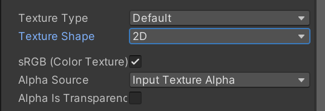
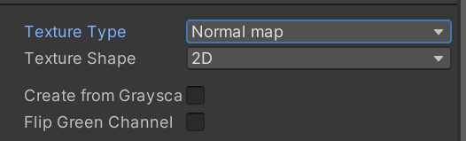
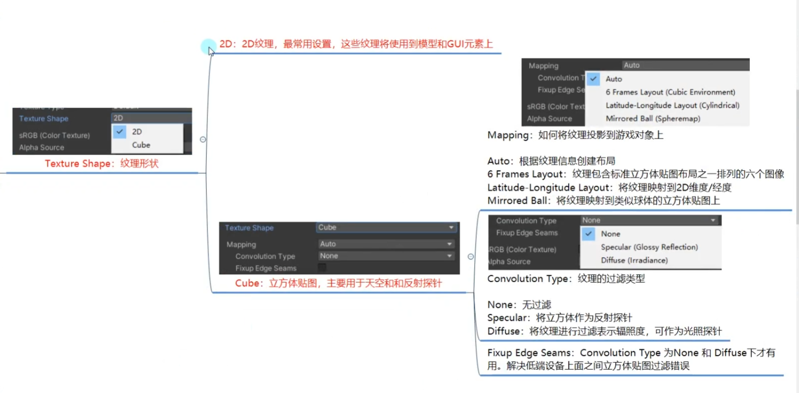

# Unity-核心

### 认识模型的制作过程
- 模型的制作过程

建模，展UV，材质和纹理贴图，骨骼绑定，动画制作

1. 建模：用三角面组装拼凑捏泥人(感觉应该不用过多解释)
2. 展UV：展uv就好像把一张纸做的立方体拆开变成一张纸(推荐视频：[看不懂建议点这个](https://www.bilibili.com/video/BV14u41147YH/?spm_id_from=333.337.search-card.all.click&vd_source=b3c97e3d2220b29b554866d21d02bd09))
3. 材质和纹理贴图:

纹理：一张2D图片

贴图：把纹理通过UV坐标映射到3D物理表面

纹理贴图：呆滞模型的颜色信息、UV信息等等

材质：模型的表现，通过纹理贴图提供的信息，使用不同的着色器算法，呈现出不同的表现效果
比如：金属、塑料、玻璃透明等等效果

4. 骨骼绑定:为模型定义骨骼信息，定义骨骼控制哪些网格信息

5. 动画制作：利用骨骼的旋转来制作3d动画,在一条时间轴上，制作关键帧的位置，通过一些规则决定从上一关键帧到这一关键帧
变化应该如何过渡,不停的制作关键帧就可以制作出最终的动画效果

## 2D相关

### 图片导入概述
1. Unity支持的图片格式

常用格式：

- JPG/JPEG：有损压缩格式，压缩率高但会损失图片数据，无透明通道

- PNG：无损压缩格式，压缩比高，文件体积小，支持透明通道

- TGA：支持不失真压缩，体积小且效果清晰

其他支持格式：

- BMP：Windows标准格式，几乎不压缩，文件体积大

- TIF：基本不损失图片信息，但体积大

- PSD：Photoshop专用格式，可通过工具导入

- EXR、GIF、HDR、IFF、PIC等：Unity也支持这些格式

### 纹理类型设置
1. 纹理类型主要设置什么

主要是为了让纹理图片有不同的主要用途

指明其是用于哪项工作的纹理

参数讲解

1. `Default`:

`sRGB` :启用可以将纹理存储在伽马空间中

`Alpha Source`:指定如何生成纹理的Alpha通道
- `None` :无论如何输入纹理是否有Alpha通道，导入的纹理都没有Alpha通道

- `Input Texture Alpha`:输入纹理中的Alpha

- `From Gray Scale`: 从输入纹理RGB值的平均值生成Alpha（常用）

`Alpha Is Transparency`:启用可以避免边缘上的过滤瑕疵

2. `Normal Map`:

法线贴图就是在原物体的奥宇表面的每个点上均做法线，法线就是垂直于某个点的切线的方向向量

`Create From Grayscale`:启用此属性可以从灰度高度贴图创建法线贴图
- `Bumpiness`:控制凹凸程度，值越打凹凸感越强

- `Filtering`：如何计算凹凸值
    - `Smooth`:使用标准算法生成法线贴图 

    - `Sharp`:生成比标准模式更锐利的法线贴图

3. `Editor GUI and Legacy GUI`:一般在编辑器中或者GUI上使用的纹理

4.  `Sprite(2D and UI)`:2D游戏或者UGUI中使用的格式
- 这块内容太多了 ai太笨了生成不出来，靠你了（而且和UGUI比较重合）

5. - `Cursor`:自定义光标

6.  `Cookie`光源剪影格式
- `LightType`:应用的光源类型，一般点光源的剪影需要设置为立方体纹理，方向光和聚光灯的剪影设置为2D纹理
    - `Spotlight`:聚光等类型，需要边缘纯黑色纹理

    - `Directional`:方向光，平铺纹理

    - `Point`:点光源，需要设置为立方体形状

7. `LightMap`:光照贴图格式

8.  `Single Channel`：单通道模式
- `Channel`:希望将纹理处理为Alpha还是Red通道
    - `Alpha`:使用Alpha通道，不允许进行压缩
    
    - `Red`:使用红色通道

### 纹理形状设置
1. 主要设置什么？

纹理不仅可以用于模型贴图

还可以用于制作天空盒和反射探针

纹理形状设置，主要就是用于在两种模式之间进行切换

2. 参数讲解：

:::warning
注意新版Unity中添加了2D Array和3D
:::

- `2D Array`:
2D Array Texture（2D 数组纹理）
作用
将多个 相同尺寸的2D纹理 打包成一个纹理数组，在Shader中通过索引访问。

适用于：

精灵动画（替代Animation Sheet，减少Draw Call）

地形分层（如不同地貌的混合）

Variants 材质（同一物体的不同皮肤/状态）

- 3D
3D Texture（体积纹理）
作用
存储 三维数据（如体素、烟雾模拟、医学成像）。

适用于：

体积效果（云、雾、火焰）

程序化生成地形（如Marching Cubes）

科学可视化（MRI数据）

### 纹理高级设置