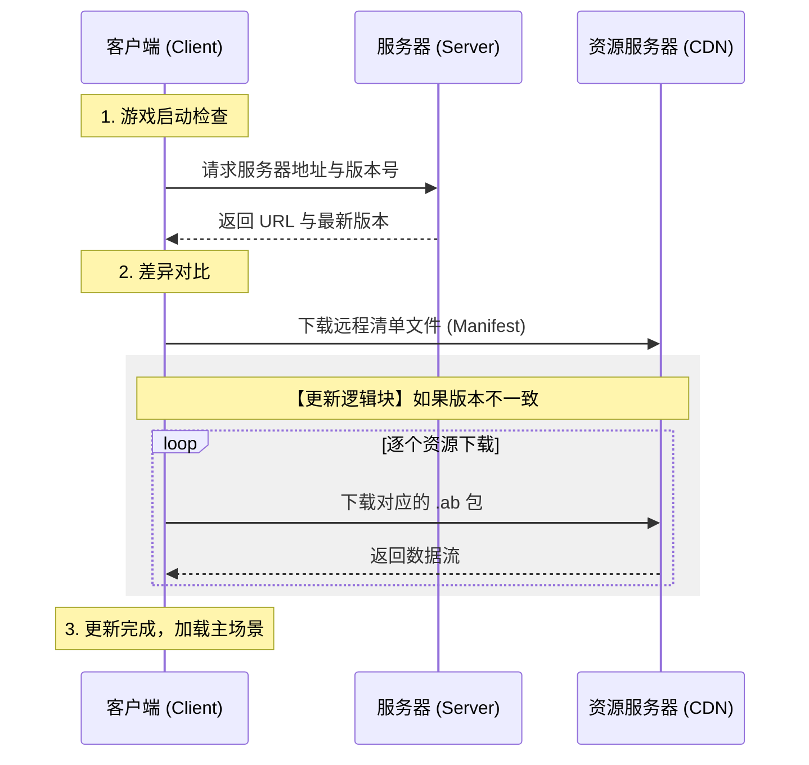
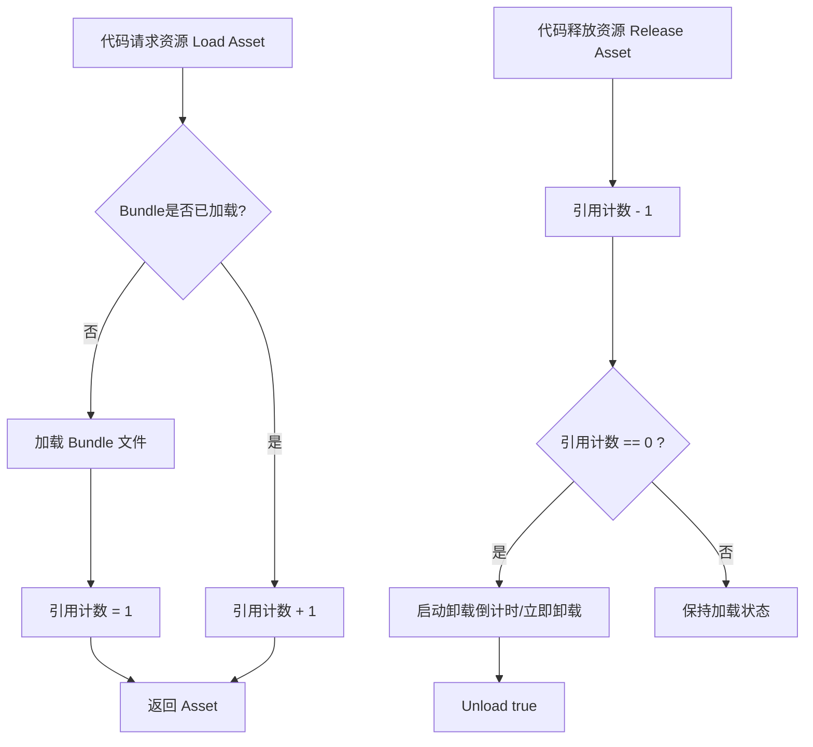

# AssetBundle

## AB 包

AssetBundle 简称 AB 包，是一种特定于平台的资产压缩包，有些类似于资产文件。可以压缩模型，贴图，与蛇体等等资产，但是不能打包代码，所以热更新会采取 Lua 来做。

AB 包的优势：

- 更加灵活：存储位置可以自定义，可以读写，可以自定义压缩方式
- 减小包体大小：会压缩资源，且能减少初始包大小（其他包可以之后通过网络下载更新）
- 热更新：资源与脚本



## 安装 AssetBundle Browser

本篇使用的 AssetBundle Browser 工具来管理 AB 包。

git URL: `https://github.com/Unity-Technologies/AssetBundles-Browser.git`

> [!NOTE]
> Unity 官方已经不再为这个工具提供维护、Bug 修复或兼容性更新了。官方推荐使用 [Addressables package](https://docs.unity3d.com/Packages/com.unity.addressables@latest) 去构建 AB 包，而不是 ab browser。


## Browser 窗口

选中资源，并在 Inspector 窗口最下方可以设置最终/创建资源要存放的 AB 包。可以在 Window -> AssetBundles Browser 中查看。AB 包是通过将关联的脚本数据打包到一起形成的，而不是直接打包脚本代码。

| Configure | Build   | Inspect          |
| --------- | ------- | ---------------- |
| 配置 AB 包资源 | 构建，打包选项 | 观测已打包的 AB 包的相关信息 |

## Build 打包

- Build Target：选择打包平台
- Output Path：输出路径
- Clear Folders：打包前清理输出文件夹（推荐开启，在项目初期增大后会导致打包时间变长） 
- Copy to StreamingAssets：打包后复制到 StreamingAssets 文件夹（推荐，方便测试）
- Advanced Settings
    - Compression：压缩方式
        - LZMA：高压缩率，解压慢；会一口气将包里所有资源解压出来
        - LZ4：中等压缩率，只解压要用到的资源（推荐）
	- ::: details 后面的不常用，但可做了解：
		- ETI：在资源包中不包含资源的类型信息
		- FR：打包时重新构建所有包，但不会删除已经不存在的包
		- ITTC：增量构建检查时，忽略类型树的更改
		- Append Hash：将文件的哈希值附加到资源包名上
		- Strict Mode：如果打包时报错，则打包直接失败，终止
		- DRB：运行时构建
	  :::

当你打包完成后，会生成一个二进制文件是 和一个`.manifest`文件。一个存储着经过压缩的资源，一个是包对应的清单文件。

可以在`.manifest`文件最下方的 Assets 中查看打包好的资产。

> [!CATUION]
> 如果 A 和 B 都用了 C，打包时 C 会被重复打进两个包里，导致包体变大。

## 同步加载

要获取包的资源，要遵守先加载 AB 包，再加载资源的顺序。注意同一 AB 包不能重复加载。

例如：

```cs
// 加载 AB 包
string path = Path.Combine(Application.streamingAssetsPath, "model");
AssetBundle ab = AssetBundle.LoadFromFile(path);
// 加载 AB 包中的资源，第二种加载资源方式通常用于热更新
GameObject cube = ab.LoadAsset<GameObject>("Friendly_Cube");
GameObject sphere = ab.LoadAsset("Friendly_Sphere", typeof(GameObject)) as GameObject;
```

## 异步加载

**携程**

```cs
void Start() 
{ 
	StartCoroutine(LoadAssetRoutine()); 
}

IEnumerator LoadAssetRoutine()
{
	string bundlePath = Path.Combine(Application.streamingAssetsPath, "mybundle");

	// 1. 异步加载 Bundle
	AssetBundleCreateRequest bundleRequest = AssetBundle.LoadFromFileAsync(bundlePath);
	yield return bundleRequest;  // 等待加载完成
	AssetBundle bundle = bundleRequest.assetBundle;

	// 2. 异步从 Bundle 中加载资源
	AssetBundleRequest assetRequest = bundle.LoadAssetAsync<GameObject>("MyPrefab");
	yield return assetRequest;  // 等待资源加载完成
	GameObject prefab = assetRequest.asset as GameObject;

	// 3. 卸载 Bundle (释放镜像内存，保留已实例化的物体)
	bundle.Unload(false);
}

```

**UniTask**

由于`AssetBundleCreateRequest`继承自`AsyncOperation`，UniTask 的扩展方法使其可以直接被 await。

```cs
// 如果你不需要等待它完成，这里可以是 async UniTaskVoid ()
// 如果你需要在别的地方 await 这个方法，或者可以是 async UniTask ()
void Start()
{
	LoadAssetAsync().Forget();
}

async UniTaskVoid LoadAssetAsync()
{
	string bundlePath = Path.Combine(Application.streamingAssetsPath, "mybundle");

	try
	{
		// 1. 异步加载 Bundle (直接 await)
		AssetBundle bundle = await AssetBundle.LoadFromFileAsync(bundlePath);

		// 2. 异步从 Bundle 中加载资源
		GameObject prefab = await bundle.LoadAssetAsync<GameObject>("MyPrefab") as GameObject;

		if (prefab != null)
		{
			Instantiate(prefab);
			Debug.Log("UniTask 加载成功！");
		}

		// 3. 卸载 Bundle
		bundle.Unload(false);
	}
	catch (System.Exception e)
	{
		Debug.LogError($"发生错误: {e.Message}");
	}
}
```
## 卸载 Bundle

**卸载所有的 AB 包**

布尔值参数
- `true`：强制卸载 AssetBundle 以及所有从该包加载出来的资源
	- 销毁 AssetBundle 自身的内存镜像（索引表）以及加载资源。
	- 关闭文件句柄。
- `false`：仅卸载 AssetBundle 自身，保留已经加载出来的资源。
	- 销毁 AssetBundle 自身的内存镜像（索引表）。
	- 关闭文件句柄。
	- 切断 AssetBundle 与已加载 Asset 之间的联系，资源仍可被场景中的 GameObject 使用。

```cs
AssetBundle.UnloadAllAssetBundles(false);
```

**卸载单个 AB 包**

```cs
ab.Unload(false)
```

**卸载 AB 包的时机**

管理 AssetBundle 的加载和卸载时机，是游戏引擎架构中最核心也最头疼的部分。你可以把资源分成三类，每类有不同的管理时机：

- 常驻资源：整个游戏生命周期都需要的资源
	- 加载时机：游戏启动时（Splash Screen 之后，进入主菜单之前）
	- 卸载时机：永不卸载（或者只在 App 退出时）    
	- 管理策略：
	    - 加载完后，可以用 `Unload(false)` 扔掉包壳，保留资源在内存里供全局调用
	    - 或者干脆留着包壳，因为全局资源通常不多，几十 KB 的包头内存可以忽略不计
- 场景级资源：只有在特定关卡或场景才需要的资源
	- 加载时机：在切场景的 Loading 界面期间
	- 卸载时机：离开该场景时
	- 管理策略： 一刀切
	    - 进入场景前：读取配置清单，批量加载该场景所有 AB 包
	    - 退出场景后：遍历该场景加载的所有包，统统执行`Unload(true)`
	    - 这是最安全、最不容易出 Bug 的方式
- 动态资源：游戏中随时可能出现，也随时可能消失的资源
	- 加载时机：需要用到时（或预加载）
	- 卸载时机：引用计数归零时



## 依赖关系

如果一个 AB 包依赖的资源在另一个 AB 包中，就需要把依赖包一并加载，否会出现资源丢失的情况（ex：洋红色物体）。

但很多时候我们不能明确知道包之间的依赖关系，我们可以通过**主包**获取依赖信息。通常来说，主包的名字是和 output path 名字是相同的。 

ex:

```cs
// 1. 加载主包
AssetBundle abMain = AssetBunlde.LoadFromFile(mainPath);
// 2. 加载主包中的清单文件
AssetBundleManifest manifest = abMain.LoadAsset<AssetBundleManifest>("AssetBundleManifest");
// 3. 获取依赖包列表
string[] dependencies = manifest.GetAllDependencies("model");

// --- 打印依赖包的名字 ---
Array.ForEach(dependencies, Debug.Log);
```

不过，此类方式也只能知道包之间的依赖关系，任然不能知道一个资产具体依赖了哪些包，导致可能会加载一些暂时不用的包。