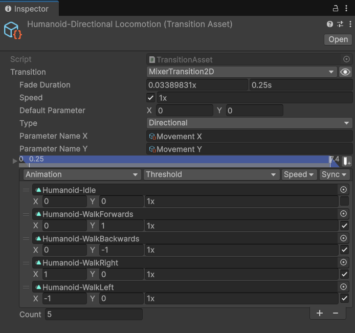

# 1. Basic Use of Animancer

官方文档：https://kybernetik.com.au/animancer/docs/

## Introduction

Animancer 是一个用于 Unity 的第三方动画插件。它的核心理念是通过代码直接驱动动画，从而完全替代或大幅简化 Unity 原生的 Mecanim 状态机系统。

对于那些希望将逻辑控制权集中在代码层面、追求高可维护性、或是反感繁琐可视化连线操作的开发者来说，Animancer 提供了一种更现代、更符合程序员直觉的解决方案。

| 对比维度       | Animancer                                                    | Mecanim (原生 Animator)                                         |
| -------------- | ------------------------------------------------------------ | --------------------------------------------------------------- |
| **核心理念**   | 代码直接驱动（直接播放 AnimationClip）                       | 可视化状态机驱动（节点连线与参数控制）                          |
| **架构与维护** | 逻辑清晰，无连线烦恼，极其适合复杂动作系统                   | 动作越多连线越复杂，容易变成难以维护的蜘蛛网                    |
| **类型安全**   | **强类型**。传递对象引用，丢失或写错时**编译器会直接报错**   | **弱类型**。依赖字符串传参（如 `SetBool("Run")`），拼错时不报错 |
| **调试排错**   | 传统**代码调试**。可直接在 `Play()` 处打断点看调用栈         | **视觉调试**。需紧盯着 Animator 窗口看哪根连线被激活            |
| **过渡与混合** | **极简 API**。一行代码实现平滑过渡（如 `Play(clip, 0.25f)`） | **操作繁琐**。需在状态间物理连线，并手动配置过渡条件和时长      |

## Quick Play

为一个带有`Animator`的 GameObject 添加`AnimancerComponent`，并调用`Play()`方法来播放一个动画片段：

```csharp
using Animancer;
using UnityEngine;

public class PlayAnimationOnEnable : MonoBehaviour
{
    [SerializeField] private AnimancerComponent _Animancer;
    [SerializeField] private AnimationClip _Animation;

    protected virtual void OnEnable()
    {
        // 0.25秒平滑过渡到新动画
        _Animancer.Play(_Animation, 0.25f);
    }
}
```

`_Animancer.Play(_Animation)`会返回一个`AnimancerState`对象，可以通过此对象控制动画的播放：

```csharp
AnimancerState state = _Animancer.Play(_Animation);
// 从头播放
state.Time = 0;
// 暂停动画
state.IsPlaying = false;
// 两倍速播放
state.Speed = 2;
// 回调
state.Events(this).OnEnd = () => Debug.Log("动画结束了");
```

除了`AnimationClip`，你还能用`ClipTransition`来指定更多的播放选项，其中就包括包括`Fade Duration`和`Start Time`：

```csharp
[SerializeField] private ClipTransition _Transition;

privote void Start()
{
    _Animancer.Play(_Transition);
}
```

> [!NOTE]
> Animancer Lite 可以在 Editor 模式下使用任意 fade duration（过渡时间），但打包后只能使用0.25s。

当你正在播放动画A时，可能希望重投再播放一遍，此时再调用`Play(A)`方法，会被 Animancer 忽略。如此一来，你就不需要每次播放前都检查是否播放完毕了：

```csharp
void Update()
{
    if (isMoving)
    {
        animancer.Play(walkClip);
    }
}
```

但如果真的需要重头再播，可以在`Play()`方法的最后传入`FadeMode.FromStart`参数。相比`state.Time = 0`，它会平滑过渡到动画的起始位置：

```csharp
animancer.Play(fire, 0.25f, FadeMode.FromStart);
```

> [!NOTE]
> 当你从动画B过渡动画A期间再次`Play(A)`，如果新的`FadeDuration`更小，会使用新的（即更小的）`FadeDuration`。

## Transition Library

Transition Library 是 Animancer 中的一种资产，用于统一管理、调配各种动画的过渡。

由于此资产可能会被共享，所以不要将事件绑定到资产上，而要绑定在状态上。

ex：

<div style="display: flex; gap: 20px;">
  <div style="flex: 1;">

**资产**

```cs
protected virtual void Awake() =>
    _Action.Events.OnEnd = UpdateMovement;


private void UpdateAction()
{
    if (SampleInput.LeftMouseUp)
    {
        _CurrentState = State.Acting;
        _Animancer.Play(_Action);
    }
}
```

  </div>
  <div style="flex: 1;">

**状态**

```cs
private void UpdateAction()
{
    if (SampleInput.LeftMouseUp)
    {
        _CurrentState = State.Acting;

        AnimancerState state =
            _Animancer.Play(_Action);
        state.Events(this).OnEnd ??=
            UpdateMovement;
    }
}
```

  </div>
</div>

## `NamedAnimancerComponent`与别名

`Named Animancer Component`是一个更简单的播放动画的组件，与`Aninmancer Component`将`AnimationClip`当作自己的键不同，此组件将 clip name 作为键。

```cs
_animancer.TryPlay("clip name");
```

使用 String Assets（字符串资产）可以避免魔法字符串的问题，并且让此字符串变得可被引用。在 Tansition Library 的左上角有一个下拉菜单按钮，点开他可以集中管理所有字符串资产别名。

勾选 Alias All 会为让所有动画使用他们 Transition Assets 的名称作为别名。

```cs
[SerializeField] private AnimancerComponent _animancer;

[SerializeField] private StringAsset _idle;
[SerializeField] private StringAsset _move;
[SerializeField] private StringAsset _action;

// 如果你懒得给每个动画片段分配一个 StringAsset，可使用更轻量的字符串引用
public static readonly StringReference Action = "Action";
```

当你播放一个`AnimationClip`或`ClipTransition`时，已经提供了所需播放都动画的一切信息。但由当使用别名时，你只有一个字符串资产，所以当前`Animancor`播放动画可能会失败，需要使用`TryPlay()`方法。

## Aninmancer Graph

右键`Animancer Component`，选择`Initialze Animancer Graph`。

在 Animancer Graph 窗口右键 Display Options -> Show 'Add Animation' Field 后可以预览动画。

当你同时播放多个动画，并修改其一权重时，会自动修改其他动画的权重使其合计为1。在 Display Options -> Auto Normalize Weights 中开关这个功能。


## `SoloAnimation`

`SoloAnimation`适用于物体只需播放一个动画的场景。例如一个门，可以只有打开的动画，关闭通过设置`speed = -1`来实现。这个组件避免了动画管理和混合的开销，开销低于`Aninmancer Component`。

| 字段                  | 用途说明                                                                                                                                                                                        |
| --------------------- | ----------------------------------------------------------------------------------------------------------------------------------------------------------------------------------------------- |
| Animator              | 和`AnimancerComponent 一样，SoloAnimation`需要一个Animator组件来实际播放动画。                                                                                                                  |
| Clip                  | 动画片段。本示例中使用的是 Door-Open 动画。                                                                                                                                                     |
| Normalized Start Time | 动画起始偏移。                                                                                                                                                                                  |
| Speed                 | 动画播放速度。                                                                                                                                                                                  |
| Apply In Edit Mode    | 启用此选项后，我们可以在 Edit Mode 中看到动画的起始姿势。这样就可以在场景编辑时，通过调整 Normalized Start Time 来控制门的打开程度。                                                            |
| Stop On Disable       | 本示例不涉及禁用门，所以这个开关是关闭的。否则，当场景卸载、门被销毁时，它会把动画倒回到起始帧，从而浪费一点性能。不幸的是，Unity 没有提供任何可靠的方式在`OnDisable`中判断对象是否即将被销毁。 |

启用 Apply In Edit Mode 后，Inspector 面板在编辑模式下也会显示 Playable Graph 的详细信息。这相当于`SoloAnimation`版本的实时检查器。

::: details Door Script

```cs
public class Door : MonoBehaviour, IInteractable
{
    [SerializeField] private SoloAnimation _SoloAnimation;

    public void Interact()
    {
        if (_SoloAnimation.Speed == 0)
        {
            bool playForwards = _SoloAnimation.NormalizedTime < 0.5f;
            _SoloAnimation.Speed = playForwards ? 1 : -1;
        }
        else
        {
            _SoloAnimation.Speed = -_SoloAnimation.Speed;
        }

        _SoloAnimation.IsPlaying = true;
    }
}
```

:::

## 更新频率

以下 gif 展示了3个角色各自使用不同的更新方式：

- **Normal Rate（普通更新率）**：和平时一样，每帧都正常更新动画。
- **Dynamic Rate（动态更新率）**：当角色靠近相机时，每帧正常更新；当角色逐渐远离相机时，开始逐渐限制动画的更新频率。 这种方式可以在不明显影响玩法的前提下提升性能。
- **Low Rate（低更新率）**： 每秒只进行有限次数的更新。 这会让动画看起来有点像定格动画（Stop Motion），但在某些特定的美术风格中，这种效果反而会显得相当不错。


<details>
<summary>代码示例</summary>

::: code-group

```cs [LowUpdateRate.cs]
using Animancer;
using UnityEngine;

public class LowUpdateRate : MonoBehaviour
{
    [SerializeField] private AnimancerComponent _Animancer;
    [SerializeField, PerSecond] private float _UpdatesPerSecond = 5;

    private float _LastUpdateTime;

    protected virtual void OnEnable()
    {
        _Animancer.Graph.PauseGraph();
        _LastUpdateTime = Time.time;
    }

    protected virtual void OnDisable()
    {
        if (_Animancer != null && _Animancer.IsPlayableInitialized)
            _Animancer.Graph.UnpauseGraph();
    }

    protected virtual void Update()
    {
        float time = Time.time;
        float timeSinceLastUpdate = time - _LastUpdateTime;
        if (timeSinceLastUpdate > 1 / _UpdatesPerSecond)
        {
            _Animancer.Evaluate(timeSinceLastUpdate);
            _LastUpdateTime = time;
        }
    }
}
```

```cs [DynamicUpdateRate.cs]
using Animancer;
using Animancer.Units;
using UnityEngine;

public class DynamicUpdateRate : MonoBehaviour
{
    [SerializeField] private LowUpdateRate _LowUpdateRate;
    [SerializeField, Meters] private float _SlowUpdateDistance = 5;

    private Transform _Camera;

    protected virtual void Awake()
    {
        _Camera = Camera.main.transform;
    }

    protected virtual void Update()
    {
        Vector3 offset = _Camera.position - transform.position;
        float squaredDistance = offset.sqrMagnitude;

        _LowUpdateRate.enabled = squaredDistance >
            _SlowUpdateDistance * _SlowUpdateDistance;

        float distance = Mathf.Sqrt(squaredDistance);
    }
}
```

:::

</details>

> [!NOTE]
> `_Animancer.Graph`会获取底层的 Playable Graph，调用`_Animancer.Graph.PauseGraph()`暂停其自动更新。然后调用`_Animancer.Evaluate(deltaTime)`来手动更新动画，完成接管。

本示例中使用的脚本在实际游戏中也可以直接使用，但还有几种方式可以进一步改进，以获得更好的性能并精细调整视觉效果。

1. **事件**

   请注意，以较低频率更新动画也会影响 **Animation Events**（Unity 原生动画事件）和 **Animancer Events** 的触发时机。 如果你非常依赖这些事件的**精确时间**（例如需要在特定帧触发特效、声音或伤害判定），那么降低更新率可能不是一个好选择。

   同样，如果你的物理碰撞箱是基于角色骨骼位置实时计算的，也会受到影响。在这些情况下，你可能需要标记哪些动画是“重要的”，让系统在时机关键的时候（例如角色正在攻击、或多个角色靠近时）**不要降低**该角色的动画更新频率。

2. **单例模式**

   Unity 调用每个 MonoBehaviour 的事件方法（例如`OnEnable`、`Update`、`OnDisable`等）时，性能开销比普通 C# 方法调用要大得多。

   因此，更高效（但也更复杂）的做法是：在场景中只保留**一个脚本**负责接收 Unity 的 Update，然后由这个脚本维护一个列表，统一管理所有需要更新的对象。这样可以显著减少 Unity 事件方法的调用次数。

3. **错开更新（Staggered Updates）**
   - 使用本示例中这种每个角色各自挂脚本的方式，各个角色的低更新率会在不同帧启用或禁用（取决于它们何时进入/离开相机范围）。结果可能是：某些帧同时有多个角色更新，而某些帧可能一个都没有。
   - 如果把所有角色放入一个列表，由一个单例脚本统一管理，则可以让它们**同时更新**。这样视觉上会更一致，但性能曲线会变成：连续几帧几乎没有更新开销，然后某一帧突然要更新所有角色，造成明显的性能尖峰。
   - 但你可以做得更好：**每帧只更新列表中的一部分角色**，从而让性能开销更加平稳。

   - **举例**： 假设场景中有100个角色，你希望它们每秒更新5次，而游戏运行在50 FPS。这时你只需要每10帧进行一次动画更新。你可以选择：
     - 前9帧什么都不做，第10帧一次性更新全部100个角色；
     - 或者每帧只更新10个角色，让每帧的性能开销保持相对稳定。

4. **其他优化因素**
   - **可变更新率**： 系统不一定要局限于每帧更新或每秒更新10次。你可以根据距离设置多个不同的更新率（可以对应 LOD 距离），或者让更新率与距离成正比，甚至根据当前帧率动态调整。
   - **角色大小**： 在决定从多远开始降低更新率时，可以把角色的大小考虑进去（例如通过`Renderer.bounds`计算）。一个体型较大的角色，即使在较远距离依然清晰可见；而一个小角色在同样距离可能已经看不清了。
   - **优先级**： 不重要的背景生物（critters）可以更激进地降低更新率，而玩家、Boss 等关键角色则应该保持较高的更新频率。
   - **可见性**： 那些甚至不在屏幕上的角色（可以使用`Renderer.isVisible`轻松判断），可能不需要频繁更新。 另外，Unity 的`Animator.cullingMode`也有一些选项，可以控制角色在屏幕外时的动画更新行为。

## 动画混合

### Mixers

#### Blend Tree

在 Mecanim 中，你可以设置参数来控制 Blend Tree 的动画混合。`ControllerTransition`是一种资产文件，允许你在 Animancer 中播放 Unity 原生的 Animator Controller（即`.controller`文件，里面可以包含 Blend Tree、多个动画状态、参数等）。

> [!NOTE]
>
> <details>
> <summary>ControllerTransition 示例</summary>
>
> ```cs
>     [SerializeField] private AnimancerComponent _Animancer;
>     [SerializeField] private ControllerTransition _Controller;
>
>     [SerializeField, Range(0, 1)]
>     private float _MovementSpeed;
>
>     protected virtual void OnEnable()
>     {
>         _Animancer.Play(_Controller);
>     }
>
>     protected virtual void Update()
>     {
>          // Transition 本身不能直接设置参数，
>          // 但是当你用它播放动画后，它会生成一个 State，
>          // 可以通过 State 来控制参数
>         _Controller.State.SetFloat("MovementSpeed", _MovementSpeed);
>     }
> ```
>
> </details>

#### Mixer

Mixer 能比 Blend Tree 更灵活地混合动画。Mixer 等同于一个 1D 混合树。

Example：

```cs
[SerializeField] private AnimancerComponent _Animancer;
[SerializeField] private LinearMixerTransition _Mixer;

[SerializeField, Range(0, 1.5f)]
private float _MovementSpeed;

protected virtual void OnEnable()
{
    _Animancer.Play(_Mixer);
}

protected virtual void Update()
{
    // Transition 本身不能直接设置参数，
    // 但是当你用它播放动画后，它会生成一个 State，
    // 可以通过 State 来控制参数
    _Mixer.State.Parameter = _MovementSpeed;
}
```

**本代码的主要区别在于参数的控制方式。**`LinearMixerTransition`知道它创建的 State 只有一个`float`参数，因此可以直接设置该参数，而无需像 Blend Tree 那样通过`SetFloat`来控制。

此外，Liner Mixer 也可也像先前的 Transition (ControllerTraisition) 一样，定义为资产文件。


> [!TIP] 时间同步
> 当两个动画的长度不同时，混合他们有时产生奇怪的效果。通过调整偏移，让两个动画以相同的姿势开始，并启用`MixerTransition`中的 Time Synchronizatio（默认开启）选项。开启时间同步后，动画会以相同的周期进度播放，且权重越大的动画对周期的实际长度影响越大。
>
> 官方文档：[Time Synchronization](https://kybernetik.com.au/animancer/docs/samples/mixers/linear/#mixer)

#### Animancer Parameters

不解耦的写法中，脚本是直接拿到具体的 State 来控制参数的：

```cs
linearMixerTransition.State.Parameter = movementSpeed;   // 直接访问 .Parameter
```

或者：

```cs
controllerTransition.State.SetFloat("MovementSpeed", value);  // 需要知道参数名
```

脚本必须硬编码知道当前播放的是`LinearMixerTransition`，还是`ControllerTransition`，还是其他类型的 Mixer。

如果你想换成别的混合方式，脚本就必须跟着修改代码.不够解耦。

**Animancer 提供了一个中央参数系统**（类似 Unity Animator Controller 的参数）：

- 参数统一存在`AnimancerComponent`中（比如`MovementSpeed`这个参数）。
- Mixer 或`ControllerTransition`在播放时，可以自动绑定自己的内部参数到这个中央参数。
- 这样，控制脚本完全不需要知道当前播放的是什么动画或什么 Mixer，只需要简单地设置：

```cs
Animancer.Parameters.SetFloat(MovementSpeed, value);
```

如此，无论你播放的是 Linear Mixer、2D Mixer、还是带 Blend Tree 的`ControllerTransition`，只要它们都绑定了同一个`MovementSpeed`参数，脚本都能正常控制混合效果。

#### `Parameter<T>`

`Parameter<T>`是 Animancer 提供的一个参数包装类型，专门用来安全、方便地读写 Animancer Parameters。

通过`Aninmancer`创建：

```cs
_Parameter = _Animancer.Parameters.GetOrCreate<float>(_ParameterName);
```

常用方法：

- `SetValue(T value)`
- `onValueChanged.AddListener()`

### Directional Mixer

#### `MixerTransition2D`

同样是一种资产，相当于 2D 混合树。



#### `SmoothedVector2Parameter`

`SmoothedVector2Parameter`是 Animancer 提供的一个参数平滑工具类，专门用于 2D Mixer。作用是：让 2D Mixer 的参数（`Vector2`）从当前值平滑地过渡到目标值。

对于 1D Mixer，也有对应的`SmoothedFloatParameter`，用法类似。

```cs
private SmoothedVector2Parameter _SmoothedDirection;

protected virtual void Awake()
{
    // 创建平滑参数：需要传入 X 参数名、Y 参数名、平滑时间
    _SmoothedDirection = new SmoothedVector2Parameter(
        _Animancer,
        _ParameterX,      // X 轴参数（通常是 Horizontal）
        _ParameterY,      // Y 轴参数（通常是 Vertical）
        0.15f);           // Smooth Time（秒），数值越小越灵敏，越大越迟钝
}

protected virtual void Update()
{
    // 设置目标值（比如根据输入方向）
    _SmoothedDirection.TargetValue = new Vector2(inputX, inputY);

    // 或者直接设置 Value（立即生效）
    // _SmoothedDirection.Value = ...
}
```

如果脚本生命周期和角色或 Animancer 完全一致，比如这个组件会和角色一起销毁，可以不调用`Dispose()`。但如果这个组件可能比 Animancer 更早销毁，就需要显示销毁：

```cs
protected virtual void OnDestroy()
{
    _SmoothedDirection?.Dispose();
}
```

## 动画序列化

需要序列化动画通常无非两个场合：

- 本地保存
- 网络

建议序列化以下运行时数据：

| 字段                           | 说明                                                                                           |
| ------------------------------ | ---------------------------------------------------------------------------------------------- |
| `float _RemainingFadeDuration` | 当前淡入淡出剩余时间；若未处于淡入淡出中则为0。                                                |
| `float _SpeedParameter`        | 线性混合示例里`MovementSpeed`参数的当前值。                                                    |
| `List<StateData> _States`      | 当前激活的状态列表。未淡入淡出时通常只有1个；淡入淡出中可能有2个或更多（例如过渡被再次打断）。 |

`_States`中每个`StateData`建议包含：

| 字段           | 说明                                                                                  |
| -------------- | ------------------------------------------------------------------------------------- |
| `byte index`   | 该状态在 Transition Library 中的索引。通常`byte`足够（<=256）；若超过可改为`ushort`。 |
| `float time`   | 对应 `AnimancerState.Time`。                                                          |
| `float weight` | 该状态当前混合权重。                                                                  |

---

**收集可序列化姿势（Gathering the Serializable Pose）**

现在我们已经知道 SerializablePose 需要哪些数据，接下来就可以开始收集它们。

```cs
public void GatherFrom(AnimancerComponent animancer, StringReference speedParameter)
{
```

首先，清空之前的数据，并获取当前速度参数的值。

```cs
    _States.Clear();
    _RemainingFadeDuration = 0;
    _SpeedParameter = animancer.Parameters.GetFloat(speedParameter);
```

然后通过`AnimancerLayer.ActiveStates`遍历当前正在播放的所有状态。

```cs
    IReadOnlyIndexedList<AnimancerState> activeStates = animancer.Layers[0].ActiveStates;
    for (int i = 0; i < activeStates.Count; i++)
    {
        AnimancerState state = activeStates[i];
```

接着为每个状态捕获所需的数据，使用 Transition Library 根据`state.Key`查找对应的索引。

```cs
    _States.Add(new StateData()
        {
            index = (byte)animancer.Graph.Transitions.IndexOf(state.Key),
            time = state.Time,
            weight = state.Weight,
        });
```

如果当前正在进行淡入淡出，对于正在淡出的状态不需要特殊处理，但对于正在淡入的状态，我们需要记录剩余的淡入时间。

```cs
        if (state.FadeGroup != null && state.TargetWeight == 1)
        {
            _RemainingFadeDuration = state.FadeGroup.RemainingFadeDuration;
```

同时把这个正在淡入的状态交换到列表首位，以便后续加载时知道第一个状态是需要淡入的。

```cs
            if (i > 0) (_States[0], _States[i]) = (_States[i], _States[0]);
        }
    }
}
```

---

**应用反序列化后的姿势（Applying the Deserialized Pose）**

应用反序列化后的姿势，基本上就是收集过程的反向操作。

```cs
public void ApplyTo(AnimancerComponent animancer, StringReference speedParameter)
{
```

首先停止 Layer 当前的所有播放（但这会把 Layer 的 Weight 设为0，所以需要重新设回1）。

```cs
    AnimancerLayer layer = animancer.Layers[0];
    layer.Stop();
    layer.Weight = 1;
```

在应用每个状态的细节后，我们需要记录第一个状态用于后续淡入。

```cs
    AnimancerState firstState = null;
```

然后遍历姿势中的所有状态数据。

```cs
    for (int i = _States.Count - 1; i >= 0; i--)
    {
        StateData stateData = _States[i];
```

使用`TransitionLibrary.TryGetTransition`根据索引查找对应的 Transition。

```cs
        if (!animancer.Graph.Transitions.TryGetTransition(
            stateData.index, out TransitionModifierGroup transition))
        {
            Debug.LogError($"Transition Library '{animancer.Transitions}' 不包含索引为 {stateData.index} 的 Transition。", animancer);
            continue;
        }
```

如果查找失败则输出错误并跳过。

获得 Transition 后，不能直接调用`Play()`（因为它会触发常规淡入并淡出其他状态），而是使用`GetOrCreateState`获取状态，并手动应用时间和权重。

```cs
        AnimancerState state = layer.GetOrCreateState(transition.Transition);
            state.IsPlaying = true;
            state.Time = stateData.time;
            state.SetWeight(stateData.weight);

        if (i == 0) firstState = state;
    }
```

当所有状态都以正确的 Time 和 Weight 加载完成后，播放第一个状态，使用保存的剩余淡入时间进行淡入。

```cs
    layer.Play(firstState, _RemainingFadeDuration);
```

最后，将保存的速度参数值应用到角色身上。

```cs
    animancer.Parameters.SetValue(speedParameter, _SpeedParameter);
}
```

## Layer

Layer 将角色分为多个层，不同的层可以播放不同的动画，权重高的层会覆盖低层。层可以只令角色身上的一部分播放动画，以此做到角色可以边移动边射击。

默认情况下，动画在 Layer 0，也叫做 Base Layer 上播放。层可在`AninmancerComponent`通过索引访问：

```cs
AninmancerLayer baseLayer = _Animancer.Layer[0];
AninmancerLayer actionLayer = _Animancer.Layer[1];
```

在特定层上播放动画：

```cs
baseLayer.Play(_idle);
actionLayer.Play(_action);
```

当某层播放完毕时，我们可以逐渐降低其权重来结束其播放：

```cs
[SerializeField, Seconds]
private float _ActionFadeOutDuration = AnimancerGraph.DefaultFadeDuration;

protected virtual void Awake()
{
    // ...
    _Action.Events.OnEnd = OnActionEnd;
}

private void OnActionEnd()
{
    _ActionLayer.StartFade(0, _ActionFadeOutDuration); // 0 代表权重
}
```

当你通过 Assets -> Create -> Avater Mask 创建好角色遮罩后，通过`SetMask()`设置层的遮罩：

```cs
[SerializeField] private AvaterMask _ActionMask;

void Awake()
{
    // ...
    _ActionLayer.SetMask(_ActionMask);
}
```

获取层的权重：

```cs
float cw = _ActionLayer.Weight;
float tw = _ActionLayer.TargetWeight;
```

你可以为 Layer 起名方便调试。且起名方法有`[Conditional]`注解，不会被打包到 release 中：

```cs
_ActionLayer.SetMask(_ActionMask);
_ActionLayer.SetDebugName("Action Layer");
```

> [!TIP]
> 你还可以让一个 layer 去播放别的层的状态：
>
> ```cs
> var baseState = _BaseLayer.Play(_ActionLayer.CurrentState);
> ```
>
> 此时`_BaseLayer`会创建自己对于播放状态的新副本`baseState`。新副本会用原状态作为 key，当`_BaseLayer`再次播放原状态时，会复用此副本。此 key 可以在 Insepctor 中观察到。

## 面部表情

面部表情通常**不使用骨骼动画**，而是使用 **Blend Shapes（混合变形）**：

- Blend Shapes 出现在角色的 SkinnedMeshRenderer 组件上（一排滑块）。
- 每个表情对应一个 Blend Shape。
- 表情动画通常非常简单：**长度为 0**，只包含一个关键帧，把某个 Blend Shape 的值设为 100（最大强度）。

Animancer 可以像播放普通动画一样播放这些 Blend Shape 动画，并进行混合。

---

**做法一：使用独立 Layer + 直接控制 Weight**

**步骤：**

1. **创建一个专用的 Face Layer**：
    

    ```cs
    [SerializeField] private AnimancerComponent _Animancer;
    private AnimancerLayer _FaceLayer;
    
    private void Awake()
    {
        _FaceLayer = _Animancer.Layers[1];           // 或 CreateLayer()
        _FaceLayer.Weight = 1f;                      // 默认显示
        // 可选：添加 Avatar Mask 只影响面部（如果需要）
    }
    ```
    
2. **准备表情 Transition**：
    - 每个表情对应一个长度为0的动画（只改一个 Blend Shape）。
    - 可以用 String Asset 或 Transition Library 管理。
3. **播放并混合表情**：

    ```cs
    private AnimancerState _smileState;
    private AnimancerState _angryState;
    
    // 播放笑的表情
    _smileState = _FaceLayer.Play(smileTransition);
    _smileState.Weight = 0.7f;        // 控制强度（0~1）
    
    // 同时播放生气（会自动混合）
    _angryState = _FaceLayer.Play(angryTransition);
    _angryState.Weight = 0.4f;
    ```
    

**优点**：简单、直观、每个表情独立控制，淡入淡出自然。

---

**做法二：使用 Manual Mixer（适合大量表情需要统一管理时）**

当你有非常多的表情，想像 Direct Blend Tree 一样统一管理时，可以使用 `ManualMixerTransition`。

```cs
// 在 Inspector 中添加所有表情 Transition
[SerializeField] private ManualMixerTransition _FaceMixer;

private void Awake()
{
    var state = _FaceLayer.Play(_FaceMixer);
    // 之后通过子状态控制权重
}

public void SetExpression(int index, float weight)
{
    _FaceMixer.State.GetChild(index).Weight = weight;
}
```

**适用场景**：表情非常多，需要像参数一样精细控制时。

Example:

```cs
public class FaceController : MonoBehaviour
{
    [SerializeField] private AnimancerComponent _Animancer;
    
    private AnimancerLayer _faceLayer;

    // 用 String Asset 或 Transition Asset 引用表情
    [SerializeField] private ClipTransition _smile;
    [SerializeField] private ClipTransition _angry;
    [SerializeField] private ClipTransition _blink;

    private void Awake()
    {
        _faceLayer = _Animancer.Layers[1];
        _faceLayer.Weight = 1f;
    }

    // 示例：播放笑 + 轻微生气
    public void ShowHappyAngry()
    {
        _faceLayer.Play(_smile).Weight = 0.8f;
        _faceLayer.Play(_angry).Weight = 0.3f;
    }

    // 关闭所有表情（淡出）
    public void ClearFace(float fadeDuration = 0.3f)
    {
        _faceLayer.Stop(fadeDuration);   // 或把所有 State 的 TargetWeight 设为 0
    }
}
```

## 事件

Animancer 支持 Unity 内置的 Animation Events，同时也提供了自己的 Animancer Events 系统，后者通常更方便使用。

`ClipTransition`在 Inspector 中的时间线处可以添加事件。
- 添加事件：双击时间线，或点击右侧的按钮。
- 删除事件：选中事件后按 Delete 键，或点击右侧的按钮。

如果只有一个事件（不包括 End Event），可以直接用索引设置回调：

```cs
_Swing.Events.SetCallback(0, _Ball.Hit);
```

但这样 Inspector 里就看不出这个事件的作用，它只是一个没有明确含义的时间标记。在复杂项目中会很不方便。

因此，事件有一个`Name`字段，可以分配一个`String Asset`。本示例中，事件名称为`Hit`。

有了名称后，脚本就可以这样设置回调：

```cs
_Swing.Events.SetCallback("Hit", _Ball.Hit);
```

如果动画中没有这个名称的事件，会抛出异常。如果你希望事件是可选的，可以先用`Events.IndexOf`，再通过索引设置回调。

---

在代码中使用魔法字符串（Magic String）作为事件名称并不理想，因为 Inspector 中无法提示脚本期望的事件名称。

一种解决方案是再给脚本添加一个字段来引用同一个 String Asset，但这样需要在 Inspector 中重复赋值，管理起来稍麻烦。

本示例采用的方式是使用`[EventNames]`属性，让脚本定义它期望的过渡包含哪些事件名称，从而让 Inspector 能提供建议。

具体步骤：

1. 创建一个静态的`StringReference`字段：

```cs
private static readonly StringReference HitEventName = "Hit";
```

2. 使用该名称设置回调：

```cs
_Swing.Events.SetCallback(HitEventName, _Ball.Hit);
```

3. 在过渡字段上添加`[EventNames]`属性。

```cs
[SerializeField, EventNames] private ClipTransition _Swing;
```

- 这个`[EventNames]`属性会自动查找**当前类中所有** static 的`StringReference`或`string`类型的字段，然后把它们作为建议的事件名称显示在 Inspector 中。
- 这样，当你在 Inspector 中为`_Swing`动画添加事件时，系统就会自动提示 “Hit” 这个名称，避免你手动输入出错，也让别人一看就知道这个过渡需要什么事件。
- 除了这种最简单的方式，`[EventNames]`属性还有其他几种用法（例如指定其他类、自定义列表等），详细说明可以在 [EventNamesAttribute API 页面](https://kybernetik.com.au/animancer/api/Animancer/EventNamesAttribute/)中查看。

---

End Event 有两种方式，一种是和 Transition 绑定的，一种是和 state 绑定的：

```cs
clip.Events.OnEnd ??= () => Debug.Log("Clip ended");
state.Events(this).OnEnd = () => Debug.Log("动画结束了");
```

如果某一个脚本中的`[SerializeField] private ClipTranstion clip`被多个角色使用，就需要使用第二种方法。

___

**Early End**

有时如果等到动画完全播放完，再开始过渡到，会看到过渡开始时出现不自然的动作变化。

将 Trasntion 的 End Time 拉前一些，这样整体运动会平滑得多。或者使用 Transition Library，只针对特定动画组合间的过渡渡进行优化。

___

**事件参数**

有时候需要事件参数，此时不得不在 Inspector 中传参了。有时你需要传递一个特殊的组件作为参数，但 Inspector 中无法知道你想要什么类型的对象，解决方案：

在 Inspector 中设置参数为`AnimancerEvent.ParameterObject`,拖入对应的游戏物体。在绑定回调时使用泛型：

```cs
[SerializeField] private AnimancerComponent _Animancer;
[SerializeField] private StringAsset _EventName;

protected virtual void Awake()
{
    _Animancer.Events.AddTo<AudioSource>(_EventName, PlaySound);
}

private void PlaySound(AudioSource source)
{
    // ...
}
```

> [!TIP]
> `AddTo<T>`只在注册事件的时候调用一次`GetComponent<T>`。

## 其他章节

- [动态 Layer](https://kybernetik.com.au/animancer/docs/samples/layers/dynamic/#character-animations)

  场景：当角色移动时，我们希望其上半身能够单独做出射击动作而不影响下半身；当角色不移动时，又希望下半身可以做出做出站立射击的架势。

  方案：单纯降低 Base Layer 权重同时提搞 Action Layer 权重无法做到平滑过渡的效果。本文提出的简单方案是让 Action Layer 和 Base Layer 一起同时播放射击动画。代码中有这么一个方法：

```cs
private void PlayActionFullBody(float fadeDuration)
{
    AnimancerState actionState = _ActionLayer.CurrentState;
    AnimancerState baseState = _BaseLayer.Play(actionState, fadeDuration);
    baseState.Time = actionState.Time;
}
```
