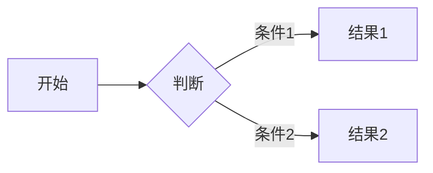

# Markdown快速指南

推荐材料:
1. [Markdown 基本语法](https://markdown.com.cn/basic-syntax/)
2. [VitePress 文档](https://vitepress.dev/zh/)

```markdown [markdown.md]
# Markdown 新手教程

Markdown 是一种轻量级的标记语言，用于格式化纯文本。它简单易学，广泛应用于文档编写、博客撰写等场景。以下是基础语法指南：

## 1. 标题

# 一级标题
## 二级标题
### 三级标题
#### 四级标题
##### 五级标题
###### 六级标题

```

## 段落与换行
段落：直接输入文字（空行分隔段落）

## 文字样式
```markdown
*斜体* 或 _斜体_  
**粗体** 或 __粗体__  
***粗斜体***  
~~删除线~~  
`行内代码`
```

## 代码 icon 测试

::: code-group
```sh [pnpm]
pnpm -v
```

```java [Java.java]
public class HelloWorld {
    public static void main(String[] args) {
        System.out.println("Hello, World!");
    }
}
```

```csharp [C#.cs]
Console.WriteLine("Hello, World!");
```

:::

```json [JSON.json]
{
  "name": "example",
  "version": "1.0.0",
  "description": "An example JSON file"
}
```


```lua [Lua.lua]
for i = 1, 5 do
    print("Hello, World!")
end
```

```bash [Bash.sh]
for i in {1..5}
do
    echo "Hello, World!"
done
```

```py [Python.py]
for i in range(5):
    print("Hello, World!")
```

```cpp [C++.cpp]
#include <iostream>
using namespace std;
int main() {
    cout << "Hello, World!" << endl;
    return 0;
}
```

```go [Go.go]
for i := 1; i <= 5; i++ {
    fmt.Println("Hello, World!")
}
```

```powershell [PowerShell.ps1]
for ($i = 1; $i -le 5; $i++) {
    Write-Host "Hello, World!"
}
```
## mermaid 图测试

