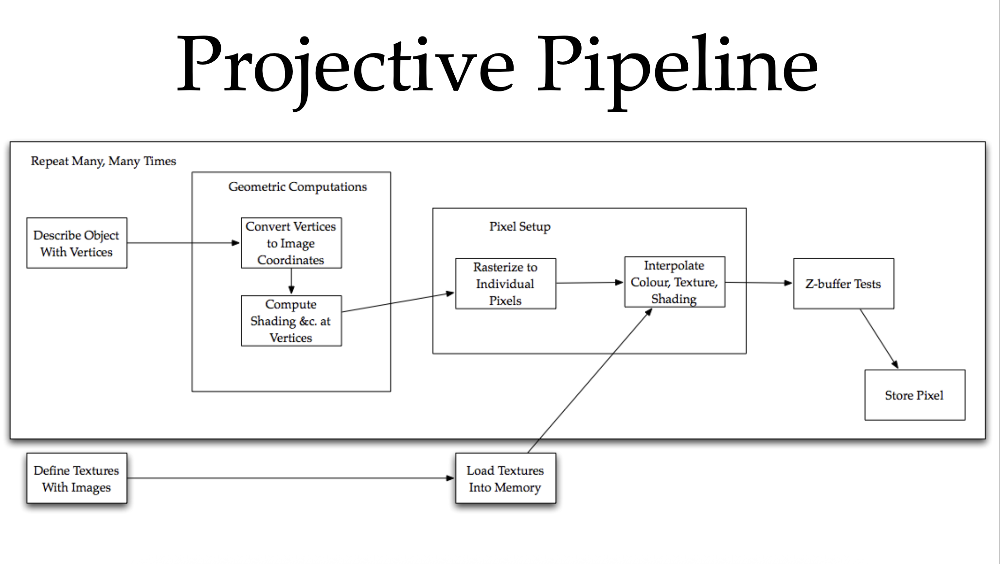

# 北工大图形学

## Introduction

图形学 (Computer Graphics) 是计算机科学的一个分支，主要研究如何使用计算机生成和处理图像。它涵盖了从基本的图形绘制到复杂的三维建模和渲染技术。

图形学严重依赖数学 (Graphics depends on mathematics)，图形学常用的数学工具有：

1. 几何学 (Geometry) 
2. 线性代数 (Linear Algebra) 
3. 微积分 (Calculus)

## Linear Algebra

这部分基本都是比较基础的知识，有关线代的内容可以参考我 Games101 中的笔记，该笔记还介绍到了第8节课才会介绍的齐次坐标 (Homogeneous Coordinates) 的内容，也可以一并了解一下。

[Games101/Lec_1.md#review-of-linear-algebra](../图形学/Games101/Lec_1.md#review-of-linear-algebra)

老师的 pdf 里还提到了基 (Basis) 的概念，指的是一组向量，通过线性组合可以表示空间中的任意向量。正交规范基 (Orthonormal Basis) 是指一组互相垂直且长度为 1 的基向量，比如 $(1,0,0)$、$(0,1,0)$ 和 $(0,0,1)$ 。

这里再顺边标记一下一些常见数学名词的英文翻译：
- 向量 (Vector)
- 矩阵 (Matrix)
- 标量 (Scalar)
- 点积 (Dot Product)
- 叉积 (Cross Product)
- 行列式 (Determinant)
- 交换律 (Commutative Law)
- 结合律 (Associative Law)
- 分配律 (Distributive Law)
- 单位矩阵 (Identity Matrix)
- 逆矩阵 (Inverse Matrix)
- 转置矩阵 (Transpose Matrix)

可以通过代码来实现线代中的概念。使用 `Point3f` 类来表示三维空间中的点：

::: code-group

```java
public class Point3f {
    public float x, y, z;

    public Point3f() {
        this(0, 0, 0);
    }

    public Point3f(float x, float y, float z) {
        this.x = x;
        this.y = y;
        this.z = z;
    }
}
```

```kotlin
data class Point3f(var x: Float = 0f, var y: Float = 0f, var z: Float = 0f)
```
:::

使用 `Vector3f` 类来表示三维空间中的向量：

::: code-group

```java
public class Vector3f {
    public float x, y, z;

    public Vector3f() {
        this(0, 0, 0);
    }

    public Vector3f(float x, float y, float z) {
        this.x = x;
        this.y = y;
        this.z = z;
    }

    public float length() {
        return (float) Math.sqrt(x * x + y * y + z * z);
    }

    public Vector3f normal() { }
    public Vector3f dot(Vector3f v) { }
    public Vector3f cross(Vector3f v) { }
}
```

```kotlin
data class Vector3f(var x: Float = 0f, var y: Float = 0f, var z: Float = 0f) {

    val length: Float
        get() = sqrt(x * x + y * y + z * z).toFloat()

    fun normal(): Vector3f { }
    fun dot(v: Vector3f): Float { }
    fun cross(v: Vector3f): Vector3f { }
}
```
:::

## Rasterization    

将上述数学概念转换为屏幕上的像素，这个过程就叫做光栅化 (Rasterization) 。

### 线

在讲画线和画三角形之前，我们必须先理解插值 (Interpolation)。插值简单来说就是在已知两个点的情况下，计算出这两个点之间的某个点的值。

线形插值 (Linear Interpolation) 是最简单的一种插值方式，就是根据两个端点的某个属性，按照比例关系计算出中间点的属性值：

$$
f(t) = f(A) + \frac{t - A}{B - A} \cdot (f(B) - f(A))
$$


::: info
ppt 里没提到，但在更简单的 $t$ 在0到1的范围内，上面的公式可以简化为更直观的形式：

$$f(t) = f(A) * (1 - t) + f(B) * t$$
:::

接下来讲解一下如何绘制一条线，ppt 值谈到了三种方法：

| 算法 | 原理 | 优点 | 缺点 |
| --- | --- | --- | --- |
| Explicit Form | $y = mx + c$。循环 $x$，计算 $y$ | 概念上简单 | 在斜率 $m > 1$ 时会失效（线条不连续）；$x1 < x0$ 时也失效，需要更多的 if-else 判断，十分麻烦 |
| Implicit Form | $distance((x,y), line) < 0.5$。通过两点确定一条直线，然后检查一个区域内的所有像素，看它离线的距离是否足够近。 | 适用性强 | 它画的是一条无限长的直线 (line)，而不是线段 (segment) ，实际使用中我们用 `x_min` 和 `x_max` 来限制 |
| Parametric Form | $r = p + (q - p) * t$。循环 $t$ 从 $0.0$ 到 $1.0$ | 易于编码  | ppt 中未提及 |

参数法 (Parametric Form) 是最优的，因为它不仅简单，而且完美地契合了插值。

ex: 

```kotlin
for (i in 0..1000) {
    val t = i / 1000.0 
    val point_r = point_p + (point_q - point_p) * t
    setPixel(round(point_r.x), round(point_r.y))
}
```
> 由于 Java 里不支持运算符重载等特性，必要时，我会使用 kotlin 来编写更贴合 ppt 中伪代码的示例。

### 填充三角形

现代图形学中万物皆为三角形，填充三角形是图形学中的基本操作。ppt 中提到了三种方法：
1. 显式法 (Explicit Form / Raster Scan)

    -  按 `x` 坐标（列）循环。对于每一个 `x`，计算出三角形在此处上边缘的 `yMax` 和下边缘的 `yMin`。然后填充 `yMin` 到 `yMax` 之间的所有像素。
    - 插值操作非常复杂：为了计算三角形一点的颜色，在遍历每一列时，你需要计算该列所在直线和三角形上下两条边的交点的颜色，然后根据交点的 `y` 坐标进行插值；但要获得上下交点的颜色，又从上下交点各自所在边的端点进行插值。

2. 隐式法 (Implicit Form / Half-Plane Test)
    - 基于一个事实：一个点 P 如果在所有边的内侧，那它就在三角形内。在逆时针三角形中（A->B->C 逆时针排序），点在所有边的左侧即为在三角形内，顺时针同理点需在边右侧。
    - 插值也很困难，难以做到颜色混合。

3. 参数法 (Parametric Form / Barycentric)
    - 三个权重 $α$ (alpha), $β$ (beta), $γ$ (gamma) 来表示三角形内的任意一点 P。
    - $α$ 是 P 相对于 A 点的权重——离 A 越近, $α$ 越接近 $1.0$；在 BC 边上, $α$ 为 $0$。$β$ 和 $γ$ 同理。
    - 重要性质：
        - $α + β + γ = 1$
        - $α, β, γ >= 0$ 时，点 P 在三角形内
        - 当点在三角形内时，$α, β, γ$ 可以直接用作插值的权重
    - 插值公式，$f$ 可以代表颜色、法线等属性：$f(P) = α * f(A) + β * f(B) + γ * f(C)$

同样，参数法是最推荐的：

```kotlin
for (x in xMin until xMax) {
    for (y in yMin until yMax) {
            
        val alpha = distance(Point(x, y), BC) / distance(A, BC)
        val gamma = distance(Point(x, y), AB) / distance(C, AB)
        val beta = 1.0 - alpha - gamma
       
        if (alpha < 0.0 || beta < 0.0 || gamma < 0.0) {
            continue
        }

        val finalColour = colour(A) * alpha + 
                          colour(B) * beta + 
                          colour(C) * gamma 

        setColour(finalColour)
        setPixel(x, y)
    }
}
```

## Geometric Modelling

### 描述世界

什么是建模？ 它是对世界的描述 ，回答三个问题：
- 物体在哪里 (where)
- 是什么 (what)
- 如何表现 (how) 

如何去描述一个复杂的图形，比如一棵树？我们可以将复杂物体分解 (break into) 为更小的、简单的图元 (primitives) ，比如点，线，球体 (spheres)、圆柱体 (cylinders)、多边形 (polygons) 等 。

如此一来，一棵树可以表述为：棕色圆柱体 + 绿色球体 

通过构造实体几何 (CSG - Constructive Solid Geometry)，我们可以使用布尔运算 (Boolean Operations) 来组合简单图元，形成复杂物体，例如：  
- 并集 (Union) ：A ∪ B
- 差集 (Subtraction) ：A - B
- 异或 (XOR) ：A ⊕ B


值得一提的是，OpenGL 不支持高级的CSG操作（如差集），它只是把所有东西都画出来（即并集）。

### 万物皆为三角形

这是现代图形学的核心原则。

我们已经知道如何绘制填充的三角形 ，一个关键点是：任何多边形都可以被分解（三角化）成一组三角形。只要我们会画三角形，就能绘制任何填充的 2D 多边形 (Polygons)。

3D 多面体 (Polyhedra) 是由多个面 (faces) 组成的，每一个面本质上就是一个 2D 多边形，所以只要我们会画三角形，我们就能绘制任何 3D 多面体。


描述一个长方体，需要定义8个顶点，12 个三角形：
```kotlin
val vertices: Array<IntArray> = arrayOf(
    intArrayOf(-1, -1, -1), // 顶点 0
    intArrayOf(-1, -1,  1), // 顶点 1
    intArrayOf(-1,  1, -1), // 顶点 2
    intArrayOf(-1,  1,  1), // 顶点 3
    intArrayOf( 1, -1, -1), // 顶点 4
    intArrayOf( 1, -1,  1), // 顶点 5
    intArrayOf( 1,  1, -1), // 顶点 6
    intArrayOf( 1,  1,  1)  // 顶点 7
)

val triangles: Array<IntArray> = arrayOf(
    intArrayOf(0, 1, 3),
    intArrayOf(0, 2, 4),
    intArrayOf(0, 1, 4),
    intArrayOf(1, 5, 7),
    intArrayOf(5, 4, 6),
    intArrayOf(2, 3, 7),
    intArrayOf(0, 3, 2),
    intArrayOf(2, 6, 4),
    intArrayOf(1, 4, 5),
    intArrayOf(1, 7, 3),
    intArrayOf(5, 6, 7),
    intArrayOf(2, 7, 6)
)
```

:::  tip
在指定这些三角形时，最好采用 CCW (逆时针) 顺序。
:::

描述球形物体时，我们用面数非常多的多面体来近似圆形物体。

对于圆柱体，可以将其视为一个多边形的柱状体，底面和顶面是多边形，侧面是矩形。通过增加底面和顶面的边数，可以使圆柱体更接近真实的圆柱形状。

对于圆形，我们先讲解如何从球坐标 ($\phi$, $\theta$) 转换为笛卡尔坐标 (x, y, z) 的关键公式：

$
x = r \sin(\phi) \cos(\theta)
$

$
y = r \sin(\phi) \sin(\theta)
$

$
z = r \cos(\phi)
$


<!--  -->

### 计算法线

为了让物体有明暗有质，你需要知道光线如何从表面反射 (reflecting light) 。法线 (Normal) 就是决定反射方向的向量。

对于一个 $p$, $q$, $r$ 三点定义的三角形，我们可以通过叉积 (Cross Product) 来计算法线：
1.  获取两个边的向量：$u = q - p$，$v = r - p$
2. 计算法线： $n = u × v$
3. 可选但推荐—— 标准化 (Normalize) 法线： $\hat{n} = \frac{n}{|n|}$

代码形式：

```kotlin
fun normal(p: Point, q: Point, r: Point): Vector {
    val u = q - p
    val v = r - p
    
    val n = u.cross(v)
    val normalizedN = n / n.length 

    return normalizedN
}
```

为每个三角面计算并使用一个法线，此过程平面着色 (Flat Shading)，会使其看起来棱角分明。为了让近似的圆柱体/球体看起来平滑，我们不使用面法线，而是提供每个顶点 (per vertex) 的法线 。

- 圆柱体：在某个顶点的法线，就是从圆心指向该顶点的水平向量 $(x, y, 0)$ 。

- 球体：对于一个中心在 $(0,0,0)$ 的球体，在表面任意一点 $(x, y, z)$ 的法线就是向量 $(x, y, z)$ 本身。

::: details 为什么点也能有法线？
你可能会疑惑，法线不是用来表示垂直于表面的方向吗，为什么点也能有法线？

这是因为，点法线 (Vertex Normal) 是专门为了服务于计算机图形学中的平滑着色 (Smooth Shading) 而“发明”出来的概念，在现实几何中没有意义，但在图形学中至关重要。
:::

> ppt 里没有介绍怎么利用法线，只是教了如何计算法线，以及它们可以做到什么。

## Projective Rendering

### 投影渲染 vs 光线追踪

投影渲染 (Projective Rendering) 和光线追踪 (Ray Tracing) 是两种不同的图形渲染技术。

- 投影渲染：以物体为中心。为每个三角形，计算它在屏幕上的投影。
- 光线追踪：像素为中心。从每个像素出发，追踪光线与场景中物体的交点。更加复杂且消耗性能，但是能实现更逼真的光影效果。

### 遮挡

如果我们把所有三角形都投影到屏幕上，它们会产生遮挡 (Occlusion) 问题。需要一种手段，正确绘制三角形的前后关系。

画家算法 (Painter's Algorithm) 是一种简单的遮挡解决方案。它的核心思想是：从后往前绘制所有物体。但是该算法无法无法处理循环遮挡（ex：A 挡住 B，B 挡住 C，C 又挡住了 A）。

这是现代图形学的通常采用 Z-Buffering (深度缓冲) 作为解决方案，其核心在于：

1. 开辟一块额外的内存 (Z-Buffer)，它与屏幕像素一一对应，但它存储的不是颜色，而是深度值 (z coordinate)。
2. 当你要在 $(x,y)$ 处绘制一个新像素时，先计算它的深度 `new_z`。
3. 检查 Z-Buffer 中 $(x,y)$ 位置的旧深度 `old_z`，只在 `new_z` 比 `old_z` 更靠近相机时，才绘制这个新像素，并更新Z-Buffer中的值为 `new_z`。

### 变换

变换参考 Games101 中内容，对于旋转部分你只要记住绕 X 轴、Y 轴、Z 轴的旋转矩阵即可：
- [Games101/Transformations](../图形学/Games101/Lec_1.md#transformations)  
- [Games101/3D Transformations](../图形学/Games101/Lec_1.md#_3d-transformations)

我们此处重点讲解一下法线变换 (Normal Transformation) ——当物体经过变换 (Transformation) 后，法线也需要相应地变换，以确保光照计算的正确性。

我们依次考虑这四种情况：
1. 平移
2. 旋转
3. 缩放
4. 切变

对于平移，法线不变，因为平移不会改变表面的方向，这是很直观的；对于旋转和均匀缩放，法线可以直接使用相同的变换矩阵进行变换，因为旋转和均匀缩放不会改变表面的方向关系。

**对于非均匀缩放，法线需要使用逆转置矩阵 (Inverse Transpose Matrix)**。原因是，缩放会改变表面的方向，如果直接用缩放矩阵变换法线，会导致法线不再垂直于表面。使用逆转置矩阵可以确保法线在变换后仍然垂直于表面。

除了上述方法，你还可以在在缩放/切变之后，再重新计算法线，对于程序来说这其实是一种挺常见的做法。或者干脆避免使用缩放和切变也行。

## Perspective Projection

文艺复兴时期的艺术家发现，现实世界中平行的线（如街道），在画面上并不是平行的 ，它们最后会它们汇聚在一个消失点 (Vanishing Point) 。

::: info Orthographic Projection 平行投影
平行投影是一种简单的投影方式，它保持物体的比例和形状，但不考虑深度信息。所有的投影线都是平行的，因此不会产生消失点，也不存在近大远小。
:::

那么，我们如何模拟近大远小的效果？我们通过相似三角形来做到这一点。

假设场景：
- 你的眼睛在原点 $(0,0,0)$。
- 成像平面（ppt 里称作 Image Plane）在 $z = d$ 处。
- 空间中有一个点 $P = (p_x, p_y, p_z)$。

我们的目标是：计算 P 在成像平面上的投影点 $Q$ 的 $x$ 坐标，即 $q_x$。


根据相似三角形的原理 $\frac{q_x}{d} = \frac{p_x}{p_z}$，我们有：

$$q_x = \frac{d \cdot p_x}{p_z}$$

可以得到结论：$q_x$ 与 $p_x$ 成正比，$q_x$ 与 $p_z$ 成反比。至此，我们成功地模拟出近大远小的效果。不仅如此，这种“除以 $Z$”的效应，会导致远处的物体不仅看起来更小，而且空间被压缩了，提供了纵深感。


::: details
老师的 ppt 里没有介绍这一点，但我觉得说清楚有助于理解。

在现实世界中，光线穿过你眼睛的晶状体，晶状体（就像相机镜头）会把来自3D世界的、发散的光线聚焦，并清晰地成像在眼球后方的2D视网膜上。这个图像是倒立的，我们的大脑会再把它正过来。在图形学中，我们在眼前定义平面，这是为了方便计算，此外这个平面有个专门的名字——近平面 (Near Plane)。
:::

人眼视野有限，于是我们也必须忽略太近或太远的物体。在透视投影中，我们能看到的空间是一个被切掉了顶部和底部的金字塔，该图形称为视锥体 (View Frustum) 。


## Projective Pipeline

一个顶点从被建模出来到显示在屏幕上，会依次经过6个坐标系：
1. OCS (Object Coordinate System) - 物体坐标系
2. WCS (World Coordinate System) - 世界坐标系
3. VCS (View Coordinate System) - 视图坐标系
4. CCS (Clipping Coordinate System) - 裁剪坐标系
5. NDCS (Normalized Device Coordinate System) - 归一化设备坐标系
6. DCS (Device Coordinate System) - 设备坐标系

我们来一个一个看：

**Model Matrix：OCS (物体坐标系) $\rightarrow$ WCS (世界坐标系)** 

- 起点：OCS 指的是物体本身的坐标系，原点在物体的中心。

- 终点：WCS 是一个全局坐标系，原点在场景的中心。

- 变换矩阵：Model Matrix，将物体从它的本地坐标系变换到世界坐标系。它通过平移、旋转和缩放，把物体放到场景中（OCS $\rightarrow$ WCS）。

**View Matrix：WCS (世界坐标系) $\rightarrow$ VCS (视图坐标系)**

- 起点：你的所有物体（树、房子）现在都已摆放在世界坐标系中。你的摄像机也在这个世界中，比如它在 $(50, 10, 5)$ 的位置。

- 终点 (VCS)： 为了方便计算，我们不希望摄像机到处乱跑。我们希望摄像机永远固定在 $(0,0,0)$ 点，并且永远朝向 $Z$ 轴的负方向。

- 变换矩阵：View Matrix，它移动和旋转整个世界，使摄像机刚好落在 $(0,0,0)$ 并看向 $-Z$。你的摄像机不会动，而是整个世界在动。

    ::: tip
    摄像机看相的方向其实也是自身局部坐标系的 $-z$ 方向。
    :::

**Projection Matrix：VCS (视图坐标系) $\rightarrow$ CCS (裁剪坐标系)**

- 起点 (VCS)： 现在，所有物体都在摄像机坐标系中。
- 终点 (CCS)： 这是一个“扭曲”了的坐标系，也叫裁剪空间 (Clipping Space)。
- 变换矩阵：Projection Matrix 很复杂，它定义了摄像机的镜头属性，并将 Frustum 扭曲成一个立方体，以便后续处理。
    1. 定义 View Frustum：根据你设置的 FOV (视野)、近平面 ($z_n$) 和远平面 ($z_f$)，定义了一个金字塔形的可见空间。
    2. 应用透视数学： 它使用下方那个复杂的矩阵 ，把 Frustum 扭曲成一个规整的立方体。
    3. 准备透视除法： 在乘上下方的变换矩阵后，坐标 $(x, y, z, 1)$ 会变成 $(x_{clip}, y_{clip}, z_{clip}, -z)$，即 $w$ 分量携带了深度信息（$-z$），为后续的透视除法做准备。

$$P = \begin{pmatrix}
\frac{1}{\tan(\frac{\text{FOV}_x}{2})} & 0 & 0 & 0 \\
0 & \frac{1}{\tan(\frac{\text{FOV}_y}{2})} & 0 & 0 \\
0 & 0 & \frac{z_f+z_n}{z_n-z_f} & \frac{2z_f z_n}{z_n-z_f} \\
0 & 0 & -1 & 0
\end{pmatrix}$$

<br>

**Perspective Division: CCS (裁剪坐标系) $\rightarrow$ NDCS (归一化设备坐标系)**

- 起点 (VCS)： 顶点还是齐次坐标 $(x, y, z, w)$。$w$ 分量里携带着投影矩阵塞给它的深度信息。
- 终点 (CCS)：顶点变成了普通的3D笛卡尔坐标。
- 作用：通过这一步实现近大远小的效果。我们通过除以 $w$ 分量，来实现透视投影的“除以 $Z$”效应：
$$x_{ndc} = \frac{x}{w}, \quad y_{ndc} = \frac{y}{w}, \quad z_{ndc} = \frac{z}{w}$$

**Viewport Transformation: NDCS (归一化设备坐标系) $\rightarrow$ DCS (设备坐标系)**

- 起点 (NDCS)：经过先前的步骤，所有可见的坐标最后都会被压缩到一个与屏幕大小无关的、标准的立方体（如 $-1$ 到 $1$）中。

- 终点 (DCS)： 将所有顶点从标准立方体映射到实际的屏幕像素坐标系里。

- 作用：把那个归一化的坐标拉伸，以匹配你实际的窗口大小。比如将 $(-1, -1)$ 映射到屏幕的左下角 $(0, 0)$，将 $(1, 1)$ 映射到屏幕的右上角 $(1920, 1080)$。

    ::: tip
    这一步是渲染和操作系统 (O/S) 窗口的桥梁 。当你的窗口被重设大小 (resized) 时，只有这个变换需要被更新 。
    :::


::: details Projective Pipeline 总结图



:::

## OpenGL 的投影渲染管线


OpenGL 是一个强大的图形库，我们来学习使用它。

### 基本绘图命令

- `glBegin(mode)`：在发送顶点数据之前，指定 `mode`  来告诉 GPU 如何理解这些顶点数据。常见的 `mode` 有：
    - `GL_POINTS`：每个顶点都是一个独立的点。
    - `GL_LINES`：你发的每一个顶点，都画成一个单独的点。
    - `GL_TRIANGLES`：你发的每三个顶点，都组合成一个三角形。

- `glEnd()`： 标记顶点数据的结束。

在 `glBegin` 和 `glEnd` 之间，你不仅要发顶点的位置，还要发它的属性（法线、颜色等）。OpenGL 本身是一个状态机 (State Machine)，这意味着你设置的一个属性（比如“当前颜色设为红色”）会一直保持（hangs around），直到你再次更改它。

```java
// 开始绘制三角形
glBegin(GL_TRIANGLES); 

// 设置颜色为红色
glColor3f(1.0, 0.0, 0.0);
glVertex3f(x1, y1, z1);
glVertex3f(x2, y2, z2);
// 设置颜色为绿色
glColor3f(0.0, 1.0, 0.0);
glVertex3f(x3, y3, z3);

// 结束绘制
glEnd(); 
```

OpenGL 要求你先设置好一个顶点的所有属性，最后才用 `glVertex()` 来提交这个顶点。调用顺讯：
1. `glNormal(...)`：设置当前的法线状态。
2. `glColor(...)`：设置当前的颜色状态。
3. `glTexCoord(...)`：设置当前的纹理坐标状态。
4. `glVertex(...)`：（最后一步） 设置位置坐标，并且把刚才设置的‘当前’法线、颜色、纹理全都打包给这个顶点。

```java
// --- 绘制顶部(绿色)三角形的第一个顶点 ---
glNormal3f(x1, y1, 0.0);    // 1. 设置法线
glVertex3f(x1, y1, 0.0);  // 2. 提交顶点 (这个点打包了上面的法线)

// --- 绘制顶部(绿色)三角形的第二个顶点 ---
glNormal3f(x2, y2, 0.0);    // 1. 设置新的法线
glVertex3f(x2, y2, 1.0);  // 2. 提交顶点 (这个点打包了新的法线)

// --- 绘制顶部(绿色)三角形的第三个顶点 ---
glNormal3f(x1, y1, 0.0);    // 1. 再次设置法线
glVertex3f(x1, y1, 1.0);  // 2. 提交顶点 (这个点打包了这条法线)
```

- 平滑着色 (Smooth Shading)：当你设置 `glShadeModel(GL_SMOOTH)`，GPU 会拿走这三个顶点的属性（比如一个红、一个绿、一个蓝），然后在光栅化时，使用重心坐标在三角形内部进行插值 (interpolate)。

- 平面着色 (Flat Shading)：当你设置 `glShadeModel(GL_FLAT)`，GPU 会简单地只用第一个顶点的属性来填充整个三角形。

### 矩阵、变换与摄像机

OpenGL 做了一个简化：它只提供了两个主要的矩阵栈 ：

1. `GL_PROJECTION` (投影矩阵)：
    - 用途： 专门用来存放 Projection 矩阵。
    - 对应管线： VCS $\rightarrow$ CCS

2. `GL_MODELVIEW` (模型视图矩阵)：
    - 用途： 这是一个合并的矩阵。它同时存放 Model 矩阵 和 View 矩阵。
    - 对应管线： OCS $\rightarrow$ WCS $\rightarrow$ VCS

因为只有两个矩阵栈，你必须明确告诉 OpenGL 你接下来要操作的是哪一个 ：
```java
glMatrixMode(GL_PROJECTION); // 选择投影矩阵栈
// ...
glMatrixMode(GL_MODELVIEW);  // 选择模型视图矩阵栈
// ...
```

在设置摄像机时，你需要先设置 View 矩阵，然后再设置 Model 矩阵。你不需要自己计算。使用辅助库 GLU：

```java
// eye：你的摄像机在世界中的位置
// center：你的摄像机正在看向的目标点
// up：摄像机的头顶朝向哪个方向（通常是 (0, 1, 0)）
GLU.gluLookAt(eyex, eyey, eyez, centerx, centery, centerz, upx, upy, upz);
```

设置镜头：


```java
// 切换模式
glMatrixMode(GL_PROJECTION); 
// 重置矩阵
glLoadIdentity();

// 选择你的“镜头”：

// 透视投影 (Perspective)：
// fovy：Y轴的视野角度（Field of View），单位是度 。
// aspect：宽高比（width/height），用来防止图像被拉伸 。
// zNear / zFar：近/远裁剪平面。
gluPerspective(fovy, aspect, zNear, zFar);

// 正交投影 (Orthographic)：
glOrtho(left, right, bottom, top, zNear, zFar);
```

操作物体 (Model Matrix)：

```java
// 切换模式
glMatrixMode(GL_MODELVIEW);
// 重置矩阵
glLoadIdentity();
// 设置摄像机
gluLookAt(...);
// 现在开始操作物体
// 这些函数会把新的变换矩阵乘到当前矩阵上（glMultMatrix）。
// 因为是“后乘”，所以执行顺序是反的。
glTranslate(...);
glScale(...);
glRotate(angle, x, y, z);
```

管线的最后一步——设置视口：

```java
// 设置视口 (Viewport)
glViewport(0, 0, windowWidth, windowHeight);
```

### 设置光照与着色

打开光照，你可以设置多个光源：

```java
glEnable(GL_LIGHTING); // 启用光照计算
glEnable(GL_LIGHT0);   // 启用第0号光源
```

配置光照属性：

```java
// 设置光源位置
float[] lightPos = {x, y, z, w}; // w=1.0 表示点光源，w=0.0 表示方向光
glLightfv(GL_LIGHT0, GL_POSITION, lightPos, 0);
// 设置光源颜色
float[] lightColor = {r, g, b, a};
glLightfv(GL_LIGHT0, GL_DIFFUSE, lightColor, 0);
// 设置环境光颜色
float[] ambientColor = {r, g, b, a};
glLightfv(GL_LIGHT0, GL_AMBIENT, ambientColor, 0);
// 设置镜面反射颜色
float[] specularColor = {r, g, b, a};
glLightfv(GL_LIGHT0, GL_SPECULAR, specularColor, 0);
```
::: details 一个完整的流程
```java
// 只需设置一次
void Start() {
    // 设置镜头
    glMatrixMode(GL_PROJECTION); 
    glLoadIdentity();
    gluPerspective(fovy, aspect, zNear, zFar); // 透视投影
    // 设置视口
    glViewport(0, 0, windowWidth, windowHeight);
}

// 每一帧都要设置
void Update() {
    glClear(GL_COLOR_BUFFER_BIT | GL_DEPTH_BUFFER_BIT); // 清屏
    glMatrixMode(GL_MODELVIEW);
    glLoadIdentity();
    // 设置摄像机
    gluLookAt(
        0.0f, 0.0f, 5.0f,  // eye position
        0.0f, 0.0f, 0.0f,  // look at point
        0.0f, 1.0f, 0.0f   // up vector
    );
    // 绘制物体
    glBegin(GL_TRIANGLES);
        // 设置顶点属性并提交顶点
        glNormal3f(...); 
        glColor3f(...);  
        glVertex3f(...); 
    glEnd();
}
```


:::

## Texture 

纹理就是一张“画” ，被“贴”在一个3D模型的表面上。如果说之前的内容是在定义物体的几何形状，那么纹理就是在定义物体的外观细节。

组成纹理图像的像素被称为 Texel (纹理像素) 。要将一张贴图贴在3D模型上，我们需要一种映射关系，将材质上的每个 Texel 对应到模型表面的一个点。为了方便地描述这种关系，我们为 3D 模型表面定义一个2D坐标系，用 $(s, t)$ 表示，2D 纹理像素坐标用 $(i ,j)$ 表示。

**我们从一个把世界地图贴在球体上的例子开始：**

我们有一个在球面上的3D顶点 $(x, y, z)$，将其转换为球坐标（经纬度） $(\phi, \theta)$：

$$\phi = \arcsin(\frac{z}{r})$$
$$\theta = \arctan2(y, x)$$

在 OpenGL 里，纹理坐标 $(s, t)$ 的范围是 $[0, 1]$，故我们也需要将球坐标限制在这个范围内：

$$s = \frac{\phi + \frac{\pi}{2}}{\pi}$$
$$t =  \frac{\theta + \pi}{2\pi}$$

在 OpenGL 里，提供了 `glTexCoord2f(s, t)` 函数来设置当前顶点的纹理坐标。你需要在 `glVertex()` 之前调用它：

```kotlin
for (theta in 0 until numTheta) {
    for (phi in 0 until numPhi) {
        // 1. 计算顶点位置
        val x = r * cos(phi) * cos(theta)
        val y = r * cos(phi) * sin(theta)
        val z = r * sin(phi)

        // 我们在这里“预先”把 (phi, theta) 转换成 (s, t)
        val s = (phi + Math.PI / 2) / Math.PI
        val t = (theta + Math.PI) / (2 * Math.PI)

        // 3. 把预计算好的 (s, t) 发送给GPU
        glTexCoord2f(s, t)    
        glVertex3f(x, y, z)
    }
}
```

**$(s, t)$ 坐标超出了 $[0, 1]$ 范围怎么处理？**
- Clamping (钳位)：将超出范围的坐标限制在 $[0, 1]$ 内，大于 $1$ 的部分设为 $1$，小于 $0$ 的部分设为 $0$。
- Repeating (重复)：将坐标对 $1$ 取模，使其在 $[0, 1]$ 范围内循环，如此可以实现平铺效果。

```java
// Clamping
glTexParameteri(GL_TEXTURE_2D, GL_TEXTURE_WRAP_S, GL_CLAMP_TO_EDGE);
// Repeating
glTexParameteri(GL_TEXTURE_2D, GL_TEXTURE_WRAP_S, GL_REPEAT);
```

**$(s, t)$ 算出的 $(i, j)$ 不是整数字怎么办？**
- Nearest Neighbour：将 $(i, j)$ 四舍五入到最近的 texel。放大观察时可能产生马赛克。
- Bilinear Interpolation (双线性插值)：同时读取周围4个 texel，然后根据距离远近做加权平均。这是一个两步插值——先在 $X$ 方向（水平）做两次插值，再在 $Y$ 方向（垂直）对刚才的结果做一次插值。图像更平滑，但会模糊边缘。

```java
// Nearest Neighbour
glTexParameteri(GL_TEXTURE_2D, GL_TEXTURE_MIN_FILTER, GL_NEAREST);
// Bilinear Interpolation
glTexParameteri(GL_TEXTURE_2D, GL_TEXTURE_MIN_FILTER, GL_LINEAR);
```

**如何使用纹理颜色？**

- Replace (替换):  完全忽略光照计算。物体是“自发光”的。无论有没有灯光，地球仪都是亮的。
- Modulate (调制):  把纹理颜色和光照计算结果（`dot(N, L)`）相乘。纹理会受到光照的影响。

```java
// Replace
glTexEnvf(GL_TEXTURE_ENV, GL_TEXTURE_ENV_MODE, GL_REPLACE);
// Modulate
glTexEnvf(GL_TEXTURE_ENV, GL_TEXTURE_ENV_MODE, GL_MODULATE);
```