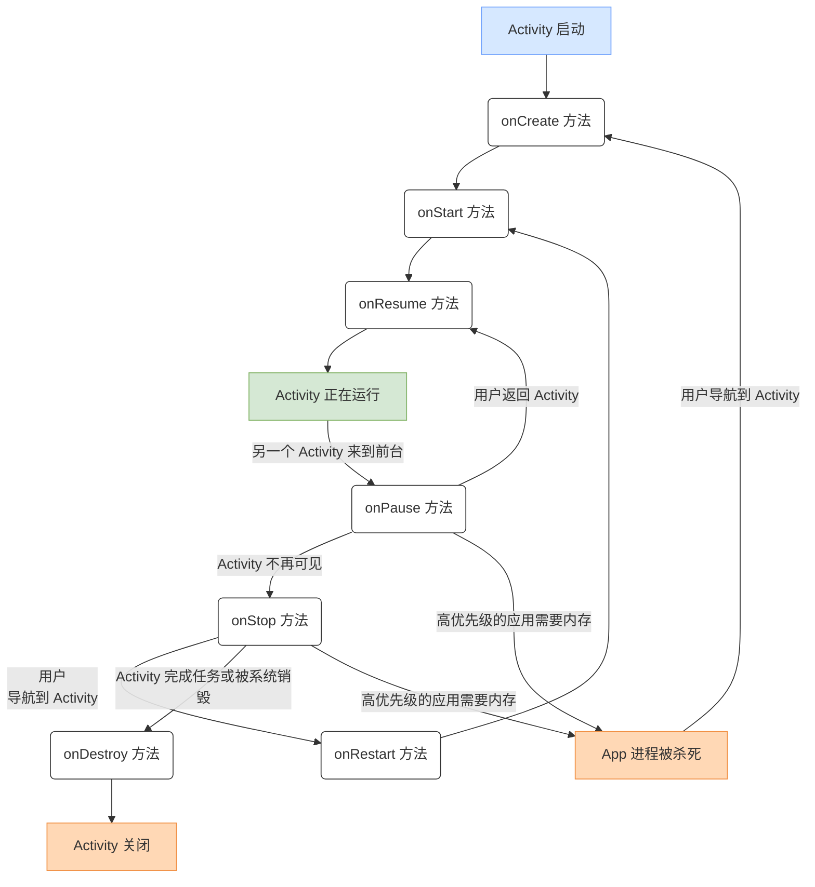
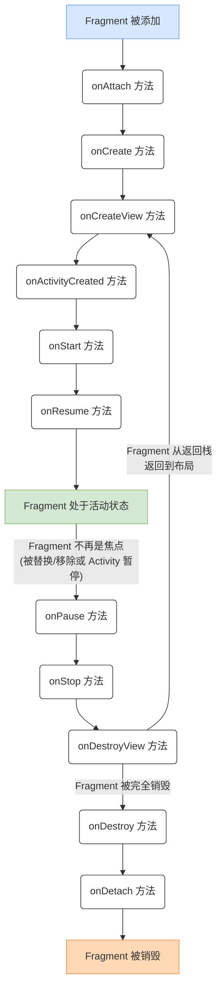

# 北工大安卓开发

## Android Software Stack

安卓系统从上到下分为四层：
1. Applications (应用层)

    就是手机上装的各种 APP。

2. Application Framework (应用框架层)

    提供了我们开发 APP 时需要调用的各种系统服务的 API，比如 Activity Manager, Window Manager, Content Providers 等。

3. Libraries and Android Runtime (库和安卓运行时)

    包含一系列用 C/C++ 写的库，来处理图形、媒体、数据库等高性能任务。这就是 Java/Kotlin 代码能跑起来的地方（在早期是 Dalvik 虚拟机，现在主要是 ART）。

    ::: info
    ART (Android Runtime) 是 Dalvik 的继任者，使用预编译技术 (Ahead-of-Time, AOT) ，它在应用安装时就把应用完全编译成本地机器码，换来了更高的性能但需要更多的存储空间。
    :::

4. Linux Kernel (Linux 内核)

    安卓是基于 Linux 内核的。

## 设计前提

由于移动设备资源非常有限，安卓开发非常关注性能和内存管理。

这个资源有限的考量，是后续所有复杂知识点（比如 Service、BroadcastReceiver、Activity生命周期）的都有在关注的根本。


## 四大组件 (Building Blocks)


1. Activities (活动)


    这是构成用户界面的基础。
    
    可以视作应用里的“一个屏幕”或“一个窗口” 。用户能看到和交互的一切，都发生在 Activity 里。

2. Services (服务)

     这是一个在后台运行的组件。

     当你用别的 APP 时，音乐播放器在后台依然能工作，这就是 Service 在发挥   作用。

3. Content Providers (内容提供者)

    它为多个应用提供了一个抽象的数据访问层。

    Content Provider 用来安全地在应用之间共享数据的机制（比如让别的 app 访问日历）。

4. Intents (意图)

    Intent 是系统消息，在设备内部运行，用于向应用程序通知各类事件

    你想从一个屏幕（Activity A）跳转到另一个屏幕（Activity B），就需要发送一个 Intent 。你想打开相机拍照，也是发送一个 Intent。

## 项目文件结构

安卓开发的项目结构规范中有3个重要文件：

1.  `AndroidManifest.xml` (清单文件)

    该清单文件是整个应用的地基，功能包括但不限于：
    - 列出了应用所有的 Activity 和 Service 。
    - 声明应用需要的权限（permission），比如访问网络、读取联系人 。
    - 声明应用的图标 (`android:icon`) 和名称 (`android:label`) 。
    - 指定启动 Activity ：通过 `<intent-filter>` 告诉系统，哪个 Activity 是点APP 图标时第一个打开的。

2. `java/` 或 `src/` 目录

    存放所有的 `.java` 或 `.kotlin` 源代码文件。

3. `res/` 目录

    存放所有非代码的静态资源。

    | 子目录       | 说明                             |
    |--------------|----------------------------------|
    | `drawable/`  | 存放图片资源                     |
    | `layout/`    | 存放界面布局文件（XML 格式）     |
    | `values/`    | 存放字符串（`strings.xml`）、颜色（`colors.xml`）、样式（`styles.xml`），尺寸值（`dimens.xml`）等资源文件 |

    Android Studio 会自动生成一个 `R.java` 文件，里面包含了所有资源的 ID，方便在代码中引用。 ex: `R.layout.activity_main` -> `res/layout/activity_main.xml` 。    

## 连接代码与布局 (XML) 

1. 布局文件 (`activity_main.xml`) - 位于 `/res/layout/`

    用来定义界面的外观和结构。

    - 它使用各种标签（View），比如 `<TextView>` (显示文本) 和 `<RelativeLayout>` (一种布局方式) 。

    -  和所有控件一样，它有两个非常重要的属性：`android:layout_width` 和 `android:layout_height`。

        - 值 `match_parent`：表示和父容器一样大。

        - 值 `wrap_content`：表示刚刚好能包住里面的内容。

2. Activity 代码 (`MainActivity.java` 或 `MainActivity.kt`)

    这是项目的入口，负责加载布局文件并处理用户交互，你应当把其用作 app 的 Controller。

    - 继承自 `AppCompatActivity`。

    - 在 Activity 创建时  `onCreate()`  方法自动被调用，其中最重要的一行是：

        ```java
        setContentView(R.layout.activity_main);  // 在 kotlin 中写法基本一致 
        ``` 

        这行代码会去加载 `R.java` 文件里 ID 为 `layout.activity_main` 的那个资源（即 `res/layout/activity_main.xml`），并把它作为这个 Activity 的界面显示出来。

#### 布局文件速览

这是用来绘制界面的 XML 布局文件，由嵌套的元素组成。

::: details 示例

```xml
<?xml version="1.0" encoding="utf-8"?>
<androidx.constraintlayout.widget.ConstraintLayout xmlns:android="http://schemas.android.com/apk/res/android"
    xmlns:app="http://schemas.android.com/apk/res-auto"
    xmlns:tools="http://schemas.android.com/tools"
    android:id="@+id/main"
    android:layout_width="match_parent"
    android:layout_height="match_parent"
    tools:context=".MainActivity">

    <TextView
        android:layout_width="wrap_content"
        android:layout_height="wrap_content"
        android:text="Hello World!"
        app:layout_constraintBottom_toBottomOf="parent"
        app:layout_constraintEnd_toEndOf="parent"
        app:layout_constraintStart_toStartOf="parent"
        app:layout_constraintTop_toTopOf="parent" />

</androidx.constraintlayout.widget.ConstraintLayout>
```

:::

常用元素：

| 组件         | 作用                         | 关键属性（代码示例）                |
|--------------|------------------------------|-------------------------------------|
| TextView     | 显示一段只读文字             | `android:text="你要显示的文字"`    |
| Button       | 可点击的按钮                 | `android:text="按钮上的文字"`       |
| ImageView    | 显示一张图片                 | `android:src="@drawable/molecule"` |
| EditText     | 输入和编辑文字的输入框       | `android:hint="提示文字"`           |
| CheckBox     | 多选框（可选多个）           | `android:text="复选框旁边的文字"`   |
| RadioGroup + RadioButton | 单选框（只能选一个，需配合使用） | `android:orientation="vertical"`（RadioGroup） |

所有 View 的通用属性：

```xml
android:id="@+id/xxx"         // 视图的唯一标识符
android:layout_width="..."   // 视图的宽度
android:layout_height="..."  // 视图的高度
android:padding="..."        // 视图内容与边界的间距
android:layout_margin="..."  // 视图与其他视图的间距
android:visibility="..."     // 视图的可见性 (visible, invisible, gone)
```

## Activities

### Activity 的生命周期

由于手机内存和电量有限，当你的 App 退到后台，系统可能会为了省内存而“杀死”它。了解 Activity 生命周期可以帮助你在 app 被 “杀死”之前保存工作，在回来时又能恢复。

核心状态：
<table>
  <tr>
    <td><strong>Active</strong></td>
    <td>在前台，用户能看到和交互</td>
  </tr>
  <tr>
    <td><strong>Paused</strong></td>
    <td>仍然可见，但被一个弹窗或通知挡住了一部分</td>
  </tr>
    <tr>
        <td><strong>Stopped</strong></td>
        <td>完全被其他 Activity 遮挡，退到后台了</td>
    </tr>
    <tr>
        <td><strong>Inactive/dead</strong></td>
        <td>从来没打开过app，或被系统杀死，内存被回收</td>
    </tr>
</table>



### 核心回调

许多重要回调都是成双成对的，在相反的时机被自动调用。

| 回调 | 说明 |
|------|------|
| 创建/销毁 | - |
| `onCreate()` | Activity 第一次被创建时调用。<br>这是你设置布局 (setContentView) 和初始化数据的地方 。 |
| `onDestroy()` | Activity 被销毁时调用。用来清理所有资源 (比如数据库连接) 。 |
| 前台/后台 | - |
| `onResume()` | Activity 进入前台，可以交互时调用。  |
| `onPause()` | Activity 失去前台焦点时调用 (比如来了个弹窗)。<br>该方法保证会被调用，是保存数据的好时机。 |
| 可见/不可见 | - |
| `onStart()` | Activity 变得对用户可见时调用。 |
| `onStop()` | Activity 不再对用户可见时调用（ex：按了 Home 键）。 |    


如果用户只是旋转屏幕，或者 App 在后台被系统回收了，`onCreate()` 会被重新调用，但所有数据（比如输入框里的字）都会丢失。

方法有二：

- `onSaveInstanceState(Bundle outState)` ：在 Activity 可能被销毁前调用。你用它来保存临时状态（比如输入框的文字）。

- `onCreate(Bundle savedInstanceState)` ：在 onCreate() 里，你可以通过检查 `savedInstanceState` 这个参数是否为 null，来判断是全新启动还是从保存的状态恢复。

## Fragments

Fragment 是一个可重用的子 Activity。你可以把它想象成一个可以嵌入到 Activity 里的小界面。你可以在多个 Activity 里重用同一个 Fragment。

Fragment 特点在于强大的灵活性，在处理不同屏幕尺寸和方向的布局上非常方便。

**创建 Fragment**

你的类首先要继承自 `Fragment` 类，然后实现以下方法：

- `onCreate()`：Fragment 附加到 Activity 时调用。
- `onCreateView()`：会在 `onCreate()` 之后调用，你需要在该方法里加载 Fragment 的布局文件并返回一个 View 对象。
- `onPause()`：当 Fragment 不再处于前台时调用，可以用于保存需要持久化的数据。

**Fragment 的生命周期**

Fragment 拥有自己的生命周期，同时依附于宿主 Activity 的生命周期。



**Fragment 的布局 XML**

Fragment 的界面也是由一个单独在 `res/layout/` 下的 XML 文件定义，语法也和 Activity 的布局文件一致。

```xml
<?xml version="1.0" encoding="utf-8"?>
<FrameLayout xmlns:android="http://schemas.android.com/apk/res/android"
    xmlns:tools="http://schemas.android.com/tools"
    android:layout_width="match_parent"
    android:layout_height="match_parent"
    tools:context=".BlankFragment">

    <!-- TODO: Update blank fragment layout -->
    <TextView
        android:layout_width="match_parent"
        android:layout_height="match_parent"
        android:text="@string/hello_blank_fragment" />

</FrameLayout>
```

要将 XML 和 `Fragment` 类关联起来，需要在 `onCreateView()` 方法中使用 `inflater.inflate()` 来加载这个 XML 布局文件，并把它转换成一个 View 对象返回给系统。例如：

```java
@Override
public View onCreateView(LayoutInflater inflater, ViewGroup container,
                         Bundle savedInstanceState) {
    // "R.layout.example_fragment" 就是这个 Fragment 自己的 XML 布局文件
    return inflater.inflate(R.layout.example_fragment, container, false); 
}
```

**把 Fragment 放进 Activity 的布局里**

有两种方法可以把 Fragment 放进 Activity 里。

1. 静态添加 (在 XML 里定义)

    你可以直接在 Activity 的布局 XML 里使用 `<fragment>` 标签来像添加一个 View 一样，使用 `<fragment>` 标签来添加 Fragment。例如：

    ```xml
    <LinearLayout xmlns:android="http://schemas.android.com/apk/res/android"
        android:layout_width="match_parent"
        android:layout_height="match_parent"
        android:orientation="horizontal">

        <fragment 
            android:name="com.example.news.ArticleListFragment" 
            android:id="@+id/list"
            android:layout_width="0dp"
            android:layout_height="match_parent"
            android:layout_weight="1" />

        <fragment 
            android:name="com.example.news.ArticleReaderFragment"
            android:id="@+id/viewer"
            android:layout_width="0dp"
            android:layout_height="match_parent"
            android:layout_weight="2" />

    </LinearLayout>
    ```

    - `android:name`：用来指定加载的 Fragment 类。
   - `android:id`：指定此 Fragment 的唯一 ID。

2. 在代码里动态添加

    这是更灵活、更常用的方法，用于在运行时切换 Fragment。

    在 Activity 的布局 XML 中，你需要预留一个空的占位符容器，如 `<FrameLayout>`。

    ```xml
    <FrameLayout
        android:id="@+id/fragment_container"
        android:layout_width="match_parent"
        android:layout_height="match_parent" />
    ```

    然后在 在 Activity 的 Java/Kotlin 代码中，你通过 `FragmentManager` 来执行一个 `FragmentTransaction` (片段事务)，把你的 Fragment 添加 (add) 或 替换 (replace) 到那个容器里。

    例如：

    ```java
    // 创建一个新的 Fragment 实例
    Fragment newFragment = new ExampleFragment();

    // 开始一个事务
    FragmentTransaction transaction = getFragmentManager().beginTransaction();

    // 把 fragment_container 容器里的内容替换成 newFragment
    transaction.replace(R.id.fragment_container, newFragment);
    transaction.addToBackStack(null);

    // 提交事务
    transaction.commit();
    ```


### `FragmentManager`

`FragmentManager` 的首要职责是管理应用中所有正在运行的 Fragment。在你的 Activity 中，你需要通过调用 `getFragmentManager()` 方法来获取其实例。

你可以通过 `FragmentManager` 的 `findFragmentById()` 或 `findFragmentByTag()` 方法来查找已经添加的 Fragment 实例。

```java
// 获取 FragmentManager 实例
FragmentManager fragmentManager = getFragmentManager();

// 通过 ID 查找 Fragment
Fragment fragment = fragmentManager.findFragmentById(R.id.fragment_container);
```

顺带一提，Tag 是一个字符串标识符，你可以在添加 View 和 Fragment 时通过 `.setTag()` 指定它，以便后续查找。

### `FragmentTransaction`

`FragmentTransaction` 则是用来执行对 Fragment 的增删改操作的。你可以通过 `FragmentManager` 的 `beginTransaction()` 方法来创建一个新的 `FragmentTransaction` 实例。

```java
// 开始一个 Fragment 事务
FragmentTransaction transaction = fragmentManager.beginTransaction();

// 添加一个新的 Fragment
transaction.add(R.id.fragment_container, new ExampleFragment());
// 提交事务
transaction.commit();
```

除了简单直接的 `add()` 方法，你还可以替换或移除 Fragment：

```java
// 替换 Fragment（最常用）
transaction.replace(R.id.fragment_container, new AnotherFragment());
// 移除 Fragment
transaction.remove(existingFragment);
```  

你还可以将一次事务添加到返回栈中，这样用户按返回键时可以撤销这次操作：

```java
// 把当前事务添加到返回栈
transaction.addToBackStack(null);
```

::: details 返回栈 (Back Stack)
你从 `Activity A` 跳转到 `Activity B`，`A` 就会被压在下面。你再跳转到 `Activity C`，`B` 也会被压下去。当你按手机的返回键时，`C` 会被销毁，`B` 就会露出来。这就是 Activity 的返回栈 。它是由系统自动管理的。

Fragment 没有这种自动的返回栈。想象一下：

1. 你在 `Activity A` 里，先显示 `Fragment 1`。

2. 你点一个按钮，用 `Fragment 2` 替换了 `Fragment 1`。

3. 这时，如果你不手动做点什么，`Fragment 1` 就会被彻底销毁。

当用户按返回键时，系统会以为你想退出 `Activity A`，整个应用就退出了，这显然不是我们想要的。

Fragment 的返回栈就是为了解决这个问题。它是一个可选的、需要你手动管理的栈，用来保存你执行过的 Fragment 操作。
:::

### 与 Activity 通信

有时，Fragment 需要告诉 Activity 发生了什么（ex: 用户点击了列表项），或者 Activity 需要告诉 Fragment 去做什么（ex: 刷新你的数据）。

**Fragment 如何找到它的宿主 Activity**

Fragment 可以通过调用 `getActivity()` 方法，来获得一个指向宿主 Activity 的引用。

一旦 `Fragment` 拿到了这个 Activity 对象，它就可以：
- 调用 `Activity` 的 public 方法。
- 使用 Activity 的上下文（Context）。

**Activity 如何找到它包含的 Fragment**

Activity 需要通过之前谈到的 `FragmentManager` 来查找已经添加的 Fragment 实例。例如：

```java
ExampleFragment fragment = (ExampleFragment) getFragmentManager()
        .findFragmentById(R.id.example_fragment);
```

## Layouts & View

ViewGroup 是一个容器，定义了它内部的 View 和 ViewGroup 是如何排列的。而 View 则是用户界面的基本构建块，比如按钮、文本框、图像等。

你有两种方式来创建布局，推荐的方式是通过 XML 文件来定义；虽也可以通过代码动态创建（ex: `Button btn = new Button(context);`），但这是不推荐的做法。

::: info
JetCompose 是一种更新更现代化的 UI 工具包，允许你使用纯 Kotlin 代码来构建界面。但还未流行开来，此处的“通过代码动态创建”并非指 JetCompose。
:::

当你加载一个 XML 布局时，里面的 ViewGroup 和 View 都会被实例化并转化为对应的 Java/Kotlin 对象。

> 之前已经提到过如何连接 Activity 与布局（`onCreate() { setContentView(...) }`），此处不再赘述。

通过代码获取 View 最常用的方法是 `findViewById()` 方法。例如：

```java
// 获取一个按钮
Button btn = (Button) findViewById(R.id.button);

// 获取父布局 - 默认返回类型为 ViewParent
var viewParent = btn.getParent();
// 获取根布局 - 转化为具体类型
View rootView =  (ConstraintLayout) btn.getRootView();
``` 

### 常见的 View


| 组件         | 作用                         | 关键属性（代码示例）                |
|--------------|------------------------------|-------------------------------------|
| TextView     | 显示一段只读文字             | `android:text="你要显示的文字"`    |
| Button       | 可点击的按钮                 | `android:text="按钮上的文字"`       |
| ImageView    | 显示一张图片                 | `android:src="@drawable/molecule"` |
| EditText     | 输入和编辑文字的输入框       | `android:hint="提示文字"`           |
| CheckBox     | 多选框（可选多个）           | `android:text="复选框旁边的文字"`   |
| RadioGroup + RadioButton | 单选框（只能选一个，需配合使用） | `android:orientation="vertical"`（RadioGroup） |

除了上述关键属性，组件之间还有一些通用属性，先前已有过涉猎：

- `android:id="@+id/button"` ：给控件一个唯一 id，好让代码能通过 `findViewById()` 找到它。
- `android:layout_width` 和 `android:layout_height` 指定控件的宽度和高度。

::: details 一个垂直单选按钮示例

```xml
<?xml version="1.0" encoding="utf-8"?>
<LinearLayout xmlns:android="http://schemas.android.com/apk/res/android"
    android:layout_width="match_parent"
    android:layout_height="match_parent"
    android:orientation="vertical"
    android:padding="16dp"
    android:background="#f5f5f5">

    <!-- 标题 -->
    <TextView
        android:layout_width="match_parent"
        android:layout_height="wrap_content"
        android:text="请选择您喜欢的编程语言："
        android:textSize="18sp"
        android:textStyle="bold"
        android:textColor="#333333"
        android:layout_marginBottom="16dp" />

    <!-- 单选框组 -->
    <RadioGroup
        android:id="@+id/languageRadioGroup"
        android:layout_width="match_parent"
        android:layout_height="wrap_content"
        android:orientation="vertical"
        android:background="@drawable/radio_group_background"
        android:padding="16dp">

        <!-- 第一个单选框 -->
        <RadioButton
            android:id="@+id/radioJava"
            android:layout_width="match_parent"
            android:layout_height="wrap_content"
            android:text="Java"
            android:textSize="16sp"
            android:textColor="#333333"
            android:buttonTint="@color/radio_button_color"
            android:padding="12dp" />

        <!-- 第二个单选框 -->
        <RadioButton
            android:id="@+id/radioKotlin"
            android:layout_width="match_parent"
            android:layout_height="wrap_content"
            android:text="Kotlin"
            android:textSize="16sp"
            android:textColor="#333333"
            android:buttonTint="@color/radio_button_color"
            android:padding="12dp" />

        <!-- 第三个单选框 -->
        <RadioButton
            android:id="@+id/radioPython"
            android:layout_width="match_parent"
            android:layout_height="wrap_content"
            android:text="Python"
            android:textSize="16sp"
            android:textColor="#333333"
            android:buttonTint="@color/radio_button_color"
            android:padding="12dp" />


</LinearLayout>
```
:::

### 常见的 Layout

| 布局类型 | 作用/特点  | 关键属性 |
|---|---|---| 
| LinearLayout     | 子视图排成一条直线（垂直或水平）   | `android:orientation="vertical"`/`"horizontal"`<br>& `android:layout_weight`   |
| RelativeLayout   | 子视图可相对父容器或其他控件定位     | `android:layout_alignParentBottom="true"`<br>& `android:layout_toRightOf="@id/label"` |
| TableLayout      | 类似 HTML 表格，控件排成行和列   | `android:layout_span`（跨列）<br>& `android:stretchColumns`（拉伸列宽）   |
| ScrollView      | 内容超出屏幕时可滚动，只能有一个子布局 | 无特殊属性 |

此外还有 `ConstraintLayout`（约束布局），你可以为每个 View 设置相对于别的 View 的约束条件（比如限制一个 View 右侧紧贴另一个 View 左侧）。该布局非常强大，现在是 Android Studio 的默认布局方式。
> 但课程 ppt 里对于这个布局实际致只是一笔带过，故也不再详述。

::: info weight - 权重
weight (权重) 用来决定在父容器中按比例分配空间。
:::

### Advance Layouts

这部分主要讲的是如何高效地显示列表数据。

#### Adapter 速览
> ppt 里这部分没有介绍怎么创建自己的 Adapter。

`ListView` (或者 `RecyclerView`) 本身只是一个空的列表容器——它不知道要显示什么数据，也不知道每一行长什么样。你需要一个“数据管家”，这个管家就是 Adapter 。

Adapter 的工作是：

1. 持有你的数据（ex：一个 `List<String>`）。

2. 当 `ListView` 需要显示第5行时，Adapter 就会获取第5个数据。

3. 创建一个布局，把数据填充进去。

4. 将填充好的 View 返回给 `ListView` 去显示。

`SimpleAdapter` (简单适配器) 专门为 `ListView` 设计     ，专门用来把 `List<Map<String, ?>>` 里的数据显示出来。

**构造函数**
```java
var adapter = new SimpleAdapter(this, 
     data, 
     R.layout.row_item,
     new String[]{"name", "age"}, 
     new int[]{R.id.nameTextView, R.id.ageTextView});
``` 
- `data`：你的数据，一个 Map 列表。
- `resource`：你为单独一行设计的 XML 布局文件。
- `from`：一个字符串数组，告诉 `SimpleAdapter ` 你要从 Map 里取哪些键的数据。
- `to`：一个整数数组，告诉 `SimpleAdapter ` 你要把数据填充到哪个控件里。

#### `RecyclerView`

由于 `ListView` 性能不好，现在已经被 `RecyclerView` 完全取代。

它之所以性能好，是因为它会回收 (Recycle) 视图。当一行滚出屏幕时，它不会销毁那行的 View，而是会回收它——用新数据填充 View，然后显示在刚滚进屏幕的底部。

**添加依赖**

```
dependencies {
    implementation 'com.android.support:recyclerview-v7:28.0.0'
}
```

**在 XML 中使用**

在你的 Activity 布局里，像普通控件一样添加它。

```xml
<android.support.v7.widget.RecyclerView
    android:id="@+id/my_recycler_view"
    android:layout_width="match_parent"
    android:layout_height="match_parent" />
```

**在代码中使用**

在 `onCreate() `里，你必须为 `RecyclerView `设置两个关键组件 ：

- `LayoutManager`： 这是 RecyclerView 比 ListView 强大的地方。LayoutManager 决定列表是如何排列的。
  - `new LinearLayoutManager(this)`：垂直列表。
  - `new LinearLayoutManager(this, LinearLayoutManager.VERTICAL, false)`：水平排列。
  - `new GridLayoutManager(this, 2)`：两列的网格布局。
- `Adapter` (适配器)： 需要一个 Adapter 来管理数据和创建视图。


**示例**

```java
public class MainActivity extends Activity {
    private RecyclerView recyclerView;
    private RecyclerView.LayoutManager layoutManager;
    private RecyclerView.Adapter mAdapter;
    private List<String> myDataset;

    @Override
    protected void onCreate(Bundle savedInstanceState) {
        super.onCreate(savedInstanceState);
        setContentView(R.layout.activity_main);

        // 找到布局中的 RecyclerView 控件
        recyclerView = (RecyclerView) findViewById(R.id.my_recycler_view);

        // 初始化数据
        myDataset = new ArrayList<>(Arrays.asList("第一行数据", "第二行数据", "第三行数据", "这是第四行", "Hello World"));

        // 关联 LayoutManager
        layoutManager = new LinearLayoutManager(this); 
        recyclerView.setLayoutManager(layoutManager);

        // 创建 Adapter 并与 RecyclerView 关联
        mAdapter = new MyAdapter(myDataset);
        recyclerView.setAdapter(mAdapter);
    }
}
```

#### `CardView`

`CardView` 是一个容器，能把你放进去的任何布局（比如一个` LinearLayout`）变成一张漂亮的卡片，自动带上圆角和阴影。

它非常常用，通常被用作 `RecyclerView` 列表里的一行内容的根布局，让你的列表看起来更现代。

**添加依赖**

```
dependencies {
    implementation 'androidx.cardview:cardview:1.0.0'
}
```

**使用**

你像使用普通布局一样使用它，它会自动给里面的 View 加上卡片背景。例如：

```xml
<android.support.v7.widget.CardView
    android:id="@+id/card_view"
    android:layout_width="200dp"
    android:layout_height="200dp"
    card_view:cardCornerRadius="4dp"> 

    <TextView
        android:id="@+id/info_text"
        android:layout_width="match_parent"
        android:layout_height="match_parent" />

</android.support.v7.widget.CardView>
```

## Action Bar

Action Bar（或 ToolBar）就是显示在应用屏幕最顶部的那条栏

Action Bar 是通过主题 (Theme) 来控制的。这意味着当你在 `AndroidManifest.xml` 里选择一个带 Action Bar 的主题（ex: `Theme.Holo`），它就会显示出来，反之亦然(ex: `Theme.Holo.NoActionBar`)。

```xml [AndroidManifest.xml]
<application
    android:theme="@style/Theme.AppCompat.Light.DarkActionBar">
    <!-- ... -->
</application>
```

当然你也可以选择一个有 Action Bar 的主题，然后在代码里动态显隐：

```java
// 获取 Action Bar
ActionBar actionBar = getActionBar();
// 显隐
actionBar.hide();
actionBar.show();
```

想要为 Action Bar 添加自定义的按钮是很常见的需求，也需要先定义 XML 布局然后在代码中加载。

**在 XML 中定义**

1. 你需要在 `res/ `文件夹下创建一个新的 `menu` 文件夹。
2. 在 `res/menu/` 文件夹里，创建一个 XML 文件（比如 `main_activity_menu.xml`）。
3. 在这个 XML 文件里，使用 `<menu>` 作为根标签，里面用 `<item>` 标签来定义每一个按钮。

例如：

```xml [res/menu/main_activity_menu.xml]
<?xml version="1.0" encoding="utf-8"?>
<menu xmlns:android="http://schemas.android.com/apk/res/android">

    <item
        android:id="@+id/menu_save"
        android:icon="@drawable/ic_menu_save"
        android:title="@string/menu_save" 
        android:showAsAction="ifRoom" /> 

    <item
        android:id="@+id/menu_search"
        android:icon="@drawable/ic_menu_search"
        android:title="@string/menu_search"
        android:showAsAction="ifRoom|collapseActionView" 
        android:actionViewClass="android.widget.SearchView" /> 

    <item
        android:id="@+id/action_settings"
        android:title="@string/action_settings"
        android:showAsAction="never" />

</menu>
```
- `android:title`：按钮文字。（`@string/menu_save`，指向 `strings.xml` 里的内容。）
- `android:icon`：按钮图标。
- `android:showAsAction`：按钮显示方式。

    | 取值    | 含义     | 
    |---|---|
    | `ifRoom`   | 有空间时显示为图标，否则折叠进“...”(Overflow)菜单  
    | `withText` | 同时显示图标和文字  |
    | `always`   | 永远显示为图标，可能挤占空间 |
    | `never`    | 永远不显示为图标，只在“...”菜单里显示文字 |

**代码加载**

接下来在 Activity 中加载菜单，你要在需要 Action Bar 的 Activity 中重写 `onCreateOptionsMenu()` 这个回调。

```java
@Override
public boolean onCreateOptionsMenu(Menu menu) {
    // 获取一个菜单加载器
    MenuInflater inflater = getMenuInflater();
    
    // 使用加载器，把 main_activity_menu.xml 加载到  menu 对象里
    inflater.inflate(R.menu.main_activity_menu, menu);

    return true;
}
```

**响应 Action Bar**

想要接收来自 Action Bar 上的事件，你需要在 Activity 中重写 `onOptionsItemSelected()` 回调 。每当用户点击任何一个 Action Bar 按钮时，系统都会调用这个方法，并把被点击的那个 `MenuItem` (菜单项) 传给你。

例如：

```java
@Override
public boolean onOptionsItemSelected(MenuItem item) {
    // 通过 item.getItemId() 来判断用户到底点了哪个按钮
    switch (item.getItemId()) {
        case R.id.menu_save:
            // 用户点了“保存”按钮
            // ..
            return true; // 表示事件已被处理

        case R.id.menu_settings:
            // 用户点了“设置”按钮
            // ..
            return true;

        case android.R.id.home:
            // 用户点了左上角的“向上”箭头
            // 执行返回主页的操作
            Intent intent = new Intent(this, HomeActivity.class);
            intent.addFlags(Intent.FLAG_ACTIVITY_CLEAR_TOP);
            startActivity(intent);
            return true;

        default:
            // 如果不是我们认识的 ID，就交给父类去处理
            return super.onOptionsItemSelected(item); 
    }
}
```