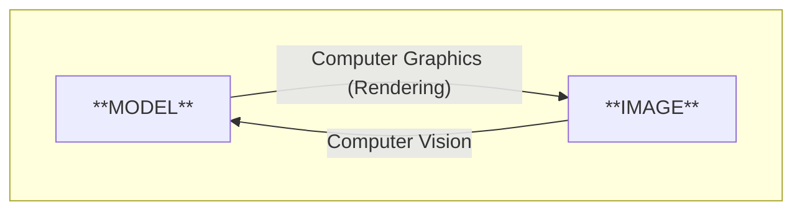
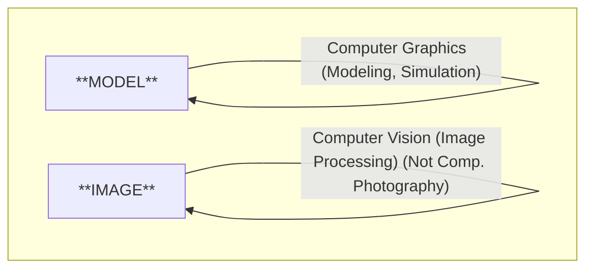

# Lec_1

**the quick brown fox jumps over the lazy dog.**

**THE QUICK BROWN FOX JUMPS OVER THE LAZY DOG.**

课程主页：https://sites.cs.ucsb.edu/~lingqi/teaching/games101.html

闫令琪老师推荐的书：Steve Marschner and Peter Shirley, *Fundamentals of Computer Graphics* 。第三版或更新版本。

## Overview

**Course Topic (mainly 4 parts):**

- Rasterization 光栅化

    > 把三维空间的几何形体显示在屏幕上，就是光栅化。实时和离线的区分是30fps。

- Curves and Meshes

-  Ray Tracing

-  Animation / Simulation

**GAMES101 is NOT about:**
- Using OpenGL / DirectX / Vulkan
- The syntax of Shaders
- 在这节课后，你就能够自己把它们学起来。

此外，不会讲计算机视觉（需要推测图形）的内容，因为不属于计算机图形学的范畴。 

但随着技术发展，实际上两者的界限越来越模糊，交叉越来越多。

 

 

**Assignments:**
- with provided code skeleton and virtual machine image
- weekly (usually no more than 20 lines of code)
- Language: C++

作业非强制，纯练手。

Website: http://www.smartchair.org/GAMES2020Coures-YLQ/

## Review of Linear Algebra

