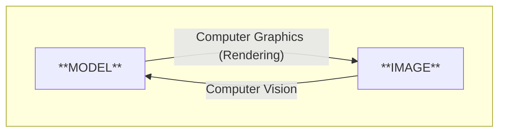
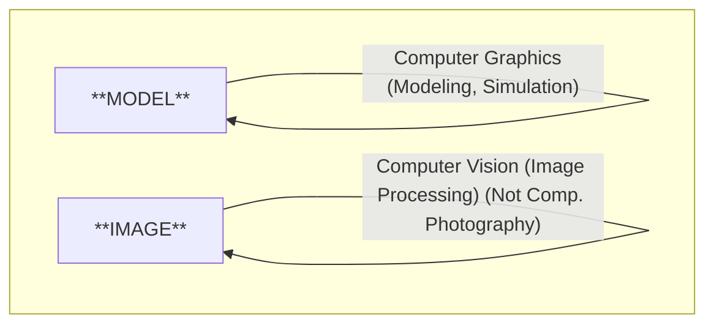
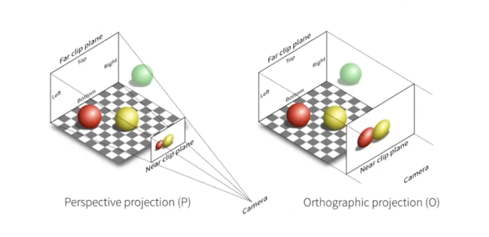

# Lec_1

**the quick brown fox jumps over the lazy dog.**

**THE QUICK BROWN FOX JUMPS OVER THE LAZY DOG.**

课程主页：https://sites.cs.ucsb.edu/~lingqi/teaching/games101.html

闫令琪老师推荐的书：Steve Marschner and Peter Shirley, *Fundamentals of Computer Graphics* 。第三版或更新版本。

## Overview

**Course Topic (mainly 4 parts):**

- Rasterization 光栅化

    > 把三维空间的几何形体显示在屏幕上，就是光栅化。实时和离线的区分是30fps。

- Curves and Meshes

-  Ray Tracing

-  Animation / Simulation

**GAMES101 is NOT about:**
- Using OpenGL / DirectX / Vulkan
- The syntax of Shaders
- 在这节课后，你就能够自己把它们学起来。

此外，不会讲计算机视觉（需要推测图形）的内容，因为不属于计算机图形学的范畴。 

但随着技术发展，实际上两者的界限越来越模糊，交叉越来越多。

 

 

**Assignments:**
- with provided code skeleton and virtual machine image
- weekly (usually no more than 20 lines of code)
- Language: C++

作业非强制，纯练手。

Website: http://www.smartchair.org/GAMES2020Coures-YLQ/

## Review of Linear Algebra

图形学所依赖：
- Basic Math ——线性代数，微积分，统计学

- Basic Physics—— 经典力学，光学

- 其他——信号处理，数学分析

- 一点美感

#### Vectors

向量可以表现一个方向。ex: $\vec{v} = (1,2,3)$

单位向量表示一个方向上模长为1的向量：$\hat{v} = \frac{\vec{v}}{|\vec{v}|}$

在图形学上，向量默认一般是列向量。ex:
$$\vec{v} = \begin{bmatrix}
1 \\
2 \\
3
\end{bmatrix}$$

向量的转置是将行向量和列向量互换。ex:
$$\vec{v}^T = \begin{bmatrix}
1 & 2 & 3
\end{bmatrix}$$

在笛卡尔系（Cartesian Coordinate System）中，向量的长度的计算非常简单：
$$|\vec{v}| = \sqrt{1^2 + 2^2 + 3^2} = \sqrt{14}$$

向量的加法就是简单的分量相加，而乘法则有两种方式：点乘和叉乘。

**点乘（内积，dot product）**

-  点乘的结果是一个标量（scalar）：$\vec{a} \cdot \vec{b} = a_1b_1 + a_2b_2 + a_3b_3$
- 也可以表示为：$\vec{a} \cdot \vec{b} = |\vec{a}||\vec{b}|\cos\theta$
- $cos\theta = \frac{\vec{a} \cdot \vec{b}}{|\vec{a}||\vec{b}|}$  &      $cos\theta = \hat{a} \cdot \hat{b}$

点乘在图形学中最重要的应用就是计算两个向量的夹角。

点乘也满足诸多性质：
- 交换律：$\vec{a} \cdot \vec{b} = \vec{b} \cdot \vec{a}$
- 分配律：$\vec{a} \cdot (\vec{b} + \vec{c}) = \vec{a} \cdot \vec{b} + \vec{a} \cdot \vec{c}$
- 结合律：$(k\vec{a}) \cdot \vec{b} = k(\vec{a} \cdot \vec{b}) = \vec{a} \cdot (k\vec{b})$

点乘可以用来计算投影（projection）。ex:

- $\vec{b}_\perp$: projection of $\vec{b}$ on $\vec{a}$
- $\vec{b}_\perp = k\cdot\hat{a}$
- $k = \|\vec{b}_\perp\| = \|\vec{b}\| \cos\theta$

投影的好处在于可以让我们分解一个向量。ex: $\vec{b} = \vec{b}_\perp + (\vec{b} - \vec{b}_\perp)$

::: tip
对于向量，$\|\vec{v}\|$ 和 $|\vec{v}\|$ 都可以表示向量的模长。
:::

点乘还可以用来判断方向。ex:
- $\vec{a} \cdot \vec{b} > 0$ ，则夹角： $\theta < 90^\circ$
- $\vec{a} \cdot \vec{b} < 0$ ，则夹角： $\theta > 90^\circ$
- $\vec{a} \cdot \vec{b} = 0$ ，则夹角： $\theta = 90^\circ$

**叉乘（外积，cross product）**

- 叉乘的结果是一个向量：$\vec{a} \times \vec{b} = \begin{vmatrix}
\hat{i} & \hat{j} & \hat{k} \\
a_1 & a_2 & a_3 \\
b_1 & b_2 & b_3
\end{vmatrix}$

- $\vec{a} \times \vec{b} = -\vec{b} \times \vec{a}$
- 大小关系：$||\vec{a} \times \vec{b}|| = ||\vec{a}||\cdot||\vec{b}||\sin\theta$

叉乘的结果垂直于两个向量所张成的平面，其方向可以使用右手法则（right-hand rule）来确定。

ex：令食指垂直于大拇指和中指，右手大拇指指向 $\vec{a}$ 方向，中指指向 $\vec{b}$ 方向，则食指指向 $\vec{a} \times \vec{b}$ 方向。

利用叉乘，可以在三维空间中搭建一个正交坐标系（orthonormal basis）。
- 右手系： $\vec{x}\times \vec{y} = \vec{z}$
- 左手系： $\vec{x}\times \vec{y} = -\vec{z}$

满足一些性质：
- 分配律：$\vec{a} \times (\vec{b} + \vec{c}) = \vec{a} \times \vec{b} + \vec{a} \times \vec{c}$
- 结合律：$(k\vec{a}) \times \vec{b} = k(\vec{a} \times \vec{b}) = \vec{a} \times (k\vec{b})$
- $\vec{a} \times \vec{a} = 0$
- $\vec{a} \times k\vec{b} = k(\vec{a} \times \vec{b})$
- $\vec{a} \times \vec{b} = -(\vec{b} \times \vec{a})$

两个列向量的叉乘可以表示为一个行列式（determinant）：
$$\vec{a} \times \vec{b} = \begin{vmatrix}
\hat{i} & \hat{j} & \hat{k} \\
a_1 & a_2 & a_3 \\
b_1 & b_2 & b_3
\end{vmatrix} = (a_2b_3 - a_3b_2, a_3b_1 - a_1b_3, a_1b_2 - a_2b_1)$$

叉乘的应用：
- 计算左和右

    ex: $\vec{a} \times \vec{b}$ 结果为正，说明 $\vec{b}$ 在 $\vec{a}$ 的左边；反之亦然。

- 计算内和外

    ex: 对于三角形ABC（逆时针），有一点 $\vec{p}$，如果 $\vec{AB} \times \vec{AP}$，$\vec{BC} \times \vec{BP}$，$\vec{CA} \times \vec{CP}$ 都是正的，则 $\vec{p}$ 在三角形内；反之亦然。

#### Matrices

矩阵就是一组数的二维数组。ex:
$$\mathbf{A} = \begin{bmatrix}
1 & 2 & 3 \\
4 & 5 & 6 \\
7 & 8 & 9
\end{bmatrix}$$

矩阵最重要的操作就是乘法。但可以相乘的矩阵必须满足一定条件：第一个矩阵的列数等于第二个矩阵的行数。

ex: Nx3矩阵可以和3xM矩阵相乘，结果是一个NxM矩阵。

结果矩阵的每个元素是通过第一个矩阵的行向量和第二个矩阵的列向量的点乘得到的。ex:
$$\mathbf{C} = \mathbf{A}\mathbf{B}$$
$$c_{ij} = \sum_{k=1}^{n} a_{ik} b_{kj}$$   

ex:
$$\begin{bmatrix}
1 & 2 \\
3 & 4
\end{bmatrix} \begin{bmatrix}
5 & 6 & 7 \\
8 & 9 & 10
\end{bmatrix} = \begin{bmatrix}
1\cdot5 + 2\cdot8 & 1\cdot6 + 2\cdot9 & 1\cdot7 + 2\cdot10 \\
3\cdot5 + 4\cdot8 & 3\cdot6 + 4\cdot9 & 3\cdot7 + 4\cdot10
\end{bmatrix} = \begin{bmatrix}
21 & 24 & 27 \\
47 & 54 & 61
\end{bmatrix}$$

矩阵乘法满足的一些性质：
- 不满足交换律：$\mathbf{A}\mathbf{B} \neq \mathbf{B}\mathbf{A}$
- 满足结合律：$\mathbf{A}(\mathbf{B}\mathbf{C}) = (\mathbf{A}\mathbf{B})\mathbf{C}$
- 满足分配律：$\mathbf{A}(\mathbf{B} + \mathbf{C}) = \mathbf{A}\mathbf{B} + \mathbf{A}\mathbf{C}$

矩阵可以和向量相乘，结果是一个新的向量。ex:
$$\mathbf{A}\vec{v} = \begin{bmatrix}
1 & 2 & 3 \\
4 & 5 & 6 \\
7 & 8 & 9
\end{bmatrix} \begin{bmatrix}
1 \\
2 \\
3
\end{bmatrix} = \begin{bmatrix}
1\cdot1 + 2\cdot2 + 3\cdot3 \\
4\cdot1 + 5\cdot2 + 6\cdot3 \\
7\cdot1 + 8\cdot2 + 9\cdot3
\end{bmatrix} = \begin{bmatrix} 14 \\ 32 \\ 50 \end{bmatrix}$$

矩阵的转置是将行和列互换。ex:
$$\mathbf{A}^T = \begin{bmatrix}
1 & 4 & 7 \\
2 & 5 & 8 \\
3 & 6 & 9
\end{bmatrix}$$

矩阵的转置的乘积满足一个特殊的性质：
$$(\mathbf{A}\mathbf{B})^T = \mathbf{B}^T \mathbf{A}^T$$

单位矩阵（identity matrix）是一个对角矩阵，对角线上的元素为1，其余元素为0。ex:
$$\mathbf{I} = \begin{bmatrix}
1 & 0 & 0 \\
0 & 1 & 0 \\
0 & 0 & 1
\end{bmatrix}$$

单位矩阵的作用类似于数字1，对于任何矩阵 $\mathbf{A}$，都有 $\mathbf{A}\mathbf{I} = \mathbf{I}\mathbf{A} = \mathbf{A}$。

通过单位矩阵，我们可以定义矩阵的逆（inverse）。

$$\mathbf{A}\mathbf{A}^{-1} = \mathbf{A}^{-1}\mathbf{A} = \mathbf{I}$$

矩阵的逆的乘积满足一个特殊的性质：
$$(\mathbf{A}\mathbf{B})^{-1} = \mathbf{B}^{-1} \mathbf{A}^{-1}$$

其实，我们可以把向量的相乘也看作是矩阵的乘法。

- 点乘：

    $$ \vec{a} \cdot \vec{b} = \vec{a}^T \vec{b} = \begin{bmatrix}
    a_1 & a_2 & a_3
    \end{bmatrix} \begin{bmatrix}
    b_1 \\
    b_2 \\
    b_3
    \end{bmatrix} = (a_1b_1 + a_2b_2 + a_3b_3)$$

- 叉乘：

    把a转化为一个反对称矩阵（skew-symmetric matrix）$\mathbf{A}$，然后和b相乘。

    $$\vec{a} \times \vec{b} = \mathbf{A}\vec{b} = \begin{bmatrix}
    0 & -a_3 & a_2 \\
    a_3 & 0 & -a_1 \\
    -a_2 & a_1 & 0  
    \end{bmatrix} \begin{bmatrix}
    b_1 \\
    b_2 \\
    b_3
    \end{bmatrix}$$

## Transformations

**Scale Matrix (缩放矩阵)**

在 x 轴上缩放0.5，在 y 轴上缩放2：
$$\mathbf{S} = \begin{bmatrix}
0.5 & 0 \\
0 & 2
\end{bmatrix}$$ 
令一个向量 $\vec{v} = \begin{bmatrix} x \\ y \end{bmatrix}$，则缩放后的结果为：
$$\mathbf{S}\vec{v} = \begin{bmatrix}
0.5 & 0 \\
0 & 2
\end{bmatrix} \begin{bmatrix} x \\ y \end{bmatrix} = \begin{bmatrix} 0.5x \\ 2y \end{bmatrix}$$

**Shear Matrix (错切矩阵)**

切变矩阵可以将一个矩形变成一个平行四边形。

ex：
$$\mathbf{H} = \begin{bmatrix}
1 & k \\
0 & 1
\end{bmatrix}$$
则 $\vec{v}$ 经过切变后的结果为：
$$\mathbf{H}\vec{v} = \begin{bmatrix}
1 & k \\
0 & 1
\end{bmatrix} \begin{bmatrix} x \\ y \end{bmatrix} = \begin{bmatrix} x + ky \\ y \end{bmatrix}$$

对于结果生成的平行四边形，每个点点 y 轴不变，但 x 轴会根据 y 的值进行平移。

**Rotation Matrix (旋转矩阵)**

我们将一个矩形，旋转（默认逆时针旋转，绕原点）一个角度 $\theta$，则旋转矩阵为：
$$\mathbf{R} = \begin{bmatrix}
\cos\theta & -\sin\theta \\
\sin\theta & \cos\theta
\end{bmatrix}$$

::: details 推导

我们考虑一个单位正方形，四个顶点分别为 (1,0), (0,1), (-1,0), (0,-1)，将旋转 $\theta$ 角度后。

先考虑 (1,0) 点，旋转后变为 $(\cos\theta, \sin\theta)$ 。因此：
$$\begin{bmatrix}
\cos\theta \\
\sin\theta
\end{bmatrix} = \begin{bmatrix}
A & B \\
C & D
\end{bmatrix} \begin{bmatrix}
1 \\
0
\end{bmatrix}$$

计算矩阵叉积，可得：
$$A = \cos\theta, C = \sin\theta$$

同理我们带入点 (0,1)，可得 ：

$$B = -\sin\theta, D = \cos\theta$$
:::

旋转矩阵是正交的（orthogonal），即一个矩阵的转置等于其逆矩阵：$\mathbf{R}^T = \mathbf{R}^{-1}$。

我们可以简单地验证一下：
$$(\mathbf{R}\mathbf{R}^T) = \begin{bmatrix}
\cos\theta & -\sin\theta \\
\sin\theta & \cos\theta
\end{bmatrix} \begin{bmatrix}
\cos\theta & \sin\theta \\
-\sin\theta & \cos\theta
\end{bmatrix} = \begin{bmatrix}
1 & 0 \\
0 & 1
\end{bmatrix}$$

**Liner Transformation (线性变换)**

先前提到的缩放，切变，旋转矩阵都属于线性变换。

对于线性变化后的 x 和 y 坐标，可以表示为：
$$x' = ax + by$$
$$y' = cx + dy$$

可以视作一个矩阵和向量的乘积：
$$\begin{bmatrix}
x' \\
y'
\end{bmatrix} = \begin{bmatrix}
a & b \\
c & d
\end{bmatrix} \begin{bmatrix}
x \\
y
\end{bmatrix}$$ 

#### Affine Transformation (仿射变换)

仿射变换是线性变换的推广，允许平移操作。
$$x' = ax + by + t_1$$
$$y' = cx + dy + t_2$$

可以表示为：
$$\begin{bmatrix}
x' \\
y'
\end{bmatrix} = \begin{bmatrix}
a & b \\
c & d
\end{bmatrix} \begin{bmatrix}
x \\
y
\end{bmatrix} + \begin{bmatrix}
t_1 \\
t_2
\end{bmatrix}$$

可见仿射变换不属于先前提到的线性变换。不过平移本身上一个非常简单的操作，我们不想将其复杂化。于是，我们引入齐次坐标（homogeneous coordinates）。

#### Homogeneous Coordinates (齐次坐标)

齐次坐标的引入是为了将仿射变换表示为矩阵乘法。

通过齐次坐标转化：
- 2D 点：$(x, y) \rightarrow (x, y, 1)$
- 2D 向量：$(x, y) \rightarrow (x, y, 0)$   

表示平移：
$$\begin{bmatrix}
x' \\
y' \\
w'
\end{bmatrix} = \begin{bmatrix}
1 & 0 & t_1 \\
0 & 1 & t_2 \\
0 & 0 & 1
\end{bmatrix} \begin{bmatrix}
x \\
y \\
1
\end{bmatrix} = \begin{bmatrix}
x + t_1 \\
y + t_2 \\
1
\end{bmatrix}$$

注意到向量和点的区别，向量的齐次坐标最后一位是0，因此平移矩阵对向量没有影响，此为向量方向不变的体现。

在齐次坐标中，点和向量的加减：
- vector + vector = vector
- point + vector = point
- point - point = vector
- point + point = ???

一般来说，点点相加没有意义。但在齐次坐标中，我们将相加结果除以 w，能够得到中点。

注意到，在先前的变化中：
$$\begin{bmatrix}
x' \\
y' \\
\end{bmatrix} = \begin{bmatrix}
a & b \\
c & d
\end{bmatrix} \begin{bmatrix}
x \\
y
\end{bmatrix} + \begin{bmatrix}
t_1 \\
t_2
\end{bmatrix}$$

我们可以轻松地将其转化为齐次坐标形式（注意a, b, c, d）：

$$\begin{bmatrix}
x' \\
y' \\
1
\end{bmatrix} = \begin{bmatrix}
a & b & t_1 \\
c & d & t_2 \\
0 & 0 & 1
\end{bmatrix} \begin{bmatrix}
x \\
y \\
1
\end{bmatrix}$$

::: tip
在二维的仿射变化中，齐次坐标的最后一位始终为0..1。但在其他变换中，可能有所不同。
:::

#### Inverse Transformation (逆变换)

将一个变换恢复到原始状态，即求逆变换。

恰巧，逆变换的矩阵刚好是原变换矩阵的逆矩阵。

毕竟：
$$
\mathbf{M} \mathbf{M}^{-1} \begin{bmatrix}
x \\
y \\
1
\end{bmatrix} = \mathbf{I} \begin{bmatrix}
x \\
y \\
1
\end{bmatrix} = \begin{bmatrix}
x \\
y \\
1
\end{bmatrix}
$$

#### Composing Transformations (复合变换)

一个复杂的变换可以由多个简单变组合而成，其变换的顺序操作是固定的（不满足交换律）。

操作的顺序从右到左排列（$A_1$ -> $A_2$ -> $A_3$）：

$$\mathbf{A_3} \mathbf{A_2} \mathbf{A_1} \begin{bmatrix}
x \\
y \\
1
\end{bmatrix}$$

将多个变换矩阵相乘，能得到一个新的变换矩阵，    表示一个复杂的变换。

ex：先在 x 轴上平移1个单位，再旋转45度。

$$\mathbf{T} = \begin{bmatrix}
1 & 0 & 1 \\
0 & 1 & 0 \\
0 & 0 & 1
\end{bmatrix} \begin{bmatrix}
\cos 45^\circ & -\sin 45^\circ & 0 \\
\sin 45^\circ & \cos 45^\circ & 0 \\ 
0 & 0 & 1
\end{bmatrix} = \begin{bmatrix}
\frac{\sqrt{2}}{2} & -\frac{\sqrt{2}}{2} & 1 \\
\frac{\sqrt{2}}{2} & \frac{\sqrt{2}}{2} & 0 \\
0 & 0 & 1
\end{bmatrix}$$ 

#### Decomposing Complex Transformations (分解复杂变换)

一个复杂的变换可以分解为多个简单变换的乘积。

ex：先前提到，旋转默认是围绕原点的。那如果我们想围绕某个点 $(x_c, y_c)$ 旋转该怎么办？

我们可以将其分解为三个步骤：
1. 平移点 $(x_c, y_c)$ 到原点
2. 围绕原点旋转 $\theta$ 角度
3. 将点平移回点 $(x_c, y_c)$

## 3D Transformations

在三维空间中的，依旧需要将向量转化为齐次坐标：
- 3D 点：$(x, y, z) \rightarrow (x, y, z, 1)$
- 3D 向量：$(x, y, z) \rightarrow (x, y, z, 0)$

使用齐次坐标表示变化：
$$\begin{bmatrix}
x' \\
y' \\
z' \\
1
\end{bmatrix} = \begin{bmatrix}
a & b & c & t_1 \\
d & e & f & t_2 \\
g & h & i & t_3 \\
0 & 0 & 0 & 1
\end{bmatrix} \begin{bmatrix}
x \\
y \\
z \\
1
\end{bmatrix}$$

在三维空间中，最复杂的操作就是操作可能就是旋转了。对于任意的旋转可能很难写，我们写考虑绕 x, y, z 轴的旋转。

1. 绕 x 轴旋转 $\theta$ 角度：
$$\mathbf{R_x} = \begin{bmatrix}
1 & 0 & 0 & 0 \\
0 & \cos\theta & -\sin\theta & 0 \\
0 & \sin\theta & \cos\theta & 0 \\
0 & 0 & 0 & 1  
\end{bmatrix}$$

2. 绕 y 轴旋转 $\theta$ 角度：
$$\mathbf{R_y} = \begin{bmatrix}
\cos\theta & 0 & \sin\theta & 0 \\
0 & 1 & 0 & 0 \\
-\sin\theta & 0 & \cos\theta & 0 \\
0 & 0 & 0 & 1  
\end{bmatrix}$$

3. 绕 z 轴旋转 $\theta$ 角度：
$$\mathbf{R_z} = \begin{bmatrix}
\cos\theta & -\sin\theta & 0 & 0 \\
\sin\theta & \cos\theta & 0 & 0 \\
0 & 0 & 1 & 0 \\
0 & 0 & 0 & 1  
\end{bmatrix}$$

::: tip
注意到此处只有绕 y 轴旋转时 $\sin\theta$ 前面是正号，其他两个轴都是负号。这是因为循环对称性：x 叉乘y = z，y 叉乘 z = x，z 叉乘 x = y 而不是 x 叉乘 z。
::::

考虑任意一个旋转，我们都可以将其拆解为为绕 x, y, z 轴旋转的复合变换：

$$\mathbf{R(\alpha, \beta, \gamma)} = \mathbf{R_x}(\alpha)\mathbf{R_y}(\beta) \mathbf{R_z}(\gamma)$$

**Rodrigues' Rotation Formula (罗德里格斯旋转公式)**

给定一个旋转角度 $\theta$ 和一个单位旋转轴 $\hat{u} = (u_x, u_y, u_z)$，则绕该轴旋转 $\theta$ 角度的旋转矩阵为：

$$\mathbf{R(n, \alpha)} = \cos\theta \mathbf{I} + (1 - \cos\theta) \hat{u}\hat{u}^T + \sin\theta \begin{bmatrix}
0 & -u_z & u_y \\
u_z & 0 & -u_x \\
-u_y & u_x & 0
\end{bmatrix}$$

当提到沿某个旋转轴旋转时，一般默认这个旋转轴是自原点出发的，此公式便是据于此。如果非要沿某个非原点的轴旋转，则可以先将旋转轴和图形平移到原点，旋转后再平移回去。

::: details $\sin\theta$ 后方的矩阵是什么
假设有两个向量 $\vec{a}$ 和 $\vec{b}$ 进行叉乘，我们可以将其中一个向量转化为一个矩阵，称为反对称矩阵（skew-symmetric matrix）：
$$\vec{a} \times \vec{b} = \mathbf{A}\vec{b} = \begin{bmatrix}
0 & -a_3 & a_2 \\
a_3 & 0 & -a_1 \\
-a_2 & a_1 & 0  
\end{bmatrix} \begin{bmatrix}
b_1 \\
b_2 \\
b_3
\end{bmatrix}$$

所以可以看出 $\sin\theta$ 后方的矩阵其实就是旋转轴 $\hat{u}$ 的反对称矩阵。
:::

此外还有四元数（quaternion）表示旋转的方法，更善于做插值（interpolation），但不在本课程范围内。

#### View / Camera Transformation (视图/相机变换)

想象拍一张照片：
1. 找个好地方安置好人 (model transformation)
2. 调整好相机位置 (view transformation)
3. 拍下照片 (projection transformation)

在图形学中，把三维空间转化到二维世界，过程就像拍一张照片，在图形学中叫做 MVP 变换（Model-View-Projection Transformation）。

在进行 View Transformation 时，我们先定义一个相机：
- Position (位置)：$\vec{e}$
- Look-at direction (观察方向)：$\vec{g}$
- Up direction (上方向)：$\vec{t}$ —— 摄像机头顶指向的方向。

约定俗成：
- 将摄像机永远放置于原点，看向 -z 方向，上方向为 y 轴正方向
- 相机永远不动，只有其他物体在动

将摄像机移动到原点，需要进行一系列的变换：
1. 平移摄像机位置 $\vec{e}$ 到原点
2. 旋转摄像机，使得观察方向 $\vec{g}$ 对其 -z
3. 旋转摄像机，使得上方向 $\vec{t}$ 对齐 y 

写成一个矩阵形式：

$$\mathbf{M_view} = \mathbf{R_view} \mathbf{T_view}$$

其中 ：

$$\mathbf{T_view} = \begin{bmatrix}
1 & 0 & 0 & -x_e \\
0 & 1 & 0 & -y_e \\
0 & 0 & 1 & -z_e \\
0 & 0 & 0 & 1
\end{bmatrix}$$

旋转矩阵不好求解，我们可以考虑其逆变换，比如将 $(0, 0, -1)$ 旋转到 $\vec{g}$ 方向，这就相对好求解了。

我们需要一个矩阵，可以旋转 $\vec{g}$ 到 $-z$，$\vec{t}$ 到 $y$，$\vec{g} \times \vec{t}$ 到 $x$：

$$\mathbf{R_{view}}^{-1} = \begin{bmatrix}
x_{g \times t}  & x_t & x_{-g} & 0 \\
y_{g \times t}  & y_t & y_{-g} & 0 \\
z_{g \times t}  & z_t & z_{-g} & 0 \\
0 & 0 & 0 & 1
\end{bmatrix}$$

由于旋转矩阵是正交矩阵，所以 $\mathbf{R_{view}} = (\mathbf{R_{view}}^{-1})^T$：
$$\mathbf{R_{view}} = \begin{bmatrix}
x_{g \times t} & y_{g \times t} & z_{g \times t} & 0 \\
x_t & y_t & z_t & 0 \\
x_{-g} & y_{-g} & z_{-g} & 0 \\
0 & 0 & 0 & 1
\end{bmatrix}$$

如此一来，我们变完成了 Camera/View Transformation。

#### Projection Transformation (投影变换)

投影有两种不同方式：
- Orthographic Projection (正交投影)
- Perspective Projection (透视投影)

正交投影一般用在工程图中，物体投影到二维平面，其形状不变。高中数学题中的几何图形采用的就是正交投影，长度相同的线段在远处和近处看起来也是相同长度。

透视投影更符合人类的视觉感知，远处的物体看起来更小。ex: 火车轨道看起来在远处最终会汇聚在一点。

::: info
道理我都懂，但是鸽子为什么这么大？
:::

**Orthographic Projection (正交投影)**

简单地考虑：

将摄像机位于原点，观察方向为 -z 轴，上方向为 y 轴。在投影平面上，将物体的 z 值扔掉，只剩下 x 和 y 坐标，叠加得到的二维图像就是投影结果。

