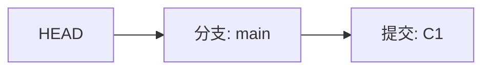
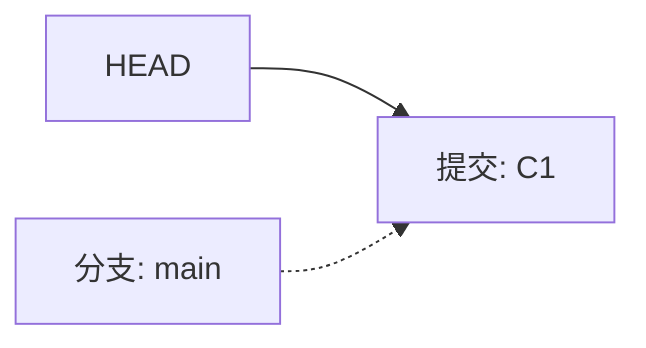

# Git


Git 仓库中的提交记录保存的是你的目录下所有文件的快照，就像是把整个目录复制，然后再粘贴一样，但比复制粘贴优雅许多！

Git 希望提交记录尽可能地轻量，因此在你每次进行提交时，它并不会盲目地复制整个目录。条件允许的情况下，它会将当前版本与仓库中的上一个版本进行对比，并把所有的差异打包到一起作为一个提交记录。

Git 还保存了提交的历史记录。这也是为什么大多数提交记录的上面都有 parent 节点的原因 —— 我们会在图示中用箭头来表示这种关系。对于项目组的成员来说，维护提交历史对大家都有好处。

关于提交记录太深入的东西咱们就不再继续探讨了，现在你可以把提交记录看作是项目的快照。提交记录非常轻量，可以快速地在这些提交记录之间切换！

> 源教程：[Learn Git Branching](https://learngitbranching.js.org/?locale=zh_CN)

## 提交 Commit 

纯提交：

```shell
git commit 
```

## 创建分支 Branch

新建分支：

```shell
git branch <分支名>
%% git branch bugFix %%
```

切换分支：

```shell
git checkout <分支>
%% git checkout bugFix %%
```

新建并切换到新分支：

```shell
git checkout -b <your-branch-name>
```

## 合并分支 

### Merge

merge 命令会在当前分支创建一个新的提交，其 parent 为当前分支和目标分支的最新节点

将目标分支与当前分支合并：

```shell
git merge <目标分支>
%% git merge bugFix %%
```

### Rebase

Rebase 实际上就是取出一系列的提交记录，“复制”它们，然后在另外一个地方逐个的放下去。

Rebase 的优势就是可以创造更线性的提交历史。如果只允许使用 Rebase 的话，代码库的提交历史将会变得异常清晰。

把当前分支的所有提交应用到目标分支上：

```shell
git rebase <目标分支>
%% git rebase main %%
```

执行完 Rebase 命令时，目标分支的最新提交后会多出许多来自当前分支的提交，但目标分支的指针还停留在自己之前的最新提交上，所以通常之后还需要让目标分支往前走到真正最新的提交记录。

ex：`git checkout main` ->  `git merge bugFix`

> [!CAUTION]
> Rebase（变基）确实被很多老手称为“破坏性命令”，因为它有一个本质特征：**它会修改历史（Rewrite History）**。你需要注意：
> 
> - Never rebase public branches (永远不要对公共分支进行变基)。不过只要你的分支只有你一个人在用，还没有推送到远程给别人看，那怎么`rebase`都是安全的。
> - 冲突地狱：如果你在一个分支上做了10次修改且每次都修改了一个文件，同时主分支上也修改了相同文件，那在 Rebase 时，由于 Rebase 是重播，会导致你需要同样解决10次。
> 
> 如果你不确定 Rebase 命令可能造成的风险，就优先考虑使用 Merge 命令。

在开发社区里，有许多关于 merge 与 rebase 的讨论。以下是关于 rebase 的优缺点：

优点:

- Rebase 使你的提交树变得很干净, 所有的提交都在一条线上

缺点:

- Rebase 修改了提交树的历史

比如, 提交 C1 可以被 rebase 到 C3 之后。这看起来 C1 中的工作是在 C3 之后进行的，但实际上是在 C3 之前。

一些开发人员喜欢保留提交历史，因此更偏爱 merge。而其他人（比如我自己）可能更喜欢干净的提交树，于是偏爱 rebase。仁者见仁，智者见智。 :D
## 在分支上移动

### HEAD

HEAD 是一个对当前所在分支的符号引用——也就是指向你正在其基础上进行工作的提交记录。

HEAD 总是指向当前分支上最近一次提交记录。大多数修改提交树的 Git 命令都是从改变 HEAD 的指向开始的。

- 在绝大多数情况下，HEAD 指向的是一个**分支名**（比如 `main` 或 `dev`）。当你提交（commit）新代码时，分支指针会自动向前移动，HEAD 因为在这条分支上，所以也会跟着移动。



分离的 HEAD 就是让其指向了某个具体的提交记录而不是分支名。在执行`git checkout <commit-id>`时就会进入这个状态。



## 查看分支

查看提交记录：

```shell
git log
```

哈希值在真实的 Git 世界中也会更长（基于 SHA-1，共 40 位）。例如前一关的介绍中的提交记录的哈希值可能是 `fed2da64c0efc5293610bdd892f82a58e8cbc5d8`。

比较令人欣慰的是，Git 对哈希的处理很智能。你只需要提供能够唯一标识提交记录的前几个字符即可。因此我可以仅输入`fed2`而不是上面的一长串字符。

**输入**

```shell
PS H:\Web_Project\LimBlog> git log
```

**输出**

```shell
commit 9320eeebc040044120e4a934d1ed3f301decf59b (HEAD -> main, origin/main, origin/HEAD)
Author: LimBoo <13720081217@163.com>
Date:   Sat Jan 17 20:43:40 2026 +0800

    基本 Addressables 内容

commit 7c9d44586cf70b73512024bf6a02998b3a27b911
Author: LimBoo <13720081217@163.com>
Date:   Wed Jan 14 19:38:03 2026 +0800

    基本完成二进制数据内容

commit 60837a8ba61db4367bfefa67e70dd8682c84b8fe
Author: LimBoo <13720081217@163.com>
Date:   Mon Jan 12 17:27:47 2026 +0800

    基本完成 TMP 内容
```

### 使用相对引用移动

#### `^` 

通过哈希值指定提交记录很不方便，所以 Git 引入了相对引用。这个就很厉害了!

使用相对引用的话，你就可以从一个易于记忆的地方（比如 `bugFix` 分支或 `HEAD`）开始计算。

相对引用非常给力，这里我介绍两个简单的用法：

- 使用 `^` 向上移动 1 个提交记录
- 使用 `~<num>` 向上移动多个提交记录，如 `~3`

首先看看操作符 (^)。把这个符号加在引用名称的后面，表示让 Git 寻找指定提交记录的 parent 提交。

- 所以`main^`相当于“`main` 的 parent 节点
- `main^^`是`main`的第二个 parent 节点

此外，你也可以将 `HEAD` 作为相对引用的参照，这样就可以一直使用`HEAD^`向上移动。

#### `~`

如果你想在提交树中向上移动很多步的话，敲那么多`^`貌似也挺烦人的，Git 当然也考虑到了这一点，于是又引入了操作符`~`。

该操作符后面可以跟一个数字（可选，不跟数字时与`^`相同，向上移动一次），指定向上移动多少次。

### 移动分支

你现在是相对引用的专家了，现在用它来做点实际事情。

我使用相对引用最多的就是移动分支。可以直接使用 `-f` 选项让分支指向另一个提交。例如:

```shell
git branch -f main HEAD~3
```

上面的命令会将 main 分支强制指向 HEAD 的第 3 级 parent 提交。

## 撤销变更

在 Git 里撤销变更的方法很多。和提交一样，撤销变更由底层部分（暂存区的独立文件或者片段）和上层部分（变更到底是通过哪种方式被撤销的）组成。我们这个应用主要关注的是后者。

主要有两种方法用来撤销变更—— 一是`git reset`，还有就是`git revert`。接下来咱们逐个进行讲解。

### Git Reset

`git reset`通过把分支记录回退几个提交记录来实现撤销改动。你可以将这想象成“改写历史”。`git reset`向上移动分支，原来指向的提交记录就跟从来没有提交过一样。

例如：`git reset HEAD~`

该命令 Git 把 main 分支移回到`HEAD~`；现在我们的本地代码库根本就不知道有这个提交了。但在reset后， `HEAD~`所做的变更还在，但是处于未加入暂存区状态。

### Git Revert

虽然在你的本地分支中使用`git reset`很方便，但是这种“改写历史”的方法对大家一起使用的远程分支是无效的哦！

为了撤销更改并**分享**给别人，我们需要使用`git revert`。

例如：`git revert HEAD~`

该命令会会使提交记录后面居然多了一个新提交。这是因为新提交记录`HEAD~`引入了**更改** —— 这些更改刚好是用来撤销`HEAD~`这个提交的。也就是说`HEAD~`的状态与`C1`是相同的。

revert 之后就可以把你的更改推送到远程仓库与别人分享啦。

## 移动提交记录

到现在我们已经学习了 Git 的基础知识 —— 提交、分支以及在提交树上移动。 这些概念涵盖了 Git 90% 的功能，同样也足够满足开发者的日常需求

然而, 剩余的 10% 在处理复杂的工作流时(或者当你陷入困惑时）可能就显得尤为重要了。接下来要讨论的这个话题是“整理提交记录” —— 开发人员有时会说“我想要把这个提交放到这里, 那个提交放到刚才那个提交的后面”, 而接下来就讲的就是它的实现方式，非常清晰、灵活，还很生动。

看起来挺复杂, 其实是个很简单的概念。

### Git Cherry-pick

本系列的第一个命令是 `git cherry-pick`, 命令形式为:

- `git cherry-pick <提交号>...`

如果你想将一些提交复制到当前所在的位置（`HEAD`）下面的话， Cherry-pick 是最直接的方式了。那个小游戏的作者非常喜欢`cherry-pick`，因为它特别简单。

ex: `git cherry-pick C1 C2 C3 C4`

将哈希值为 C1, C2, C3, C4 的提交全部复制到当前位置 (HEAD) 下。

### 交互式的 rebase

当你知道你所需要的提交记录（**并且**还知道这些提交记录的哈希值）时, 用 cherry-pick 再好不过了 —— 没有比这更简单的方式了。

但是如果你不清楚你想要的提交记录的哈希值呢? 幸好 Git 帮你想到了这一点, 我们可以利用交互式的 rebase —— 如果你想从一系列的提交记录中找到想要的记录, 这就是最好的方法了

交互式 rebase 指的是使用带参数`--interactive`的 rebase 命令, 简写为 `-i`

如果你在命令后增加了这个选项, Git 会打开一个 UI 界面并列出将要被复制到目标分支的备选提交记录，它还会显示每个提交记录的哈希值和提交说明，提交说明有助于你理解这个提交进行了哪些更改。

在实际使用时，所谓的 UI 窗口一般会在文本编辑器 —— 如 Vim —— 中打开一个文件。 

当 rebase UI 界面打开时, 你能做3件事:

- 调整提交记录的顺序（通过鼠标拖放来完成）
- 删除你不想要的提交（通过切换 `pick` 的状态来完成，关闭就意味着你不想要这个提交记录）
- 合并提交。简而言之，它允许你把多个提交记录合并成一个。

ex: `git rebase -i HEAD~4`

> [!CAUTION]
> 就像之前说的，你需要明白 reabse 命令可能会造成的风险。提交的顺序不能随意地修改。

## 杂项

### 本地栈式提交

来看一个在开发中经常会遇到的情况：我正在解决某个特别棘手的 Bug，为了便于调试而在代码中添加了一些调试命令并向控制台打印了一些信息。

这些调试和打印语句都在它们各自的提交记录里。最后我终于找到了造成这个 Bug 的根本原因，解决掉以后觉得沾沾自喜！

最后就差把 `bugFix` 分支里的工作合并回 `main` 分支了。你可以选择通过 fast-forward 快速合并到 `main` 分支上，但这样的话 `main` 分支就会包含我这些调试语句了。你肯定不想这样，应该还有更好的方式……

实际我们只要让 Git 复制解决问题的那一个提交记录就可以了。我们可以使用

- `git rebase -i`
- `git cherry-pick`

来达到目的。

### 提交的技巧 

#### 1-修改先前的提交

接下来这种情况也是很常见的：你之前在 `newImage` 分支上进行了一次提交，然后又基于它创建了 `caption` 分支，然后又提交了一次。

此时你想对某个以前的提交记录进行一些小小的调整。比如设计师想修改一下 `newImage` 中图片的分辨率，尽管那个提交记录并不是最新的了。

我们可以通过下面的方法来克服困难：

- 先用 `git rebase -i` 将提交重新排序，然后把我们想要修改的提交记录挪到最前
- 然后用 `git commit --amend` 来进行一些小修改
- 接着再用 `git rebase -i` 来将他们调回原来的顺序
- 最后我们把 main 移到修改的最前端（用你自己喜欢的方法），就大功告成啦！

当然完成这个任务的方法不止上面提到的一种（我知道你在看 cherry-pick 啦），之后我们会多点关注这些技巧啦，但现在暂时只专注上面这种方法。 

> [!TIP] git commit --amend
> 它主要用于修正最近一次的提交。它能帮你做两件事：
>
> 1. **修改提交信息（Commit Message）：** 比如你刚才手快把 "Fix player movement" 写成了 "Fix plyaer movement"。
> 2. **追加漏掉的文件或修改：** 比如你提交了代码，但忘记把相关的资源文件（在 Unity 中常见的是 `.meta` 文件）一起提交。
>
> 当你执行这个命令时，Git 并不是在原来的提交上“修修补补”，而是废弃原来的提交，生成一个新的提交（拥有全新的 Commit ID）来替换它。
> 
>- 原来的状态：Commit A (ID: `a1b2c3`)
>- 执行 Amend 后：Commit A' (ID: `d4e5f6`) -> _Commit A 实际上消失了_

#### 2-修改先前的提交

正如你在上一关所见到的，我们可以使用 `rebase -i` 对提交记录进行重新排序。只要把我们想要的提交记录挪到最前端，我们就可以很轻松的用 `--amend` 修改它，然后把它们重新排成我们想要的顺序。

但这样做就唯一的问题就是要进行两次排序，而这有可能造成由 rebase 而导致的冲突。下面还是看看 `git cherry-pick` 是怎么做的吧。

要在心里牢记 cherry-pick 可以将提交树上任何地方的提交记录取过来追加到 HEAD 上（只要不是 HEAD 上游的提交就没问题）。

#### Git Tags

分支很容易被人为移动，并且当有新的提交时，它也会移动。分支很容易被改变，大部分分支还只是临时的，并且还一直在变。

你可能会问了：有没有什么可以永远向某个提交记录的标识呢，比如软件发布新的大版本，或者是修正一些重要的 Bug 或是增加了某些新特性，有没有比分支更好的可以永远指向这些提交的方法呢？

当然有了！Git 的 tag 就是干这个用的啊，它们可以（在某种程度上 —— 因为标签可以被删除后重新在另外一个位置创建同名的标签）永久地将某个特定的提交命名为里程碑，然后就可以像分支一样引用了。

更难得的是，它们并不会随着新的提交而移动。你也不能切换到某个标签上面进行修改提交，它就像是提交树上的一个锚点，锚定了某个特定的位置。

ex：建立一个标签，指向提交记录 `C1`，表示这是我们 1.0 版本。

```shell
git tag v1 C1
```

#### Git Describe

由于标签在代码库中起着“锚点”的作用，Git 还为此专门设计了一个命令用来**描述**离你最近的锚点（也就是标签），它就是 `git describe`！

Git Describe 能帮你在提交历史中移动了多次以后找到方向；当你用 `git bisect`（一个查找产生 Bug 的提交记录的指令）找到某个提交记录时，或者是当你坐在你那刚刚度假回来的同事的电脑前时， 可能会用到这个命令。

`git describe` 的​​语法是：

```shell
git describe <ref>
```

`<ref>` 可以是任何能被 Git 识别成提交记录的引用，如果你没有指定的话，Git 会使用你目前所在的位置（`HEAD`）。

它输出的结果是这样的：

```shell
<tag>-<numCommits>-g<hash>
```

`tag` 表示的是离 `ref` 最近的标签， `numCommits` 是表示这个 `ref` 与 `tag` 相差有多少个提交记录， `hash` 表示的是你所给定的 `ref` 所表示的提交记录哈希值的前几位。

当 `ref` 提交记录上有某个标签时，则只输出标签名称。

#### Git Bisect

它利用二分查找算法，帮你快速定位是哪一次提交引入了 Bug。

这是一个交互式的过程：

1. 启动审讯模式

	告诉 Git 你要开始找 Bug 了：

```shell
git bisect start
```

 2. 标记“坏”的提交（Bad）

	通常就是你当前的这个版本（因为它有 Bug）：

```shell
git bisect bad
```

3. 标记“好”的提交（Good）

	你需要告诉 Git 一个过去的时间点，那个时候功能是正常的。比如你记得 `v1.0` 标签或者某个哈希值 `a1b2c` 是好的：

```shell
git bisect good a1b2c
```

 4. Git 自动切片（自动化开始）
	
	- 输入完上面命令的瞬间，Git 会**自动**计算中间点，并把你的代码库 `checkout`（切换）到那一次提交。
	
	- Git 会显示：`Bisecting: 25 revisions left to test after this (roughly 5 steps)`
    

 5. 你进行测试

	现在你的代码变成了中间那个版本的状态。你需要打开 Unity 或者运行程序看看：功能正常吗？

	- 没有 Bug：说明 Bug 是在**后面**引入的。 你输入：`git bisect good`
	    
	- 已有 Bug：说明 Bug 在**前面**就已经存在了。 你输入：`git bisect bad`
	    

 6. 重复并定位

	Git 会根据你的反馈，再次跳到剩下范围的中间点。你不断重复“测试 -> 告诉 Git 好坏”，直到 Git 告诉你：`a1b2c3d is the first bad commit`

7. 退出模式
	
	找到罪魁祸首后，记得退出这个模式，回到原本的最新代码：

```shell
git bisect reset
```

## 远程操作

我们现在需要学习远程仓库的操作 —— 我们需要一个配置这种环境的命令, 它就是 `git clone`。 从技术上来讲，`git clone` 命令在真实的环境下的作用是在**本地**创建一个远程仓库的拷贝（比如从 github.com）。

克隆到本地：

```shell
git clone <URL>
```

### 远程分支

既然你已经看过 `git clone` 命令了，咱们深入地看一下发生了什么。

你可能注意到的第一个事就是在我们的本地仓库多了一个名为 `origin/main` 的分支, 这种类型的分支就叫**远程**分支。由于远程分支的特性导致其拥有一些特殊属性。

远程分支反映了远程仓库(在你上次和它通信时)的**状态**。这会有助于你理解本地的工作与公共工作的差别 —— 这是你与别人分享工作成果前至关重要的一步.

远程分支有一个特别的属性，在你切换到远程分支时，自动进入分离 HEAD 状态。Git 这么做是出于不能直接在这些分支上进行操作的原因, 你必须在别的地方完成你的工作, （更新了远程分支之后）再用远程分享你的工作成果。

远程分支有一个命名规范 —— 它们的格式是:

- `<remote name>/<branch name>`

因此，如果你看到一个名为 `origin/main` 的分支，那么这个分支就叫 `main`，远程仓库的名称就是 `origin`。 `origin/main` 只有在远程仓库中相应的分支更新了以后才会更新。

### Git Fetch

与 Git 远程仓库的交互，归根结底就是向其它仓库传输数据以及从其它仓库获取数据。只要能相互传递提交记录，就可以分享任何能被 Git 管理的更新（因此可以分享代码、文件、想法、情书等等）。

本节课我们将学习如何从远程仓库获取数据 —— 命令如其名，它就是 `git fetch`。

你会看到，当我们从远程仓库获取数据时, 远程分支也会更新以反映最新的远程仓库。这就是上节课所讲的，远程分支反映了远程仓库在你上次和它通信时的状态。

`git fetch` 完成了仅有的但是很重要的两步:

- 从远程仓库下载本地仓库中缺失的提交记录
- 更新远程分支指针（如 `o/main`）

`git fetch` 实际上将本地仓库中的远程分支更新成了远程仓库相应分支最新的状态。

如果你还记得上一节课程中我们说过的，远程分支反映了远程仓库在你**最后一次与它通信时**的状态，这里 `git fetch` 就是你与远程仓库通信的方式！

`git fetch` 通常通过互联网（使用 `http://` 或 `git://` 协议）与远程仓库通信。

#### Git Pull

既然我们已经知道了如何用 `git fetch` 获取远程的数据, 现在我们学习如何将这些变化更新到我们的工作当中。

其实有很多方法的 —— 当远程分支中有新的提交时，你可以像合并本地分支那样来合并远程分支。也就是说就是你可以执行以下命令:

- `git cherry-pick o/main`
- `git rebase o/main`
- `git merge o/main`
- 等等

实际上，由于先抓取更新再合并到本地分支这个流程很常用，因此 Git 提供了一个专门的命令来完成这两个操作。它就是我们要讲的 `git pull`。`git pull` 就是 `git fetch` 和 `git merge` 的缩写。

### Git Push

是我如何与大家分享**我的**成果呢？

嗯，上传自己分享内容与下载他人的分享刚好相反，那与 `git pull` 相反的命令是什么呢？`git push`！

`git push` 负责将**你的**变更上传到指定的远程仓库，并在远程仓库上合并你的新提交记录。一旦 `git push` 完成, 你的朋友们就可以从这个远程仓库下载你分享的成果了！

你可以将 `git push` 想象成发布你成果的命令。它有许多应用技巧，稍后我们会了解到，但是咱们还是先从基础的开始吧……

> [!NOTE]
> `git push` 不带任何参数时的行为与 Git 的一个名为 `push.default` 的配置有关。它的默认值取决于你正使用的 Git 的版本，在你的项目中进行推送之前，最好检查一下这个配置。

### 历史偏移

假设你周一克隆了一个仓库，然后开始研发某个新功能。到周五时，你新功能开发测试完毕，可以发布了。但是 —— 天啊！你的同事这周写了一堆代码，还改了许多你的功能中使用的 API，这些变动会导致你新开发的功能变得不可用。但是他们已经将那些提交推送到远程仓库了，因此你的工作就变成了基于项目**旧版**的代码，与远程仓库最新的代码不匹配了。

这种情况下, `git push` 就不知道该如何操作了。如果你执行 `git push`，Git 应该让远程仓库回到星期一那天的状态吗？还是直接在新代码的基础上添加你的代码，亦或由于你的提交已经过时而直接忽略你的提交？

因为这情况（历史偏离）有许多的不确定性，Git 是不会允许你 `push` 变更的。实际上它会强制你先合并远程最新的代码，然后才能分享你的工作。

**那该如何解决这个问题呢？很简单，你需要做的就是使你的工作基于最新的远程分支。**

有许多方法做到这一点呢，不过最直接的方法就是通过 rebase 调整你的工作。咱们继续，看看怎么 rebase！

1. 我们用 `git fetch` 更新了本地仓库中的远程分支
2. 然后用 rebase 将我们的工作移动到最新的提交记录下
3. 最后再用 `git push` 推送到远程仓库

**还有其它的方法可以在远程仓库变更了以后更新我的工作吗? 当然有，我们还可以使用 `merge`。**

尽管 `git merge` 不会移动你的工作（它会创建新的合并提交），但是它会告诉 Git 你已经合并了远程仓库的所有变更。这是因为远程分支现在是你本地分支的祖先，也就是说你的提交已经包含了远程分支的所有变化。

1. 我们用 `git fetch` 更新了本地仓库中的远程分支
2. 然后合并了新变更到我们的本地分支（为了包含远程仓库的变更）
3. 最后我们用 `git push` 把工作推送到远程仓库

很好！但是要敲那么多命令，有没有更简单一点的？

当然 —— 前面已经介绍过 `git pull` 就是 fetch 和 merge 的简写，类似的 `git pull --rebase` 就是 fetch 和 rebase 的简写！
### 远程服务器拒绝!(Remote Rejected)

如果你是在一个大的合作团队中工作，很可能是 main 被锁定了，需要一些 Pull Request 流程来合并修改。如果你直接提交 (commit) 到本地 main,，然后试图推送 (push) 修改, 你将会收到这样类似的信息：

```shell
! [远程服务器拒绝] main -> main (TF402455: 不允许推送(push)这个分支; 你必须使用pull request来更新这个分支.)
```

远程服务器拒绝直接推送 (push) 提交到 main，因为策略配置要求 pull requests 来提交更新。

你应该按照流程,新建一个分支，推送 (push) 这个分支并申请 pull request，但是你忘记并直接提交给了main.现在你卡住并且无法推送你的更新。

**解决办法**

新建一个分支 feature，推送到远程服务器。然后 reset 你的 main 分支和远程服务器保持一致，否则下次你 pull 并且他人的提交和你冲突的时候就会有问题。

### 合并特性分支

既然你应该很熟悉 fetch、pull、push 了，现在我们要通过一个新的工作流来测试你的这些技能。

在大型项目中开发人员通常会在（从 `main` 上分出来的）特性分支上工作，工作完成后只做一次集成。这跟前面课程的描述很相像（把 side 分支推送到远程仓库），不过本节我们会深入一些。

但是有些开发人员只在 main 上做 push、pull —— 这样的话 main 总是最新的，始终与远程分支 (o/main) 保持一致。

对于接下来这个工作流，我们集成了两个步骤：

- 将特性分支集成到 `main` 上
- 推送并更新远程分支

让我们看看如何快速的更新 `main` 分支并推送到远程。我们执行了两个命令:

1. `git pull --rebase`：将我们的工作 rebase 到远程分支的最新提交记录
2. `git push`：向远程仓库推送我们的工作