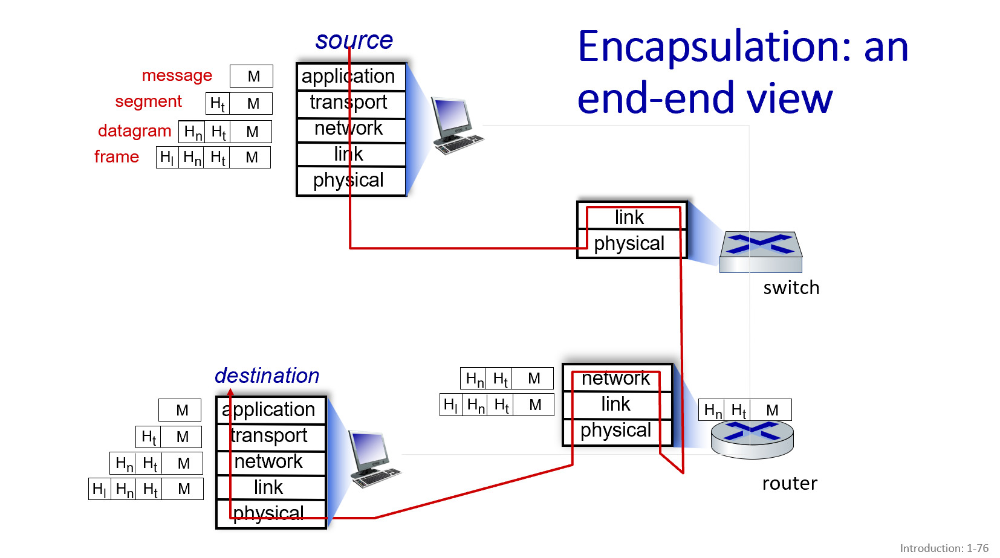

# Why layering? 
explicit structure allows identification, relationship of complex system’s pieces

# Internet protocol stack
1. 应用层 (application): 支持网络应用程序
例如：FTP, SMTP, HTTP
2. 传输层 (transport): 端到端的数据传输（进程到进程）
例如：TCP, UDP
3. 网络层 (network): 将数据报从源地址路由到目标地址
例如：IP, 路由协议
4. 链路层 (link): 相邻网络元素之间的数据传输
例如：以太网 (Ethernet), 802.11 (WiFi), PPP
5. 物理层 (physical): 线路上的“比特流”

# 每层都做了什么
1. 应用层 (Application Layer):
生成数据: 应用程序（比如你的浏览器、邮件客户端）创建了你需要发送的数据。这可能是 HTTP 请求、电子邮件内容、FTP 命令等等。
添加应用层头部: 应用层协议（如 HTTP）会在这些数据上添加特定的头部信息，用于标识请求类型、内容格式等。

2. 传输层 (Transport Layer):
分段 (Segmentation): 如果应用层的数据太大，传输层可能会将其分割成更小的段 (segments)。
添加传输层头部: 传输层协议（如 TCP 或 UDP）会为每个段添加传输层头部。对于 TCP 来说，头部包含端口号（标识发送和接收的应用程序）、序列号（用于保证数据按序到达）、确认号（用于可靠传输）等。对于 UDP 来说，头部更简单，通常包含端口号和长度信息。
交给网络层: 传输层将带有传输层头部的数据段交给网络层。在 TCP 的上下文中，这通常被称为 TCP 报文段 (TCP segment)；在 UDP 的上下文中，这通常被称为 UDP 数据报 (UDP datagram)。

3. 网络层 (Network Layer):
添加网络层头部: 网络层协议（如 IP）会在传输层的数据包（segment 或 datagram）前添加网络层头部。这个头部包含源 IP 地址和目标 IP 地址，以及其他用于路由的信息。
形成数据包 (Packet): 带有网络层头部的数据单元通常被称为 IP 数据包 (IP packet) 或简称为数据包 (packet)。

4. 链路层 (Data Link Layer):
添加链路层头部和尾部: 链路层协议（如以太网）会在网络层的数据包前后都添加信息。头部通常包含源 MAC 地址和目标 MAC 地址，以及用于标识链路层协议的类型字段。尾部通常包含用于错误检测的帧校验序列 (FCS)。
形成帧 (Frame): 带有链路层头部和尾部的数据单元被称为帧 (frame)。

5. 物理层 (Physical Layer):

