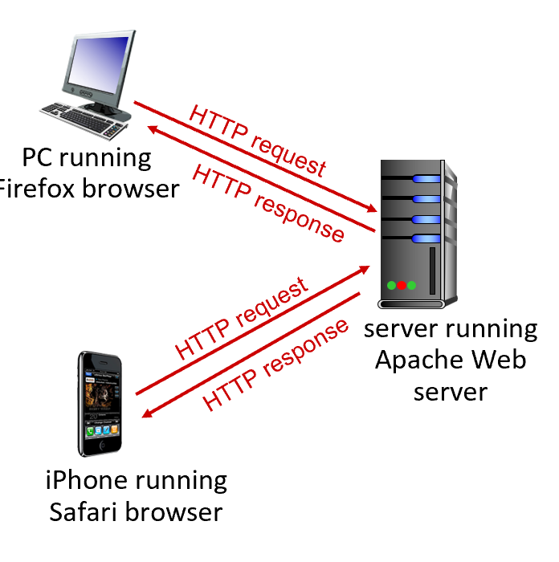

网页由一个基础的 HTML 文件构成，这个文件包含了若干被引用的对象，每个对象都可以通过一个 URL 来寻址。

# HTTP overview
HTTP: hypertext transfer protocol


# HTTP connections: two types
1. Non-persistent HTTP
    - TCP 连接已打开
    - 通过此 TCP 连接最多发送一个对象
    - TCP 连接已关闭
下载多个文件需要建立多个连接

2. Persistent HTTP
    - 与服务器建立了一个 TCP 连接
    - 客户端和该服务器之间可以通过同一个 TCP 连接发送多个对象
    - TCP 连接已关闭

# Persistent HTTP
与 Non-persistent HTTP 为每个资源请求都建立一个新的 TCP 连接不同，Persistent HTTP 允许客户端和服务器在同一个 TCP 连接上进行多次 HTTP 请求和响应。这意味着在最初建立一次 TCP 连接后，可以用于传输多个相关的资源（例如 HTML 文件、图片、CSS 文件、JavaScript 文件等），而无需为每个资源都重新建立连接。

Persistent HTTP 的优点：
- 更低的延迟： 避免了为每个资源都进行 TCP 连接建立的延迟。
- 更少的资源消耗： 减少了服务器和客户端维护多个连接的开销。
- 减少网络拥塞： 由于连接的建立和关闭次数减少，有助于减轻网络拥塞

# HTTP message
1. HTTP request message
    - 请求行
        - 请求方法：GET、POST、PUT、DELETE等
        - URL
        - HTTP版本
    - 请求头部
        - 客户端信息：User-Agent、Accept等
        - 其他信息：Host、Connection等
    - 请求体（可选）
        - 包含要发送给服务器的数据

2. HTTP response message
    - 状态行
        - HTTP版本
        - 状态码：200、404、500等
        - 状态描述
    - 响应头部
        - 服务器信息：Server、Date等
        - 内容类型：Content-Type、Content-Length等
    - 响应体（可选）
        - 包含要返回给客户端的数据

# HTTP status codes
- 200 OK
request succeeded, requested object later in this message
- 301 Moved Permanently
requested object moved, new location specified later in this message (in Location: field)
- 400 Bad Request
request msg not understood by server
- 404 Not Found
requested document not found on this server
- 505 HTTP Version Not Supported

# Maintaining user/server state: cookies
HTTP 协议本身是无状态的 (stateless)。这意味着每次客户端发送请求到服务器时，服务器都会将该请求视为一个全新的请求，不会记住之前客户端做过什么。但在很多应用场景下，我们需要记住用户的状态，例如：
- 用户登录状态
- 购物车内容
- 用户偏好设置

**Cookies 就是为了解决 HTTP 无状态的问题而设计的机制。**

## 工作原理：

1. 服务器设置 Cookie： 当用户第一次访问一个网站时，服务器可能会在发送给客户端的 HTTP 响应中包含一个或多个 Set-Cookie 首部字段。每个 Set-Cookie 字段包含一个名值对，例如：
```HTTP
Set-Cookie: sessionid=12345
Set-Cookie: username=john
```

2. 浏览器发送 Cookie： 当用户之后再次访问同一个域名下的网页时，浏览器会在发送的 HTTP 请求的 Cookie 首部字段中，自动包含之前存储的、与该域名相关的 Cookie。例如：
```HTTP
Cookie: sessionid=12345; username=john
```
这样，服务器就能通过接收到的 Cookie 知道这个用户是谁，或者他之前做过什么。

# Web caches
Goal: satisfy client requests without involving origin server

Web 缓存是一种在客户端或服务器端存储 Web 资源（如 HTML 页面、图片、CSS 文件、JavaScript 文件等）副本的技术。当客户端再次请求相同的资源时，缓存可以直接提供副本，而无需向原始服务器发送请求。这可以显著提高 Web 性能，减少网络流量，并降低服务器负载。

Web 缓存主要可以分为两类：客户端缓存 (Client Caches) 和 代理缓存 (Proxy Caches)。

**Why Web caching?**
- 减少客户端请求的响应时间
- 减少机构接入链路上的流量 (reduce traffic on an institution’s access link)
- 互联网上布满了缓存

**Browser caching: Conditional GET**
浏览器为了提高性能，会将访问过的网页资源（如 HTML、CSS、图片等）缓存在本地。当用户再次访问同一个页面时，如果缓存的资源尚未过期，浏览器可以直接使用本地缓存，而无需重新从服务器下载，这样可以加快页面加载速度。

1. 问题：

但是，浏览器如何知道本地缓存的资源是否仍然是服务器上的最新版本呢？如果缓存的资源已经过时，浏览器就应该重新从服务器获取。

2. 条件 GET 的解决方案：

条件 GET 就是为了解决这个问题而设计的。它的目标是：如果浏览器拥有最新版本的缓存副本，就不要发送对象 (资源) 给浏览器。 这样可以避免不必要的数据传输，节省网络资源，并减少延迟。

3. 工作原理：
当浏览器发现本地有某个资源的缓存时，它会在发送给服务器的 HTTP GET 请求中添加一个特殊的首部字段：
```HTTP
If-Modified-Since: <date>
```
服务器检查缓存副本是否仍然是最新版本。

服务器收到这个带有 If-Modified-Since 首部的请求后，会比较请求中指定的日期和服务器上该资源的最后修改日期。

如果服务器上的资源自 If-Modified-Since 指定的日期以来没有被修改过，那么服务器会返回一个特殊的 HTTP 响应：
```HTTP
HTTP/1.0 304 Not Modified
```

# HTTP/2
Key goal: decreased delay in multi-object HTTP requests

1. HTTP/1.1 的一个问题: 服务器按照请求的顺序 (in-order, FCFS: first-come-first-served scheduling) 响应 GET 请求。
2. FCFS 带来的问题 (with FCFS): 较小的对象可能不得不等待排在它前面的较大对象的传输完成，这被称为*队头阻塞* (head-of-line (HOL) blocking)。
3. 另一个问题: TCP 丢包后的恢复（重传丢失的 TCP 分段）会延迟所有对象的传输 (loss recovery (retransmitting lost TCP segments) stalls object transmission)。

**解决方案：**
HTTP/2: [RFC 7540, 2015] 增加了服务器在向客户端发送对象时的灵活性：

- 方法、状态码以及大多数头部字段与 HTTP 1.1 保持不变
- 请求对象的传输顺序基于客户端指定的对象优先级（不一定是先来先服务 FCFS）
- 推送未经请求的对象到客户端
- 将对象分割成帧，调度这些帧以缓解队头阻塞 (HOL blocking)

# HTTP/3
HTTP/2 基于单个 TCP 连接意味着：丢包恢复仍然会阻塞所有对象的传输

- 就像在 HTTP/1.1 中一样，浏览器有动机打开多个并行的 TCP 连接来减少阻塞，提高整体吞吐量
- 在原始的 TCP 连接上没有安全性

HTTP/3: 在 UDP 上增加了安全性、每个对象的错误控制和拥塞控制（更多的pipelining）
- HTTP/3 的一些关键特性和改进是在 传输层 实现的。