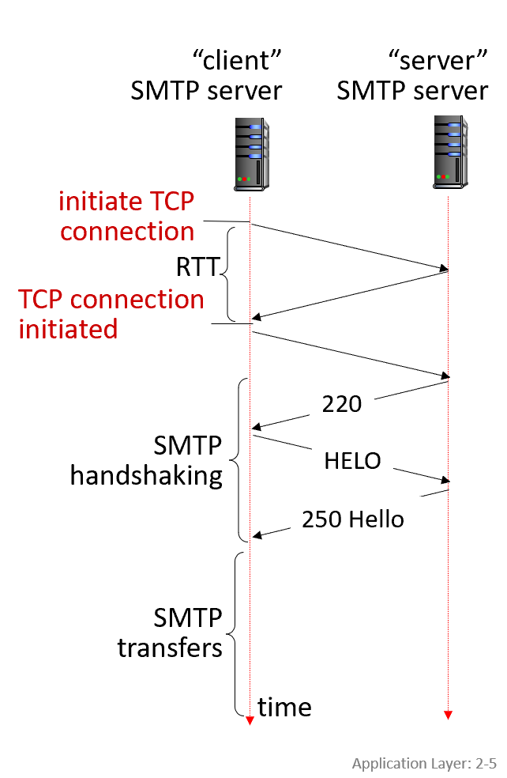
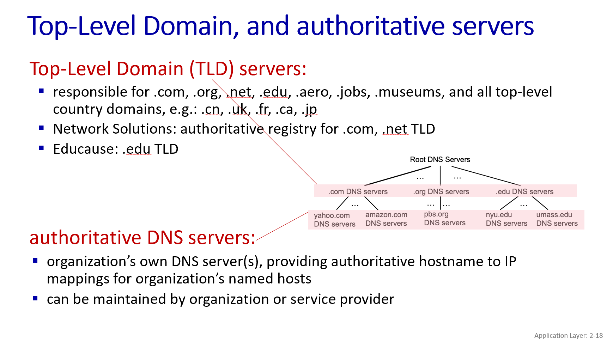

# Email

## 3 major components of email
1. user agent
2. mail server
3. simple mail transfer protocol (SMTP)

## SMTP RFC (5321)
SMTP (简单邮件传输协议) 主要负责将邮件从发送方的**服务器**递送/存储到接收方的**邮件服务器**。

SMTP 利用TCP协议在客户端（发起连接的邮件服务器）和服务器（接收邮件的服务器）之间可靠地传输邮件，通常使用25号端口。 其交互过程包括握手（问候）、邮件传输和关闭连接等阶段，采用ASCII文本命令和状态码响应的方式进行通信。

three phases of transfer：
1. SMTP handshaking (greeting)
2. SMTP transfer of messages
3. SMTP closure

command/response interaction (like HTTP)：
- commands: ASCII text
- response: status code and phrase

### comparison with HTTP:
#### 相同点：
两者都使用ASCII码进行命令/响应交互，并且都有状态码。
### 不同点：
HTTP: client pull
SMTP: client push

HTTP：每个对象(图片，CSS文件等)都封装在各自独立的响应消息中。
SMTP：多个对象（例如邮件正文和附件）可以在一个多部分消息 (multipart message) 中发送。

## Retrieving email: mail access protocols
用于用户从接收方的**邮件服务器**上检索这些邮件到自己的**设备上**（如电脑、手机）进行阅读和管理。

# DNS: Domain Name System
IP 地址 (IP address)：例如32位的IPv4地址（或128位的IPv6地址），这是计算机在网络中进行数据包寻址时实际使用的地址，就像门牌号码。
域名 (Name)：例如 www.google.com，这是方便人类记忆和使用的名称。

DNS是一个分布式的数据库系统，它通过一个由许多域名服务器组成的层级结构来实现。它同时也是一个应用层协议，允许主机（如您的电脑）和DNS服务器之间进行通信，以解析名称（即将域名翻译成IP地址，或反之）。

## 为什么DNS是分布式的，而不是集中式的？

如果DNS是集中式的，会面临诸多问题，使其无法有效扩展：

1. 单点故障 (Single point of failure)：如果中央服务器宕机，整个互联网的域名解析都会瘫痪。
2. 通信流量巨大 (Traffic volume)：所有请求都涌向一台服务器，难以承受。
3. 距离远 (Distant centralized database)：全球用户访问一台远距离的服务器，延迟会很高。
4. 维护困难 (Maintenance)：维护和更新一个庞大的中央数据库非常复杂。

## DNS 的主要服务/功能:

1. 主机名到IP地址的转换 (Hostname-to-IP-address translation)：这是最核心的功能。
2. 主机别名 (Host aliasing)：一个主机可以有多个域名（例如，一个规范名和一个或多个别名）。
3. 邮件服务器别名 (Mail server aliasing)：帮助找到负责特定域名的邮件服务器。
4. 负载分配 (Load distribution)：可以将一个域名解析到多个IP地址，从而将访问流量分散到多个服务器上，实现负载均衡。

## DNS的层次结构

## Local DNS name servers

### 1. 首要联系点 (First point of contact):

当您的计算机或其他设备（主机）需要将一个域名（例如 www.google.com）解析成IP地址时，它首先会将这个DNS查询发送给其配置的本地DNS服务器。你可以把它想象成你进行域名查询时的“本地咨询台”或“第一站”。

### 2. 工作方式 (How it works):

缓存查询 (Checks its cache): 本地DNS服务器收到查询后，首先会检查自己的本地缓存中是否已经有这个域名到IP地址的映射记录，并且这个记录是否仍然有效（没有过期）。如果找到了，它会立即返回IP地址，这样速度非常快。

转发请求 (Forwards request into DNS hierarchy): 如果本地缓存中没有相关记录，或者记录已过期，本地DNS服务器就会代表您的设备，将查询请求转发到DNS的层级结构中进行解析。这意味着它会去联系根域名服务器、顶级域名(TLD)服务器以及权威域名服务器，一步步地找到最终的IP地址。这个过程可以是迭代查询也可以是递归查询（幻灯片后续有详细解释）。

### 3. 谁提供 (Who provides them?):

通常情况下，您的互联网服务提供商 (ISP) 会提供本地DNS服务器。当您连接到互联网时，您的网络设置（通常通过DHCP自动配置）会包含这些本地DNS服务器的地址。

一些组织，如大学或公司，也可能运行自己的本地DNS服务器供其内部网络使用。

### 4. 查询方式：
- 迭代查询 (Iterative query)
- 递归查询 (Recursive query)

## DNS record
RR format: (name, value, type, ttl)

## DNS security
### 1. DNS spoofing (DNS cache poisoning)
DNS欺骗（DNS spoofing）是一种网络攻击，攻击者通过向DNS服务器注入虚假的DNS记录，使得用户在访问某个域名时被重定向到攻击者控制的IP地址上。这种攻击可以导致用户访问恶意网站、数据泄露或其他安全问题。
### 2. DDoS Attack
分布式拒绝服务攻击（DDoS）是一种网络攻击，攻击者通过大量的计算机（通常是被感染的僵尸网络）向目标服务器发送大量请求，导致服务器过载，从而使其无法正常服务。DNS服务器也可能成为DDoS攻击的目标。

# Peer-to-peer (P2P) architecture
与传统的客户端-服务器 (Client-Server) 架构不同，P2P架构的核心思想是去中心化。在这种架构中，网络中的各个参与者（称为对等方或节点 Peers）直接相互通信和共享资源或服务，而不需要依赖一个永久在线的中央服务器。

## P2P架构的主要特征：

### 没有永久在线的服务器 (No always-on server)：
这是P2P与客户端-服务器模型最显著的区别。在P2P网络中，没有一个必须持续运行的中央服务器来协调或提供所有服务。

### 任意终端系统直接通信 (Arbitrary end systems directly communicate)：
网络中的任何一个对等方都可以直接与其他对等方建立连接并交换信息或数据，无需通过中间服务器进行转发（尽管某些P2P系统可能使用辅助服务器进行节点发现或引导）。

### 对等方既是服务请求者也是服务提供者 (Peers request service from other peers, provide service in return to other peers)：
每个节点在网络中扮演双重角色。它们既可以作为客户端从其他节点请求服务或数据，也可以作为服务器向其他节点提供服务或数据。

### 自扩展性 (Self scalability)：
这是一个非常重要的特性。当新的对等方加入网络时，它们不仅带来了新的服务需求，同时也贡献了新的服务能力（如带宽、存储空间、计算能力）。这意味着随着用户数量的增加，整个系统的总容量也会相应增加，理论上可以避免客户端-服务器模型中服务器可能出现的瓶颈。幻灯片中关于文件分发时间的比较 (幻灯片 2-30, 2-31, 2-32) 也体现了这一点。

### 对等方间歇性连接且IP地址可能改变 (Peers are intermittently connected and change IP addresses)：
P2P网络中的节点通常不是永久在线的，它们可以随时加入或离开网络。同时，节点的IP地址也可能因为动态分配等原因而发生变化。这使得P2P网络具有高度的动态性。

### 管理复杂 (Complex management)：
由于其去中心化和动态的特性，P2P网络的管理（如节点发现、数据一致性、安全性、资源定位等）通常比集中式系统更为复杂。

## BitTorrent
这是一种非常流行的 点对点 (P2P) 文件分发协议，专门设计用来高效地将大文件分发给大量用户。

BitTorrent的核心思想是，参与文件下载的每个用户（称为对等方 Peers）同时也向其他用户上传他们已经下载到的文件部分，从而分担了源文件服务器的带宽压力，并加快了整体下载速度。

### BitTorrent系统主要包含以下概念：

#### 文件块 (Chunks)：

要分发的大文件会被分割成许多固定大小的小数据块（幻灯片中提到通常是256KB大小）。 对等方之间交换的就是这些文件块。

#### Torrent (洪流/种子文件所描述的网络)：

指的是所有正在交换特定文件（的各个文件块）的对等方组成的群体。当你说“下载一个torrent”时，通常指的是加入这个特定的文件交换网络。

#### Tracker (追踪服务器)：
这是一个服务器，它追踪哪些对等方正在参与某个特定torrent的文件块交换。

当一个新的对等方（比如幻灯片中的Alice）想要加入一个torrent时，它会联系tracker服务器，获取当前参与该torrent的其他对等方的列表。

(值得注意的是，现代BitTorrent也发展出了无需Tracker的DHT技术，但幻灯片主要聚焦于基于Tracker的模式。)

#### 对等方 (Peers)：
参与文件下载和上传的用户。

Leechers (下载者/ leechers)： 正在下载文件但尚未拥有完整文件的对等方。他们同时也会上传已拥有的文件块。

Seeders (做种者/种子)： 已经拥有完整文件并仅进行上传，帮助其他leechers下载的对等方。

### BitTorrent的工作流程 
加入Torrent：

用户通过一个.torrent文件（通常包含文件的元数据和tracker服务器地址）启动BitTorrent客户端。
客户端联系tracker服务器，注册自己并获取一个当前活跃在该torrent中的其他对等方的列表（这些对等方也称为“邻居” neighbors）。

#### 交换文件块：
对等方开始从列表中的其他对等方下载自己缺失的文件块。同时，它也会将自己已经拥有的文件块上传给其他需要的对等方。 这是P2P的核心，即“我为人人，人人为我”。

#### 请求块的策略 ("Rarest First" - 稀缺优先)：

为了保证所有文件块都能均匀分布并尽快完成整个文件的下载，对等方在请求文件块时，通常会优先请求那些在它的邻居中最稀有（即拥有该块的邻居数量最少）的文件块。这样可以防止某些块变得难以获取，并加快整个文件的“拼凑”速度。

### 发送块的策略 ("Tit-for-Tat" - 一报还一报 / 投桃报李)
这是BitTorrent中一个非常重要的激励机制，鼓励用户贡献上传带宽。

一个对等方（比如Alice）会优先将文件块发送给那些当前正以最高速率向她发送文件块的几个对等方（通常是4个）。这些被优先发送的对等方被称为被Alice“非阻塞 (unchoked)”。

其他大部分向Alice请求但没有给她高速率上传的对等方则被“阻塞 (choked)”，暂时不会从Alice那里收到数据。

Alice会大约每10秒重新评估一次这“贡献最大的前四名”。

"Optimistic Unchoking" (乐观非阻塞)： 每隔一段时间（例如30秒），Alice会随机选择一个当前被她阻塞的对等方，并开始向其发送文件块（即“乐观非阻塞”）。这样做有几个目的：

1. 允许新加入的对等方有机会开始接收数据，从而能够参与到“一报还一报”的交换中。

3. 帮助Alice发现是否有其他潜在的、能够提供更高上传速率的“交易伙伴”。如果这个被随机选中的对等方开始以高速率回传数据，它就有可能进入Alice的“前四名”列表。

这种机制的目的是：“上传速率越高，就能找到更好的交易伙伴，从而更快地获取完整文件！”

#### Churn (人员流动)：
P2P网络中的对等方是动态的，它们可能随时加入或离开torrent。

#### 完成下载：
一旦一个对等方下载了完整的文件，它可以选择离开torrent（比较“自私”的做法），或者继续留在torrent中作为seeder，帮助其他尚未完成下载的对等方（比较“利他”的做法）。
### BitTorrent的优势：

1. 高效分发大文件： 特别适合将大文件同时分发给大量用户。
2. 减轻源服务器负载： 下载压力分散到所有参与的对等方，源服务器只需提供初始种子。
3. 可扩展性好： 参与下载的人越多，理论上可用的总上传带宽也越大，下载速度可能反而更快。

总而言之，BitTorrent 通过将文件分块、让用户在下载的同时也进行上传，并利用“稀缺优先”和“一报还一报”等智能策略，实现了一种高效且可扩展的大文件P2P分发机制。