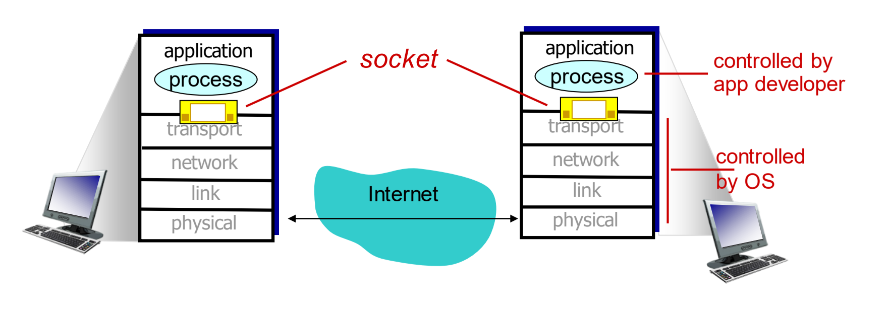

# Video

数字图像 (digital image): 每一帧图像都是由很多个微小的点组成的，这些点叫做“像素” (pixels)。你可以把一张数字图片想象成一个网格，每个格子就是一个像素，每个像素都有自己的颜色信息，这些信息是用比特 (bits) 来表示的。

## video streaming and content distribution networks (CDNs)
挑战：
规模 (Scale)：单个大型视频服务器无法工作。
异构性 (Heterogeneity)： 用户所处的网络环境和设备能力千差万别。

**解决方案: 分布式的、应用层的基础设施 (distributed, application-level infrastructure)。这就是后面要讲到的CDN等技术。**

## 压缩和编码
编码 (coding): 如果直接存储和传输原始的、未经压缩的视频数据，数据量会非常非常大。所以，需要“编码”技术来减少表示图像所需的比特数。编码主要利用了图像数据中的“冗余” (redundancy)。

1. 空间冗余 (Spatial redundancy - 图像内部的冗余)
    - 只发送一次“蓝色”这个颜色值，然后告诉接收方这个颜色连续出现了N次。这样就大大减少了数据量。

2. 时间冗余 (Temporal redundancy - 图像之间的冗余)
    - 发送第一帧的完整图像后，对于后续的帧，主要发送与前一帧相比发生变化的部分 (differences)。

## 视频编码速率
1. CBR (Constant Bit Rate - 恒定比特率): 无论视频内容的复杂程度如何（比如画面是静止的还是剧烈运动的），编码器都以固定的速率产生数据。这种方式比较简单，但可能造成浪费（简单画面用了过高的比特率）或质量不佳（复杂画面比特率不够）。

2. VBR (Variable Bit Rate - 可变比特率): 编码器会根据视频内容的复杂度动态调整编码速率。对于简单的、变化少的画面，使用较低的比特率；对于复杂的、运动剧烈的画面，使用较高的比特率。这样可以在保证视频质量的同时，更有效地利用带宽。VBR通常更优。

## 流式传输存储的视频 (Streaming stored video)
“流式传输”(Streaming) 的核心思想是，用户不需要等待整个视频文件完全下载完毕就可以开始观看。客户端会接收一部分数据（通常先放到一个叫做“缓冲区” - buffer 的地方），然后开始播放，同时后台继续下载后续的内容。这样就大大减少了用户的等待时间。

## 流媒体：DASH (Streaming multimedia: DASH)
核心思想：让视频播放能够根据用户当前的网络状况动态调整视频的质量，从而尽可能保证播放的流畅性，同时在网络好的时候提供更高质量的画面。而且，它利用的是大家都很熟悉的HTTP协议。

### 服务器端的工作:

- 分割视频 (divides video file into multiple chunks): 服务器会预先把一个完整的视频文件切割成很多个小的片段 (chunks)，比如每几秒钟一个片段。
- 多种编码率 (each chunk stored, encoded at different rates): 关键在于，服务器不仅仅是把视频切块，还会为每一个小块准备多个不同质量（也就是不同编码率或比特率）的版本。比如，同一个2秒的片段，可能会有一个高清版 (高比特率)、一个标清版 (中标特率) 和一个流畅版 (低比特率)。
- 清单文件 (manifest file): 服务器还会提供一个“清单文件”（通常是一个XML文件）。这个文件非常重要，它告诉客户端这个视频被分成了哪些块，每个块有哪些不同的编码率版本，以及每个版本的URL地址

### 客户端的工作:
- 测量带宽 (periodically measures server-to-client bandwidth): 客户端会持续监测自己和服务器之间的网络连接速度（可用带宽）。
- 查阅清单 (consulting manifest): 客户端先获取并解析清单文件，了解有哪些视频块和它们的各种版本。
- 逐块请求 (requests one chunk at a time): 客户端不是一次请求整个视频，而是一块一块地请求。
- 动态调整

### 客户端的“智能”:

- DASH技术把很多“决策智能”放在了客户端。客户端需要决定：
何时请求 (when to request chunk): 要管理好本地的播放缓冲区，既不能让缓冲区空了导致卡顿 (buffer starvation)，也不能让缓冲区满了造成浪费或问题 (overflow)。
- 请求哪个编码率 (what encoding rate to request): 在可用带宽允许的情况下，尽可能选择高质量的版本。
- 从哪里请求 (where to request chunk): 如果清单文件提供了多个服务器地址（比如CDN网络中的不同节点），客户端可以根据网络距离（比如选择延迟最低的服务器）或服务器负载情况来选择从哪个服务器获取数据。

## 内容分发网络 (Content Distribution Networks - CDNs)
CDN: store/serve multiple copies of videos at multiple geographically distributed sites.

这就是CDN的核心思想：与其让用户千里迢迢来找你（源服务器），不如把内容主动放到离用户更近的地方。CDN通过在世界各地部署大量的服务器节点，并将视频等内容的副本缓存到这些节点上。当用户请求内容时，CDN会智能地将用户导向一个离他最近或网络质量最好的节点。

### CDN的部署策略:

1. 深入部署 (Enter deep):
这种策略是将CDN服务器尽可能地部署到网络的边缘，深入到各个互联网服务提供商 (ISP) 的接入网络中，非常靠近用户。
PPT提到 Akamai 公司（全球最大的CDN服务商之一）就采用了这种策略，在全球拥有成千上万的部署地点。
优点： 离用户非常近，延迟极低，用户体验好。
2. 带回家 (Bring home):
这种策略不是把服务器部署得那么分散，而是在一些关键的网络交换点 (Points of Presence - POPs) 附近建立数量较少但规模较大的服务器集群。这些POP点靠近（但不在）用户的接入网络。
PPT提到 Limelight 公司采用了这种策略。
优点： 更易于管理和维护，成本可能相对较低，同时也能覆盖较广的用户。

### CDN的工作原理:
智能导向： 当用户发起请求时，CDN系统并不会让用户直接访问最源头的服务器（可能在很远的地方）。相反，它会通过某种机制将用户的请求导向到一个离用户“最近”或“最优”的CDN节点。这个“最近”或“最优”不仅仅指地理位置近，还可能综合考虑了网络延迟、服务器负载情况等因素。

# Socket
socket: door between application process and endend-transport protocol.

## 两种主要的Socket类型 (Two socket types for two transport services)
1. UDP Socket: 提供不可靠的数据报服务。  就像寄明信片，不保证一定能到，也不保证按顺序到。
2. TCP Socket: 提供可靠的、面向字节流的服务。  就像打电话，双方先建立连接，然后可以保证对话内容按顺序、可靠地传达给对方。

### UDP
特点：
1. 无连接 (no "connection"): 客户端和服务器在发送数据前，不需要进行“握手”来建立一个专门的连接。
2. 发送时需指定地址 (sender explicitly attaches IP destination address and port): 因为没有预先建立连接，所以每次发送数据包时，发送方都必须明确地附上接收方的IP地址和端口号。
3. 接收方提取地址 (receiver extracts sender IP address and port#): 服务器从收到的数据包中可以提取出是哪个客户端发来的（客户端的IP和端口），以便回复。
4. 不可靠 (unreliable): UDP不保证数据一定能送达，也不保证接收顺序和发送顺序一致。
5. 应用视角 (Application viewpoint): 从应用的角度看，UDP提供了在客户端和服务器之间不可靠地传输一组组字节（称为“数据报”，datagrams）的服务。

小结一下：UDP编程就像写信。每次寄信（发数据）都要写清楚收信人地址（服务器IP和端口）。服务器收到信后，能从信封上看到寄信人地址，然后可以回信。但信件在邮寄过程中可能会丢失或顺序被打乱。

### TCP
特点：
1. 客户端必须先联系服务器：和UDP一样，总是客户端主动发起。
2. 服务器必须先运行起来：服务器进程必须先于客户端启动并等待连接。 
3. 服务器创建“欢迎Socket” (welcoming socket)：服务器会创建一个初始的Socket，像一扇敞开的大门，专门用来迎接客户端的连接请求。
4. 客户端发起连接：客户端通过创建一个TCP Socket，并明确指定服务器的IP地址和端口号来联系服务器。  当客户端执行此操作时，操作系统会在客户端和服务器的TCP层之间建立一个连接（也就是我们常说的“三次握手”）。
5. 服务器创建“专用Socket”：这是TCP和UDP的一个关键区别。当服务器的“欢迎Socket”接收到一个客户端的连接请求后，它不会用这个Socket和客户端直接通信。相反，它会创建一个新的、专用的Socket，这个新Socket将专门用于与这一个特定的客户端进行后续所有的通信。
6. 支持多客户端：通过为每个连接成功的客户端创建一个专用的Socket，服务器的“欢迎Socket”就可以被解放出来，继续去迎接其他新的客户端。  这也是TCP服务器能够同时与多个客户端保持通信的基础。
7. 应用视角：从应用的角度看，TCP提供了一个可靠的、有序的字节流传输通道，就像在客户端和服务器之间建立了一根“管道”(pipe)。

简单来说，TCP服务器就像一个公司的总机。总机（欢迎Socket）一直开着，等待电话打入。当一个客户（客户端）打电话进来后，总机不会一直占线跟他聊。总机会把这个电话转接到一个具体的分机上（新的专用Socket），让这个客户和分机进行一对一的沟通。与此同时，总机又可以继续接听其他新客户的来电。

#### 四次挥手
TCP的四次挥手 (Four-Way Handshake)，也就是TCP连接的关闭过程。

TCP连接是全双工 (full-duplex) 的，这意味着数据可以在两个方向上独立传输。因此，当一端想要关闭连接时，它只是表明自己这边已经没有数据要发送了，但它仍然可以接收来自对方的数据，直到对方也关闭了发送通道。所以，连接的关闭需要双方各自声明并确认。

*假设客户端（Client）想要主动关闭与服务器（Server）的连接。*

1. 第一次挥手：客户端 -> 服务器 (FIN)
    - 当客户端的应用进程完成了数据发送，它会向其TCP层发出关闭连接的请求。
    - 客户端的TCP层会发送一个特殊的TCP报文段，其首部中的FIN (Finish) 标志位被置为1。这个FIN报文段表明：“我（客户端）已经没有数据要发送给你（服务器）了，我请求关闭我这边的发送通道。”
    - 客户端进入FIN_WAIT_1状态，等待服务器的确认。

2.  二次挥手：服务器 -> 客户端 (ACK)

    - 服务器的TCP层收到客户端发来的FIN报文段后，会回复一个确认报文段。
    - 这个确认报文段首部中的ACK (Acknowledgment) 标志位被置为1。它表示：“我（服务器）已经收到了你（客户端）的关闭请求。”
    - 此时，服务器可能还有数据要发送给客户端（因为TCP是全双工的，客户端只是关闭了它的发送通道，但接收通道还在）。所以，服务器进入CLOSE_WAIT状态。
    - 客户端收到这个ACK后，进入FIN_WAIT_2状态，等待服务器发送它自己的FIN报文。从客户端到服务器的连接（发送方向）此时已经关闭了。

3. 第三次挥手：服务器 -> 客户端 (FIN)
    - 当服务器的应用进程也完成了所有数据发送，并且准备好关闭连接时，它会向其TCP层发出关闭连接的请求。
    - 服务器的TCP层也会发送一个FIN标志位置为1的报文段给客户端。这个FIN报文段表明：“我（服务器）也没有数据要发送给你（客户端）了，我请求关闭我这边的发送通道。”
    - 服务器进入LAST_ACK状态，等待客户端对这个FIN的最后确认。

4. 第四次挥手：客户端 -> 服务器 (ACK)
    - 客户端的TCP层收到服务器发来的FIN报文段后，会回复一个ACK标志位置为1的确认报文段。它表示：“我（客户端）已经收到了你（服务器）的关闭请求，同意关闭。”
    - 客户端在发送完这个ACK后，并不会立即关闭，而是会进入TIME_WAIT状态。这个状态会持续一段时间（通常是2MSL，Maximum Segment Lifetime，报文段最大生存时间的两倍）。

TIME_WAIT状态的目的：
  - 确保服务器能收到客户端发送的最后一个ACK。如果这个ACK丢失了，服务器会超时重传它的FIN，客户端在TIME_WAIT状态下还能再次响应这个重传的FIN。
  - 防止“已失效的连接请求报文段”出现在本连接中。等待2MSL可以确保本次连接中产生的所有报文段都从网络中消失。
- 服务器收到客户端的这个ACK后，就正式关闭连接，进入CLOSED状态。
- 客户端在TIME_WAIT状态结束后，也进入CLOSED状态。

总结一下四次挥手的关键点：
1. 主动关闭方（比如客户端）先发送FIN。
2. 被动关闭方（比如服务器）先回复ACK，然后再发送自己的FIN（当它也准备好关闭时）。
3. 主动关闭方最后回复ACK。
4.  涉及到两个关键的TCP标志位：FIN（表示结束数据发送）和ACK（表示确认收到）。

这个过程比三次握手要复杂一些，主要是因为TCP连接是全双工的，需要双方独立地关闭各自的发送通道。

