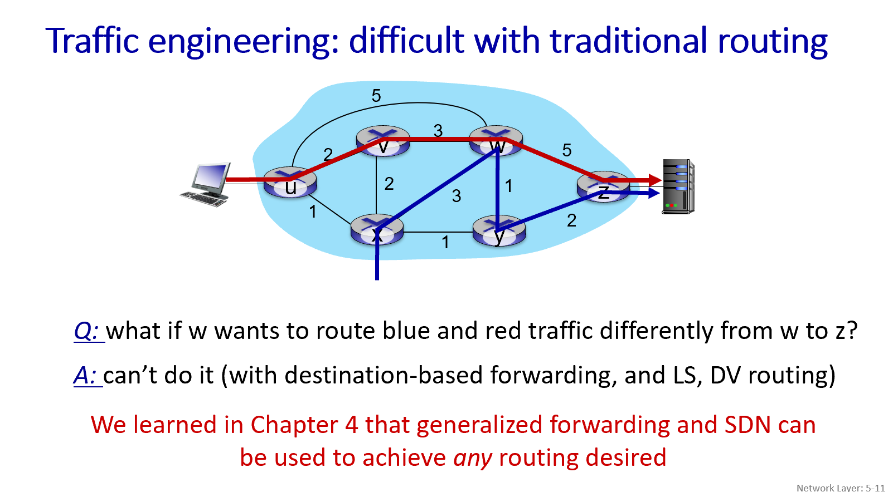
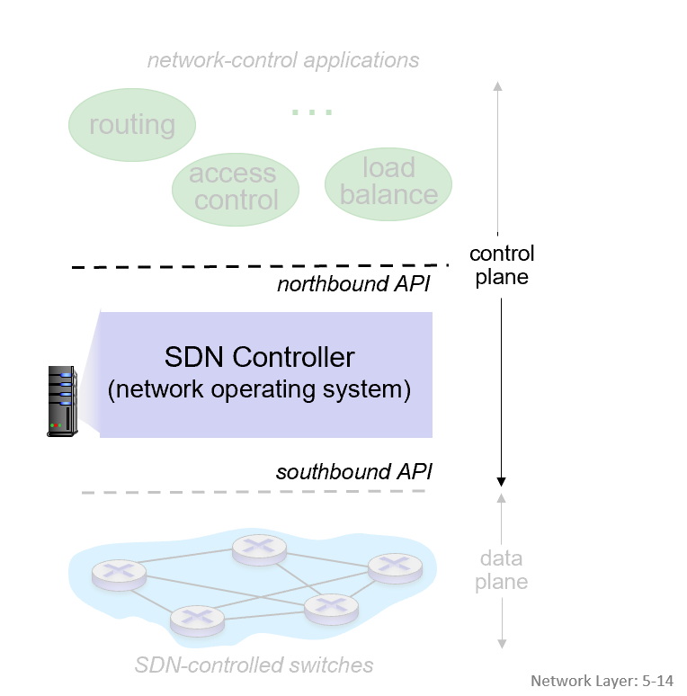
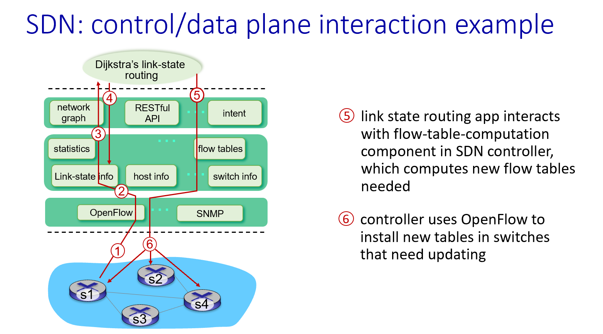
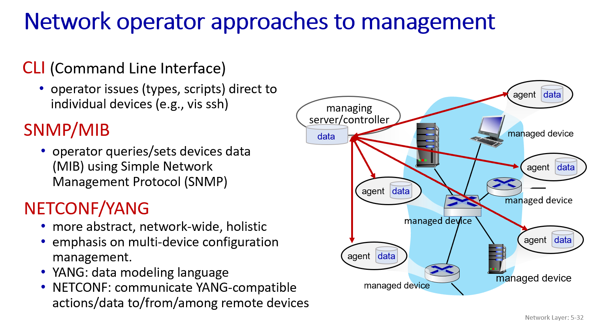
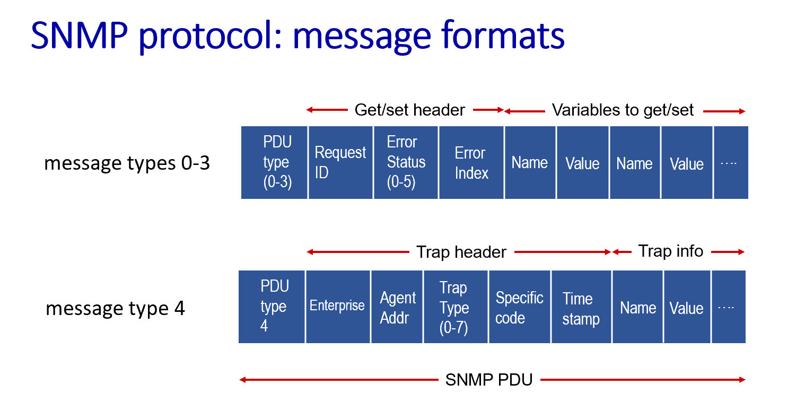

# 1. SDN control plane
传统方式：每个路由器独立控制 (Per-router control plane)
- 路由算法（如我们学过的LS或DV的原理）在每个路由器上独立运行。
- 路由器之间相互交换路由信息来共同计算转发表。

SDN方式：逻辑上集中的控制 (Software-Defined Networking (SDN) control plane)
- 一个或一组远程的SDN控制器负责计算全网的转发表。
- 控制器将转发表下发给网络中的各个交换机（路由器）。
- 交换机主要负责数据平面的转发，控制逻辑集中在控制器。

LimBoo注：路由表是转发表的来源。流表在交换机的数据平面上起到了转发表的作用，指导数据包的转发。

## 1.1 为什么需要逻辑上集中的控制平面 (SDN)
- 更易于网络管理：可以避免因单个路由器配置错误导致的问题，并且对流量的控制更加灵活。
- 可编程的路由器：基于流表的转发（如OpenFlow API）使得路由器可以被“编程”。
    - 集中式编程更容易：在中央控制器上计算转发表然后分发，比在每个路由器上独立运行分布式算法来计算要简单直接。
- 开放的控制平面实现：不再依赖于特定厂商的专有系统，促进标准化和互操作性。
- 促进创新：开放的架构使得更多第三方可以开发新的网络控制应用和服务。

## 1.2 传统路由在流量工程上的局限性
想改变特定流量路径：如果网络管理员希望u到z的流量走uvwz而不是默认计算出的uxyz，在传统路由中，唯一的控制“旋钮”就是修改链路权重，然后让路由算法重新计算。这种控制粒度很粗，不够灵活。

想实现流量分担：如果想让u到z的流量同时走uvwz和uxyz两条路径以实现负载均衡，传统的基于目标地址的路由算法通常做不到。

想根据流量类型区分路由：如果节点w希望将发往z的“蓝色”流量和“红色”流量走不同的路径，基于目标地址的转发以及LS/DV算法也无法实现这种细粒度的区分。

## 1.3 软件定义网络 (SDN) 详解
1. 基于流的通用化转发 (Generalized “flow-based” forwarding)：例如OpenFlow协议定义的。交换机根据流表进行匹配和行动，而不是仅仅基于目标IP地址。

2. 控制平面与数据平面分离 (Control, data plane separation)：这是SDN最核心的理念。数据平面（交换机硬件）负责快速转发，控制平面（网络操作系统/控制器）负责集中的智能决策。

3. 控制平面功能外部化 (Control plane functions external to data-plane switches)：路由计算、访问控制、负载均衡等控制逻辑从交换机中移出，集中到外部的控制器上。

4. 可编程的控制应用 (Programmable control applications)：允许开发者编写网络应用程序，通过控制器提供的API来定义和管理网络行为（例如路由、访问控制、负载均衡等）。

## 1.4 SDN的组件

数据平面交换机 (Data-plane switches)
- 这些通常是快速、简单、商品化的交换机，负责在硬件中实现通用的数据平面转发
- 它们内部的流表（转发表）是由SDN控制器计算并安装的。
- 需要一个API（如OpenFlow）来让控制器对交换机的流表进行控制，定义哪些是可控的，哪些不是。
- 还需要一个协议（如OpenFlow）用于交换机和控制器之间的通信。

SDN控制器 (SDN Controller / 网络操作系统)
- 维护网络状态信息（如链路状态、交换机状态、主机信息等）。
- 通过北向接口 (Northbound API) 与上层的网络控制应用交互。
- 通过南向接口 (Southbound API) 与下层的网络交换机交互。
- 为了保证性能、可扩展性、容错性和健壮性，控制器通常作为一个分布式系统来实现。

网络控制应用程序 (Network-control applications)
- 这些是控制平面的“大脑”，它们使用SDN控制器提供的底层服务和API来实现具体的控制功能（如路由、访问控制、负载均衡）。
- 这些应用可以被解耦，由第三方提供，独立于路由设备厂商或SDN控制器厂商。

### 1.4.1 SDN控制器的组件细化

- 与受控设备的通信层：使用如OpenFlow、SNMP等协议与交换机通信。

- 网络范围的状态管理层：管理网络链路、交换机、主机信息、统计数据、流表等状态，像一个分布式的数据库。

- 对网络控制应用的接口层：向上层应用提供抽象的API（如RESTful API）和网络图、意图（Intent）等抽象概念。

### 1.4.2 OpenFlow协议
作用：OpenFlow协议在SDN控制器和受其控制的交换机之间运作，用于交换控制信息。

通信方式：
- 通常使用TCP来交换消息，确保控制信息的可靠传输。
- 也可以选择加密通信。

与OpenFlow API的区别：PPT强调，OpenFlow协议不同于OpenFlow API。API是用来指定通用化转发动作的接口规范，而协议是控制器和交换机之间实际通信的规则。

### 1.4.3 OpenFlow消息的三个类别：
1. 控制器到交换机 (Controller-to-switch)：控制器向交换机发送指令或查询信息。
2. 异步消息 (Asynchronous - switch to controller)：交换机主动向控制器报告事件或状态变化。
3. 对称消息 (Symmetric - misc.)：用于一些杂项功能，如Hello消息或错误报告。

控制器到交换机的关键消息 (Key controller-to-switch messages)：
- Features (特性)：控制器查询交换机的特性（例如，支持的OpenFlow版本、端口数量、流表大小等），交换机回复其特性信息。
- Configure (配置)：控制器查询或设置交换机的配置参数。
- Modify-state (修改状态)：这是核心消息之一，用于添加、删除或修改OpenFlow交换机流表中的流表项 (flow entries)。
- Packet-out (数据包发出)：控制器可以通过这个消息，指示交换机将一个特定的数据包从交换机的某个指定端口发送出去。这对于处理那些在交换机流表中没有匹配项的“首包”非常有用——交换机可以将首包上送给控制器，控制器决定如何处理后，可以通过Packet-out消息将包发回网络，并可能下发新的流规则。

交换机到控制器的关键消息 (Key switch-to-controller messages)：
- Packet-in (数据包进入)：当一个数据包到达交换机，但在流表中找不到任何匹配的流表项时，交换机可以将这个数据包（或其一部分）封装在Packet-in消息中发送给控制器，请求控制器指示如何处理。
- Flow-removed (流表项移除)：当交换机上的某个流表项因为超时或被控制器删除而被移除时，交换机可以通知控制器。
- Port status (端口状态)：当交换机的某个端口状态发生变化时（例如，端口UP/DOWN，链路断开/连接），交换机会通知控制器。

幸运的是，网络操作员通常不需要直接创建和发送这些底层的OpenFlow消息。他们会使用SDN控制器提供的更高级别的抽象来进行网络编程和管理。

交换机负责检测本地事件并上报。
控制器集中处理信息，运行控制逻辑（通过网络应用程序）。
控制器再将新的转发策略下发给交换机执行。

### 1.5 SDN面临的挑战
- 强化控制平面 (Hardening the control plane)：需要确保控制器这个“大脑”是可靠的、高性能的、可扩展的，并且是安全的分布式系统。
- 健壮性与可靠性：需要借鉴可靠分布式系统的理论来保证控制平面的健壮性，以应对各种故障。
- 满足特定需求的网络和协议：例如，如何支持实时性、超高可靠性、超高安全性的特定任务需求。
- 互联网规模的扩展性：如何将SDN的理念扩展到单个自治系统（AS）之外的、整个互联网的规模。
- 在5G网络中的关键作用：SDN在5G蜂窝网络的架构中扮演着关键角色。

# 2. 互联网控制报文协议 (ICMP - Internet Control Message Protocol)
作用：ICMP被主机和路由器用来交流网络层面的信息 (network-level information)。它不是用来在用户应用之间传输数据的，而是网络基础设施自身进行通信的一种方式。

主要功能：
- 差错报告 (Error reporting)：例如，目标主机不可达、网络不可达、端口不可达、协议不可达。
- 回显请求与应答 (Echo request/reply)：这是著名的 ping 命令所使用的机制。

ICMP的封装：ICMP报文被封装在IP数据报中进行传输。从IP层的角度看，ICMP是其上层协议，就像TCP或UDP一样。

ICMP报文结构：一个ICMP报文包含类型 (Type)、代码 (Code) 字段，以及导致该ICMP报文生成（通常是某个出错的IP数据报）的IP数据报的首部和前8个字节的数据。通过包含这部分原始数据报的信息，源主机可以知道是哪个数据报在传输过程中出了问题。

# 3. 网络管理与配置 (Network Management and Configuration)

什么是网络管理？
- 复杂性：现代网络是包含数千个硬件和软件组件的复杂交互系统，需要有效的监控、配置和控制。
- 定义：网络管理包括部署(deployment)、集成(integration)和协调硬件、软件及人力资源，以监控、测试、轮询、配置、分析、评估和控制网络及网元资源，从而以合理的成本满足实时操作性能和服务质量 (QoS) 的要求。

## 3.1 网络管理的组件
一个典型的网络管理架构包含以下组件：
- 管理服务器/控制器 (Managing server/controller)：这是一个应用程序，通常有人类网络管理员参与其中，负责监控和控制网络。
- 被管设备 (Managed device)：网络中的设备（如路由器、交换机、主机），它们拥有可被管理的、可配置的硬件和软件组件。
- 代理 (Agent)：运行在被管设备上的软件进程，负责与管理服务器通信，并代表管理服务器对被管设备进行操作。
- 数据 (Data)：包括设备的“状态”配置数据、操作数据(operational data)，以及设备统计信息(device statistics)等。
- 网络管理协议 (Network management protocol)：用于管理服务器查询、配置和管理设备；也用于设备向管理服务器报告数据和事件。

## 3.2 网络运营商的管理方法

网络操作员主要通过以下几种方式进行网络管理：

- CLI (Command Line Interface - 命令行界面)：操作员直接通过命令行（例如通过SSH连接）向单个设备发出指令或运行脚本来进行配置和管理。
- SNMP/MIB (Simple Network Management Protocol / Management Information Base)：操作员使用SNMP协议来查询或设置设备的管理信息库 (MIB) 中的数据。
- NETCONF/YANG：这是一种更抽象、网络范围的、整体性的管理方法，强调对多个设备的配置管理。
    - YANG：一种数据建模语言，用于定义网络管理数据的结构、语法和语义。
    - NETCONF：一个协议，用于在管理服务器和被管设备之间（或远程设备之间）传送与YANG兼容的动作和数据。

### 3.2.1 SNMP (Simple Network Management Protocol)

#### SNMP传递MIB信息和命令的两种方式：
1. 请求/响应模式 (Request/Response mode)：管理服务器向代理发送请求（比如查询某个数据），代理回复响应。
2. 陷阱模式 (Trap mode)：代理在发生某些异常事件（例如，接口故障、设备重启）时，可以主动向管理服务器发送一个“陷阱 (trap)”消息来报告事件。

#### SNMP协议：消息类型 

| 消息类型 (Message type) | 方向 (Direction) | 功能 (Function) |
|---|---|---|
| GetRequest | 管理服务器 -> 代理 | 获取一个或多个MIB变量的实例值。 |
| GetNextRequest | 管理服务器 -> 代理 | 获取MIB树中下一个MIB变量的实例值（常用于遍历表格）。 |
| GetBulkRequest | 管理服务器 -> 代理 | 获取MIB变量的大块数据（例如，表格中的多行）。 |
| SetRequest | 管理服务器 -> 代理 | 设置一个或多个MIB变量的值。 |
| Response | 代理 -> 管理服务器 | 对GetRequest, GetNextRequest, GetBulkRequest, SetRequest消息的响应，包含请求的结果或错误信息。 |
| Trap | 代理 -> 管理服务器 | 代理主动通知管理服务器发生了某个重要的（通常是异常的）事件。 |

SNMP协议：消息格式:

 

#### SNMP：管理信息库 (MIB - Management Information Base)
MIB的本质：被管设备的操作数据（以及部分配置数据）被收集并组织到设备的MIB模块中。MIB定义了所有可以通过SNMP进行管理的数据对象的集合。

SMI (Structure of Management Information)：是一种数据定义语言，用于规定MIB中对象的类型、结构和命名方式。

对象ID (Object ID - OID)：MIB中的每个管理对象都有一个唯一的对象标识符 (OID)，它是一个由点分隔的数字序列，形成一个层次化的树状结构。

标准与私有MIB：有许多由RFC定义的标准MIB模块（例如，用于UDP、IP、TCP等协议的MIB），同时设备制造商也可以定义自己的私有MIB，用于管理其设备的特定功能。

SNMP通过定义一套标准的消息类型和数据对象结构 (MIB)，使得不同厂商的网络设备可以用一种统一的方式被监控和管理。

### 3.2.2 NETCONF 和 YANG

#### NETCONF
目标：NETCONF协议旨在提供一种更强大、更标准化的方式来主动管理和配置网络设备，实现网络范围内的设备配置。
actively manage/configure devices network-wide.

运作方式：它在管理服务器（控制器）和被管网络设备之间运作。

核心功能/动作 (Actions)：
- 检索 (Retrieve)：获取设备的配置和状态信息。
- 设置 (Set)：设置设备的配置信息。
- 修改 (Modify)：修改设备的配置信息。
- 激活 (Activate)：激活配置。

关键特性：
- 多设备原子提交 (Atomic-commit actions over multiple devices)：能够确保对多个设备的配置更改要么全部成功，要么全部失败回滚，保证配置的一致性。
- 查询操作数据和统计信息 (Query operational data and statistics)。
- 订阅设备通知 (Subscribe to notifications from devices)。

通信范式：采用远程过程调用 (Remote Procedure Call - RPC) 的模式。

消息编码：NETCONF协议的消息使用XML (Extensible Markup Language) 进行编码。

传输协议：通常通过安全、可靠的传输协议（如TLS - Transport Layer Security，通常承载在TCP之上）进行交换。

#### NETCONF 初始化、交换与关闭 (NETCONF initialization, exchange, close)

#### YANG 数据建模语言
定义：YANG是一种数据建模语言，用于指定NETCONF网络管理数据的结构、语法和语义。它定义了配置数据、状态数据、RPC操作和通知的格式。

特性：
- 拥有内置的数据类型（类似于SMI，用于SNMP MIB）。
- 可以从YANG描述生成描述设备及其能力的XML文档。
- 能够表达数据之间的约束关系，这些约束必须被一个有效的NETCONF配置所满足，从而确保配置的正确性和一致性。

与NETCONF的关系：YANG模型定义了NETCONF消息中承载的数据的结构。例如，一个`<edit-config>`的RPC消息中，具体的配置内容会是一个由YANG模型生成的XML文档。