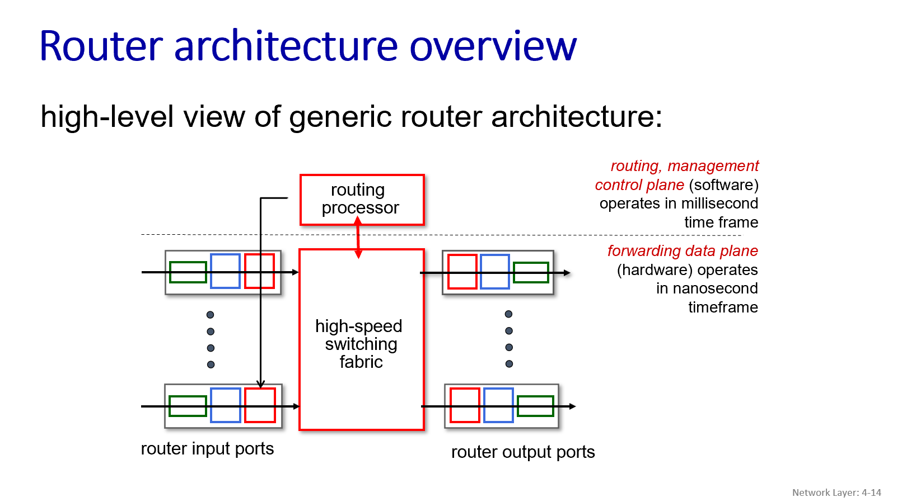
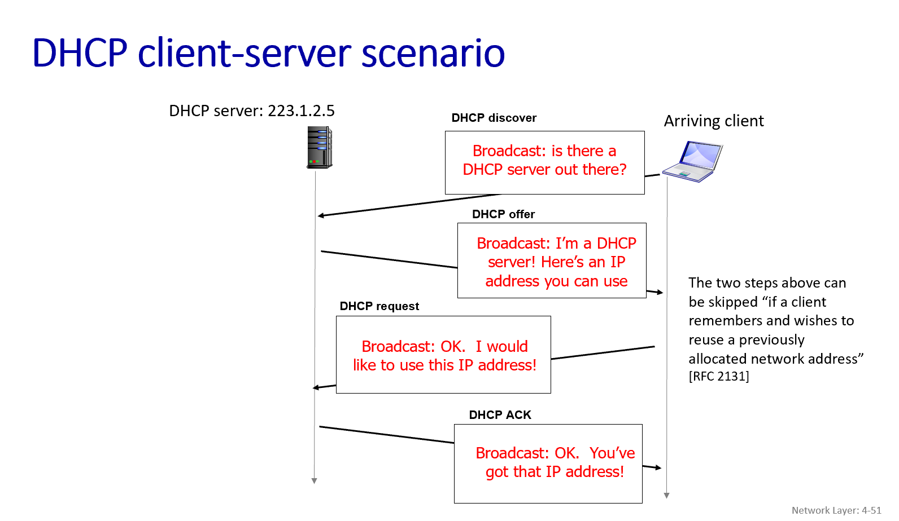
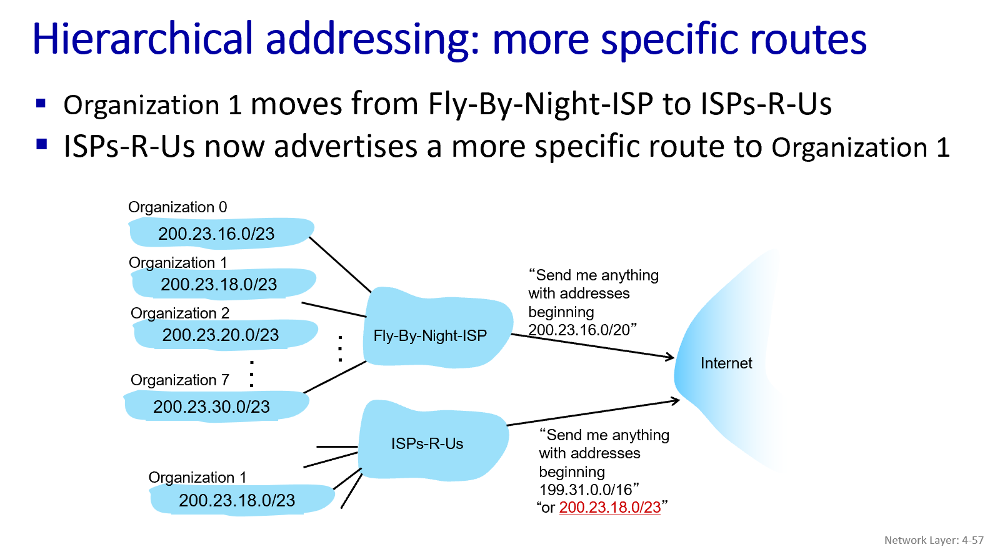

# Network layer overview

## 1. 网络层在互联网中的作用 

数据平面：主要功能是转发 (forwarding)，即在单个路由器内部，根据输入端口收到的数据报头部信息，决定将其转发到哪个输出端口 。这部分操作通常由硬件实现，速度非常快。

控制平面：主要功能是路由 (routing)，即决定数据报从源主机到目标主机所经过的路径 。这是网络范围的逻辑，通常由路由算法（在传统网络中）或SDN控制器（在软件定义网络中）实现

### 网络层功能

- 将传输层递交的报文段 (segment) 从发送主机传送到接收主机。
- 发送方：将报文段封装成数据报 (datagrams)，然后交给链路层。
- 接收方：从数据报中提取报文段，交给传输层。
- 网络层协议存在于每一个互联网设备中，包括主机和路由器 。
- 路由器会检查所有经过它的IP数据报的头部字段，并根据转发表将数据报从输入端口移动到合适的输出端口，以使其沿着端到端的路径传输。

## 2. 网络层服务模型 (Network-layer service model)
什么是服务模型？它定义了网络层向传输层提供的服务特性，比如数据交付是否保证、时延是否有保证、带宽是否有保证等。

### 互联网的服务模型：“尽力而为” (Best Effort)
互联网的网络层提供的是“尽力而为”的服务。这意味着它不提供任何保证 ：
- 不保证数据报一定能成功送达目的地。
- 不保证数据报的交付时序或顺序。
- 不保证端到端流可用的带宽。

### 其他网络架构的服务模型 (例如ATM)
ATM (Asynchronous Transfer Mode) 网络则可以提供更丰富的服务模型，例如：
- CBR (Constant Bit Rate)：提供恒定的比特率，保证带宽、无丢失、有序、有固定时延 。
- ABR (Available Bit Rate)：保证最小带宽 

### 对“尽力而为”服务的思考 (Reflections on best-effort service)
尽管是“尽力而为”，但这种模型的简单性使得互联网能够被广泛部署和采纳。
通过充分配置带宽，很多实时应用（如交互式语音、视频）的性能在“大多数时候”是“足够好”的。
应用层的分布式服务（如数据中心、CDN）通过将服务部署得离用户更近，也帮助提升了服务质量 。

结论是：“尽力而为”服务模型的成功是毋庸置疑的。

## 3. 路由器内部探秘 (What’s inside a router)
输入端口 (Input ports)：
物理功能：接收数据链路层传来的比特流。
链路层功能：将比特流组装成数据链路层帧，并进行差错检测等。
网络层功能：查找转发表，决定数据报应该被转发到哪个输出端口。

交换结构 (Switching fabric)：
这是路由器的核心，负责将数据报从输入端口实际地转移到正确的输出端口。

输出端口 (Output ports)：
接收来自交换结构的数据报。
可能需要对数据报进行排队（如果输出链路繁忙）。
执行链路层封装，然后通过物理层将数据发送出去。

路由处理器 (Routing processor)：
这部分属于控制平面。它运行路由协议（如OSPF, BGP），维护路由表，计算转发表，并执行网络管理功能。
转发数据报的数据平面操作通常由硬件实现，速度极快（纳秒级）。
路由和管理的控制平面操作通常由软件实现，在毫秒级时间尺度上运行。

## 4. 输入端口的功能详解 (Input port functions)

- 线路端接 (Line termination)：物理层功能，负责比特级别的接收。
- 链路层协议 (Link layer protocol (receive))：例如以太网协议，负责帧的处理。
- 查找与转发 (Lookup, forwarding)：这是网络层的核心功能。
    - 分散式交换 (Decentralized switching)：为了达到线速处理（即以数据到达输入链路的速率完成处理），现代路由器通常在每个输入端口都存有转发表的副本。输入端口直接根据数据报头部的字段值查找转发表，决定输出端口，而不需要经过中央的路由处理器。这个过程可以描述为“匹配加行动 (match plus action)”。
    - 基于目标的转发 (Destination-based forwarding)：传统的转发方式，仅根据数据报的目标IP地址来决定下一跳。
    - 通用化转发 (Generalized forwarding)：更现代的方式，可以根据数据报头部的任意一组字段值来进行转发决策（例如，考虑源IP、端口号等）。
- 排队 (Queueing)：如果数据报到达输入端口的速率超过了它们被转发到交换结构的速率，那么输入端口就需要缓存这些数据报，形成队列。

关键点是“分散式交换”：为了追求高性能，查找转发表并做出转发决定的操作通常在每个输入端口独立完成，而不是集中在路由处理器。这使得路由器能够以非常高的速率处理数据包。

### 基于目标的转发与最长前缀匹配 (Destination-based forwarding & Longest Prefix Matching)
当路由器收到一个IP数据报，它需要查看数据报的目标IP地址，并在其转发表 (forwarding table) 中查找，以确定应该将该数据报转发到哪个输出端口。

#### 转发表条目
转发表中的条目通常不是单个完整的IP地址，而是IP地址前缀 (address prefix)。一个前缀代表了一个IP地址范围。
例如，一个条目可能是 11001000 00010111 00010，它匹配所有以此比特序列开头的目标IP地址。

#### 最长前缀匹配规则 (Longest prefix matching)
当一个数据报的目标IP地址到达时，路由器会在转发表中查找所有能够匹配该目标地址的前缀。
可能会有多个前缀都能匹配上。例如，目标地址 11001000 00010111 00010110 10100001 可能同时匹配前缀 11001000 00010111 00010 和 11001000 00010111 0001011 （如果后者存在于表中）。
规则：在这种情况下，路由器会选择匹配上的最长的前缀所对应的输出链路接口。

#### 为什么使用最长前缀匹配？
我们稍后在学习IP地址和子网划分时会更清楚地看到，最长前缀匹配允许更灵活和层次化的地址分配和路由。一个组织可以获得一个大的地址块（对应一个较短的前缀），然后在内部再划分成更小的子网（对应更长的前缀）。当数据要发往这个组织内部的特定子网时，更长（更具体）的前缀会优先匹配，确保了路由的准确性。

#### 实现方式
最长前缀匹配的查找操作需要在高速网络中非常快地完成。
现代高性能路由器通常使用 TCAM (Ternary Content Addressable Memories - 三态内容可寻址存储器) 来实现这个功能。
TCAM允许路由器在单个时钟周期内就能找到匹配的条目，无论转发表有多大。例如，思科的Catalyst系列路由器可以在TCAM中存储约100万条路由条目。

## 5. 交换结构 (Switching Fabrics)
交换结构是路由器的核心，它的任务是将数据包从输入链路高效地转移到合适的输出链路。

交换速率 (Switching rate)：指的是数据包可以从输入端转移到输出端的速率，通常以输入/输出线路速率的倍数来衡量。理想情况下，对于有N个端口的路由器，如果每个端口的线路速率是R，那么交换结构的速率最好能达到 N*R，以避免交换结构自身成为瓶颈。

1. 基于内存的交换 (Switching via memory)
- 这是第一代路由器采用的方式，类似于传统计算机。
- 输入端口收到数据包后，通过系统总线将其复制到路由处理器的内存中。
- 路由处理器查找目标地址对应的输出端口，然后将数据包从内存中复制到输出端口的缓冲区。
- 缺点：性能受限于内存带宽，因为每个数据报都需要两次跨越系统总线（输入到内存，内存到输出）。如果多个数据包同时到达，它们需要竞争对内存的访问。

2. 基于总线的交换 (Switching via a bus)
- 输入端口通过共享总线直接将数据包传输到输出端口，无需路由处理器的直接干预。
- 输入端口为数据包添加一个内部标签，指明目标输出端口，然后将其广播到总线上。所有输出端口都能收到这个包，但只有与标签匹配的那个输出端口会真正保留并处理它。
- 缺点：总线带宽成为瓶颈。

3. 基于互联网络的交换 (Switching via interconnection network)
- 为了克服共享总线的带宽限制，采用了更复杂的互联网络结构，例如纵横式交换网络 (crossbar switch) 或多级交换网络 (multistage switch)。

- 纵横式交换网络：它由2N条总线构成（N个输入端口，N个输出端口）。
- 多级交换网络：可以通过将多个小型的交换单元（如小的纵横交换单元）组合起来构建大型的交换网络。
- 并行处理：为了进一步提高性能，可以将数据报分割成固定长度的信元 (cells)，然后在交换结构中并行地交换这些信元，在输出端再重新组装成数据报。
- 多平面并行：高端路由器（如Cisco CRS）甚至使用多个并行的交换平面（fabric planes）来共同承担交换任务，从而实现极高的交换容量（可达数百Tbps）。

LimBoo注：不关键的小知识。通过将大的数据报分割成定长的cell，可以简化交换单元的设计，并提高性能。整个IP数据报（包括其头部和载荷Payload）都会被被切分成多个更小的、固定大小的信元。每个信元都会获得一些新的头部信息（由交换结构内部使用）并保留部分原始的IP头部信息，以便它们能够被独立地在交换网中路由，并最终在正确的输出端口被重新组装。

### 输入端口队列与行头阻塞 (Input Port Queuing & Head-of-the-Line (HOL) blocking) 
输入端口的一个功能是排队 (queueing)。

为什么输入端口会发生排队？
- 如果交换结构 (switch fabric) 的转发速率慢于所有输入端口接收数据包的总速率，那么数据包就可能在输入端口的队列中累积起来，等待被交换结构处理。这会导致排队延迟 (queueing delay)，如果队列满了，还会导致丢包 (loss due to input buffer overflow)。

- 输出端口竞争 (Output port contention)：
即使交换结构的速率足够快，输入端口队列也可能因为输出端口竞争而形成。
假设有两个输入端口都收到了要去往同一个输出端口（比如图中的上方红色输出端口）的数据包。
交换结构在同一个时刻只能将一个数据包传送到那个特定的输出端口。
因此，其中一个输入端口的数据包）就必须在输入队列中等待，因为它想要去的输出端口正忙。

- 行头阻塞 (Head-of-the-Line (HOL) blocking)：
这是一种由输入端口队列和输出端口竞争共同导致的问题。
当一个输入队列的队首数据包（Head-of-the-Line packet）因为其目标输出端口正忙而被阻塞时，它会*阻止队列中排在它后面的、可能要去往其他空闲输出端口的数据包被处理和转发*。

简单来说，行头阻塞就像是超市结账时：
你排的队里，排在最前面的那个人因为某种原因（比如和收银员聊天、付款遇到问题）卡住了，即使你后面的人可能买的东西很少、可以很快结账，或者想去隔壁空闲的收银台，但因为前面的人不动，整个队伍都动不了。

### 输出端口队列与调度 (Output Port Queuing, Buffer Management, and Scheduling)

#### 1. 输出端口的功能与排队 (Output port queuing)
核心功能：输出端口的主要任务是将从交换结构传来的数据包通过物理链路发送出去。

为什么需要缓冲？
- 当数据包从交换结构到达输出端口的速率超过该输出链路的传输速率时，就需要缓冲。
- 想象一下，交换结构可能很快地同时向一个输出端口扔过来好几个数据包，但输出链路一次只能发送一个。这时，来不及发送的包就必须在输出端口的缓冲区中排队等待。

后果：
- 排队延迟 (Queueing delay)：数据包在缓冲区中等待发送所花费的时间。
- 丢包 (Loss due to output port buffer overflow)：如果输出端口的缓冲区已满，新到达的数据包将无处存放，只能被丢弃。这通常是网络拥塞导致丢包的一个主要原因。

丢弃策略 (Drop policy)：当缓冲区已满时，需要一个策略来决定丢弃哪个数据包（例如，是丢弃新到达的包，还是队列中的某个包）。

调度规则 (Scheduling discipline)：当输出链路空闲时，调度规则会从队列中选择下一个要发送的数据包。

需要多少缓冲？
- 传统经验法则 (RFC 3439)：平均缓冲量应等于“典型”的RTT（往返时间，比如250毫秒）乘以链路容量C。例如，一个10 Gbps的链路，需要的缓冲大约是2.5 Gbit。
- 过量缓冲的弊端：虽然需要足够的缓冲来吸收突发流量，但过多的缓冲（尤其是在家用路由器中）可能会显著增加延迟，导致实时应用性能下降，TCP响应迟缓。这与我们之前讨论的基于延迟的拥塞控制思想（“保持瓶颈链路刚好满但不过满”）是相关的。
- 较新的建议：对于有N个TCP流共享的链路，建议的缓冲量是 RTT * C / sqrt(N)。这个公式考虑了流的数量，当流很多时，每个流所需的缓冲量会相对减少。

缓冲区管理 (Buffer Management)
- 丢弃 (Drop)：当缓冲区满时，决定添加哪个包，丢弃哪个包。
    - 队尾丢弃 (Tail drop)：最简单的策略，当队列已满时，新到达的数据包被丢弃。
    - 优先丢弃 (Priority)：根据数据包的优先级来决定丢弃或移除哪个包。
- 标记 (Marking)：在缓冲区开始拥挤但还未满时，可以对某些数据包进行“标记”，以向网络中的其他设备（或端点）发出拥塞信号（例如，使用我们之前提到的ECN - 显式拥塞通知）。

#### 2. 包调度策略 (Packet Scheduling)
1. 先来先服务 (First Come, First Served - FCFS / FIFO)
    - 定义：按照数据包到达输出端口队列的顺序来发送它们。也被称为先进先出 (First-In-First-Out - FIFO)。
    - 特点：实现简单，公平（至少在到达顺序上）

2. 优先级调度 (Priority Scheduling)
    - 定义：到达的数据包根据其类别被划分到不同的优先级队列中。分类的依据可以是数据包头部的任何字段（例如，TOS字段、端口号等）。
    - 调度规则：总是从具有缓冲数据包的最高优先级队列中选择数据包进行发送。在同一个优先级队列内部，可以采用FCFS策略。
    - 潜在问题：容易发生“饥饿 (starvation)”现象。

3. 轮询调度 (Round Robin - RR)
    - 定义：同样，到达的数据包被分类并放入不同的类别队列中。
    - 调度规则：调度器会周期性地、循环地扫描每个类别队列，并从每个有数据包的队列中发送一个完整的数据包。
    - 特点：比严格优先级调度更公平，保证了每个类别队列都能得到服务机会，避免了饿死现象。但是，如果数据包大小不一，单纯的轮询（每个队列发一个包）可能并不能保证带宽的公平分配。
4. 加权公平队列 (Weighted Fair Queuing - WFQ)
    - 定义：这是轮询调度的一种泛化或改进版本。
    - 调度规则：每个类别队列 i 会被分配一个权重 wi。在每个服务周期内，每个类别 i 会获得与其权重 wi 成比例的服务量 (即可以发送的数据量)。
    - 特点：
        - 能够为不同的流量类别提供差分服务 (differentiated service)。
        - 可以为某些重要的流量类别保证最小带宽。
        - 实现了比简单轮询更精细和公平的带宽分配。

# IP协议 (Internet Protocol)
IP协议 (IP protocol)：
- 数据报格式 (datagram format)
- 寻址 (addressing)
- 数据包处理约定 (packet handling conventions)

## 1. IP数据报格式 (IP Datagram format) 

IPv4数据报的头部结构。IP数据报由头部 (header) 和载荷 (payload) 两部分组成。载荷部分通常是来自传输层的TCP报文段或UDP数据报。IP头部则包含了将数据报从源主机路由到目标主机所需的关键控制信息。

LimBoo注：ppt里只有这一张图在讲解这部分内容。我在这里进行了额外补充。

版本 (ver - 4位)：指IP协议的版本号。对于IPv4，这个值是4。

头部长度 (head. len - 4位)：指IP头部的长度，单位是4字节。
- 由于“head. len”字段本身只有4位，它能表示的最大十进制数是15 (1111二进制)。所以，IP头部的最大长度可以是 15 * 4字节 = 60字节。最小长度是当值为5时，即 5 * 4字节 = 20字节（没有选项字段的情况）

服务类型 (type of service - TOS - 8位)：用于指示期望获得的服务质量，例如低延迟、高吞吐量或高可靠性。现在这个字段通常被用于区分服务 (DiffServ) 和显式拥塞通知 (ECN)。

标识 (16-bit identifier - 16位)：主要用于IP分片 (fragmentation) 和重组 (reassembly)。当一个IP数据报因为太大而需要被分割成多个较小的片段才能通过某个网络链路时，所有这些片段都会拥有相同的标识号。

标志 (flgs - 3位)：标志 (flgs - 3位)：也与IP分片相关。其中一位表示“不分片 (Don't Fragment - DF)”，另一位表示“更多分片 (More Fragments - MF)”。

片偏移 (fragment offset - 13位)：指明该分片在原始IP数据报中的相对位置（以8字节为单位）。

生存时间 (Time To Live - TTL - 8位)：设置数据报可以经过的最多路由器跳数。每经过一个路由器，TTL的值减1。当TTL减到0时，数据报将被丢弃，并通常会向源主机发送一个ICMP超时消息。这个机制可以防止数据报在网络中无限循环。

上层协议 (upper layer - 8位)：指明IP数据报的载荷部分应该交给哪个上层协议处理，例如TCP (值为6) 或UDP (值为17)。

头部校验和 (header checksum - 16位)：仅用于校验IP头部在传输过程中是否出错。每经过一个路由器，由于TTL字段会改变，所以校验和需要重新计算。

选项 (options - 可变长度)：一个可选的、可变长度的字段，可以用于一些特殊处理，如记录路由路径、时间戳等。由于这个字段的存在，IP头部长度不是固定的，需要“头部长度”字段来指明其实际长度。

## 2. IP寻址 (Addressing)
IP地址定义：IP地址是与每个主机或路由器接口相关联的32位标识符（对于IPv4）。

接口 (interface)：是主机/路由器与物理链路之间的连接点。
- 路由器通常有多个接口，连接到不同的网络。
- 主机通常有一个或两个接口（例如，有线以太网接口和无线WiFi接口）。

点分十进制表示法 (dotted-decimal IP address notation)：为了方便人类阅读，32位的IP地址通常被书写为点分十进制的形式，例如 223.1.1.1。

*目前，我们暂时不需要担心没有路由器介入的情况下，一个接口是如何连接到另一个接口的细节。*

LimBoo注：整个流程就是-数据包从一个接口（例如A）进入，路由器查看其目标地址，根据转发表决定它应该从哪个接口（例如B）出去，然后通过内部的交换结构把它送到那个出口，最终从接口B发出。

## 3. 子网 (Subnets)
直观定义：子网指的是一个网络中的一部分，其中的设备接口能够在不经过中间路由器的情况下物理地相互到达。

IP地址结构：同一个子网内的设备接口，其IP地址的高位部分（即网络部分或子网部分）是相同的。IP地址的剩余低位部分（主机部分）则用于区分该子网内的不同接口。

子网掩码 (Subnet mask)：用来指明IP地址中哪部分是子网部分，哪部分是主机部分。例如，/24 的子网掩码表示IP地址的前24位是子网部分，后8位是主机部分。

子网地址：一个子网通常用其网络部分的IP地址和子网掩码来表示，例如 223.1.1.0/24 表示子网部分是 223.1.1，掩码长度是24位。

## 4. IP寻址：CIDR (IP addressing: CIDR)
CIDR (发音为 "cider")：这是一种允许IP地址的网络部分（或子网部分）长度是任意的的寻址方案。这与早期基于类别的IP地址分配（A类、B类、C类，它们有固定的网络前缀长度）不同。

地址格式：CIDR地址通常表示为 a.b.c.d/x 的形式，其中 x 表示IP地址中网络部分的比特数。
- 例如，PPT中的 200.23.16.0/23 表示该IP地址块的前23位是网络/子网部分，剩下的 32 - 23 = 9 位是主机部分。

CIDR的优点：
1. 更高效地利用IP地址空间：允许更精细地分配IP地址块，避免了早期固定类别地址分配时可能造成的大量浪费。
2. 路由聚合 (Route Aggregation)：使得互联网骨干路由器可以用一个更短的前缀来代表一大片区域的多个子网，从而大大减小路由表的规模，提高路由查找效率。我们稍后在讨论层次化寻址时会看到这一点。

## 5. 如何获得IP地址？(IP addresses: how to get one?)
这个问题可以分解为两个层面：
1. 主机如何在其网络内获得IP地址？ (即IP地址的主机部分如何分配)
2. 一个网络（或组织）如何获得一部分IP地址空间供自己使用？ (即IP地址的网络部分如何分配)

### 1. 主机如何获得IP地址？ (How does a host get an IP address?)

#### 手动配置 (Hard-coded)：
系统管理员可以在配置文件中为每台主机硬编码一个静态IP地址（例如，在UNIX系统中的 /etc/rc.config 文件）。这种方式适用于数量较少且地址固定的设备（如服务器）。

#### DHCP (Dynamic Host Configuration Protocol - 动态主机配置协议)：
这是一种更常用、更自动化的方式，允许主机在加入网络时动态地从服务器获取IP地址。

目标:
- 主机动态获取IP地址。
- 可以续租正在使用的地址。
- 允许地址的重复使用（仅在连接时持有地址）。
- 支持移动用户加入和离开网络。

DHCP工作流程概述 (四步)：
1. DHCP发现 (DHCP discover)：新加入网络的主机广播一个DHCP发现消息，试图找到网络中的DHCP服务器。
   - 源IP: 0.0.0.0, 目标IP: 255.255.255.255 (广播地址)。源端口: 68, 目标端口: 67。
2. DHCP提供 (DHCP offer)：DHCP服务器收到发现消息后，会回复一个DHCP提供消息，其中包含一个可供客户端使用的IP地址（yiaddr字段，意为your IP address）、租用期等信息。
   - 这个提供消息通常也是广播发送的，因为此时客户端还没有IP地址。
3. DHCP请求 (DHCP request)：客户端从可能收到的一个或多个DHCP提供中选择一个，然后广播一个DHCP请求消息，正式请求使用该IP地址。
4. DHCP确认 (DHCP ACK)：被选中的DHCP服务器回复一个DHCP确认消息，确认将该IP地址分配给客户端，并提供租用期等信息。

*如果客户端记得并希望重用之前分配的地址，前两步（发现和提供）可以跳过。*

通常，DHCP服务器会与路由器部署在一起，为路由器连接的所有子网提供服务。

DHCP不仅仅分配IP地址：DHCP还可以向客户端提供更多信息，例如：
- 该子网的第一跳路由器地址 (网关地址)。
- DNS服务器的名称和IP地址。
- 网络掩码 (指明地址的网络部分和主机部分)。

LimBoo注：如果采用硬编码，上面这些信息都需要要手动设置。

### 2. 网络如何获得IP地址块 (IP addresses: how to get one?)
问题：一个网络（比如一个公司、一个大学或者一个ISP）是如何获得其子网部分的IP地址的？
答案：它们通常从其上游的互联网服务提供商 (ISP) 那里获得一部分地址空间。

#### 层次化寻址与路由聚合 (Hierarchical addressing: route aggregation)

路由聚合的效率：层次化的地址分配允许进行高效的路由信息通告，这被称为路由聚合 (route aggregation) 或路由汇总。
- 在PPT 4-56页的例子中，"Fly-By-Night-ISP" 可以向互联网的其他部分宣告：“所有目的地以 200.23.16.0/20 开头的流量都请发给我。”它不需要向外界通告其内部更具体的 /23 的组织网络。这样，外部路由器只需要一条路由条目就能知道如何到达这个ISP所服务的所有组织网络。

更具体的路由 (More specific routes)：
- 如果某个组织（比如Organization 1）更换了ISP（例如从 "Fly-By-Night-ISP" 换到了 "ISPs-R-Us"）。
- 新的ISP ("ISPs-R-Us") 就会开始向互联网通告一条到达Organization 1的更具体的路由（比如 200.23.18.0/23）。
- 当路由器进行路由查找时，如果同时存在一个概括性的路由（如 200.23.16.0/20 指向旧ISP）和一个更具体的路由（如 200.23.18.0/23 指向新ISP），根据我们之前学过的“最长前缀匹配”规则，去往Organization 1的数据包将会被正确地路由到新的ISP。

#### IP地址分配的最后说明 (IP addressing: last words)：
ISP如何获得地址块？
- ICANN (Internet Corporation for Assigned Names and Numbers) 是负责全球IP地址分配、域名系统管理等的顶层机构。
- ICANN通过5个区域互联网注册管理机构 (Regional Internet Registries - RRs) 来分配IP地址。这些RRs再将地址分配给其服务区域内的本地注册管理机构或ISP。

IPv4地址够用吗？
不够。
- NAT (网络地址转换) 技术帮助缓解了IPv4地址耗尽的问题（我们稍后会讨论NAT）。
- IPv6 拥有128位的地址空间，提供了远超IPv4的地址数量。

## 6. 网络地址转换 (NAT - Network Address Translation)
核心思想：允许多个在本地网络（例如家庭网络、公司内部网络）中的设备共享单个对外的公共IP地址，以便与外部互联网通信。

### 工作方式：
- 本地网络中的设备通常使用私有IP地址（例如 10.0.0.0/24 网段的地址）。这些私有地址只在本地网络内有效，不能在公共互联网上路由。
- 当本地网络中的设备要向外部互联网发送数据报时，NAT路由器（通常是家用路由器或公司网关）会修改数据报的源IP地址和源端口号。
- 对于离开本地网络的数据报：NAT路由器会将数据报的源IP地址替换为NAT路由器自身的公共IP地址 (NAT IP address)，并将源端口号替换为一个新的、唯一的端口号。
- 对于进入本地网络的数据报：当外部服务器响应时，它会将数据发往NAT路由器的公共IP地址和那个新的端口号。NAT路由器会根据其内部的NAT转换表 (NAT translation table)，将目标IP地址和目标端口号改回原始本地设备的私有IP地址和原始端口号，然后将数据报转发给本地网络中的正确设备。

### NAT的优点
- 节省IP地址：只需要一个公共IP地址就可以让本地网络中的所有设备接入互联网，极大地缓解了IPv4地址耗尽的压力。
- 本地网络地址管理的灵活性：可以在本地网络中自由更改主机的IP地址，而无需通知外部世界。
- 更换ISP的便利性：更换ISP时，只需要更改NAT路由器的公共IP地址配置，本地网络内部的设备地址无需改变。
- 一定的安全性：本地网络内部的设备不直接暴露在公共互联网上，它们的私有地址对外部不可直接寻址和访问，提供了一层隐蔽性。

### NAT的争议
- 违反分层原则：路由器作为网络层设备，本应只处理到网络层（第三层）的头部，但NAT需要修改传输层（第四层）的端口号。
- IPv6才是根本解决之道：有人认为地址短缺问题应该通过全面转向IPv6来解决，而不是依赖NAT这种“打补丁”的方式。
- 破坏端到端原则(violates end-to-end argument)：NAT使得内部主机不再拥有全局唯一的IP地址，这破坏了互联网最初设计的一些端到端连接的透明性。
- NAT穿越 (NAT traversal)：如果外部客户端想要主动连接到一个位于NAT之后的服务（例如，一个P2P应用中的节点或一个家庭网络中的游戏服务器），就会遇到困难，需要特殊的NAT穿越技术。

尽管有争议，但NAT因其便利性和在缓解IPv4地址耗尽方面的巨大作用，已经成为并将长期存在于互联网中，广泛应用于家庭网络、企业网络以及4G/5G蜂窝网络。

## 7. IPV6
主要设计动机：
- 32位IPv4地址空间即将完全分配完毕：这是最主要的驱动力。

其他动机：
- 简化头部，加快处理/转发速度：IPv6设计了一个固定长度的40字节头部，并移除了一些IPv4头部中不常用或可以由其他方式处理的字段（比如头部校验和），以期路由器能更高效地处理数据包。
- 支持对“流 (flows)”的差异化网络层处理：IPv6头部中包含了“流标签 (flow label)”字段，为实现对特定数据流的服务质量 (QoS) 保证提供了可能性。

而然IPV6现实部署十分缓慢。

# 总结：
我们了解了网络层的数据平面，主要包括：

- 网络层的概述和服务模型（尽力而为）。
- 路由器的内部架构（输入端口、交换结构、输出端口）。
- 输入端口的关键技术，如最长前缀匹配。
- 交换结构的三种主要类型。
- 输出端口的队列、缓冲管理和包调度策略。
- IP协议的核心内容，包括IP数据报格式。
- IP寻址，包括子网、CIDR。
- IP地址的获取方式（DHCP、ISP分配）。
- 网络地址转换 (NAT)。
- IPv6的动机和采用情况。  