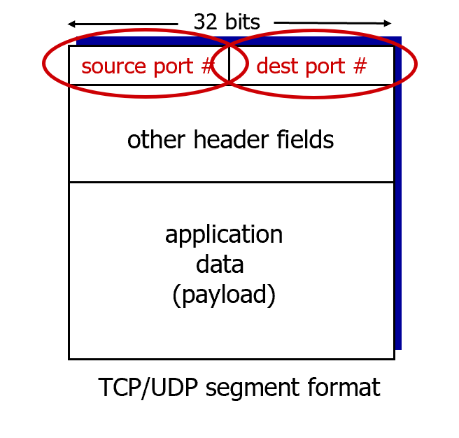

# Transport-layer services
逻辑通信 (Logical communication): 传输层协议在不同的主机上运行的应用程序进程之间提供逻辑通信 。

- “逻辑通信”意味着，从应用程序的角度来看，它就好像是直接和另一台主机上的应用程序在通信，而无需关心底下的网络有多复杂（比如经过了多少个路由器，走了哪条路）。传输层隐藏了这些细节。

与网络层的区别：网络层 (Network layer)提供的是主机到主机的通信服务 。它的任务是把数据包 (datagrams) 从一台主机送到另一台主机。传输层 (Transport layer)提供的是进程到进程的通信服务 。它利用网络层提供的“主机到主机”服务，并在此基础上增加了将消息送达指定应用程序进程的能力。

*比喻：*
主机 (Hosts) = 两栋房子 (比如Ann家和Bill家)。
进程 (Processes) = 房子里的孩子们。
应用消息 (App messages) = 孩子们写的信。
网络层协议 (Network-layer protocol) = 邮政服务。它的任务是把信件从一栋房子送到另一栋房子，但它不关心具体是哪个孩子写的或要给哪个孩子。
传输层协议 (Transport protocol) = 家里的长辈 (Ann和Bill)。当邮递员把一大堆信送到Bill家时，Bill负责查看每封信的收信人，然后把信分发给正确的孩子。这个“分发”的动作就是多路分用 (demultiplexing)。反之，当Ann家的孩子们写完信后，Ann负责收集所有信件然后交给邮政服务，这个“收集”的动作就是多路复用 (multiplexing)。

# 多路复用与多路分用 (Multiplexing and Demultiplexing)
这个概念回答了一个核心问题：“当一台主机（比如你的电脑）同时运行着浏览器、微信和游戏时，操作系统如何知道收到的网络数据包应该交给哪个程序？”

简单来说，端口号 (Port Number) 就像公寓楼里每个房间的门牌号。IP地址能帮你找到正确的大楼（主机），而端口号能帮你找到大楼里正确的房间（应用程序进程）。多路复用就是把不同房间的信件统一拿到楼下邮箱发出去，多路分用就是把收到的信件按门牌号分发到各个房间。

## 多路分用 (Demultiplexing) - 在接收方:
接收主机的传输层检查收到的数据段 (segment) 的头部信息（主要是端口号），然后利用这些信息将数据段准确地递交给绑定了对应端口号的那个Socket，从而送达正确的应用程序进程。

## 多路复用 (Multiplexing) - 在发送方:
发送方的传输层从多个不同的Socket（对应不同的应用程序）收集数据，为每个数据块添加上头部信息（包含了源端口和目标端口等），然后将这些封装好的数据段传递给网络层。

## 无连接分用 (Connectionless demultiplexing)
当你在使用UDP时，情况比较简单：
- UDP Socket由“目标端口号”标识：当一个UDP数据段到达主机时，主机的传输层只检查数据段头部的目标端口号 (destination port #)。
- 分发到对应Socket：然后，它会把这个UDP数据段直接发送给本机上绑定了这个目标端口号的那个Socket。
- 不关心源地址：UDP分用不关心数据来自哪里（即源IP地址和源端口号）。这意味着，来自不同发送方（不同源IP、不同源端口）但发往同一个目标端口的数据包，都会被送到同一个Socket。

## 面向连接分用 (Connection-oriented demultiplexing)
TCP的分用过程要更精细一些，因为它需要支持多个并发的、独立的连接。

TCP Socket由“四元组”标识：一个TCP连接（以及它对应的专用Socket）是由一个包含四个值的元组唯一标识的：
1. 源IP地址 (source IP address) 
2. 源端口号 (source port number) 
3. 目标IP地址 (dest IP address) 
4. 目标端口号 (dest port number)

使用所有四个值进行分用：当一个TCP数据段到达主机时，接收方的传输层会同时检查这全部四个值，来决定应该将这个数据段交给哪个Socket 。

支持并发连接：正因为如此，一个TCP服务器可以同时与多个客户端保持连接。即使所有客户端都连接到服务器的同一个端口（比如Web服务器的80端口），但因为每个客户端的源IP地址或源端口号不同，所以它们各自对应的四元组也不同，服务器能够为每个连接创建一个独立的专用Socket，并将数据准确地分发给它们。

## UDP: User Datagram Protocol

1. 为什么要有UDP？
- “极简”的协议 ("no frills," "bare bones") ：UDP几乎没有增加任何多余的功能。它提供的“尽力而为”服务 (best effort)，意味着UDP数据段可能会丢失 ，也可能不按顺序到达 。
- 无需建立连接 (no connection establishment) ：UDP在发送数据前不需要进行“三次握手”来建立连接。这可以节省时间，特别是对于那些需要快速响应的应用 。
- 简单 (simple)：由于没有连接状态，发送方和接收方都不需要维护复杂的连接信息（如序列号、窗口大小等）。
- 头部开销小 (small header size) ：UDP的头部只有8个字节，非常小，而TCP的头部至少有20个字节。
- 没有拥塞控制 (no congestion control) ：UDP本身不会因为网络拥堵而主动减慢发送速度。它允许应用程序按照自己希望的速率发送数据。

2. UDP的用途 
正是因为上述特点，UDP非常适用于以下场景 ：
- 流媒体应用 (streaming multimedia apps)：比如在线视频、直播。这类应用能容忍丢失一些数据，但对传输速率和延迟非常敏感 。
- DNS (域名系统) 。
- SNMP (简单网络管理协议) 。
- HTTP/3 ：新一代的HTTP协议建立在UDP之上，并在应用层自己实现了可靠传输和拥塞控制 。

3. UDP数据段头部 (UDP segment header)
一个UDP数据段由两部分组成：UDP头部和应用数据（载荷）。它的头部格式非常简单，包含四个字段：
- 源端口号 (source port #) 
- 目标端口号 (dest port #) 
- 长度 (length)：整个UDP数据段（包括头部和数据）的总长度，以字节为单位 。
- 校验和 (checksum)：用于检查数据段在传输过程中是否出现了差错（比如比特翻转）。

4. UDP校验和 (UDP checksum)
目标：检测传输过程中数据段里出现的差错（即比特位的翻转）。

发送方 (sender) 的操作 ： 
- 将UDP数据段的内容看作是一系列16位的整数 。
- 将所有这些16位整数进行反码求和 (one’s complement sum) 。如果最高位相加后产生了进位，需要将这个- 进位加回到结果的最低位（这被称为“回卷” - wraparound）。

将最终的和按位取反，得到的结果就是校验和的值，然后将其放入校验和字段 。

接收方 (receiver) 的操作 ： 
- 将收到的数据段中所有16位整数（包括校验和字段本身）用同样的反码加法相加 。
- 检查计算结果是否等于校验和字段的值 。在一种常见的实现中，如果将收到的校验和也加入计算，那么最终结果的所有比特位都应该是1。
- 如果不等（或结果不全为1），则说明传输过程中出现了差错。