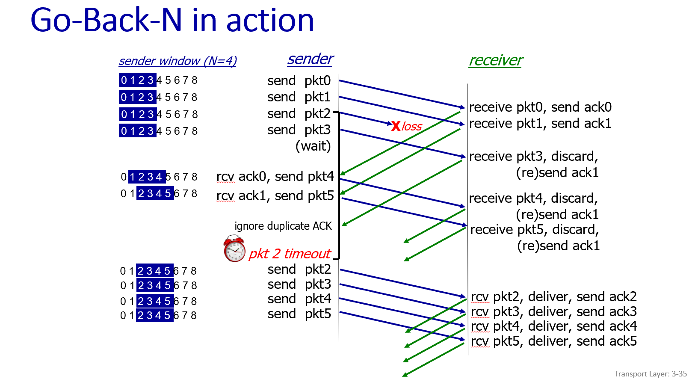

# 可靠数据传输原理 (Principles of Reliable Data Transfer - RDT)

## 第一部分：可靠数据传输的起点
### 目标与抽象

目标：我们希望为上层应用提供一个完全可靠的信道，让应用层觉得数据传输绝对不会出错或丢失。

接口：为了实现这个目标，我们需要设计一个可靠数据传输协议 (rdt)。这个协议会调用下层的、不可靠的数据传输协议 (udt_send，代表unreliable data transfer) 来实际发送数据 。

### rdt1.0: 在可靠信道上的可靠传输
**核心假设： 我们假设底层的信道是完全可靠的。**
- 这意味着数据包不会丢失，也不会出现错误。
发送方只需要把数据包发送出去，接收方只需要接收数据包就可以了。

## 第二部分：处理比特差错 (rdt2.0)

### rdt2.0: 在不可靠信道上的可靠传输
**新的假设： 我们现在假设，底层信道可能会发生比特翻转（即数据包内容会出错），但我们暂时先假设数据包不会丢失。**

如何恢复？

首先，我们已经知道可以用校验和 (checksum) 来检测出比特差错。

但检测出错误后该怎么办？PPT用了一个很形象的类比：人类在交谈中是如何处理“错误”的？  如果你没听清对方的话，你会说“麻烦再说一遍”，如果听清楚了，你可能会点点头示意。

#### 引入反馈机制：
1. 确认 (Acknowledgements - ACKs): 接收方明确地告诉发送方，数据包已完好无损地收到。
2. 否定确认 (Negative Acknowledgements - NAKs): 接收方明确地告诉发送方，收到的数据包是损坏的。 

#### 引入重传机制 (Retransmission)
当发送方收到一个NAK时，它会重新发送上一个数据包。

#### 停等协议 (Stop and Wait)
rdt2.0采用了一种被称为“停等”的工作模式。顾名思义，发送方发送一个数据包后，就停止下来，等待接收方的响应（ACK或NAK）。只有在收到响应后，它才能决定下一步是发送新数据（如果收到ACK）还是重传旧数据（如果收到NAK）。

#### rdt2.0的状态机 (FSM)
发送方 (Sender):
- 它有一个“等待上层调用”的初始状态。
- 当上层要发数据时，它发送数据包 udt_send(sndpkt)，然后进入一个新的状态：“等待ACK或NAK”。
- 在这个新状态下：
    - 如果收到ACK，说明发送成功，它就回到初始状态，等待发送下一个新数据。
    - 如果收到NAK，说明发送失败，它就重传刚才的数据包。 udt_send(sndpkt)，然后继续留在这个状态，等待对这次重传的响应。

接收方 (Receiver):
- 它只有一个状态：“等待下层数据”。
- 当它收到一个数据包时：
    - 如果通过校验和发现数据包是完好的 (notcorrupt)，它就向上层应用交付数据，并发送一个ACK。
    - 如果发现数据包是损坏的 (corrupt)，它就直接发送一个NAK。

## 第三部分：处理损坏的ACK/NAK (rdt2.1)
### rdt2.0的致命缺陷 
**问题：如果ACK或NAK反馈消息本身在传回来的路上损坏了，会发生什么？**

不能简单重传： 发送方不能因为收到了一个损坏的ACK/NAK就盲目地重新发送数据包。因为万一接收方其实已经成功收到了上一个数据包，这次重传就会造成重复的数据包 (duplicate packet)。 对于上层应用来说，收到重复的数据可能是个严重的问题（比如银行转账操作执行两次）。

#### 解决方案：引入序列号 (Sequence Numbers)
为了解决这个问题，协议需要进化到 rdt2.1，它引入了一个新的关键机制：序列号 (sequence number)。

- 工作原理：
    - 发送方给它发送的每个数据包都附上一个序列号。在停等协议中，这个序列号可以非常简单，就是 0 和 1 交替使用。
    - 接收方不仅检查数据包是否损坏，还要检查序列号是否是它当前所期望的那个。
    - 处理重复： 如果接收方收到了一个序列号是它已经确认过的包（比如它期望收到包1，但又收到了一个包0），它就知道这是一个重复的数据包。这时，它会丢弃这个重复包（不向上层交付），但仍然会为这个序列号再发送一次ACK。这样，发送方就能知道接收方确实收到了。

#### rdt2.1的状态机
发送方 (Sender):
- 状态数量翻倍了。它现在有“等待发送包0”、“等待ACK0”、“等待发送包1”、“等待ACK1”等状态。
- 它必须记住当前等待的ACK应该对应哪个序列号。
- 如果收到损坏的ACK/NAK，它会重传当前序列号的数据包。

接收方 (Receiver):
- 也需要记住它期望接收的下一个数据包的序列号（0还是1）。
- 如果收到的包是期望的序列号且未损坏，则接收数据，发送对应ACK，然后更新期望的序列号（比如从期望0变成期望1）。
- 如果收到的包是非期望的序列号（即重复包），则直接丢弃，并为这个旧的序列号重新发送一次ACK。

#### rdt2.1 讨论
为什么两个序列号(0, 1)就足够了？ 因为在“停等协议”中，任何时候在网络中途最多只有一个待确认的数据包。发送方只需要区分“当前发送的包”和“下一个要发送的包”就够了，所以0和1交替使用即可。

接收方必须检查重复。

关键点：接收方永远无法确定它发送的最后一个ACK/NAK是否被发送方成功收到了。这也正是导致发送方可能重传、从而产生重复数据包的根本原因。

## 第四部分：一个无NAK的协议 (rdt2.2)
### rdt2.2: 无NAK协议 (a NAK-free protocol)
**目标：实现与 rdt2.1 完全相同的功能，但完全不使用NAK消息，只使用ACK。**

核心思想:
- 当接收方收到一个损坏的数据包时，它不再发送一个NAK。
- 取而代之的，接收方会为上一个正确接收的数据包重新发送一次ACK。
- 为了让发送方能区分这是对哪个包的确认，接收方发送的ACK消息中必须明确包含它所确认的那个数据包的序列号（例如，发送"ACK0"或"ACK1"）。

发送方的行为:
- 当发送方收到一个重复的ACK (duplicate ACK) 时，它就知道接收方没有正确收到当前它正在发送的那个新包。
- 因此，重复的ACK对于发送方来说，起到了和NAK完全相同的效果：**触发重传**。

与TCP的关系：
我们将来会看到，真实的TCP协议就采用了这种无NAK的、仅使用ACK的方式。

#### rdt2.2 的状态机片段 (FSM fragments)

发送方 (Sender):
- 以等待ACK0的状态为例。在 rdt2.1 中，触发重传的条件是 isNAK(rcvpkt)。
- 在 rdt2.2 中，触发重传的条件变成了 isACK(rcvpkt, 1)。也就是说，当发送方发送了包0并等待ACK0时，如果它收到了一个ACK1（这就是对上一个包的重复确认），它就知道包0出问题了，需要重传。

接收方 (Receiver):
- 它的逻辑变得更简单了。它不再需要判断何时发送NAK。
- 无论收到的包是损坏的，还是序列号不对，它要做的都是同一件事：为上一个正确收到的包发送一次ACK。

简单来说，rdt2.2 用“重复确认”这种行为，巧妙地替代了“否定确认”这种消息类型，让协议的实现更统一、更简洁。

## 第五部分：处理数据包丢失 (rdt3.0)
**新的问题：信道会丢失数据包。**

我们现在面对一个更真实、更具挑战的信道，它不仅会产生比特差错，还会丢失数据包。这包括从发送方到接收方的数据包，以及从接收方到发送方的ACK包。

致命后果：如果一个数据包丢失了，接收方永远收不到它，自然也不会发送ACK。如果一个ACK包丢失了，发送方就永远收不到确认。在这两种情况下，发送方都会永远地等待下去，整个协议就会被“卡死”。

人类如何处理？如果你对某人说了一句话，但对方毫无反应，你会怎么办？你可能会等一会儿，然后问“你还在听吗？”，或者直接把刚才的话再说一遍。这个“等一会儿”就是“超时”思想的来源。

### 解决方案：超时重传 (Timeout & Retransmission)
为了解决“无限等待”的问题，协议进化到了 rdt3.0，它引入了最后一个关键机制：超时重传。

核心思想：
- 发送方在发送一个数据包后，启动一个倒计时器 (countdown timer) 。
- 发送方会等待一段“合理的”时间 。
- 如果在这段时间内收到了对应的ACK，就万事大吉，关闭计时器。
- 如果计时器时间到了，但仍然没有收到ACK，发送方就假设之前的包或ACK丢失了，然后重新发送同样的数据包，并重启计时器。

如何处理延迟（非丢失）？

万一数据包或ACK只是被延迟了，而不是真的丢失了，那么超时重传就会造成一个重复的数据包 。
但幸运的是，我们之前在 rdt2.1 中引入的序列号机制这时就派上用场了！接收方可以通过序列号识别出这是一个重复包，然后直接丢弃它，并再次为这个序列号发送一个ACK 。

#### rdt3.0 的状态机与实际运作 
在 rdt2.2 的基础上，增加了计时器操作。

发送方状态机 (Sender FSM):
- 发送数据时，start_timer。
- 收到正确ACK时，stop_timer。
- 发生 timeout 事件时，重传数据并重启计时器 start_timer。

## 第六部分：rdt3.0的性能问题与流水线技术 (Pipelining)
###  rdt3.0 (停等协议) 的性能瓶颈
“停等” (Stop-and-Wait) 的本质：发送方发送一个包，然后就必须停下来，一直等到收到ACK，才能发送下一个包。这在网络链路上造成了巨大的浪费。

发送方利用率 (Sender Utilization)：这个指标用来衡量在一段时间内，发送方真正在“忙于发送数据”的时间占总时间的比例。

### 解决方案：流水线技术 (Pipelining)
为了解决停等协议的低效率问题，我们引入了流水线 (pipelining) 技术。

**核心思想：不再傻等，而是允许发送方连续发送多个数据包，而无需等待它们各自的ACK回来。这些已经发送但还未被确认的包被称为“在途中的” (in-flight) 包。**

带来的变化：
- 序列号范围必须增加： 只用0和1两个序列号已经不够了，因为现在可能有多个包在路上，需要用更多的序列号来区分它们。 
- 需要缓冲区： 发送方和/或接收方需要有缓冲区（内存）来存储这些在途中的数据包。

简单来说，“停等”就像是你走一步，必须等对方点头你才能走下一步。而“流水线”则允许你连续走一大段路，然后再回头看看对方的反应。

## 第七部分：回退N步协议 (Go-Back-N)
Go-Back-N协议在流水线技术的基础上，通过一系列规则来确保可靠性。

Go-Back-N 发送方:
- 发送窗口 (Window): 发送方维护一个“窗口”，窗口的大小为 N。它最多可以连续发送 N 个还未被确认的数据包。
- 累积确认 (Cumulative ACK): GBN使用“累积确认”机制。当接收方发送一个 ACK(n) 时，它表示序列号为 n 以及 n 之前的所有数据包都已经被正确接收了。
- 计时器: 发送方只需要维护一个计时器，这个计时器对应的是“在途中的”、最早的那个未被确认的数据包。
- 收到ACK时的行为: 当收到 ACK(n) 时，发送方就知道 n 和 n 之前的所有包都安全到达了。于是，它向前移动发送窗口，使其基址 (base) 变为 n+1。
- **超时行为 (核心！)**: 如果计时器超时了，发送方会重传所有已发送但还未被确认的数据包。也就是说，它会“回退”到那个超时的包，然后把从那个包开始的所有包（窗口内的）都重新发送一遍。

Go-Back-N 接收方:
- 只按序接收: 接收方只接收按顺序到达的数据包。它内部只维护一个变量 rcv_base，表示下一个期望收到的数据包的序列号。
- 处理按序到达的包: 如果收到的数据包序列号正好是 rcv_base，说明这是期望的包。接收方将数据交给上层应用，将 rcv_base 加1，并发送一个对该序列号的ACK。
- 处理乱序到达的包: 如果收到的数据包序列号不是 rcv_base（即乱序包），接收方会直接丢弃 (discard) 这个包。然后，它会为上一个按序收到的包重新发送一次ACK。
- 无需缓存: 因为接收方会丢弃所有乱序的包，所以它完全不需要设置缓冲区来存放乱序包。

## 第八部分：选择重传协议 (Selective Repeat - SR)
Go-Back-N的缺点在于，哪怕只丢失了一个包，它也需要重传后面所有的数据，造成了巨大的浪费。

选择重传 (Selective Repeat - SR) 协议就是为了解决这个问题而设计的，**核心思想是：只重传真正丢失的那个包。**

### 选择重传的核心机制

接收方 (Receiver):
- 单独确认 (Individually acknowledges): 接收方会为每一个正确收到的数据包单独发送ACK，无论它是否按序。
- 缓存乱序包 (Buffers packets): 与GBN不同，SR的接收方会缓存那些提前到达的、乱序的数据包。
- 按序交付： 当一个期望的、填补了序列号空缺的包到达后，接收方就可以将一批连续的数据包一起交付给上层应用。

发送方 (Sender):
- 单独重传 (Retransmits individually): 发送方只重传那些它认为丢失了的包（即超时了还未收到ACK的包）。
- 为每个包设置计时器 (Maintains timer for each unACKed pkt): 为了实现单独重传，发送方必须为每一个“在途中”的、未被确认的数据包都维护一个独立的计时器。

一句话总结：SR协议通过增加接收方和发送方的复杂性（需要缓存、需要更多计时器），换来了在不可靠信道上更高的传输效率和带宽利用率。

## 简单回顾

我们来简单回顾一下这条进化路线：

- rdt1.0: 在一个完美的信道上，一切都很简单。
- rdt2.0 -> rdt2.1 -> rdt2.2: 为了解决比特差错问题，我们逐步引入了 校验和、ACK/NAK、序列号 和 重复ACK 机制。
- rdt3.0: 为了解决数据包丢失问题，我们引入了 *超时重传* 机制。
- 流水线 (Pipelining): 为了解决 rdt3.0 停等协议的性能问题，我们引入了流水线技术。
- Go-Back-N 和 Selective Repeat: 这是实现流水线技术的两种具体协议，它们在效率和复杂性之间做出了不同的取舍。

这节课所学习的这一切，并不仅仅是理论。这些机制正是大名鼎鼎的 TCP协议 实现其可靠服务的基石。