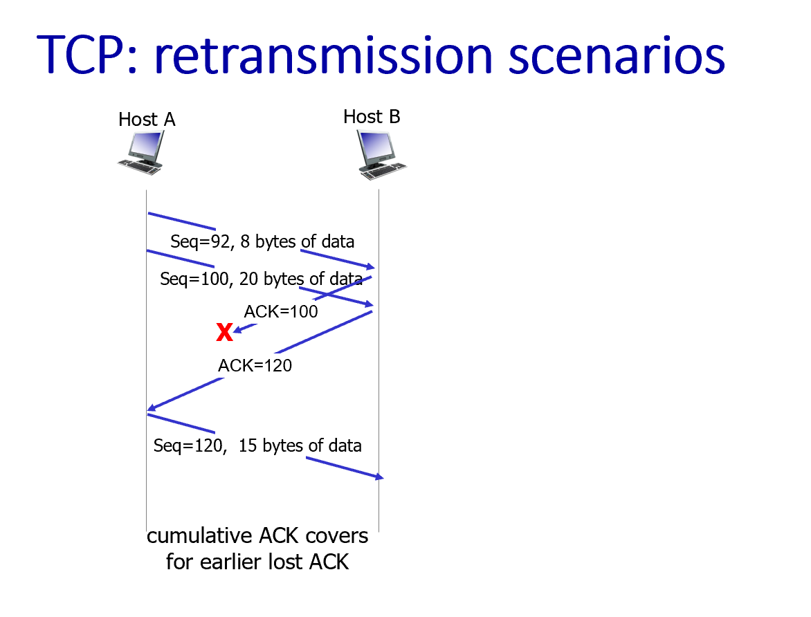

# TCP 可靠数据传输与流量控制

## TCP 概述：
- 面向连接 (connection-oriented)：在数据交换前，需要通过握手（交换控制报文）来初始化发送方和接收方的状态。
- 点对点 (point-to-point)：一个发送方，一个接收方。
- 可靠、有序的字节流 (reliable, in-order byte steam)：没有“报文边界”的概念，数据被看作是一个连续的字节流。
- 全双工数据 (full duplex data)：数据可以在同一连接中双向流动。
- 流水线 (pipelining)：允许发送多个报文段而无需等待确认，窗口大小由拥塞控制和流量控制决定。
- 累积确认 (cumulative ACKs)
- 流量控制 (flow controlled)：发送方不会淹没接收方。
- MSS (maximum segment size)：最大报文段大小。

1. 序列号 (Sequence numbers)：指的是报文段数据中第一个字节在整个字节流中的编号，而不是报文段的编号。
- 例如，如果一个TCP连接要发送5000字节的数据：
    - 第一个报文段可能包含字节流中的第1到第1000个字节，那么这个报文段的序列号就是1。
    - 第二个报文段可能包含字节流中的第1001到第2000个字节，那么这个报文段的序列号就是1001。

2. 确认号 (Acknowledgements - ACKs)：是期望从对方接收的下一个字节的序列号。  它采用的是累积确认的方式，即一个ACK确认了该序列号之前的所有字节都已正确接收。

3. 接收方如何处理乱序的报文段：TCP规范本身并没有严格规定，这取决于具体的实现者。

LimBoo注：“length是指的header是哪部分？”
在结构图中，有一个字段叫做 “head len” (header length)。

这个字段指明了 TCP头部本身有多长，单位是4字节（32位字）。例如，如果这个字段的值是5，那么TCP头部的长度就是 5 * 4 = 20字节。如果值是6，头部长度就是 6 * 4 = 24字节（可能因为包含了选项字段）。

这个字段非常重要，因为它告诉接收方TCP头部在哪里结束，以及真正的应用数据从哪里开始。因为TCP头部有一个可变长度的“选项 (options)”字段，所以TCP头部的长度并不总是固定的20字节。

## TCP 接收方：ACK 的生成策略 [RFC 5681]

|接收方事件 (Event at receiver)|	TCP 接收方行为 (TCP receiver action)|
|---|---|
|收到期望序列号的按序报文段，且所有之前的数据都已确认。 |	延迟ACK (delayed ACK)。等待最多500ms看是否有下一个报文段到达。如果没有，则发送ACK。 |
|当连续收到两个按序到达的报文段，并且第一个报文段的ACK因为延迟ACK机制而被暂缓发送。 |	立即发送一个单独的累积ACK，这是一个能够确认这两个按序到达的报文段的ACK。 |
|收到乱序报文段，其序列号大于期望值 (检测到数据间隙)。 |	立即发送一个重复的ACK (duplicate ACK)，该ACK指明期望的下一个字节的序列号。 |
|收到的报文段部分或完全填补了之前检测到的数据间隙。|	立即发送ACK，前提是该报文段从间隙的下边界开始。|

- 延迟ACK (Delayed ACK) 是一种常见的优化手段，目的是减少发送的ACK数量。如果数据是双向流动的，ACK可以搭载在数据报文段中（捎带确认 Piggybacking），从而提高效率。

- 重复ACK (Duplicate ACK) 在TCP的快速重传机制中扮演着非常重要的角色，我们稍后会看到。

LimBoo注：虽然ppt里面没有提到，但是细心的你可能会发现(｀・ω・´)！目前介绍的TCP协议，既不是GO-Back-N，也不是Selective Repeat！实际上，TCP的设计比我们在理论上学习的纯粹的GBN或SR要更复杂和灵活，它借鉴了这两种协议的思想，并进行了一些融合和优化。
1. 累积确认 (Cumulative ACKs) - 类似GBN的特点
2. 处理乱序报文段 - TCP规范并没有严格规定接收方必须如何处理乱序的报文段，而是将此留给实现者决定。大多数现代TCP实现都会缓存一定数量的乱序报文段。
3. 快速重传 (Fast Retransmit) - 结合了两种思想的优化。

## TCP 重传场景 (TCP: retransmission scenarios)
1. ACK丢失
2. 过早超时场景：过早的超时也会导致不必要的重传。选择一个合适的超时时间（RTO, Retransmission Timeout）非常重要。
3. 累积ACK弥补了早先丢失的ACK：累积确认机制在某些情况下可以帮助减少因ACK丢失而引起的不必要重传。

## TCP 快速重传 (TCP Fast Retransmit)
之前的重传场景告诉我们，如果一个报文段丢失，发送方通常需要等待超时计时器到期才会重传。但如果网络延迟较大，超时时间可能也会相应较长，这就会导致较长的等待。

**快速重传机制的思想是：如果发送方连续收到了三个对于同一个数据报文段的冗余ACK (duplicate ACKs)，那么发送方就可以合理地猜测这个ACK所确认的序列号之后的那个报文段很可能已经丢失了，并且不等超时计时器到期就立即重传那个丢失的报文段。**

### 为什么是三个冗余ACK？
当发送方收到这三个指向同一个旧序列号的重复ACK后，它就有了较强的理由相信，那个序列号对应的下一个报文段确实丢失了。因为这三个重复ACK表明有三个后续的包已经到达了接收方。此时，网络可能并没有完全拥塞到所有包都无法到达的程度，而更可能是单个包的丢失。

选择“3个”冗余ACK是一个经验性的折中，它旨在避免因为网络中正常的报文段乱序（而非真正丢失）而过早触发不必要的快速重传。如果只因为1个或2个冗余ACK就重传，误判的概率会更高。

### 快速重传的优点
在某些丢包情况下，可以比等待超时更快地恢复数据，从而提高TCP的性能和吞吐率。

## TCP 流量控制 (TCP Flow Control)
想象一下，网络层（IP层）可能以非常快的速度将数据递交给接收方的TCP层，但接收方的应用程序（比如浏览器）处理数据的速度可能跟不上。

如果发送方发送数据过快，超出了接收方应用程序的处理能力，接收方的TCP接收缓冲区 (receiver buffer) 就会被填满。新到达的数据包将无处存放，最终导致数据丢失（即使网络本身并没有拥塞）。

流量控制的目的：流量控制是一种速度匹配服务，确保发送方发送数据的速率不会超过接收方应用程序读取数据的速率，从而防止接收方缓冲区溢出。PPT中强调“接收方控制发送方，所以发送方不会因为发送过多、过快而淹没接收方的缓冲区”。

## 流量控制是如何实现的？
TCP的流量控制是通过接收方向发送方“通告”其接收窗口 (receive window - rwnd) 的大小来实现的。

- 接收窗口 (rwnd)：接收方在TCP头部中有一个专门的字段叫做“接收窗口”（或“窗口大小”）。这个字段的值告诉发送方，接收方当前还有多少可用的缓冲区空间来接收数据。

- 接收缓冲 (RcvBuffer)：接收方为每个TCP连接分配一个接收缓冲区。这个缓冲区的大小可以通过套接字选项来设置（典型默认值是4096字节），很多操作系统也会自动调整其大小。

- 发送方的行为：发送方会确保任何时候已发送但尚未收到确认的数据量（即“在途数据”或“in-flight data”）不会超过接收方通告的 rwnd 值。

- 保证不溢出：通过这种机制，TCP保证了接收方的缓冲区不会因为发送方发送太快而溢出。

## 重要区别：流量控制 vs. 拥塞控制
流量控制 (Flow Control)：是为了防止单个发送方淹没单个接收方的缓冲区。它是一个端到端的问题，关注的是接收方的处理能力。

拥塞控制 (Congestion Control)：是为了防止太多的发送方发送太多的数据，导致网络本身（比如路由器）不堪重负。它关注的是整个网络的承载能力。 我们稍后会详细讨论拥塞控制。

## TCP 连接管理 (TCP Connection Management)

### TCP连接的建立 
目的：在客户端和服务器之间交换数据之前，它们必须“握手”。
- 同意建立连接（双方都知道对方愿意建立连接）。
- 就连接参数达成一致（例如，初始序列号）。

#### 为什么两路握手不够？
1. 半开连接 (half open connection)：如果客户端发送连接请求，服务器同意并建立了连接状态，但客户端可能已经崩溃或改变主意，服务器就会白白维持一个无用的连接。
2. 重复数据接受：如果一个旧的、延迟很久的连接请求报文突然到达服务器，而服务器又恰好重启过（忘记了之前的状态），它可能会错误地接受这个旧请求，导致后续数据处理混乱。

### TCP 三次握手 
为了解决上述问题，TCP采用了著名的“三次握手”来建立连接。这确保了客户端和服务器双方都知晓对方已准备好，并且双方的初始序列号都得到了同步。

LimBoo注：返回的用作确认的ACKnum不会影响发送方的序列号。接受方发送的是一个"纯 ACK 包"（pure ACK），仅包含TCP 头部。

#### 步骤1：客户端 -> 服务器 (SYN)
客户端选择一个初始序列号 x。
发送一个TCP报文段，其中 SYN 标志位置为1，序列号字段 (Seq) 设置为 x。
客户端进入 SYNSENT 状态。

#### 步骤2：服务器 -> 客户端 (SYN-ACK)
服务器收到客户端的SYN报文后，如果同意连接，则：
- 选择自己的初始序列号 y。
- 发送一个TCP报文段，其中 SYN 标志位置为1，ACK 标志位置为1，序列号字段 (Seq) 设置为 y，确认号字段 (ACKnum) 设置为 x+1 (表示期望收到客户端下一个字节的序列号是x+1)。

服务器进入 SYN RCVD 状态。

#### 步骤3：客户端 -> 服务器 (ACK)
客户端收到服务器的SYN-ACK报文后：
- 发送一个TCP报文段，其中 ACK 标志位置为1，确认号字段 (ACKnum) 设置为 y+1 (表示期望收到服务器下一个字节的序列号是y+1)。这个报文段可能也包含应用层数据。

客户端进入 ESTABLISHED 状态，此时连接已建立。
服务器收到这个ACK后，也进入 ESTABLISHED 状态，连接正式建立完毕。

### TCP连接的关闭 (Closing a TCP connection)
我们之前已经详细讨论过TCP的四次挥手过程，这里简要回顾:

客户端和服务器各自关闭自己这一侧的连接。

- 通过发送 FIN 标志位置为1的TCP报文段来表明自己没有更多数据要发送了。
- 收到对方的FIN后，需要回复一个ACK。
- 对FIN的ACK可以与己方的FIN合并在一个报文段中发送。
- 也可以处理同时发生的FIN交换（双方同时关闭连接）。

# TCP 拥塞控制 (TCP Congestion Control)
当“太多的源主机发送太多的数据，发送速度太快，以至于网络无法处理”时，就发生了拥塞。

拥塞的表现形式：
1. 长延迟 (long delays)：由于数据包在路由器的缓冲区中排队等待。
2. 数据包丢失 (packet loss)：由于路由器的缓冲区溢出。

与流量控制的区别：
- 流量控制 (Flow Control) 是为了防止一个发送方淹没一个接收方。它关注的是点对点的速率匹配。
- 拥塞控制 (Congestion Control) 是为了防止太多的发送方一起淹没整个网络（尤其是网络中的路由器）。它关注的是保护网络基础设施的整体稳定性和效率。

## 拥塞的原因与代价 (Causes/costs of congestion)

拥塞的原因：
1. 两个发送方，一个路由器，无限缓冲区
    - 当两个发送方的总发送速率接近链路容量R时，排队延迟会急剧增加。每个连接的最大吞吐量是R/2。
2. 一个路由器，有限缓冲区
    - 当缓冲区满时，后续到达的数据包会被丢弃，导致丢包。
    - 发送方因为超时或重复ACK（由丢包引起）而进行重传。
3. 四个发送方，多跳路径
    - 当一个数据包在下游链路被丢弃时，它在上游链路所消耗的所有传输容量和缓冲资源都被浪费了。
    - 如果一个连接（比如图中的红色连接）的发送速率过高，导致路由器持续丢弃其他连接（比如蓝色连接）的数据包，那么蓝色连接的吞吐量可能会趋近于0。

拥塞的代价：
1. 当链路容量接近饱和时，延迟会显著增加。
2. 丢包和重传会降低有效吞吐量。
3. 不必要的重传进一步降低有效吞吐量。
4. 因为数据包在下游丢失而导致的上游资源浪费。
5. 吞吐量永远不可能超过网络容量。

### 拥塞控制的方法 (Approaches towards congestion control)
1. 端到端拥塞控制 (End-to-end congestion control)
    - 这种方法中，网络层不向传输层提供关于拥塞的明确反馈。
    - 传输层的发送方通过观察网络状况（如丢包事件、延迟增加）来推断是否发生了拥塞。
    - TCP采用的就是这种方法。

2. 网络辅助拥塞控制 (Network-assisted congestion control)
    - 这种方法中，网络中的路由器会向发送方或接收方提供关于网络拥塞状况的直接反馈。
    - 这种反馈可以是指示拥塞的程度，或者直接设置发送方的发送速率。
    - 例如，IP头部中的ECN（显式拥塞通知）位可以被路由器标记以指示拥塞，然后这个信息会通过ACK传递给发送方。

# TCP 拥塞控制：AIMD (加法增大，乘法减小)
TCP采用的是端到端的拥塞控制，其核心算法思想是AIMD (Additive Increase, Multiplicative Decrease)，即“加法增大，乘法减小”。

**基本方法：发送方持续增加其发送速率，直到检测到丢包（意味着可能发生拥塞），然后在发生丢包事件时降低发送速率。**

## 行为模式：“锯齿形”探测带宽：
1. 加法增大 (Additive Increase)：每经过一个RTT（往返时间），如果所有数据包都被成功确认（没有丢包），TCP发送方就将其拥塞窗口 (cwnd) 增加一个MSS (Maximum Segment Size，最大报文段大小)。这是一种温和的、线性的增加方式，试图逐渐探测网络中可用的额外带宽。

2. 乘法减小 (Multiplicative Decrease)：当检测到丢包事件时（通常是通过超时或收到三个重复ACK来判断），TCP会将其拥塞窗口大幅度减小。
    - 如果是因为超时检测到丢包，cwnd 会被直接降至1个MSS（这通常被认为是TCP Tahoe版本的行为）。
    - 如果是因为收到三个重复ACK检测到丢包（这通常被认为是TCP Reno版本的行为，也是快速重传触发的条件），cwnd 会被减半。

## 为什么选择AIMD？
1. AIMD作为一个分布式的、异步的算法，已被证明能够在网络范围内优化拥塞流的速率。
2. 它具有良好的稳定性。

## TCP 慢启动 (TCP Slow Start)
当一个TCP连接刚开始时，发送方并不知道网络路径上可用的带宽是多少。如果一开始就以很高的速率发送数据，很容易立即造成拥塞。慢启动机制就是为了让TCP连接在开始时能以一个较慢的速率启动，然后迅速地增加发送速率，直到接近网络实际承载能力。

### 工作机制：
1. 初始 cwnd：当连接开始时，拥塞窗口 cwnd 被初始化为一个较小的值，通常是 1个MSS (Maximum Segment Size)。
2. 指数增长：在慢启动阶段，每当发送方收到一个对已发送报文段的ACK时，它就会将 cwnd 增加1个MSS。这意味着，每经过一个RTT (Round Trip Time)，cwnd 的大小实际上会翻倍 (double cwnd every RTT)。

“慢”启动并不慢：虽然名字叫“慢启动”，但实际上在这个阶段，cwnd 是以指数级快速增长的。它的“慢”是相对于连接刚建立时，以一个很小的窗口开始，而不是一开始就使用一个可能很大的窗口。

### 退出慢启动：
慢启动阶段并不会一直持续下去。当 cwnd 增长到某个阈值（称为“慢启动阈值” - ssthresh）时，或者当检测到丢包（拥塞）时，TCP就会退出慢启动阶段，进入“拥塞避免 (Congestion Avoidance)”阶段（也就是我们之前讨论的AIMD中的“加法增大”阶段）。

总结来说，慢启动允许TCP在连接初期快速地将发送速率提升到一个合理的水平，以便尽快利用可用的网络带宽。

### 从慢启动到拥塞避免 (From Slow Start to Congestion Avoidance)
何时从指数增长切换到线性增长？关键的转换点是当拥塞窗口 cwnd 达到慢启动阈值 ssthresh 时。

ssthresh 的设定：
1. 当发生一次丢包事件 (loss event) 时（无论是超时还是收到三个重复ACK），ssthresh 的值会被设置为当前 cwnd 值的一半。
2. 这样做是基于一个假设：既然在当前 cwnd 大小下发生了丢包，那么网络能承受的容量大约是当前 cwnd 的一半。

行为切换：
1. 如果 cwnd < ssthresh：TCP处于慢启动 (Slow Start) 阶段，cwnd 按指数级增长（每收到一个ACK，cwnd 增加1 MSS，即每个RTT翻倍）。
2. 如果 cwnd >= ssthresh：TCP进入拥塞避免 (Congestion Avoidance) 阶段，cwnd 按线性（加法）方式增长（每个RTT，cwnd 增加1 MSS）。这比慢启动阶段的增长要平缓得多，目的是更小心地探测额外的可用带宽，避免再次过快地导致拥塞。
3. 如果发生丢包事件：
    - ssthresh 被设置为当前 cwnd 的一半。
    - 如果是超时导致的丢包，cwnd 通常被重置为1 MSS，然后重新开始慢启动。
    - 如果是三个重复ACK导致的丢包（快速重传），cwnd 通常被设置为新的 ssthresh 值（即减半后的值），然后直接进入拥塞避免阶段（这是TCP Reno的一个特点，也称为快速恢复）。

## TCP CUBIC
传统的AIMD（加法增大、乘法减小）策略在探测可用带宽时是“线性”增加的。TCP CUBIC试图以一种更智能的方式来“探测”可用带宽，尤其是在高速、长延迟的网络（也称为“长肥网络”，LFNs - Long Fat Networks）中，AIMD的线性增长可能过于缓慢。

基本思想/直觉 (Insight/intuition)：
当发生拥塞导致丢包时，TCP会将发送速率/窗口减小。假设丢包前的窗口大小为 Wmax。CUBIC认为，在发生丢包后，网络瓶颈链路的拥塞状况可能并没有发生根本性的巨大变化。因此，在因为丢包而将窗口减半后，CUBIC的目标是能够更快地将窗口大小恢复到接近上一次发生拥塞时的值 (Wmax)，但当窗口接近Wmax时，它又会变得更谨慎，增长得更慢，以避免再次轻易触发拥塞。

窗口增长函数:
CUBIC的窗口增长不再是简单的线性增加，而是使用一个*三次函数 (cubic function)*（这也是它名字的由来）来控制窗口大小的增长。

这个三次函数的形状使得：
- 当当前的窗口大小远小于上一次发生拥塞时的窗口大小 (Wmax) 时，窗口增长非常快（凹形曲线）。
- 当当前的窗口大小接近 Wmax 时，窗口增长变得非常平缓（凸形曲线的顶部，接近拐点）。
- 在超过 Wmax 后，它又会开始更积极地探测（凸形曲线），尝试寻找新的网络容量上限。
- K 值：这个三次函数的增长速度和形状会受到一个参数 K 的影响，K 代表了窗口大小达到 Wmax 的时间点，并且 K 本身是可以调整的。

总结来说，TCP CUBIC 试图在网络带宽的利用上更加“积极进取”，尤其是在从拥塞恢复时，它能更快地将发送速率提升到一个较高的水平。同时，当接近已知的拥塞点时，它又表现得相对“保守”，以更平滑的方式探测带宽，从而尝试减少丢包和提高稳定性。

## 瓶颈链路 (Bottleneck Link)：

当数据从源主机发送到目标主机时，通常会经过一系列的路由器和链路。这些链路的带宽（容量）可能各不相同。

其中，容量最小的、最容易发生拥塞的链路，就被称为“瓶颈链路”。这个瓶颈链路的输出队列几乎总是繁忙的，并且有时会因为数据包到达速率超过其处理能力而发生溢出，导致丢包。

TCP（无论是经典版本还是CUBIC版本）的拥塞控制机制，实际上就是通过不断增加发送速率，直到在某个路由器的输出端（即瓶颈链路）发生丢包为止，来间接探测这个瓶颈链路的容量。

理解拥塞的关键 (PPT 3-51页)：

关注瓶颈：
1. 理解拥塞的关键在于关注这个拥塞的瓶颈链路。
2. 增加发送速率不一定增加吞吐量：当瓶颈链路已经拥塞时，即使TCP发送方继续增加其发送速率，端到端的实际吞吐量也不会增加，反而可能因为加剧拥塞和丢包而下降。
3. 增加发送速率会增加RTT：继续增加发送速率会导致数据包在瓶颈路由器的队列中等待更长的时间，从而使得测量的RTT（往返时间）增加。
4. 拥塞控制的目标：理想情况下，拥塞控制的目标是“让端到端的管道刚好被填满，但又不要过满” (keep the end-end pipe just full, but not fuller)。也就是说，要让瓶颈链路尽可能地繁忙以充分利用带宽，但又不至于产生过大的排队延迟和大量的丢包。

## 基于延迟的TCP拥塞控制 (Delay-based TCP congestion control)
传统的TCP拥塞控制（如Tahoe, Reno, CUBIC的部分行为）主要是基于丢包来判断拥塞的。但丢包通常意味着拥塞已经发生到一定程度了（缓冲区溢出）。那么，有没有更主动的方式来感知并应对拥塞呢？基于延迟的拥塞控制就是一种尝试。

**核心思想：在不实际造成丢包的情况下，通过监控网络延迟（RTT的变化）来判断拥塞程度，并调整发送速率。目标是“保持管道刚好满，但不过满”，即最大化吞吐量的同时保持较低的延迟。**

### 如何工作:
- RTTmin：记录观察到的最小RTT，这可以代表路径在非拥塞状态下的往返时间。
- 无拥塞时的期望吞吐量：如果网络不拥塞，并且当前的拥塞窗口是cwnd，那么期望的吞吐量大约是 cwnd/RTTmin。
- RTTmeasured：当前实际测量的RTT。
- 实际测量的吞吐量：上一个RTT间隔内发送的字节数 / RTTmeasured。
- 调整策略：
    - 如果实际测量的吞吐量“非常接近”无拥塞时的期望吞吐量，则认为路径未拥塞，线性增加cwnd。
    - 如果实际测量的吞吐量“远低于”无拥塞时的期望吞吐量，则认为路径拥塞，线性减少cwnd。

优点：这种方法试图在不引起丢包的情况下控制拥塞，从而可能获得更平滑的吞吐和更低的延迟。

## 显式拥塞通知 (Explicit Congestion Notification - ECN)
这是我们之前提到的“网络辅助拥塞控制”的一个例子。

机制：
- 路由器在检测到拥塞迹象时（比如队列开始变长，但还未溢出），可以主动在IP数据包头部的特定字段（服务类型ToS字段中的两位）设置一个标记，以指示网络拥塞。
- 这个拥塞指示会随着数据包传递到接收方。
- 接收方在回复ACK时，会在TCP头部设置一个ECE (ECN-Echo) 位，将网络拥塞的信息通知给发送方。
- 发送方收到这个ECE标记后，就知道网络发生了拥塞，并可以像处理丢包一样（比如减小拥塞窗口）来缓解拥塞。

优点：ECN允许网络在缓冲区实际溢出导致丢包之前就向发送方发出拥塞信号，从而实现更主动的拥塞避免。
